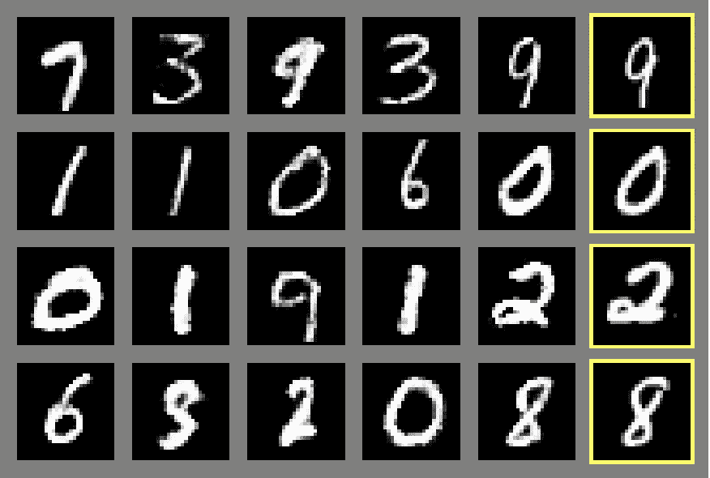
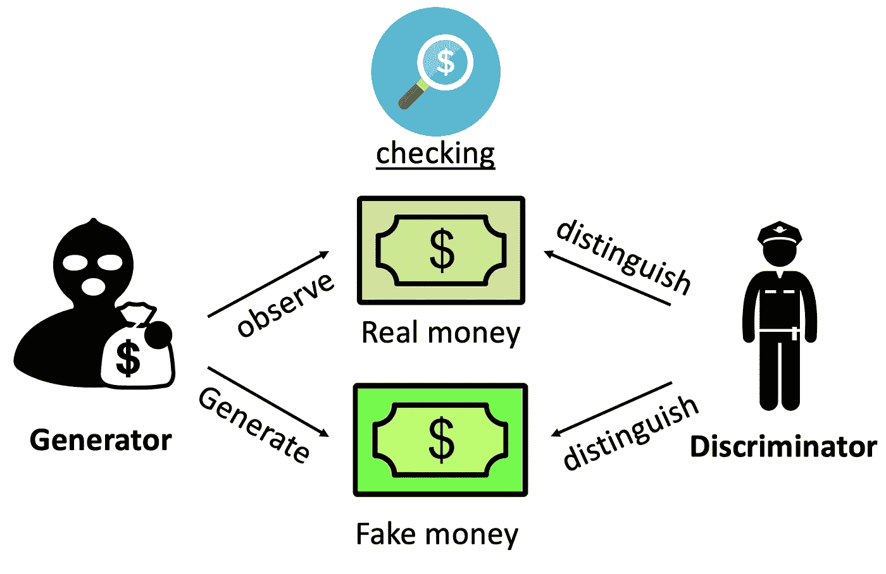
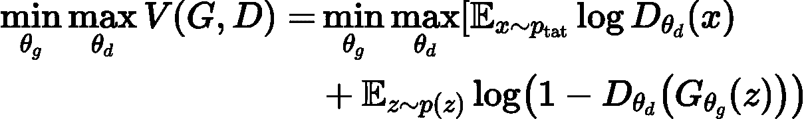
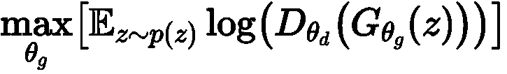
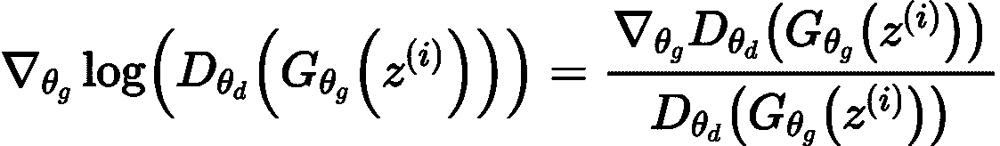
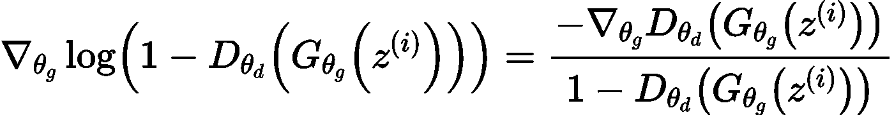

# 【深度学习】引入生成对抗网络(GANs)

> 原文：<https://towardsdatascience.com/deep-learning-introduction-of-generative-adversarial-networks-gans-ae22c4350b1f?source=collection_archive---------26----------------------->

## 甘斯的直觉和客观功能

生成对抗网络(GANs)形成于 2014 年[1]，是一种先进的深度神经网络，具有许多应用。与无监督学习中的传统机器学习(它不需要目标标签)不同，GANs 是一种通过给定数据生成新内容的生成模型。

有趣的是，GANs 首先从原始论文的右侧看到了 MNIST(手写数字数据库)的生成图像:

[MNIST GANs 从原纸生成的图像](https://papers.nips.cc/paper/5423-generative-adversarial-nets.pdf)

# **直觉**

GANs 的类比被认为是伪钞制造者和警察之间的假币检测游戏[1]。根据 Goodfellow [2]对 GANs 的教程，GANs 由两个角色组成，分别是生成者(造假者)和鉴别者(警察)。

伪造者试图制造假币，并通过查看真钞来欺骗警察(鉴别者)。鉴别器的工作就是鉴别给定的钱是不是真的。首先，伪造者制造的货币太粗糙，很容易辨别。基于这些失败，现在伪造者努力生产更复杂的货币。与此同时，警察现在更有经验来辨别真假钱。

随着这一过程重复多次，双方都向对方学习(这就是它被称为“对抗性”的原因)，因此变得足够成熟和老练。现在，造假者生产的假币对除了警察以外的其他人来说都是非常逼真的。

打假人与警察博弈的类比。图片由作者提供。

# GANs 的目标函数

回想一下，目标函数是在训练时要优化的函数(通常是最大化它，如果我们要最小化它，通常它被称为损失函数)。寻找目标函数的最优点有几种方法，如最大似然估计(MLE)和不同的梯度下降法等。

GANs 由两个深度神经网络组成，生成器网络(表示为 G)和鉴别器网络(表示为 D)。G 的目的是从分布 p_data 中输出假数据 G(z)来欺骗 D。另一方面，鉴别器网络 D 输出真实数据的概率，其目标是最大化真实标签的概率和最小化虚假标签的概率(分布为 p_z)。

在训练期间，G 和 D 基于下面的最小-最大目标函数 V(G；d):

等式 1。作者图片

鉴别器应该给真实图像(D_θd(x))一个高值，这与对它取逻辑函数((logD_θd(x)))是一样的。它还应该给假图像(G_θg(z))一个低值，这与减去它并取逻辑函数(log(1- D_θd(x))是一样的。简而言之，可以通过上述目标函数 V(G；d)为 d。

对于生成器来说，最好是愚弄生成器，如果 D_θd(x)接近 1，就可以实现，这与最小化 log(1- D_θd(x))相同。对于生成器来说是有区别的，也就是说，最小-最大函数 V(G；d)不依赖于发电机。(在打假人与警察的博弈类比中，警察能否识别真钱与打假人无关。)简而言之，它与最小化目标函数 V(G；d)对于θg。

# **训练甘斯**

由于训练中的实际原因，对发生器部分进行了修改，而不是原来的目标函数:

等式 2。作者图片

原因是在训练开始时，生成的伪图像太明显(即 D_θd(x)接近于零),因此损失几乎为零并且具有零梯度。

对于新的目标函数，当 D_θd(x)较小时，梯度比原来的高:

等式 3。作者图片

但是对于一个梯度:

等式 4。作者图片

当 D_θd(x)较小时，等式 3 中的分母比等式 4 中的分母小得多。

原始论文陈述了鉴别器 D 的最佳点和训练过程，这里跳过这些以避免数学细节和直接复制，但是这里提供了用于说明的非正式想法:

*   训练在小批量的噪声样本和真实例子中进行。minibatch 的目标是加快训练过程，因为通过所有数据训练 DNN 是非常繁重的。
*   发电机的原始随机梯度下降通常被方程 2 的随机梯度上升代替。

# 参考资料:

1.  古德费勒、j .普热-阿巴迪、m .米尔扎、b .徐、d .沃德-法利、s .奥泽尔、a .库维尔和 y .本吉奥。生成对抗网络。在 NIPS，2014。
2.  好家伙。Nips 2016 教程:生成性对抗网络。arXiv 预印本 arXiv:1701.00160，2016。