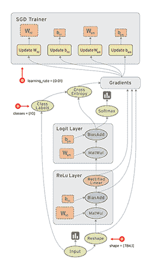

# 深度学习:张量和张量流简介

> 原文：<https://towardsdatascience.com/deep-learning-introduction-to-tensors-tensorflow-36ce3663528f?source=collection_archive---------10----------------------->

## 了解最受欢迎的深度学习库！


图片来自 [Unsplash](https://unsplash.com/photos/AAMldegB0x8)

# 介绍

本文的目标是涵盖以下主题:

*   张量介绍
*   图表、变量和操作
*   使用 TensorFlow 解决问题

# 什么是张量流

TensorFlow 是由 Google 开发和维护的一个框架，它使数学运算能够在 CPU 或 GPU 上以优化的方式执行。我们将专注于 GPU，因为这是我们训练深度神经网络的最快方法。

**为什么是 Tensorflow？**

*   因为它的灵活性和可伸缩性
*   因为它受欢迎


按作者分列的数字

使 TensorFlow 成为最受欢迎的深度学习库的关键功能是:

*   TensorFlow 使用张量来执行操作。
*   在 TensorFlow 中，首先定义要执行的活动(构建图)，然后执行它们(执行图)。这允许该过程被优化到手边的任务，大大减少了计算时间。
*   TensorFlow 支持代码并行运行或在一个或多个 GPU 上运行。

好吧，但是张量是什么？

虽然张量是物理学家发明的，用来描述相互作用，但在人工智能领域，张量可以简单地理解为数字的容器。


按作者分列的数字

让我们现在就把这一切付诸实践。我们将使用 python 编写一些张量代码，以便更好地理解它们是什么以及它们是如何工作的。

# 实践中的张量

假设我们想存储一个学生的平均成绩。我们将使用一个 0D 张量，它只是一个简单的数或标量。

```
import numpy as nptensor_0D = np.array(5)
print("Average grade: \n{}".format(tensor_0D))
print("Tensor dimensions: \n{}".format(tensor_0D.ndim))
```


现在让我们尝试存储该学生所学的每门课程的分数。我们可以用 1D 张量来做到这一点:

```
tensor_1D = np.array([4,6,8])
print("Subject grades: \n{}".format(tensor_1D))
print("Tensor dimensions: \n{}".format(tensor_0D.ndim))
```


但是，等等……如果我们想存储学生每门学科的每次考试的分数，该怎么办呢？如果每个科目有 3 次考试，我们该怎么做呢？

通过使用 2D 张量！正如我们之前看到的，它是一个矩阵。

```
**# 2D Tensor (matrix)**
tensor_2D = np.array([[0, 1, 1],  # Subject 1
                      [2, 3, 3],  # Subject 2
                      [1, 3, 2]])  # Subject 3
print("Exam grades are:\n{}".format(tensor_2D))print("Subject 1:\n{}".format(tensor_2D[0]))print("Subject 2:\n{}".format(tensor_2D[1]))print("Subject 3:\n{}".format(tensor_2D[2]))print("Tensor dimensions: \n{}".format(tensor_2D.ndim))
```


我们现在希望存储四个季度的科目成绩(每年一次)，这样将来需要时就可以更容易地访问它们，你不这样认为吗？你认为我们该如何组织他们？

如果我们给 2D 张量增加一个维度来表示四分之一会怎么样？

我们会得到一个三维张量(三维矩阵或立方体)。

```
tensor_3D = np.array([[[0, 1, 1],  # First quarter
                      [2, 3, 3],
                      [1, 3, 2]],
                     [[1, 3, 2],  # Second quarter
                      [2, 4, 2],
                      [0, 1, 1]]])
print("Exam grades per quarter are:\n{}".format(tensor_3D))print("First quarter:\n{}".format(tensor_3D[0]))print("Second quarter:\n{}".format(tensor_3D[1]))print("Tensor dimensions: \n{}".format(tensor_3D.ndim))
```


如果我们在张量中增加一个维度，这样我们就可以得到每个学生每门学科每学期的成绩，会怎么样？

它将是一个 4D 张量(3D 矩阵向量或立方体向量)。

```
tensor_4D = np.array([[[[0, 1, 1], # Jacob
                      [2, 3, 3],
                      [1, 3, 2]],
                     [[1, 3, 2],
                      [2, 4, 2],
                      [0, 1, 1]]],
                      [[[0, 3, 1], # Christian
                      [2, 4, 1],
                      [1, 3, 2]],
                     [[1, 1, 1],
                      [2, 3, 4],
                      [1, 3, 2]]],
                     [[[2, 2, 4], # Sofia
                      [2, 1, 3],
                      [0, 4, 2]],
                     [[2, 4, 1],
                      [2, 3, 0],
                      [1, 3, 3]]]])
print("The grades of each student are:\n{}".format(tensor_4D))print("Jacob's grades:\n{}".format(tensor_4D[0]))print("Christian's grades:\n{}".format(tensor_4D[1]))print("Sofia's grades:\n{}".format(tensor_4D[2]))print("Tensor dimensions: \n{}".format(tensor_4D.ndim))
```


所以我们可以无限地增加张量的维数，来存储更多的数据。

为了让您了解张量在深度学习领域的使用频率，最常见的张量类型有:

*   **三维张量**:用于时间序列。
*   **4D 张量**:用于图像。
*   **5D 张紧器**:与视频一起使用。

通常，其中一个维度将用于存储每种数据类型的样本。例如，对于图像:

如果我们想要存储 224x224 像素的 64 幅 RGB 图像，我们将需要一个 3D 矩阵向量，或者同样的，一个 4D 张量。我们需要多少维度？

我们有 64 幅 224 像素 x 224 像素 x 3 通道(R、G、B)的图像。

因此:(64，224，224，3)

如果你想更深入地了解张量或更多的例子，这里有一个非常好的资源:[用猫说明的张量](https://hackernoon.com/learning-ai-if-you-suck-at-math-p4-tensors-illustrated-with-cats-27f0002c9b32)

我们之前说过，在 TensorFlow 中，首先定义要执行的操作，然后执行它们。为了做到这一点，你使用一个图表。

**什么是图形？**

a + b 求和的一个简单例子。


按作者分列的数字

这是一个更复杂的例子，现在，你不需要完全理解，但这只是其中的一小部分。



# 张量流付诸实践

首先我们需要定义和理解 TensorFlow 的一些基本概念(从现在开始 TF):

*   tf。图:表示一组 tf。操作
*   tf。运算:运算是由我们定义的方程式决定的吗
*   tf。张量:我们存储 tf 结果的地方。操作

一开始，tf。图形对我们来说是透明的，因为有一个默认的图形，其中添加了我们定义的所有操作。它被称为 tf.get_default_graph()。

```
**# We import the Tensorflow package and matplotlib for the charts** import tensorflow as tf
import matplotlib.pyplot as plt 
%matplotlib inline
```

先说一些很简单的，仅仅是 Tensorflow 中的一个简单乘法。

```
**# Variables definition**
x = tf.constant(6)  
y = tf.constant(8)**# Operations definition**
result = tf.multiply(x, y)
print(result)
```


如你所见，它没有给我们返回结果。到目前为止，它所做的就是创建网络。

举个例子，就像坐车一样。现在我们已经把它组装好了，但是它仍然没有完成它的设计，移动。为此，我们应该打开它。为此，我们将使用 tf。会话()。

```
sess = tf.Session() 
output = sess.run(result)  
print(output)
```


为了能够可视化该图，我们应该定义几个函数。

```
from IPython.display import clear_output, Image, display, HTMLdef strip_consts(graph_def, max_const_size=32):
    """Strip large constant values from graph_def."""
    strip_def = tf.GraphDef()
    for n0 in graph_def.node:
        n = strip_def.node.add() 
        n.MergeFrom(n0)
        if n.op == 'Const':
            tensor = n.attr['value'].tensor
            size = len(tensor.tensor_content)
            if size > max_const_size:
                tensor.tensor_content = "<stripped %d bytes>"%size
    return strip_defdef show_graph(graph_def, max_const_size=32):
    """Visualize TensorFlow graph."""
    if hasattr(graph_def, 'as_graph_def'):
        graph_def = graph_def.as_graph_def()
    strip_def = strip_consts(graph_def, max_const_size=max_const_size)
    code = """
        <script>
          function load() {{
            document.getElementById("{id}").pbtxt = {data};
          }}
        </script>
        <link rel="import" href="[https://tensorboard.appspot.com/tf-graph-basic.build.html](https://tensorboard.appspot.com/tf-graph-basic.build.html)" onload=load()>
        <div style="height:600px">
          <tf-graph-basic id="{id}"></tf-graph-basic>
        </div>
    """.format(data=repr(str(strip_def)), id='graph'+str(np.random.rand()))iframe = """
        <iframe seamless style="width:1200px;height:620px;border:0" srcdoc="{}"></iframe>
    """.format(code.replace('"', '&quot;'))
    display(HTML(iframe)
```

现在我们将展示之前定义的图表:


正如我们所见，该图由两个常量类型的节点和一个运算符类型(乘法)的节点组成。然而，他们的名字并不十分具有指示性。让我们改变这一点:

```
x2 = tf.constant(5.0, name='x2')
y2 = tf.constant(6.0, name='y2')result = tf.multiply(x2, y2)# Let's see what it looks like now:
show_graph(tf.get_default_graph().as_graph_def())
```


一旦我们执行了操作，我们应该关闭会话，用 sess.close()释放资源。

最后，我们还可以向 the GPU 表明我们希望它执行操作。为此，我们可以打印可用设备的列表:

```
from tensorflow.python.client import device_libdef get_available_devices():
    local_device_protos = device_lib.list_local_devices()
    return [x.name for x in local_device_protos]print(get_available_devices())
```


我们将选择 GPU:0，并执行[3 ^ 3]乘以[2 ^ 2]的乘法运算，结果可能是 3x3 +2x2 = 12。让我们来看看:

通过使用 with ___ as __:我们让 python 自己释放 TF 会话的资源:

```
with tf.Session() as sess:
  with tf.device("/GPU:0"):
    matrix1 = tf.constant([[3., 3.]])
    matrix2 = tf.constant([[2.],[2.]])
    product = tf.matmul(matrix1, matrix2)

  output = sess.run(product)
  print(output)
```


现在让我们创建一个在-5 和 5 之间平均稀疏的 32 个值的 1D 张量:

```
n_values = 64
x = tf.linspace(-5.0, 5.0, n_values)sess = tf.Session()
result = sess.run(x)print(result)
```


除了 sess.run(_)之外，还有其他评价张量的方法

```
x.eval(session=sess)
```


我们需要始终记住结束会议:

```
sess.close()
```

我们还可以使用交互式会话，这可以帮助我们不必不断地调用。运行()以执行结果:

```
sess = tf.InteractiveSession()
x.eval()
```


现在我们来看一个 tf。操作，为此，我们将使用“x”来创建和可视化高斯分布。它的公式是:


```
sigma = 1.0
mean = 0**# To implement the gaussian distributio formula**:
g1d = (tf.exp(tf.negative(tf.pow(x - mean, 2.0) / (2.0 * tf.pow(sigma, 2.0)))) *
     (1.0 / (sigma * tf.sqrt(2.0 * 3.1415))))**# to check that this operation has been succesuflly included in our tf.Graph**
if g1d.graph is tf.get_default_graph():
  print('All good')
```


```
plt.plot(g1d.eval())
```


```
# to see the dimensions
print(g1d.get_shape())
print(type(g1d.get_shape()))print(g1d.get_shape().as_list())print(type(g1d.get_shape().as_list()))
```


有时候，在执行返回变量值的操作之前，我们不知道变量的维数。对于这些情况，我们可以使用 tf.shape(variable ),它返回一个张量，在运行时计算结果的维数。

这被称为“静态形状”和“动态形状”，其中静态形状的计算考虑了张量的维度和所涉及的操作，以及执行时的动态。

如果我们将 x 定义为“占位符”会发生什么？一个占位符就像一个储备，它表明那里会有一个张量，但没有必要在那个时刻定义它。例如，通过定义:

```
x = tf.placeholder(tf.int32, shape=[5])
```

我们知道 x 将持有一个 1D 五维张量，这一点由 x.get_shape()所证实:

```
print(x.get_shape())
```


但是我们不知道什么价值观会形成它，直到我们告诉它。

> **占位符和变量的区别:**
> 
> **变数**
> 
> 它们用于容纳在培训过程中学习到的参数。
> 
> 因此，这些值是从训练中获得的-它们需要分配一个初始值(可以是随机的)
> 
> **占位符**
> 
> 为数据保留空间(例如，为图像中的像素)
> 
> 它们不需要为 start 赋值(尽管它们可以)

获得的值 5 是 x 维度的静态值。但是，如果我们对 x 应用一个 tf.unique()会发生什么呢？

```
y, _ = tf.unique(x)
print(y.get_shape())
```


所发生的是 tf.unique()返回 x 的唯一值，这些值最初是未知的，因为 x 被定义为一个占位符，占位符直到执行时才需要定义，正如我们之前所说的。事实上，让我们看看如果我们给“x”输入两个不同的值会发生什么:

```
with tf.Session() as sess:
 print(sess.run(y, feed_dict={x: [0, 1, 2, 3, 4]}).shape)
 print(sess.run(y, feed_dict={x: [0, 0, 0, 0, 1]}).shape)
```


看那个！y 的大小根据 tf.unique()返回的内容而变化。这叫做“动态形状”，它总是被定义的，它永远不会通过回答返回一个问题。因此，TensorFlow 支持类似 tf.unique()的操作，这些操作可能会产生大小可变的结果。

现在你知道了，每次你使用输出变量的运算，你都需要使用 tf.shape(变量)来计算张量的动态形状。

```
sy = tf.shape(y)**# Returns a list with the dimensions**
print(sy.eval(feed_dict={x: [0, 1, 2, 3, 4]}))
print(sy.eval(feed_dict={x: [0, 0, 0, 0, 1]}))**# We access the dimension of interest**
print(sy.eval(feed_dict={x: [0, 1, 2, 3, 4]})[0])
print(sy.eval(feed_dict={x: [0, 0, 0, 0, 1]})[0])
```

现在，我们可以在考虑操作的输出大小之后执行操作，我们在第一个实例中并不知道输出的大小。

```
print(tf.shape(y).eval(feed_dict={x: [0, 1, 4, 1, 0]}))
print(type(tf.shape(y).eval(feed_dict={x: [0, 1, 4, 1, 0]})))print(tf.stack([y, y[::-1], tf.range(tf.shape(y)[0])]).eval(feed_dict={x: [0, 1, 4, 1, 0]}))
```


现在让我们看看 2D 的高斯分布

```
g1d_r = tf.reshape(g1d, [n_values, 1])
print(g1d.get_shape().as_list())
print(g1d_r.get_shape().as_list())# We multiply the row vector of the 1D Gaussian by the column to obtain the 2D version
g2d = tf.matmul(tf.reshape(g1d, [n_values, 1]), tf.reshape(g1d, [1, n_values]))# To visualize it
plt.imshow(g2d.eval())
```


查看我们的 tf 中包含的操作列表。图表

```
ops = tf.get_default_graph().get_operations()
print([op.name for op in ops])
```


# 结论

一如既往，我希望你喜欢这篇文章，并且你已经学习了张量和张量流的基础知识以及它们是如何使用的**。**

*如果你喜欢这篇文章，那么你可以看看我关于数据科学和机器学习的其他文章* [*这里*](https://medium.com/@rromanss23) *。*

*如果你想了解更多关于机器学习和人工智能的知识* ***请在 Medium*** *上关注我，敬请关注我的下一篇帖子！*