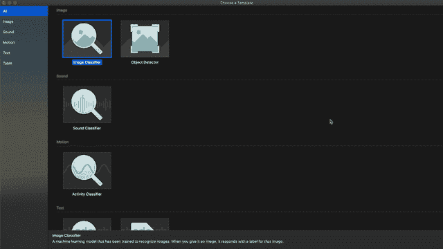
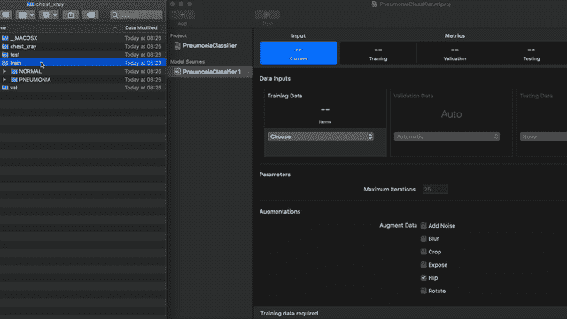
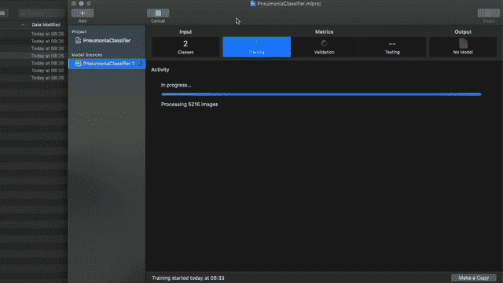

# 深度学习很容易

> 原文：<https://towardsdatascience.com/deep-learning-is-easy-a048afd50c81?source=collection_archive---------59----------------------->

## 意见

## 企业通过深度学习创造价值有多容易

很长一段时间以来，深度学习一直是新闻中的热门话题。这有很好的理由——最重要的理由是它通过软件提供的附加值。今天，我们将探索这些年来深度学习变得多么容易，以及这对就业市场意味着什么。

丹尼尔·明戈金在 [Unsplash](https://unsplash.com?utm_source=medium&utm_medium=referral) 上的照片

让我先做一个大胆的免责声明——这篇文章**不适用于深度学习的研究部分。然而，这篇文章确实适用于实际的深度学习。我所说的“实用”是指利用深度学习库来解决特定的业务问题。**

今天，我们将探索在没有雇用任何深度学习工程师的情况下，这些公司可以在深度学习方面做些什么。所有的工作都可以由软件开发人员或领域专家来完成——归结起来就是点击几下鼠标。

这里的目的是测试深度学习工程师是否变得过时，并测试入门级深度学习工作所需的技能水平——所有这些都是根据 2020 年的标准。

但是我们如何测试呢？好问题。让我们在下一节看一个具体的例子。

# 具体的例子

“没有数据，你只是另一个有观点的人”——威廉·爱德华·戴明说，我非常同意。我不指望你相信你读到的一切——我知道我不会。这就是为什么我准备了一个具体的、简单易懂的展示，让你无可争议。

让我把你介绍给乔。

乔在一家医院的一个部门工作，该部门处理肺部疾病和一般肺部疾病。缺少医学专家，工作不断出现。医务人员超负荷工作，疲惫不堪，因此容易出错。

我不是医学专家，所以如果我在这里说错了什么，请原谅我——这是最重要的整体概念。

为了减轻团队的负担，Joe 决定使用深度学习来“外包”重复的任务，比如说，**肺部图像分类**。最终的结果是，Joe 的医疗团队应该有更多的时间从事这项工作的人的方面。唯一的问题是——乔对深度学习一无所知。

Joe 在网上搜索并找到了一些 AutoML 工具——比如苹果的 CreateML。碰巧他也有一台 Mac 电脑。太好了！

经过进一步的研究，Joe 发现 CreateML 对很多任务都很有用——图像分类就是其中之一:

太棒了。Joe 在医院工作，所以获取数据不成问题。他的团队已经收集并标记了几千张图片，准备插入到 CreateML 中。

现在我无法访问他们的图像，所以我将使用[肺炎肺部图像数据集](https://www.kaggle.com/paultimothymooney/chest-xray-pneumonia)进行演示。该数据集包含超过 5000 张(非常)不同大小的肺部图像——这对深度学习实践者来说是一个问题，但对 *CreateML* 来说不是问题。

Joe 的下一步是开发一个预测模型。在阅读了一两篇文章之后，他熟悉了训练/测试/验证分割的概念，所以他以那种方式组织数据。结果是 *CreateML* 以同样的方式工作:

只需拖放即可——其他一切都是自动处理的

乔现在可以点击那个大而醒目的 *Run* 按钮，开始训练过程。在我的机器上花了大约 1 个小时完成，但结果是在测试集上产生了 85%的准确率(以前看不到的数据):

我不知道医学专家的分类有多少次是错的，但 85%肯定是一个很好的起点！

我以前在这个 Pneuomina 数据集上工作过(用 PyTorch ),在测试集上只获得了 83.5%的准确率。这里的召回值非常高，大约为 99.5%，这意味着如果图像被分类为受感染，我们可以 99.5%确定它确实被感染了。

简单来说，这个模型不太可能对阳性病例进行错误分类。该数据集的问题是类别不平衡-负面案例比正面案例多约 2 倍-这影响了模型的整体预测能力(准确性)。

然而，85%是坚如磐石的，至少一开始是这样。当然，乔和他的医疗团队是一个虚构的人，但我希望你能明白。

# 这对就业市场意味着什么？

*这是否意味着深度学习工作将成为过去？一点也不，但你还是应该有所顾虑。*

试着像做生意一样思考一下。*如果一个免费工具可以胜过新手深度学习实践者，你会雇佣他们吗？我知道我不会。还有， *CreateML* 模型很容易将模型部署到 iOS 和 macOS 上，但是通过一些手工操作，模型可以部署到任何地方。*

像 *CreateML* 这样的工具是为软件开发人员设计的——让他们更容易在应用程序中使用机器学习。这并不意味着取代人，但人们只能假设，除了这些工具可以提供的解决方案之外，很大一部分公司并不需要更复杂的解决方案。

另外，*你能指望新手知道如何处理模型部署吗？没有，但是您的软件开发和 DevOps 团队可以轻松处理这项任务。*

那么深度学习实践者的目的是什么呢？嗯，通过专业知识和领域知识来超越像这样的工具。初级从业者可能做不到这一点。这也是为什么**领域内大部分职位都是资深**的原因。

*喜欢这篇文章吗？成为* [*中等会员*](https://medium.com/@radecicdario/membership) *继续无限制学习。如果你使用下面的链接，我会收到你的一部分会员费，不需要你额外付费。*

 [## 通过我的推荐链接加入 Medium-Dario rade ci

### 作为一个媒体会员，你的会员费的一部分会给你阅读的作家，你可以完全接触到每一个故事…

medium.com](https://medium.com/@radecicdario/membership)