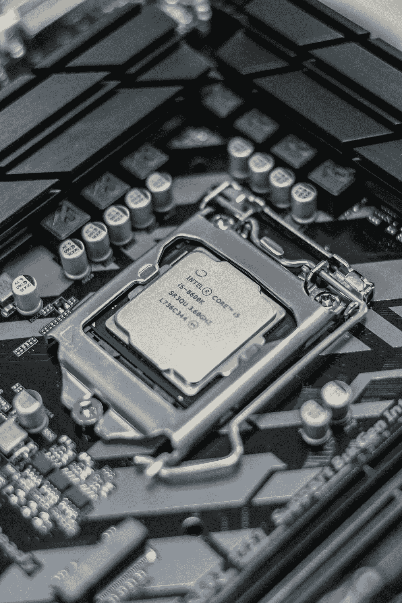

# 如何让深度学习使用逻辑

> 原文：<https://towardsdatascience.com/deep-learning-is-not-logical-ce0941b74f0a?source=collection_archive---------31----------------------->

## 理解大脑如何导航环境可以帮助人工智能解决复杂的问题

亚历山德鲁-波格丹一世·吉塔在 [Unsplash](https://unsplash.com?utm_source=medium&utm_medium=referral) 上拍摄的照片

在这篇文章中，我将展示深度学习无法理解逻辑和结构，并指出由神经科学启发的潜在解决方案。这很重要，因为世界上大多数有价值的问题都需要逻辑地解决，但现代深度学习在这方面很大程度上失败了。

# 合乎逻辑是什么意思？

从统计学的角度来说，逻辑类似于在给定一组观察值的情况下对预测的极端信心。在纯粹的逻辑世界中，1 + 1 = 2 总是正确的，而在更随机的非逻辑系统中，1 + 1 = 2 可能只在 90%的情况下是正确的。

有些逻辑产生于我们对世界结构的理解，比如物理定律。举个例子，如果你丢了一个球，然后你希望它会掉到地上。然而，在一个非结构化的世界中，一切皆有可能，这使得预测未来变得困难。例如，股票市场是一个非结构化的世界。我父亲从 5 月份就开始关注 Novax Pharma，但他不可能预测到首席执行官会卖掉他的股票，使其价格暴跌。

统计学家可能会说，我们生活在一个随机和无组织的世界，但宇宙中也有许多方面是可预测和符合逻辑的，如物理、数学和科学。逻辑性让我们能够规划未来，并形成具体的路径来帮助我们达到目标。几乎所有值得解决的难题都需要运用推理和逻辑。

# 纯深度学习是学不到逻辑的

深度学习能否实现逻辑的圣杯？ [DeepMind 在他们 2019 年的论文](https://arxiv.org/abs/1904.01557)中提出了这个问题，他们在论文中实现了一个变压器模型来解决数学问题[1]。他们的结果令人印象深刻；该模型在简单的加法、减法、除法和乘法中达到了 90%以上的准确率。但是当混合操作时，性能下降到 50%，这表明该模型只是猜测解决方案，而不是一步一步地解决问题。

在深度学习中还有其他例子，模型或代理人非常擅长他们的任务，以至于他们产生了逻辑和推理的幻觉。

OpenAI 的 GPT-2 语言模型可以生成类似人类的文章，但更仔细的检查表明，它的输出没有逻辑结构，只是模仿它在训练数据中被训练的内容。例如，该模型有时会写到水下发生的*火灾。*

DeepMind 和 OpenAI 开发的分别用于玩星际争霸 2 和 DotA 2 的视频游戏代理在各自的游戏中击败了顶级职业游戏玩家，但大多使用纯粹的机械技能和执行良好的攻击，而不是策略。例如在 DotA 2 中，如果目标的生命值低于阈值，玩家可以采取一个动作立即杀死另一个玩家，否则伤害很小甚至没有。不可否认，在阈值以上使用它是一个错误，但 OpenAI 的 DotA 2 bot 一直在这样做。当人类对手使用仅靠机械技能无法克服的模糊策略时，DeepMind 为《星际争霸 2》开发的 AlphaStar 会持续倾斜并输掉比赛。

一些人认为，如果接受更长时间的训练，这些特工可能会克服上述缺陷。这可能是真的，但是这些问题通常不会出现在普通玩家身上。很明显，这些智能体缺少一种使它们像人类一样聪明的成分。

# 神经科学给了我们答案

早在二月份，我偶然发现了莱克斯·弗里德曼对理论神经科学家杰弗瑞·霍金的采访。在采访中，霍金斯描述说，神经科学家正在假设人类空间导航的神经机制也可能是人类导航抽象概念的能力的原因。我是说，为什么不呢？从逻辑上来说，解决问题与空间导航使用相同的原理，因为两者都需要规划从起点到终点的路线。

2018 年，DeepMind 恰好实现了[世界上第一个使用神经基底进行空间导航的智能体](https://deepmind.com/blog/article/grid-cells)(称为网格细胞)[2]。代理的任务是在迷宫般的环境中导航，网格细胞的参与教会了代理始终选择捷径*并在原始捷径受阻后创建新的捷径*。这是一个令人难以置信的壮举，网格细胞的最初发现者评论说这是“机器人学中众所周知的困难”。然而，最重要的是，他们的实验发现，智能体中使用的神经网络通过仅让网络估计智能体每次移动时在迷宫中的位置和朝向，发展了类似网格细胞的属性。简而言之，他们的发现表明*自我意识(在这种情况下是空间自我意识)是解决任何导航问题的关键因素*。对于我们大多数人来说，这不应该是一个惊喜，因为评估我们相对于目标的位置对于实现目标是至关重要的。**

*这是这篇文章的惊人想法。我们一直在通过最小化预测误差来训练深度学习模型(例如，分类图像是猫还是狗等等)，但如果我们最小化其自我意识误差，模型是否有可能理解这个世界的结构并导航抽象概念？*

# *实现自我感知的人工智能*

*假设自我意识是人工智能逻辑解决问题的必要成分之一，我们将如何实现它？网格细胞论文中有一些要点:*

1.  *“自我意识”的错误是真实情况和代理人自己预测的位置和方向之间的差异。*
2.  *基本事实的位置和方向(代理的自我意识)由神经激活信号表示，当代理处于唯一的位置和方向时，每个单元都会触发。*
3.  *网格单元相对于代理的位置和它的方向以规则的间隔被激活*
4.  *当模型训练以最小化自我意识的损失时，网格单元激活正好在最终线性层之前出现。*

*总之，只要我们确定它所处的环境，并尽量减少对其坐标和方向预测的误差，“自我意识”就会完全脱离训练。不幸的是，涉及网格单元的实验只在空间导航上进行过，所以还不清楚它是否适用于非空间系统。*

*但我心里确实有一个实验。自然语言处理中的一个研究热点是理解如何教授一个模型来捕捉因果关系。我之前提到的关于 GPT-2 写的关于*水下发生火灾*的例子是一个混淆因果关系和相关性的例子。仅仅因为有句子说水经常灭火并不意味着火影响水。学会在单词嵌入的向量空间中导航的网格细胞会更好地捕捉这种关系吗？*

# *结论*

*虽然上面的实验是推测性的，这篇文章可能完全是一场虚惊，但不可否认的是[深度学习已经撞上了一堵墙](/is-deep-learning-hitting-the-wall-d2f560419daf)，对于研究社区来说，一个值得前进的方式是探索新的想法(哎呀，感谢明显队长！).在我的[计算机科学论文项目](https://github.com/TianrenWang/KnowledgeNet)期间，我探索了知识图在赋予神经网络推理能力方面的潜力。这是一个很酷的概念，但由于图形的内在限制，这个项目失败了。*

*在写这篇文章的时候，我正暂停深度学习，专注于我最后一年的教育，所以我将火炬传递给你。对于那些厌倦了优化现有架构或被这一想法吸引的人，我强烈建议你看看 DeepMind 关于 grid cell 的论文，并将其应用于非空间应用。谁知道呢，你可能会发现一个比现有架构性能更好的新架构。但是如果你是，记住你是从这里听到的。*

*[1] D. Saxton，E. Grefenstette，F. Hill，和 P . Kohli，[分析神经模型的数学推理能力](https://arxiv.org/abs/1904.01557) (2019)，ICLR 2019*

*[2] A. Banino 等[人工智能体中使用网格状表示的矢量导航](https://www.nature.com/articles/s41586-018-0102-6) (2018)，Nature 26，1。*