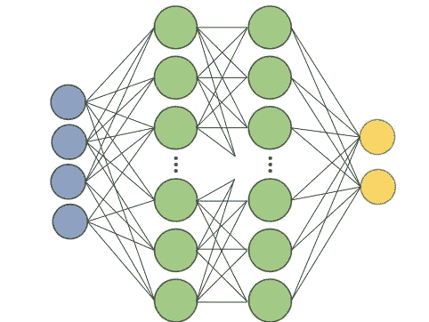
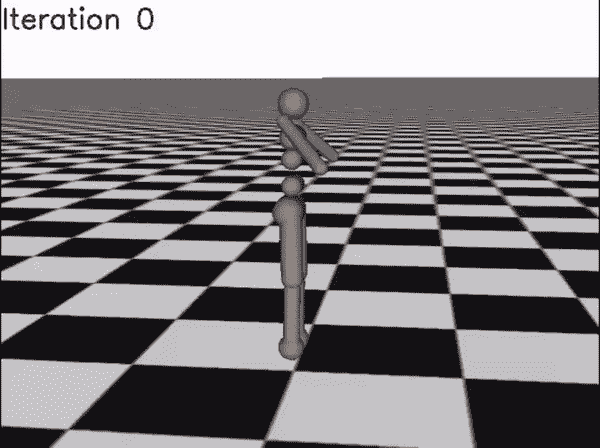

# 深度学习不是解开奇点的钥匙

> 原文：<https://towardsdatascience.com/deep-learning-is-not-the-key-to-unlocking-the-singularity-913f960ac345?source=collection_archive---------14----------------------->

## 深度学习改变了人工智能领域，但它不会给我们人工通用智能——下面是原因。

D eep 学习是使用神经网络来解决近似、回归或分类任务。这个**工具**已经成为展示智能代理的突出设备，但它并不具备结构化推理的明显潜力。这篇文章强调了深度学习的*惊人的优势，将其放在我们试图解决的*的背景下。

神经网络的规范图像。来源—作者。

神经网络是使人工智能实用化的第一个工具——它们现在被用于许多领域(见[这篇](https://www.hindawi.com/journals/cin/2018/7068349/)impact 综述)。上一次单一技术*试图*在行业中引起引人注目的变化是 [**专家系统**](https://en.wikipedia.org/wiki/Expert_system) ，在那里，计算机科学家和专业人士的协同作用将他们的知识提取到树状搜索算法中，以供重复使用。这种方法的问题在于，它无法解读训练集的言外之意——它只是重复给定的内容，因此公司不再花钱制作它们。它给了我们第一个[艾的冬天](https://en.wikipedia.org/wiki/AI_winter)。

> 机器学习:人工智能的子领域，任务是从状态空间的部分观察中对新数据做出决策。

关于 AI 的状态，神经网络改变了什么？他们**有能力概括(或记忆)一个状态空间**到适度概括的程度。你问什么是神经网络？逼近任何有限的输入数据集都是一个长时间的非线性函数和矩阵运算的交织过程*。如果你想知道更多，我会让你观看这个由[格兰特·桑德森](https://www.3blue1brown.com/about)制作的*神奇的* 视频和系列。有许多方法来描述它，但是在本文的上下文中，仅仅把它想成一个高维函数近似器就足够了。*

在讨论神经网络时，记住机器学习的目标是什么是很重要的。 ***机器学习是关于做决策，人工智能是关于做推理能力。*** 做第一件事可以启用第二件事，但这不是一个*充分*的准则。

# 奇点是什么？

Vernor Vinge 在 1993 年的一篇文章 [*中创造了“奇点”，即将到来的技术奇点*](https://edoras.sdsu.edu/~vinge/misc/singularity.html) ，它标志着人类从占主导地位的超级智能时代的结束。现在，人工智能领域的顶尖科学家在争论它何时会出现，我暂时弃权。最终，问题是，需要什么工具或发现来让计算机绕过人类智能。答案不是深层网络。

来源——作者 CS188 课程，[http://ai.berkeley.edu](http://ai.berkeley.edu)。

## 反对深度学习的理由

为什么深度学习不会超越人类的智力——缺乏真正的概括？最近的研究已经讨论了神经网络是如何简单地[记忆训练集](https://arxiv.org/pdf/1706.05394.pdf)的，其间有轻微的插值。这解释了转换数据的困难、分布变化的困难以及增加数据集大小的好处。深度网络是最好的近似工具，因为它们可以跨越有限数据的任何领域:计算机视觉、动态系统、音频处理等等。他们无法准确预测系统何时在复杂的习性中扩展，如身体智能或抽象造句，这是人类大脑的奇迹。

把神经网络的预测能力看作是解决人类水平智能的必要组成部分，但是对于是否足以证明超级智能的存在并没有说什么。

## 将深度学习与符号人工智能相结合

**人脑是一个 20W 的通用智能系统的存在。计算机最终可以做到(也许在更高的功率下)。象征性人工智能的经典领域[试图使用更高级的数学和基于推理的构造来创造智能系统。符号人工智能旨在使计算机能够推理和提取知识，而不是记忆和预测。也就是说，深度学习已经实现了如此多的自动化任务(图像识别、时间序列预测等)，因此这些推理系统可以采取非常不同的方法。在深度学习浪潮之外获得资金要困难得多，但正是研究人员*展示了下一个平台(可能利用深度学习)，这将通过建设性的推理能力彻底改变该领域*。](https://en.wikipedia.org/wiki/Symbolic_artificial_intelligence)**

人工智能社区需要记住有时会偏离正道。来源—作者。

# 强化学习是深度学习的展示

强化学习近年来已经成为深度学习能力的一个戏剧性展示——在各种游戏中展示戏剧性的概括和发现能力( [1](https://deepmind.com/blog/article/alphago-zero-starting-scratch) 、 [2](https://cdn.openai.com/dota-2.pdf) 、 [3](https://www.nytimes.com/2018/12/26/science/chess-artificial-intelligence.html) 、…)。它如此成功的原因是它们是游戏。它们是不同比例的玩具样品。RL 的进步表明，我们可以将一个报酬近似问题框架化为一个回归问题。

[GAE-舒尔曼，莫里茨，莱文，约旦，阿比勒，ICLR 2016]

这是如此令人兴奋的原因——潜力。当我们将更多真实世界的问题公式化为复杂的近似问题时，deep-RL 任务将会更出色。现在的障碍是系统和数据科学。

考虑一下新上市的初创公司 [Covariant.ai](https://covariant.ai/) ，[他们正在用深度学习进行物流革命](/robots-are-ready-for-the-real-world-32808cb1a4eb)(当然，也在幕后尝试 RL——伯克利的 source friends。)

Lex Friedman 对深度学习的位置做了一个很好的总结——学习专家在互联网上的人数越来越多，请欣赏！

更多？订阅我关于机器人、人工智能和社会的时事通讯！

 [## 自动化大众化

### 一个关于机器人和人工智能的博客，让它们对每个人都有益，以及即将到来的自动化浪潮…

robotic.substack.com](https://robotic.substack.com/)