# 物体检测的深度学习方法:R-CNN 解释

> 原文：<https://towardsdatascience.com/deep-learning-method-for-object-detection-r-cnn-explained-ecdadd751d22?source=collection_archive---------6----------------------->

## R-CNN 目标检测算法，从原始论文一步一步讲解

来源:Matthijs Hollemans 的博客

# 介绍

CNN 已经被广泛用于图像分类。但是检测图像中的对象并在它们周围绘制边界框是一个很难解决的问题。为了解决这个问题，2014 年发表了 R-CNN 算法。在 R-CNN 之后，它的许多变体如 [Fast-R-CNN](https://arxiv.org/abs/1504.08083) 、[Fast-R-CNN](https://arxiv.org/abs/1506.01497)和 [Mask-R-CNN](https://arxiv.org/abs/1703.06870) 出现了，它们即兴完成了对象检测的任务。要了解最新的 R-CNN 变种，对 R-CNN 有一个清晰的认识是很重要的。一旦理解了这一点，那么所有其他的变化就很容易理解了。

这篇文章将假设读者熟悉 SVM，使用 CNN 和线性回归的图像分类。

# 概观

[R-CNN 论文](https://arxiv.org/abs/1311.2524)【1】发表于 2014 年。这是第一篇表明 CNN 可以在对象检测中产生高性能的论文。该算法以下列方式进行对象检测:

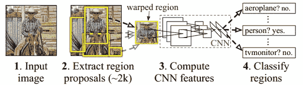

来源:[原创论文](https://arxiv.org/abs/1311.2524)

1.  该方法将图像作为输入，并从图像中提取大约 2000 个区域提议(上图中的步骤 2)。
2.  然后，每个区域提议被扭曲(整形)成固定大小，作为 CNN 的输入。
3.  CNN 为每个区域提议提取一个固定长度的特征向量(上图中的步骤 3)。
4.  这些特征用于使用类别特定的线性 SVM 对区域方案进行分类(上图中的步骤 4)。
5.  使用边界框回归来细化边界框，使得对象被该框正确地捕捉。

现在这篇文章将深入解释模型如何被训练以及它如何预测边界框的细节。

# 计算区域建议

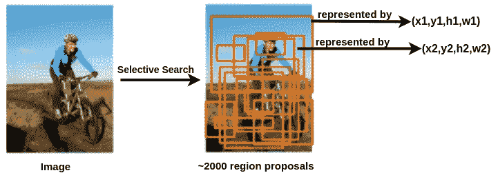

地区提案|来源:作者图片

区域建议是可能包含对象的边界框。这些由 4 个数字(x，y，h，w)的元组表示。(x，y)是边界框中心的坐标,( h，w)分别是边界框的高度和宽度。这些区域建议由一种叫做[选择性搜索](https://www.geeksforgeeks.org/selective-search-for-object-detection-r-cnn/)【2】的算法计算。对于一幅图像，提取大约 2000 个区域提议。

# 训练 CNN 特征提取器；

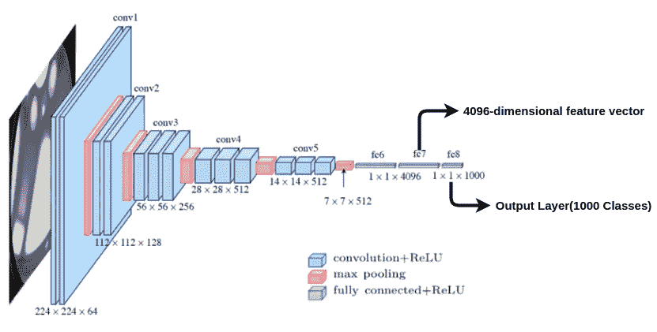

基于 CNN(VGG 16 台)的特征提取器|来源: [Pinterest](https://www.pinterest.ca/pin/834854849655070162/?autologin=true) |由作者编辑

**预训练网络:**为了训练 CNN 进行特征提取，像 VGG-16 这样的架构用来自 [imagenet](http://www.image-net.org/) 数据的预训练权重初始化。具有 1000 个类别的输出层被切断。因此，当一个区域提议图像(扭曲到 224x224 大小)被传递到网络时，我们得到一个 4096 维的特征向量，如上图所示。这样，每个区域提议由 4096 维特征向量表示。

下一步是用区域建议图像微调网络的权重。为了理解这一点，我们将引入一个称为交集/并集或 IoU 得分的新指标。

## 并集上的交集

为了衡量分类模型的性能，我们通常使用准确度、召回率、精确度等指标。但是如何衡量物体检测的性能。在对象检测中，我们必须评估两件事:

1.  边界框在图像中定位对象的能力。换句话说，预测的边界框有多接近地面真实。
2.  边界框是否正确分类了被包围的对象

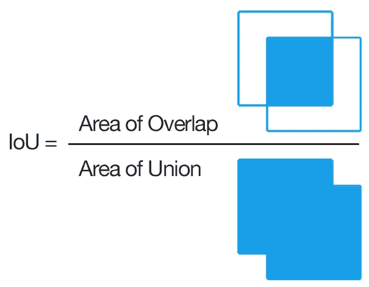

来源:[阿德里安·罗斯布鲁克的博客](https://www.pyimagesearch.com/2016/11/07/intersection-over-union-iou-for-object-detection/)

IoU 分数衡量预测框与实际情况的接近程度。它是地面真实值和预测框的公共面积与这两个框所包围的总面积的比率。

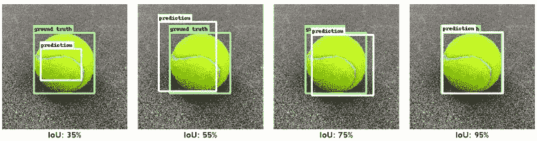

来源: [Gitbook](https://apple.github.io/turicreate/docs/userguide/object_detection/advanced-usage.html)

在最左边的图像中，可以看到预测框不接近真实情况，因此 IoU 得分仅为 35%,而在最右边的图像中，预测框与真实情况框完全重叠，因此获得了 95%的非常高的值。IoU 值从 0 到 1 不等。

**微调网络:**为了微调模型，用 N+1 个类(softmax 层)替换具有 1000 个类的输出层，模型的其余部分保持不变。n 是对象被分类的不同类别的数量，加上背景类别的 1。

接下来，微调需要数据。IoU > 50%的区域提案被视为该目标的积极类别，其余被视为背景。在上面的球图像中，IoU 分数为 35%的区域提案将被标记为背景，而其余的方框将被标记为球。这些图像(区域提议)被扭曲(调整大小)到与 CNN 兼容的尺寸，在 VGG 16 的情况下是 224x224。使用这些图像，网络的权重被微调。

# 特定于培训班的 SVM

一旦获得了每个区域建议的 4096 维特征，下一个任务是为每个类别训练一个二元 SVM。例如，如果检测模型要检测三个不同的对象——猫、狗和人，那么需要为每个类训练三个 SVM。

**数据准备:**属于特定类别的所有对象提议被分离。该类别的手动标记的地面实况图像被认为是正类别，而对于该类别具有 IoU < 30%的对象提议被认为是负类别。对每个类别做同样的事情，并且训练 N 个 SVM 模型以将每个区域提议分类成 N 个类别。

# 包围盒回归

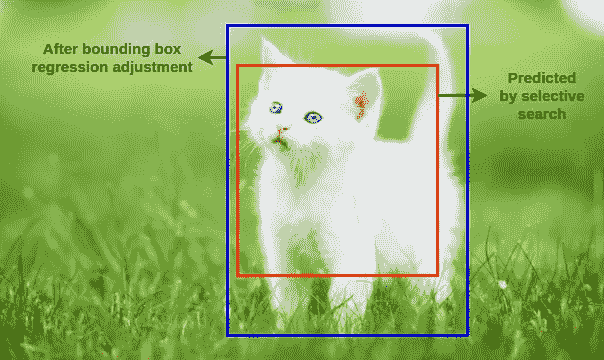

来源:[我的起点网站](https://blog.mystart.com/my-white-cat-hd-wallpapers-new-tab-theme/) |作者编辑

由选择性搜索[2]算法预测的区域提议边界框可能无法捕获整个对象。为了微调预测的边界框，使用边界框回归。

通过选择性搜索[2]算法考虑地面真实区域建议 G 和预测区域建议 P。

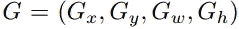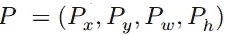

为了使 G 比例不变的预测，进行以下变换，使得回归的目标是 *t.*

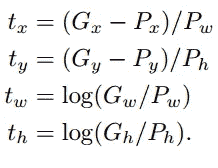

转换方程

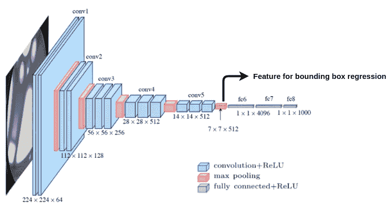

来源: [Pinterest](https://www.pinterest.ca/pin/834854849655070162/?autologin=true) |作者编辑

回归模型的输入是来自 CNN 的最后一个池层的特征。我们每类训练 4 个回归模型，目标为 *t* ，输入特征为 CNN 的最后一个池层特征，以学习回归参数 w。

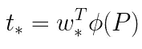

回归方程式

这里*是(x，y，w，h)的占位符，phi(P)是对应于方案 P 的最后一个池化图层要素。因此，要预测地面实况 G，我们可以使用回归方程根据区域方案 P 计算 t，然后将 t 和 P 的值代入变换方程以获得 G。

# 预言；预测；预告

一旦 R-CNN 的不同部分被训练，接下来的部分是进行对象检测。

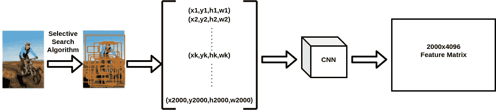

来源:作者图片

1.  拍摄输入图像，并使用选择性搜索[2]算法，为图像获得大约 2000 个区域提议。
2.  每个区域建议图像被扭曲成 224x224 的固定大小。
3.  这些区域提议图像然后被传递到训练的 CNN 以获得所有 2000 个区域提议的 4096 维特征向量，这导致 2000×4096 维矩阵。

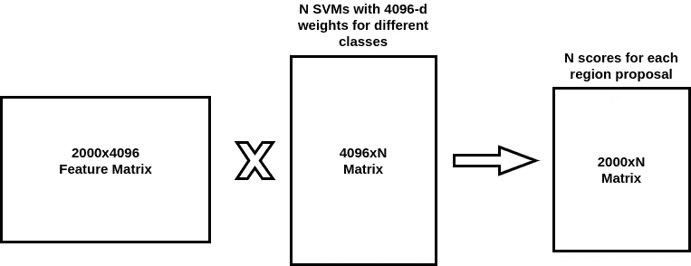

来源:作者图片

3.每个区域的提案都使用每个类别的 SVM 进行分类。通常对于 N 个类，SVM 权重(4096 维)以矩阵的形式堆叠，并与特征矩阵相乘。这将产生一个矩阵，该矩阵为区域提案所属的每个类别分配一个分数。

4.该建议被分配到得分最高的类别。因此，图像中的所有 2000 个区域提议或边界框都标有类别标签。

5.在那些众多的边界框中，许多是多余的和重叠的边界框，需要被移除。为了实现这一点，使用了非最大抑制算法。

**非最大抑制算法:**

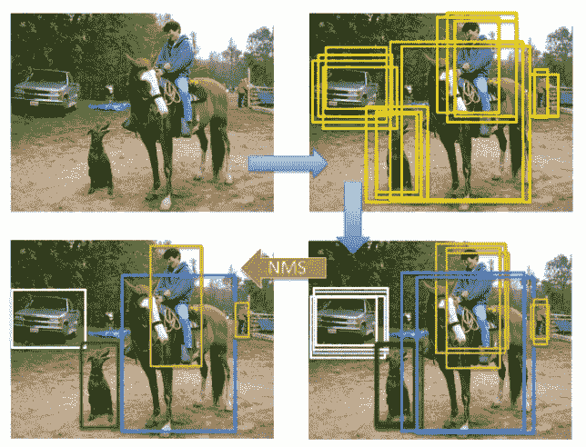

来源:[非最大压制博客](https://medium.com/@yusuken/object-detction-1-nms-ed00d16fdcf9)

非最大抑制是一种贪婪算法。它一次只对一个类有效。对于一个特定的类，它选择使用 SVM 获得最高分数的盒子。然后，它计算属于该类的所有其他边界框的 IoU 分数。IoU 分数大于 70%的框被移除。换句话说，具有非常高重叠的边界框被移除。然后选择下一个最高得分框，依此类推，直到该类别的所有重叠边界框都被移除。对所有的类都这样做，以获得如上所示的结果。

6.一旦获得标记的边界框，下一个任务是使用回归来微调框的位置。

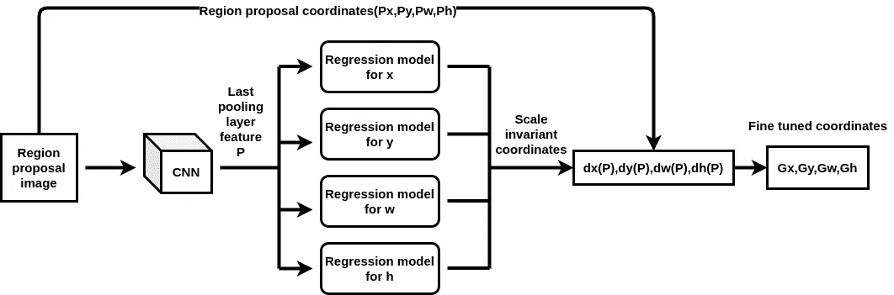

通过回归微调区域建议|来源:作者图片

在训练期间，为每个类训练 4 个回归模型。因此，对于特定的包围盒，区域建议图像通过 CNN 以获得要传递给回归模型的特征 P。回归模型输出比例不变的坐标(dx(P)，dy(P)，dw(P)，dh(P))。这些坐标与区域建议坐标(Px，Py，Pw，Ph)相结合，使用以下公式获得调整后的最终坐标(Gx，Gy，Gw，Gh)。

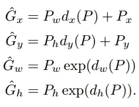

# 原始论文的结果

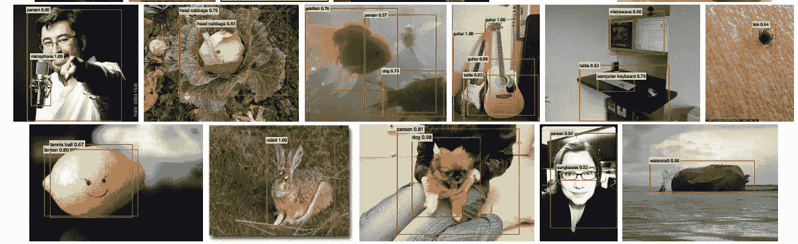

R-CNN 物体探测结果|来源:[原创论文](https://arxiv.org/abs/1311.2524)

# 结论

R-CNN 虽然擅长检测对象，但也有不足之处。

1.  这种算法很慢，在图像上执行对象检测大约需要 47 秒。
2.  训练不是一步到位的。不同的部分有不同的模式，这使得培训过程非常耗时。

这些缺点在 R-CNN 后来的改进中得到解决，这些改进是 Fast-RCNN、Fast-RCNN 和 Mask-RCNN。对 R-CNN 有很好的理解，有助于轻松直观地理解 R-CNN 的其他变种。

# 参考

1.  R.吉希克、j .多纳休、t .达雷尔和 j .马利克。丰富的特征层次，用于精确的对象检测和语义分割。2014 年在 CVPR。
2.  Uijlings，Jasper & Sande，K. & Gevers，T. & Smeulders，Arnold。(2013).物体识别的选择性搜索。国际计算机视觉杂志。104.154–171.10.1007/s 11263–013–0620–5。