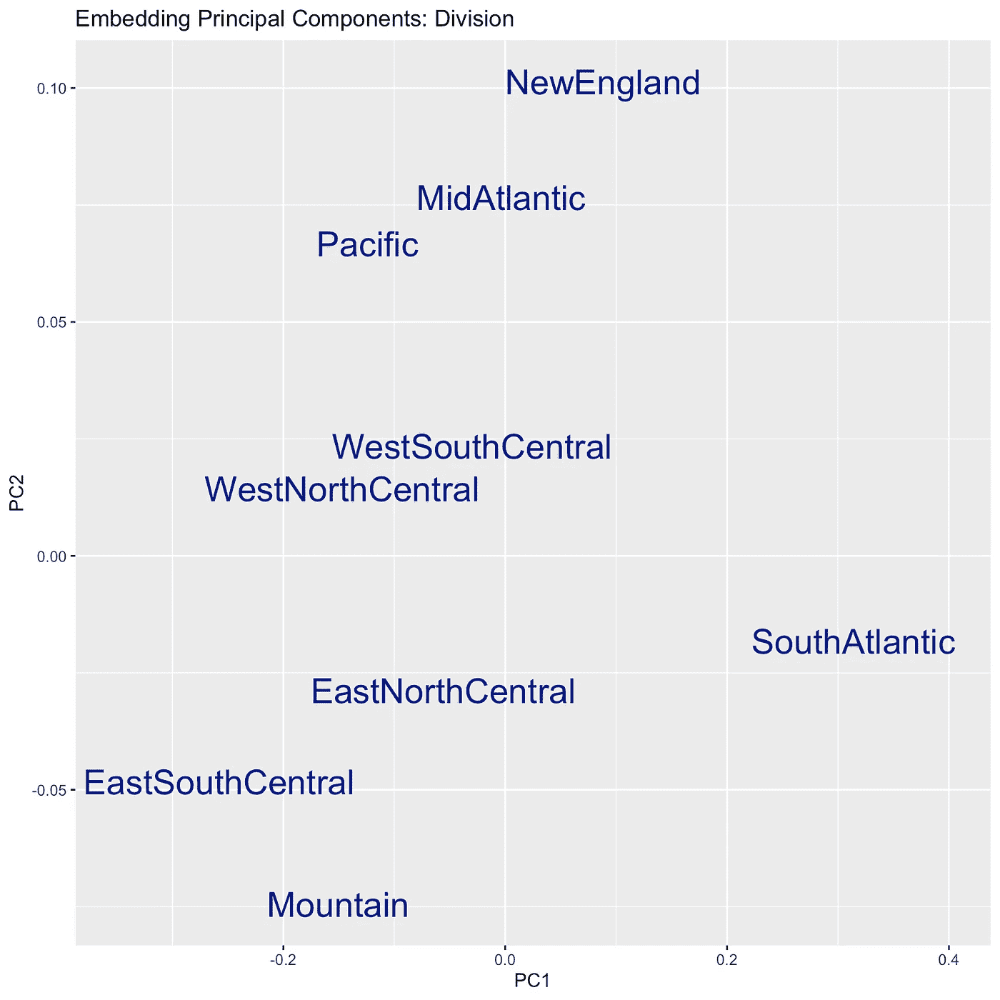
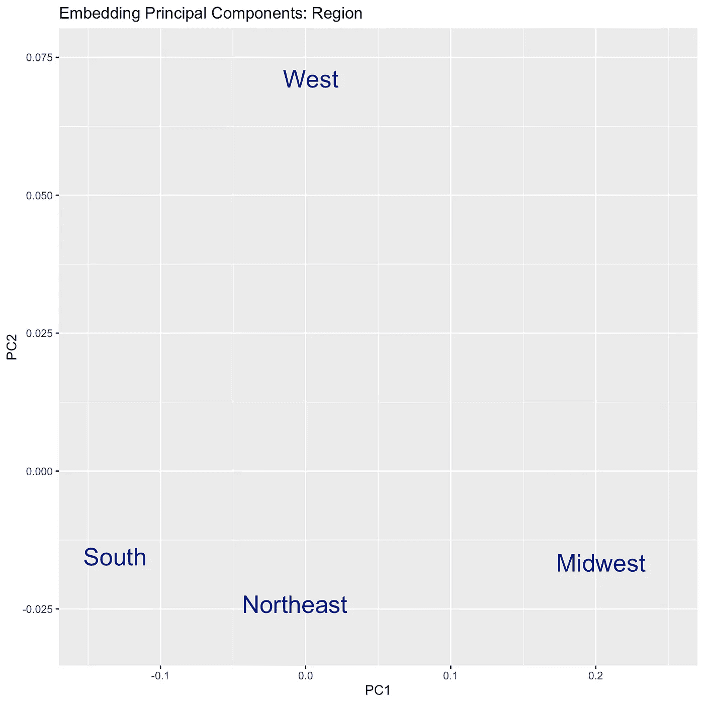

# 深度学习模型实现:分类变量的嵌入

> 原文：<https://towardsdatascience.com/deep-learning-model-implementation-embeddings-for-categorical-variables-1f12df30fcc8?source=collection_archive---------26----------------------->

## 利用嵌入探索美国房价和移民模式

对于许多复杂的预测问题，深度学习(DL)方法(如 CNN、NLP 和全连接网络)提供了最高水平的性能。这通常以理解解释特征在预测结果中的作用为代价。虽然基于统计方法的机器学习(ML)方法提供了多种技术，包括变量选择、相对重要性和某些情况下的模型系数，以了解预测器的作用(如本系列的第 1 部分中所讨论的)，但在 DL 方面实现类似见解的潜力还没有得到充分探索。而且，由于所涉及的复杂性，这种情况很可能会持续下去。然而，有一些方法可以获得一些关于众所周知的黑盒中发生了什么的线索。例如，在图像的 CNN 分析中，类别激活地图是一种识别图片的哪些区域在其分类中最活跃或最有影响力的方法。

# 嵌入

对于时间序列或其他结构化数据，嵌入为分类特征提供了标准的一键编码或“虚拟”变量表示的替代方法，可以洞察它们对因变量的影响模式([郭和 Berkhahn2016](https://arxiv.org/abs/1604.06737) )。嵌入矩阵与模型拟合一起被估计，并且它们的维数通常被选择为稍微小于变量的基数，例如，表示一周中各天的嵌入矩阵可以具有 7×4 的维数，从而允许每一天由 4 维嵌入向量来表示。这允许沿着 4 个维度来捕捉模式和各天之间的相似性或差异。

# 一个例子:房地产时间序列

我想看看我是否能从 DL 模型中估计嵌入，以及产生的模式是否是可解释的。当美国经济分析局(BEA)最近开始发布美国各县的 GDP 数据时，我开始对在这种地理粒度级别上还能找到什么类型的数据感兴趣。我热爱所有与房地产有关的事情，当时我还不是一个能接触到 MLS 信息的活跃的代理人。幸运的是，有 Zillow 研究公司。尽管 Zillow 在该网站上提供的信息会随着时间的推移而变化，但去年他们提供了从 2010 年 1 月 1 日到 2018 年 1 月 1 日期间约 1260 个美国县的调整后销售价格数据。各县提供的其他房地产数据包括销售计数、降价百分比、Zillow 房屋价值指数(ZHVI)、Zillow 天数、每月房源和以前止赎房屋的销售百分比。所有这些功能每月都有。我收集了美国各县的其他数据，包括 GDP(2015-2018，BEA)，人口模式，失业和贫困，家庭收入，县商业模式和美国人口普查地区和部门(2010-2018，美国人口普查局)。这些数据每年记录一次。我还从美联储经济数据(2010-2018，FRED)中获得了月度优惠利率。

我的目标是使用 [fastai](https://www.fast.ai) 库来预测美国各县的年度月度调整销售价格。我拟合了一个具有两个完全连接层的 DL 模型，其中分类变量使用嵌入来表示。最终模型在预测下一年的调整后销售价格时实现了 8%的验证均方根百分比误差。你可以在这里看到适合和如何提取嵌入的代码[。一旦提取，嵌入矩阵与原始数据合并回计算主成分(PCs)。地理变量的前两个 PCs 的图表如下，从最细到最细:州、部门和地区。这些会引出我们可以解读的东西吗？让我们来了解一下！](http://dahliaanalytics.com/htmls/re_zillow.html)

# 状态

作者图片

状态嵌入沿 PC1 的布局显示了一些我们可能预期的聚类(例如 CT 和 RI、NY 和 NJ)和异常值(例如 CA、HI)，但在其他方面显得相当复杂。让我们使用美国人口普查部门和地区来进行更高层次的分组(你可以在这里看到这些)。

# 美国人口普查部门

作者图片

这里事情变得有趣了！沿着 PC1，除了南大西洋分部之外，其它地方都相当不错。沿着 PC2，我们有一些最初看起来不协调的分组，至少从地理角度考虑。东/北/中南部以及南大西洋与山区划分在一起，新英格兰/中大西洋与它们的海岸相对，太平洋。这些领域有什么共同点？

从供求及其对价格的影响来考虑，让我们看看美国的移民模式。虽然人口普查局也有这种类型的信息，但我发现了一个有趣的来源(来自应该知道的人！)是北美搬家服务。你可以在这里查看他们过去十年的互动迁徙地图。在美国大选的前一个月，我有点希望他们选择不同的颜色而不是红色和蓝色来区分各州是主要向外还是向内(！)但这是一张迷人的地图。在他们的网站上，你可以滑动滚动条来查看 2011 年至 2019 年每年的数据，并将鼠标悬停在每个州上来查看其出境和入境统计数据，以及财产税百分比。

有趣的是，我们看到了与上述嵌入描述的模式的一致性，美国人口普查部门东南中、南大西洋和山地有更多的向内迁移，新英格兰(至少是 CT)、中大西洋和太平洋部门经历了更多的向外迁移。该模式的一个例外是东北中心区，虽然与其他入境区组合在一起，但似乎有更多的出境移民。

还有一个最小的美国人口普查分组需要考虑:地区。

# 美国人口普查地区

作者图片

如上图所示，美国的四个人口普查区域将人口普查划分折叠起来。根据我们已经研究过的迁移模式，PC1 可能会根据迁移模式及其对房价的影响对这些地区进行排序。在过去的十年中，美国南部地区的房价涨幅无疑是最大的。真正有意思的是 PC2！虽然其他三个地区基本上在这个轴上一起崩溃，但西方与其他地区截然不同。虽然在过去十年中，南部、东北部和中西部地区的入境或出境移民模式在内部相当一致，但西部人口普查区合并了太平洋地区和山区的不同移民动态。

# 最后

通过一点额外的工作，分类变量的嵌入可以从 DL 模型拟合中提取出来，并且可以提供一些关于预测变量影响我们预测结果的能力的方式的见解。嵌入还可以被提取并用作其他类型的建模的协变量，例如 ML 策略，并且可以提供比传统虚拟或一个热编码参数化更小的基数。