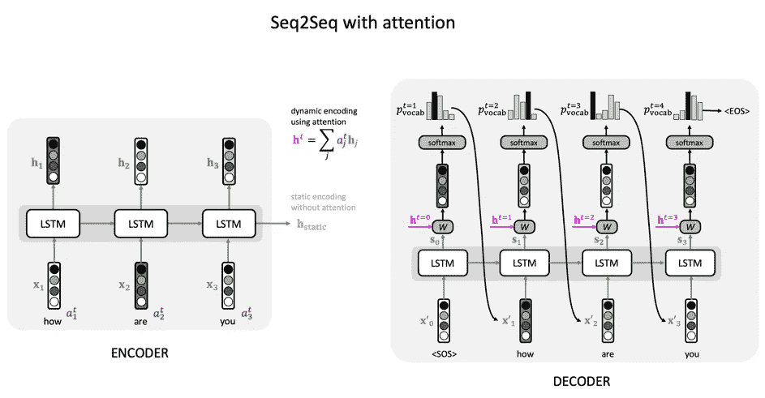
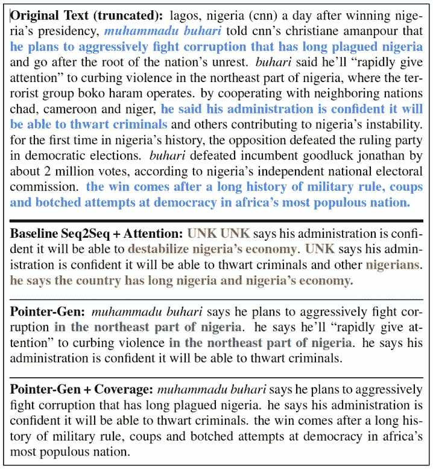
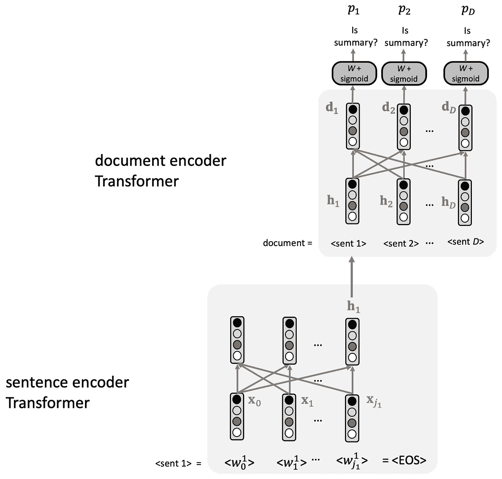
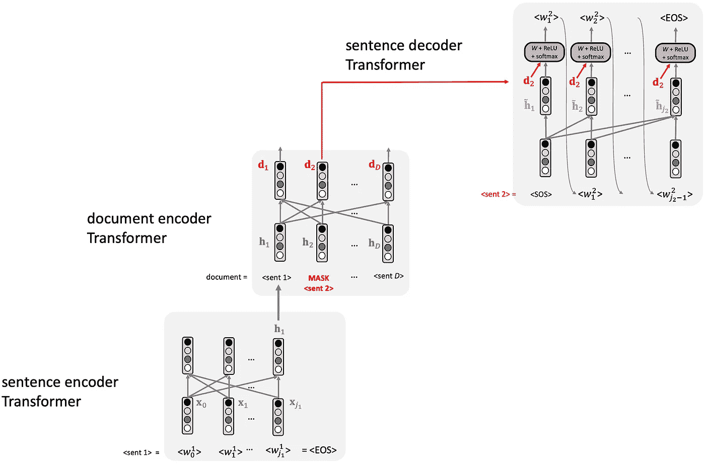

# 用于自动摘要的深度学习模型

> 原文：<https://towardsdatascience.com/deep-learning-models-for-automatic-summarization-4c2b89f2a9ea?source=collection_archive---------15----------------------->

## NLP 的下一件大事？

[来源](https://photos.app.goo.gl/79pnDc5Yqx1EuoTP9):作者

[arXiv 上的 PDF 版本](https://arxiv.org/abs/2005.11988)

# 也许是所有 NLP 任务中最有帮助的

超过四分之一世纪以来，我们已经能够通过使用几个相关的关键字查询搜索引擎来搜索网络。如果没有这样的工具，互联网将只是无用的数据垃圾场。1998 年，谷歌的 [**PageRank 算法**](https://en.wikipedia.org/wiki/PageRank) 重新定义了我们对搜索结果相关性的预期。最近一些 [**语义处理**](https://searchengineland.com/welcome-bert-google-artificial-intelligence-for-understanding-search-queries-323976) 已经被添加到这个魔法中，帮助引擎解释用简单语言表达的查询。在不太遥远的将来，我们也许可以通过与搜索引擎进行简短的对话来确定文档，就像我们与书商进行对话一样。尽管在书商和搜索引擎之间有一个重要的区别。如果你犹豫应该读哪本书，你可以试着让书商用几句话给你总结一下。

在传统的基于规则的 NLP 方法中，这种摘要任务看起来已经完全遥不可及，并且在可预见的将来，它也被认为是不现实的。但是，随着 NLP 深度学习模型的最新进展，事情正在慢慢发生变化。现在想象一下，在你最喜欢的搜索引擎的输入框旁边有一个下拉列表，可以让你设置给定文档的自动摘要的长度。比如说，1 句话，10 句话或者一页纸的总结。那会有帮助吗？事实上，它很有可能很快被证明是如此有用，以至于**可能变得无处不在**。除了改进文档搜索，它还可以帮助许多其他任务。例如，它可以帮助科学家跟上医学或人工智能等领域令人眼花缭乱的出版物。更通俗地说，它可以帮助为网上商店制作 [**简短的产品描述**](https://arxiv.org/abs/1807.08000) ，这些商店的商品目录太大，人工无法处理。自动摘要应用的更多例子在这里描述为**。**

**对于像小说这样有几百页的大文档，这种通用的摘要工具仍然属于科幻小说的范畴。然而，由于深度学习模型令人惊讶的灵活性，对可以用几句话概括一两页文档的工具的等待可能不会太长，至少在特定的知识领域内。本文的目的是描述最近的**数据集** [ [1](https://arxiv.org/abs/1906.03741) ， [2](https://arxiv.org/abs/1906.01351) ，**深度学习架构** [ [3](https://arxiv.org/abs/1704.04368) ， [4](https://arxiv.org/abs/1905.06566) ， [5](https://arxiv.org/abs/1705.04304) ，它们让我们更接近目标。**

# **困难的任务**

**总结任务很困难，原因有很多，其中一些与其他 NLP 任务相同，例如翻译:**

*   **对于给定的文档**，不存在客观上最好的摘要**。一般来说，他们中的许多人会认为同样好。**
*   **很难准确定义什么是好的总结，以及我们应该用什么分数来评估它。**
*   **好的训练资料早就被**稀缺的**和**昂贵的**给收集了。**

**人类对摘要的评价是主观的，包括对风格、连贯性、完整性和可读性的判断。不幸的是，目前还不知道既容易计算又忠实于人类判断的分数。胭脂分数是我们所拥有的最好的分数，但是我们将会看到它有明显的缺点。ROUGE 只是计算机器生成的摘要和人类编写的参考摘要共有的字数，即 *n* 克。更准确地说，它报告了相应的**召回**的组合:**

****

**和**精度**:**

****

**ROUGE- *n* 中报道的组合是他们的几何平均值(称为 F1 分数)。尽管 ROUGE 分数没有如实地反映人类的判断，但是它具有计算简单的优点，并且它考虑了与多个摘要相关联的一些灵活性，这可以通过重新排列有效摘要中的单词来产生。**

**有两种类型的摘要系统:**

*   ****摘录摘要**系统从源文档中选择多个片段来组成摘要。这种方法的优点是保证了生成的摘要在语法上是正确的。总的来说，提取系统的 ROUGE 得分较高，比我们接下来讨论的选项更可靠。**
*   **另一方面，抽象概括系统生成自己的单词和句子来重新表达原文的意思，就像人类作家会做的那样。它们可以被视为试图保留意义的压缩系统。后一种系统显然更难开发，因为它涉及到解释信息和包含外部知识的能力。**

**我们将在下面描述这两种情况。**

# **更多更好的数据**

**直到最近，用于训练摘要模型的主要数据集是 [**CNN /每日邮报数据集**](https://github.com/abisee/cnn-dailymail) ，它包含 300，000 个新闻文章的例子和它们的多行摘要。然而，一项详细的检查[ [1](https://arxiv.org/abs/1906.03741) ]揭示了这个数据集中的各种限制，这些限制可能会对系统执行文本摘要的能力的评估产生偏见。例如，结果表明有用的信息在数据源中分布不均匀，即大部分在文档的开头。此外，许多摘要包含源代码的大片段。这当然不是教系统如何产生好的抽象摘要的最好方法。

但最近事情发生了变化。例如， [**大专利数据集**](https://arxiv.org/abs/1906.03741) [ [1](https://arxiv.org/abs/1906.03741) ]包含 130 万个专利文档及其摘要，缓解了上述大部分缺点。**

**一种为训练摘要模型产生不断增长的数据集的新方法使用了在国际科学会议上给出的谈话的视频记录。这里的基本假设是，这些抄本为产生高质量的科学论文摘要提供了一个良好的起点。成绩单本身并不直接是一篇论文的总结。相反， [**TalkSumm 方法**](https://arxiv.org/abs/1906.01351)【[2](https://arxiv.org/abs/1906.01351)】的作者提出通过从演讲中呈现的论文中检索一系列相关句子来创建摘要。一个句子被认为是相关的，取决于说话者在她的谈话中使用了多少单词来描述它，假设她在任何给定的时间点脑子里都有论文的给定句子。**

# **巧妙的架构和改进的成本函数**

**在本节中，我们将描述最近为摘要任务开发的 3 个神经网络模型。这里的目的当然不是完整的，而仅仅是为了说明为解决这个基本的自然语言处理问题而提出的各种想法。**

**使学习这种任务成为可能的基本神经网络架构是 [**Seq2Seq 架构**](https://guillaumegenthial.github.io/sequence-to-sequence.html) 、 [**LSTM 递归神经网络**](https://colah.github.io/posts/2015-08-Understanding-LSTMs/) (RNN)、 [**BERT**](http://jalammar.github.io/illustrated-bert/) 和 [**变压器**](http://jalammar.github.io/illustrated-transformer/) 模型以及 [**注意机制**](https://arxiv.org/abs/1409.0473) 。**

****

****图 1** :基本 Seq2Seq 编解码架构，注意。 **x** _i 是输入令牌嵌入，a_i^t 是步骤 *t* 的注意力权重， **h** _ *i* 是上下文向量， **h** ^t 是通过用注意力权重对上下文向量进行加权得到的步骤 t 的句子嵌入， **s** _i 是解码器状态， **x** '_ *i* 最后，p^t_vocab 是固定词汇在时间 *t* 的概率分布，(来源:作者)。**

**对于不熟悉这些话题的读者，我们推荐上面的链接，这些链接将为他们提供很好的介绍。图 1 显示了 Seq2Seq 架构，它将一个令牌序列转换成另一个长度可能不同的序列。它定义了我们在讨论 Seq2Seq 时要参考的向量。**

****

****图 2** : BERT 作为变压器架构的编码器部分。转换器背后的核心思想是注意力机制的智能实现，允许计算在 GPU 上高效并行化，这是经典 RNN 无法实现的。每个输入向量 **x** _ *j* 是一个令牌嵌入和一个位置嵌入的和。输出 **h** _ *i* 是上下文感知令牌嵌入(来源:作者)。**

**图 2 描绘了一个**变压器**网络，在嵌入和隐藏向量之间具有自我关注依赖性。粗略地说，转换器将令牌嵌入序列 **x** _ *i* 转换成另一个上下文感知嵌入序列 **h** _ *i* 。输入向量 **x** _ *i* 通常也包括位置信息。与 RNN 网络相比，这是必需的，因为变压器中的输入具有排列对称性。**

## **不结巴地总结**

**我们提出的第一个架构解决了抽象的摘要任务[ [3](https://arxiv.org/abs/1704.04368) ]。将普通 Seq2Seq 架构应用于总结的早期尝试揭示了这种简单方法的许多问题:**

*   **原始文档中的事实细节，如日期、地点或电话号码，在摘要中经常被错误地复制。**
*   **一个有限的词汇表阻止了一些像专有名词这样的词被考虑进去。**
*   ****源片段的不必要重复**经常发生，换句话说**模型倾向于口吃**。**

**图 3 显示了这些不想要的行为的例子。[ [3](https://arxiv.org/abs/1704.04368) 中的作者提出了**两个对普通 Seq2Seq 的改进**来缓解这些缺点。**

****

****图 3** :最后一节“Pointer-Gen + Coverage”包含了[3]中提出的系统的输出。摘要中使用的片段用蓝色表示，事实错误用红色表示，不必要的重复用绿色表示([来源](https://arxiv.org/abs/1704.04368))。**

**首先，为了克服有限的词汇限制，他们允许网络直接从源中复制一个单词，并在需要时在摘要中使用。做到这一点的精确机制被称为**指针网络**。请记住，在普通的 Seq2Seq 网络中，解码器在每个时间步长 *t* 计算固定有限词汇中的单词 *w* 的概率分布*p*^*t*_ vocab(*w*)。像往常一样， *p* ^ *t* _vocab 通过 softmax 层计算，该层将注意力上下文向量 **h** ^ *t* 和解码器状态 **s** _ *t* 作为输入。在指针网络中，计算一个附加的**复制概率** *p* _copy，它表示一个字应该从源复制而不是由解码器生成的概率。使用具有 **h** ^ *t* 、 **s** _ *t* 和 **x** _ *t* 矢量作为输入的 s 形层来计算概率 *p* _copy(参见图 1)。哪个单词实际上应该被复制是由解码器在时间 *t* 对源中的每个单词*w*_*I*I^*t*确定的。将所有这些放在一起，模型产生单词 *w* 的全部概率由以下混合给出:**

****

**第二，为了避免重复相同的片段，作者在每个时间步 *t* 定义了一个**覆盖向量** **c** ^ *t* ，该覆盖向量估计直到时间 *t* 源中的每个单词从解码器接收到的关注量:**

****

**这个覆盖向量然后被用在网络内的两个不同的地方。首先，它用于通知负责计算注意力权重 *a* ^ *t* _ *i* 的注意力机制(除了通常对字 *w* _ *i* 和解码器状态 **s** _ *t* 的编码器上下文向量 **h** _ *i* 。解码器因此知道它已经注意的单词。其次，它用于校正损失函数。请记住，在时间步长 *t* 时，权重*a*^*t*_*I*是放在单词 *w* _ *i* 上的注意力，而*c*^*t*_*I*是这个单词在过去受到的注意力。如果单词 *w* _ *i* 在时间 *t* 比它在过去已经受到的关注更多，也就是说，如果*a*^*t*_*I*>*c*^*t*_*I*，那么成本函数应该惩罚 *c* 的大值为了惩罚对重复单词的注意，在时间步长 *t* 时，在**损失函数**中定义一个附加项作为输入标记的总和:**

****

**这然后被添加到(用附加的超参数)训练集中目标词 *w* ^*_ *t* 的通常负对数似然中:**

****

**使用和不使用这些额外技巧的结果如图 3 所示。**

## **作为语境化句子序列的文档**

**我们的下一个例子展示了为提取摘要任务定义新 SOTA 的最新想法。它直接基于导致 2018 年
[**BERT 模型**](http://jalammar.github.io/illustrated-bert/) 的一个关键思想，即基于一个 [**变压器**](http://jalammar.github.io/illustrated-transformer/) 编码器的巧妙预训练任务的迁移学习。让我们再深入一点，总结一下文档摘要的 [**HIBERT**](https://arxiv.org/abs/1905.06566) 架构[ [4](https://arxiv.org/abs/1905.06566) ]。**

**基本的观察是，抽取分类可以铸为一个**句子标注问题**:简单训练一个模型，识别文档中的哪个句子应该保留，组成摘要！为此，HIBERT 架构使用两个嵌套的编码器转换器，如图 4 所示。**

****

****图 4**:HIBERT 架构包含两个 Transformer 编码器的层次结构，用于将文档中的每个句子分类为摘要的一部分或不是摘要的一部分(来源:作者)。**

**底部的第一个 Transformer 编码器是一个经典的**句子编码器**，它将组成文档第 *k* 句的单词序列( *w* _0^ *k* ， *w* _1^ *k* ，…，*w*_*j*^*k*)转换为嵌入**h**的句子该向量通常被识别为句尾标记< EOS >上方的上下文向量。******

**位于顶部的第二个 Transformer 编码器是一个**文档编码器**，它将句子嵌入序列( **h** _1、 **h** _2、…、 **h** _ *D)* 转换为一个**文档感知句子嵌入序列** ( **d** _1、 **d** _2、…、**D*这些嵌入又被转换成概率序列( *p* _1、 *p* _2、…、 *p* _ *D* )，其中 *p* _ *j* 是第 *j* 句应该是摘要的一部分的概率。*****

**从头开始训练这样一个复杂的层次网络是不切实际的，因为它需要大量不切实际的文档摘要对。众所周知，训练这样一个数据量有限的复杂网络的最佳策略是使用**迁移学习**。为此，首先在辅助任务上对 HIBERT 体系结构进行预训练，该辅助任务包括预测在大型文档语料库中随机屏蔽(15%)的句子:**

****

**掩蔽句子预测任务的一个例子。**

**图 5 显示了用于这个**屏蔽句子预测任务**的架构。它在 HIBERT 架构之上添加了一个 Transformer 解码器，以便将嵌入了 **d** _ *k* 的文档感知语句转换为被屏蔽的第 *k* 个语句的单词序列( *w* _0^ *k* 、 *w* _2^ *k* 、…、w_ *j* ^ *k* )。为了在步骤 *i* 生成单词，解码器使用其上下文 **h** _ *i* 和来自文档编码器的嵌入 **d** _ *k* 的文档感知语句。**

****

****图 5** :用于屏蔽语句预测任务的架构。在 HIBERT 架构的顶部添加了一个句子转换解码器，以使用其文档感知嵌入 **d** _ *k* 中封装的信息来恢复被屏蔽句子的单词(来源:作者)。**

**以这种方式训练的网络收集了大量的语义知识，而不需要任何扩展的标记过程。在第二阶段，利用它在预训练任务中学习到的内容，网络在实际的目标任务上进行微调，即作为句子二进制标记任务的摘要，如图 4 所示。**

**这个屏蔽句子预测任务显然在句子层面上让人想起用于预训练原始 BERT 模型的**屏蔽语言模型** (MLM)。请记住，MLM 的任务在于恢复句子中随机屏蔽的单词。**

## **强化学习来拯救**

**正如我们前面所解释的，总结任务的一个核心问题是缺少唯一的最佳总结。ROUGE score 在某种程度上考虑到了这一点，因为它忽略了生成的摘要中单词的顺序(或 *n* -grams)。因此，我们实际上希望最小化的成本函数应该类似于这个胭脂分数，或者至少最终的损失函数应该包括这样一个项。这就是我们在这里展示的上一部作品[ [5](https://arxiv.org/abs/1705.04304) 中遵循的策略，同样涉及抽象概括。**

**像 ROUGE 这样的分数的问题是，对于解码器生成的任何单词序列( *w* _1，…， *w* _ *j* )，它相对于网络的参数*θ*是恒定的，因此使得反向传播不可能。这种情况并不是没有希望的，因为从生成器*定义的联合概率分布 *p_theta* ( *w* _1、…， *w* _ *j* )中采样的句子( *w* _1、…， *w* _ *j* 的胭脂分数的期望值实际上是一个**可微的**接下来的路就很清楚了。只要将期望值定义的损失最小化:***

****

**实际上，我们可以将 Seq2Seq 模型的生成器视为一个**强化学习** (RL)代理，其在时间步 *t* 的动作是根据内部状态 **s** _ *t* 生成一个字 *w* _ *t* ，该字封装了来自先前动作的历史。从现在开始，我们只需要打开一本关于 RL [ [13](http://incompleteideas.net/book/the-book-2nd.html) ]的书，学习如何最小化 *L* _RL。RL 中的一个基本结果，被称为**政策梯度定理**，陈述了 *L* _RL 的梯度:**

****

**在哪里**

****

**最后一个索引 *j* 是< EOS >令牌的索引。**加强**算法用生成器计算的分布*p*_*θ*(*w*_ 1，…，*w*_ 1，…， *w* _j】)的单个样本来近似上述期望:**

****

**实际上，像 ROUGE 这样的分数可能具有**大的方差**，这阻碍了梯度下降的收敛。好在我们可以通过比较 ROUGE( *w* _1、…、 *w* _ *j* )和一个独立于( *w* _1、…、 *w* _ *j* )的**基线** *b* 来提升收敛速度。这不会改变 *L* _RL 的梯度，这一点很容易验证，但它可以显著降低方差[ [13](http://incompleteideas.net/book/the-book-2nd.html) ]，从而显著提高收敛性:**

****

**因此，主要问题是找到一个适当的基线。我们正在讨论的工作中的想法是，让基线 *b* 等于生成器在推理时实际生成的单词序列的 ROUGE 分数。请记住，这是由解码器的 softmax 在每一步 *t* 计算的连续最大化条件概率的单词序列:**

****

**基线 *b* 的这种选择称为**自我临界序列训练** (SCST)。因此，总的来说，钢筋损失项为:**

****

**在哪里**

****

**我们可以看到，这个损失项促使*p*_*θ*生成单词序列( *w* _1、…， *w* _ *j* )，其胭脂分数大于解码器当前生成的序列的胭脂分数。**

**在损失函数中包括这样的 SCST 强化学习项有两个好处。首先，促使构造 *L* _RL 的原因是，它使得在随机梯度下降训练过程中使用像 ROUGE 这样的不可微分数成为可能。第二个好处是，它还可以治疗所谓的**曝光偏差**。暴露偏差来自典型的**教师强制**程序，该程序通常用于训练 Seq2Seq 模型。该过程使用来自训练集的基础真值字( *w* *_1，…， *w* *_ *j* )来训练解码器 RNN，而在推断时间，解码器当然必须使用其自己生成的令牌，这可能因此导致错误的累积。基线 *b* 的 SCST 选择相当于使用在推断时间实际看到的分布来训练解码器。**

**使用的最终损失函数是**强化学习** **损失** *L* _RL 和标准**最大似然** **目标** *L* _ML 的加权和。前者考虑到了摘要的非唯一性，至少在某种程度上是这样，但它本身肯定不是模型产生可读消息的动机。另一方面，后者更喜欢可读的句子，因为它基本上定义了一个语言模型。**

**为了避免重复，作者还使用了一种增强的注意力机制，这种机制涉及到一个指针网络，类似于我们在第一个例子[ [3](https://arxiv.org/abs/1704.04368) 中描述的那个。**

# **下一步是什么？**

**我们在上一节中描述的三个模型都使用深度学习，因此实现了一种纯粹的统计方法来完成摘要任务。最近的研究也试图找到更好的损失函数。例如， [*朗诵会*](https://recital.ai/en/) 的研究人员探索了一个有趣的想法，即一个好的总结应该在原文允许的范围内回答问题。总的来说，这些模型对于短文档确实出奇地有效。但是，我们可以合理地期望建立一个系统，使用仅仅依赖于处理大量文本数据的技术，在一页中总结 300 页的小说吗？这远非显而易见。原则上，摘要应该能够利用真实世界的知识来理解要摘要的文档或书籍。尽管语言模型本身不太可能捕捉到这样的常识，而这些常识更有可能是由感官经验收集的。建立有用的摘要工具的一个短期可能性是将它们的范围缩小到已经有知识基础或本体的特定专业领域。一个更激进的步骤是建立一个具有更好的“真实世界理解”的系统，这个步骤可能来自于**多模态学习器**，它被设计来聚合音频、视频和文本模态，例如电影。沿着这条道路已经取得了可喜的成果。**

# **感谢**

**在此，我要感谢 [Thomas Scialom](https://www.linkedin.com/in/tscialom/?originalSubdomain=fr) ，他是*朗诵会的研究员，他好心地与我分享了他的知识，让我注意到他在 GitHub [ [16](https://github.com/recitalAI/summarizing_summarization) 上的[总结摘要](https://github.com/recitalAI/summarizing_summarization)页面。这帮助我启动了对深度学习摘要模型的探索。***

# ***参考***

1.  ***E.Sharma，C. Li，L. Wang， [BIGPATENT:一个用于抽象和连贯摘要的大规模数据集](https://arxiv.org/abs/1906.03741) (2019)，arXiv:1906.03741。***
2.  ***G.Lev，m . shmu Eli-朔伊尔，J. Herzig，A. Jerbi，D. Konopnicki， [TalkSumm:一种基于会议会谈的科学论文摘要的数据集和可扩展标注方法](https://arxiv.org/abs/1906.01351) (2019)，arXiv:1906.01351。***
3.  ***A.见 Peter J. Liu，Ch。d .曼宁，[直奔主题:用指针生成器网络进行总结](https://arxiv.org/abs/1704.04368) (2017)，arXiv:1704.04368。***
4.  ***X.张，魏，周，【面向文档摘要的层次双向变换器文档级预训练】 (2019)，arXiv:1905.06566 .***
5.  ***R.保卢斯，c .熊，R. Socher，[抽象概括的深度强化模型](https://arxiv.org/abs/1705.04304) (2017)，arXiv:1705.04304。***
6.  ***C.林*、*、[胭脂一包自动评价总结](https://www.aclweb.org/anthology/W04-1013.pdf)。***
7.  ***南 J. Rennie，E. Marcheret，Y. Mroueh，J. Ross，V. Goel，[用于图像字幕的自我临界序列训练](https://arxiv.org/abs/1612.00563) (2016)，arXiv:1612.00563。***
8.  ***G.Genthial， [Seq2Seq 带关注和光束搜索](https://guillaumegenthial.github.io/sequence-to-sequence.html) (2017)，博客。***
9.  ***C.Olah *，* [了解 LSTM 网络](https://colah.github.io/posts/2015-08-Understanding-LSTMs/) (2015)，博客。***
10.  ***J.Alammar， [The Illustrated BERT，ELMo and Co.](http://jalammar.github.io/illustrated-bert/) ，博客。***
11.  ***J.Alammar，[图文并茂的变形金刚](http://jalammar.github.io/illustrated-transformer/)，博客。***
12.  ***D.Bahdanau，K. Cho，Y. Bengio，[联合学习对齐和翻译的神经机器翻译](https://arxiv.org/abs/1409.0473) (2016)，arXiv:1409.0473。***
13.  ***R.萨顿和 a .巴尔托，[强化学习:导论](http://incompleteideas.net/book/the-book-2nd.html) (2018)，麻省理工学院出版社，麻省剑桥。***
14.  ***T.Scialom，S. Lamprier，B. Piwowarski，J. Staiano，[答案联合起来！增强摘要模型的无监督度量](https://arxiv.org/abs/1909.01610) (2019)，arXiv:1909.01610。***
15.  ***南 Palaskar，J. Libovick，S. Gella，F. Metze，【How2 视频的多模态抽象摘要 (2019)，arXiv:1906.07901。***
16.  ***T.Scialom，[总结概括](https://github.com/recitalAI/summarizing_summarization) (2019)，GitHub。***