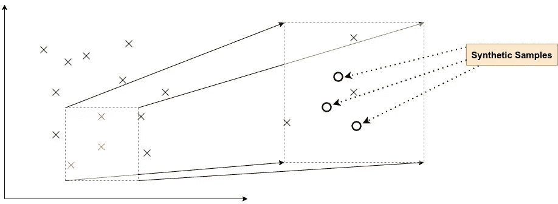
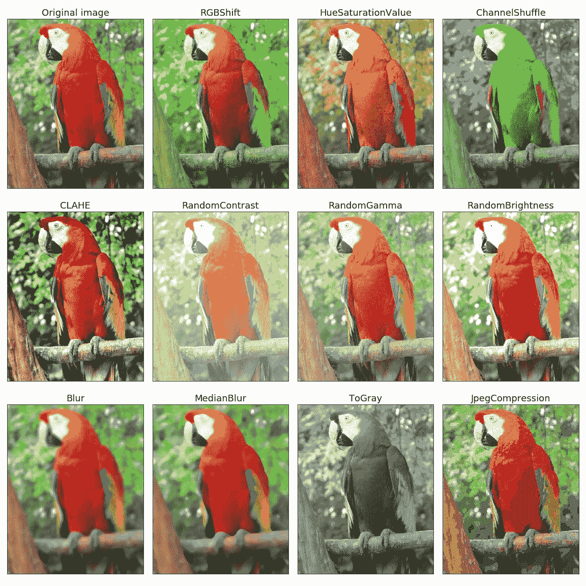
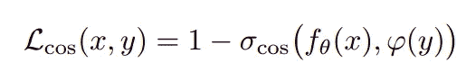

# 深度学习——不仅仅是大公司

> 原文：<https://towardsdatascience.com/deep-learning-not-only-for-the-big-ones-bd16b019d5e8?source=collection_archive---------62----------------------->

## 如何使用深度学习，即使是小数据集

弗兰基·查马基在 [Unsplash](https://unsplash.com?utm_source=medium&utm_medium=referral) 上拍摄的照片

当你在研究深度学习算法时，你几乎总是需要大量的数据来训练你的模型。这是不可避免的，因为像 RNN 或 GRU 这样的深度学习算法需要数据，为了收敛，它们需要公平的数据份额。但是如果没有足够的数据呢？这种情况并不罕见，事实上，在研究工作中，你可能每天都要处理它，或者即使你正在研究一个新的领域/产品，那里还没有很多可用的数据。你怎么处理这个？我能应用机器学习吗？我能利用深度学习的最新进展吗？

有两种可能的路径可供我们选择，我将在下一节中介绍它们——数据路径和模型路径。

# 数据分支

这听起来可能有点显而易见，但有时我们会错过这种解决方案解决小数据问题的能力——我说的是**数据增强**。数据扩充背后的想法是——**某个点(在超空间中)附近的点代表类似的行为**。例如:一个狗的图像增加了对比度或亮度仍然是一个狗的图像。

要对表格数据集使用**数据扩充，有多种方法可用，例如:**

*   [随机过采样](https://machinelearningmastery.com/random-oversampling-and-undersampling-for-imbalanced-classification/)
*   基于聚类的过采样
*   [合成少数过采样技术(SMOTE)](https://medium.com/analytics-vidhya/balance-your-data-using-smote-98e4d79fcddb)

再来详细说说 SMOTE。为了简化，我们可以将 SMOTE 背后的概念定义为“*物以类聚*”，这在数据方面的减少意味着在多维空间中彼此接近的数据点表示相似的行为，因此它们可以被近似为数据集的新数据点。

当从一个较大的集合中合成几个样本时，这种技术最有效。但是，一旦你超过了某个近似合成样本的阈值，样本的可能性就开始发散。因此，在实现这一点时，你必须记住这一点。

> 但是，一旦你超过了某个近似合成样本的阈值，样本的可能性就开始发散。

再来说说图像中的**数据增强**。看下面的图片，它们都代表一只鹦鹉，但它们都不同，因为图像的人口统计数据，如对比度、亮度等。，从单个图像变为 12 个图像，数据量增加了 12 倍。

演职员表:【https://github.com/albumentations-team/albumentations 

当然，我们还可以应用旋转、镜像和裁剪来增加可用的图像数据集。为此，有几个可用的库，如 OpenCV、PyTorch 和 TensorFlow。另一个也很有趣的是[蛋白](https://albumentations.readthedocs.io/en/latest/)，你可以在这个 [Colab](https://colab.research.google.com/drive/1JuZ23u0C0gx93kV0oJ8Mq0B6CBYhPLXy#scrollTo=GwFN-In3iagp&forceEdit=true&offline=true&sandboxMode=true) 笔记本上看到它的运行。

## 数据扩充的生成模型

生成模型已经证明了对数据分布的超级有用的理解，以至于今天这些模型是数据扩充任务的主要工具。

用于数据扩充的生成模型的一些最广为人知的应用可以恢复如下:

[*LSTM 的文本生成*](https://machinelearningmastery.com/text-generation-lstm-recurrent-neural-networks-python-keras/)——除了用于预测模型，RNN 和 LSTM 的能够学习问题的序列，然后为文本生成等问题领域生成新的完全合理的序列。但它们在地理位置数据生成方面也非常强大。

[用于图像生成的可变自动编码器(VAE)](/generating-new-faces-with-variational-autoencoders-d13cfcb5f0a8)—深度生成模型越来越受欢迎。VAE 架构非常直观且易于理解，由两个神经网络组成——一个编码器和一个解码器，其中编码器将每个记录映射到 z 维标准分布。

[用于表格数据生成的生成对抗模型](https://medium.com/ydata-ai/generating-synthetic-tabular-data-with-gans-part-1-866705a77302?source=friends_link&sk=beee724f8445a7f9ed66aaf41660325c) —由两个网络组成——一个鉴别器和一个生成器，GANs 已被证明在学习数据集分布和复制数据增强方面非常强大。它们的应用相当广泛，从图像到规则数据生成，从[表格数据到时间序列](https://ydata.ai/product/syntheticdata?utm_source=medium&utm_medium=signature&utm_campaign=blog)。

# 模型路径

到目前为止，我们研究了调整我们的数据量本身，但是，如果我们调整模型本身，我们也可以通过小数据集获得更好的结果。有几种方法可以实现这一点，接下来我将描述它们。

## 迁移学习

迁移学习已经成为研究者甚至业界人士的首选策略。你在 Kaggle 上看到的几乎所有模型都以这样或那样的方式利用迁移学习。它不仅*减少了训练次数*，而且在小数据集上也工作得很好。

例如，您可以使用像 ResNet、InceptionV3 这样的预训练模型，只训练最后一层(冻结其余部分)，而不是在图像分类任务中从头开始训练您的 CNN 模型，这样您的任务将只需原来训练时间的一半即可完成。

迁移学习过程中需要微调，这将涉及超参数优化和多层冻结(根据需要)。这里是一个使用 Tensorflow2.0 的预训练 CNN 的[transfer learning 实现。](https://www.tensorflow.org/tutorials/images/transfer_learning)

## 余弦损失

另一种已被证明有效的技术是将损失函数从交叉熵改为一种称为余弦损失的新方法。

***什么是余弦损失？*** 余弦损失是通过考虑余弦相似性和

*   f_theta(x)代表模型参数
*   Psi(y)表示类别标签的独热码编码向量
*   σ_cos 表示两个向量之间的余弦相似度。

这个在这篇[论文](https://arxiv.org/pdf/1901.09054.pdf)里有详细解释。在分类过程中使用余弦损失代替了传统的交叉熵等方法，模型的准确性有了很大的提高。在所有小数据集上，使用余弦损失获得的分类精度大大优于 softmax 后的交叉熵，在 [CUB](https://vision.cornell.edu/se3/caltech-ucsd-birds-200/#:~:text=Caltech%2DUCSD%20Birds%20200%20(CUB,Caltech%2D101%2C%20etc).) 和 [NAB](https://github.com/numenta/NAB) 数据集上，最大相对改进为 30%和 21%。

虽然小数据集是一个现实，并且对大多数研究人员和组织来说是一个明显的问题，但是为了解决这个问题，在这个领域已经做了很多改进。在这里，我给你留下一些在这个领域已经完成的最惊人的研究:

*   [**全景成像上的动脉粥样硬化颈动脉斑块:使用深度学习的小数据集自动检测**](http://arxiv.org/abs/1808.08093v1) **:** 本文将 R-CNN 模型应用于 65 幅图像的数据集上，取得了显著的灵敏度和特异性分数。
*   [**通过对小数据的深度学习进行肺部 CT 影像征象分类**](http://arxiv.org/abs/1903.00183v1) **:** 本文采用甘氏进行数据扩充，并应用基于 CNN 的模型，达到约 91%的准确率
*   [**生物医学图像分析中小样本深度学习综述**](http://arxiv.org/abs/1908.00473v1) **:** 本文分析了处理小样本生物医学图像数据的不同方法，并对它们进行了比较

最后但并非最不重要的一点是，由于 COVID 已经存在并长期存在，研究人员正在寻找利用现有基础设施检测它们的更好方法。COVID 是一种相当新的疾病，这使得*被感染和检测的人的数据集非常小*。

*   [**利用小数据集上的深度学习从胸部 x 光片中发现新冠肺炎**](http://arxiv.org/abs/2004.02060v4) **:**

> 他们在 4000 张病毒性和细菌性肺炎的胸部 x 光片上使用了预先训练好的 CNN 模型，其中 122 张属于新冠肺炎。这证明了小数据集的用例以及在这种情况下利用预训练模型的合理性。他们报告的 AUC 分数约为 0.997，令人印象深刻。

*   [**基于生成对抗网络和使用胸部 X 射线数据集的微调深度转移学习模型的冠状病毒(新冠肺炎)相关性肺炎的检测**](http://arxiv.org/abs/2004.01184v1)

> *本文解释了生成模型的使用，该模型通过针对胸部 X 射线的有限数据集的微调深度迁移学习来扩充数据。这里使用的预训练模型包括 ResNet、GoogLeNet、AlexNet 和 SqueezeNet，数据集为 5863 张胸部 x 光片。该论文的结论是，ResNet 的性能优于其他达到约 99%准确率的产品。*

# 结论

我们在这篇文章中看到，有两种主要方法可以解决小数据集问题，一种是通过调整数据部分，另一种是利用模型固有的功能和使用不同的损失函数。不同的策略可以很容易地应用，并提高整体 ML 模型的质量，同时使其有可能受益于深度学习算法的力量。然而，如果我们想要产生有价值的 ML 模型，我们不应该忘记与每一种方法相关的权衡。

[*法比亚娜·克莱门特*](https://www.linkedin.com/in/fabiana-clemente/) *是*[*y Data*](https://ydata.ai/?utm_source=medium&utm_medium=signature&utm_campaign=blog)*的首席数据官。*

[**我们帮助人工智能的早期采用者改进和生成高质量的数据，以便他们能够成为明天的行业领导者**](https://ydata.ai/?utm_source=medium&utm_medium=signature&utm_campaign=blog)