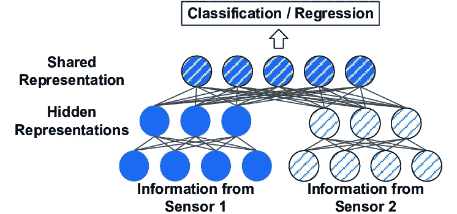
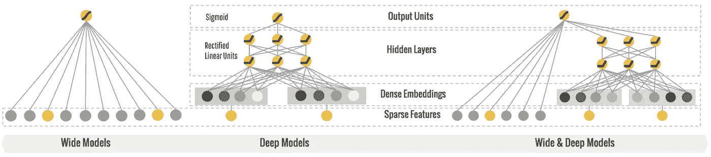

# 结合时间序列和表格数据的深度学习。

> 原文：<https://towardsdatascience.com/deep-learning-on-a-combination-of-time-series-and-tabular-data-b8c062ff1907?source=collection_archive---------37----------------------->


图片来源:[取消快照](https://unsplash.com/photos/dr_9oxbVnuc)

我们经常发现自己处于这样一种情况，即我们想要在模型中利用不同特性的组合。模型的输入数据是时间序列和表格数据的混合。在这种情况下，设计一个深度学习模型是一个有趣的问题。

一个示例场景是:您有来自 fitbit 等设备的数据，并且您想要预测任何给定时刻的睡眠阶段:

你混合了:

时间序列输入:

*   心率序列
*   呼吸频率序列

表格特征:

*   睡眠开始后的时间
*   代表这种用户睡眠模式的个性化嵌入

和许多其他功能。

解决这个问题的一种方法是将其视为多模态深度学习。



多模态学习——在[研究之门](https://www.researchgate.net/figure/Baseline-of-multimodal-deep-learning-model-It-deals-with-multisource-data-directly-and_fig1_334532323)上的照片

在谷歌研究[这里](https://ai.googleblog.com/2016/06/wide-deep-learning-better-together-with.html)引入了“广泛和深度学习”



广泛而深入的学习——谷歌[博客](https://ai.googleblog.com/2016/06/wide-deep-learning-better-together-with.html)上的照片

## 那么我们该如何着手呢？

1.  通过 RNN 或 LSTM 或 1D CNN 传递时间序列序列，并捕获隐藏状态或 CNN 嵌入作为序列的表示。
2.  将每个序列的嵌入与其他表格特征连接起来。

## 一些有趣的决定需要考虑:

对于多个时间序列输入序列:

*   你是否将序列视为独立的，并在后期融合/连接表示(后期融合)？
*   还是把它们当做多通道输入，每个时间序列作为一个通道(早期融合)？

一般来说，晚期融合似乎比早期融合工作得更好，并且当不同的输入序列长度不同时，也不需要填充输入。然而，它确实依赖于问题空间和输入序列的相关性。

一般来说，RNN 似乎更适合较短的序列，双向 LSTM 更适合较长的序列。在后期融合中，你可以混合搭配 RNN/LSTM/1d 有线电视新闻网的不同序列。

## 下面是一个示例模型实现(用 pytorch 编写):

该实施例使用具有后期融合的 2 层比迪 LSTM。

对于每个时间序列特征(特征 1 和特征 2 ),我们也有基线值，因此我们有融合层，其中我们融合了序列的表示(LSTM 的隐藏状态)和基线值。然而，该融合层不是必需的，并且在没有基线值的情况下不是必需的。

```
class TestModel(nn.Module):
    def __init__(self):
        super().__init__()
        self.input_size = 70
        self.hidden_size = 8
        self.num_layers = 2
        self.output_dim = 2
        self.lstm_feature_1 = nn.LSTM(self.input_size, self.hidden_size, self.num_layers, batch_first=True,
                                      bidirectional=True)
        self.lstm_feature_2 = nn.LSTM(self.input_size, self.hidden_size, self.num_layers, batch_first=True,
                                      bidirectional=True)
        self.fc_feature_1 = nn.Linear((self.hidden_size * 2) + 1, 1)
        self.fc_feature_2 = nn.Linear((self.hidden_size * 2) + 1, 1)

        self.fc = nn.Linear(4, self.output_dim)

    def forward(self, f, device=None):
        if not device:
            device = torch.device("cuda:0" if torch.cuda.is_available() else "cpu")

        x_f1, f1, x_f2, f2, f3, f4 = f

        # x_f1 is feature_1_seq
        # f1 is feature_1_baseline
        # x_f2 is feature_2_seq
        # f2 is feature_2_baseline

        # f3 and f4 are tabular features

        x_f1 = x_f1.view(x_f1.shape[0], 1, -1)
        h0_f1, c0_f1 = self.init_hidden(x_f1, device)
        h_t_f1, c_t_f1 = self.lstm_feature_1(x_f1, (h0_f1, c0_f1))
        x_f1 = h_t_f1
        x_f1 = x_f1.view(x_f1.shape[0], -1)

        x_f2 = x_f2.view(x_f2.shape[0], 1, -1)
        h0_f2, c0_f2 = self.init_hidden(x_f2, device)
        h_t_f2, c_t_f2 = self.lstm_feature_2(x_f2, (h0_f2, c0_f2))
        x_f2 = h_t_f2
        x_f2 = x_f2.view(x_f2.shape[0], -1)

        x_f1 = torch.cat((x_f1, f1), 1)
        x_f1 = self.fc_feature_1(x_f1)

        x_f2 = torch.cat((x_f2, f2), 1)
        x_f2 = self.fc_feature_2(x_f2)

        x = torch.cat((x_f1, x_f2, f3, f4), 1)
        x = self.fc(x)
        x = F.log_softmax(x, dim=1)
        return x

    def init_hidden(self, x, device):
        batch_size = x.size(0)
        h0 = torch.zeros(self.num_layers * 2, batch_size, self.hidden_size).to(device)
        c0 = torch.zeros(self.num_layers * 2, batch_size, self.hidden_size).to(device)
        return h0, c0
```

如果你曾处理过一个涉及类似输入方式的问题:我很想听听你对你有用的东西或者你尝试过的其他方法。