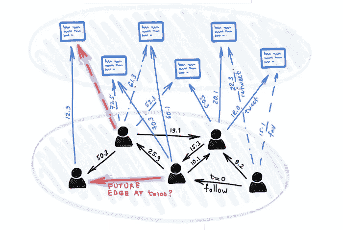

# 动态图上的深度学习

> 原文：<https://towardsdatascience.com/deep-learning-on-dynamic-graphs-1b97c2fab0ab?source=collection_archive---------61----------------------->

## [时态图网络](/temporal-graph-networks-ab8f327f2efe)

由[迈克尔布朗斯坦](https://medium.com/u/7b1129ddd572?source=post_page-----1b97c2fab0ab--------------------------------) — 8 分钟阅读

许多现实世界的问题涉及各种性质的交易网络以及社会互动和参与，这些问题是动态的，可以建模为图表，其中节点和边随着时间的推移而出现。在这篇文章中，我们描述了时态图网络，这是一个在动态图上进行深度学习的通用框架。

## [用合成数据改善机器学习中的大规模不平衡数据集](/improving-massively-imbalanced-datasets-in-machine-learning-with-synthetic-data-7dd3d856bbdf)

到[亚历山大·沃森](https://medium.com/u/cacf157aade0?source=post_page-----1b97c2fab0ab--------------------------------) — 6 分钟阅读

我们将使用合成数据和 SMOTE 中的一些概念来提高欺诈、网络安全或任何极少数类别分类的模型准确性

照片由 Florian Olivo 在 Unsplash 上拍摄

## [用人工智能玩毁灭:深度 Q 学习的多目标优化](/playing-doom-with-ai-multi-objective-optimization-with-deep-q-learning-736a9d0f8c2)

由[阿德里安·许](https://medium.com/u/c834a59b6354?source=post_page-----1b97c2fab0ab--------------------------------) — 13 分钟读完

在线学习方法是一个动态的算法家族，为过去十年强化学习的许多最新成就提供了动力。在线学习方法属于强化学习方法的基于样本的学习类别，允许简单地通过重复观察来确定状态值，消除了对显式转换动态的需要。

丹·史沫特莱在 Unsplash 上的照片

## [让你的机器学习模型进入现实世界](/getting-your-machine-learning-model-out-to-the-real-world-30c550876174)

由[保罗调](https://medium.com/u/3f15d28c014e?source=post_page-----1b97c2fab0ab--------------------------------) — 10 分钟读出

过去几年中一个令人兴奋的发展是产品中机器学习的扩散。我们现在看到最先进的计算机视觉模型被部署在手机上。最先进的自然语言处理模型正被用来改进搜索。