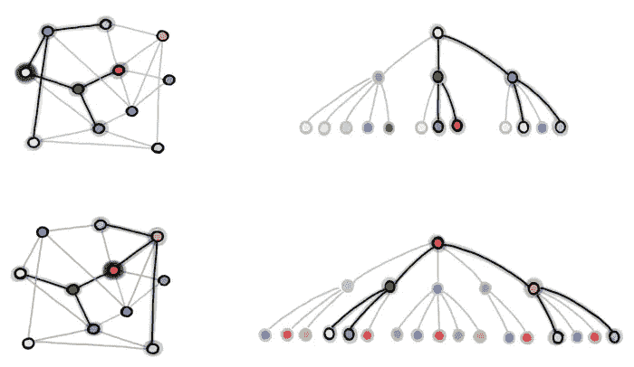
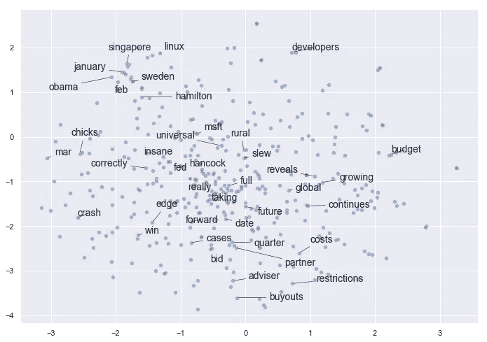
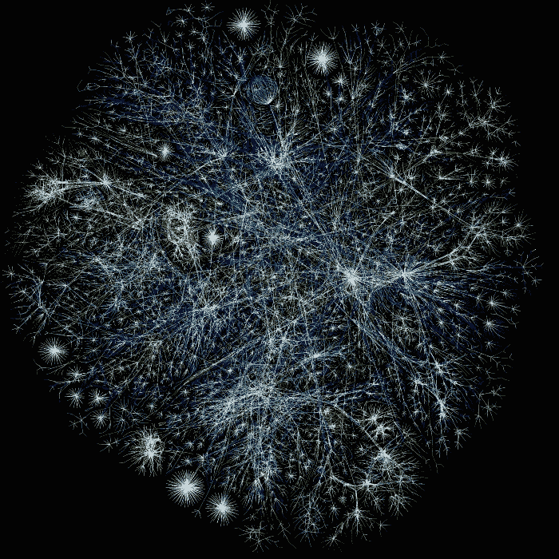

# 巨型图上的深度学习

> 原文：<https://towardsdatascience.com/deep-learning-on-giant-graphs-6b20b033b4a0?source=collection_archive---------63----------------------->

## [简单可扩展图形神经网络](/simple-scalable-graph-neural-networks-7eb04f366d07)

由[迈克尔·布朗斯坦](https://medium.com/u/7b1129ddd572?source=post_page-----6b20b033b4a0--------------------------------) — 12 分钟阅读

迄今为止，阻碍图形神经网络在工业应用中广泛采用的挑战之一是难以将它们扩展到大型图形，如 Twitter follow graph。节点之间的相互依赖性使得将损失函数分解成单个节点的贡献具有挑战性。在这篇文章中，我们描述了一个在 Twitter 上开发的简单的图形神经网络架构，它可以处理非常大的图形。

## [夏琳·钱布利斯:从心理学到自然语言处理和应用研究](/charlene-chambliss-from-psychology-to-natural-language-processing-and-applied-research-3845b1c83ac0)

通过[琥珀色滕](https://medium.com/u/2a58d8e73e5a?source=post_page-----6b20b033b4a0--------------------------------) — 18 分钟读取

在过去的十年中，人们对数据科学的兴趣呈指数级增长，越来越多的人开始转向该领域。2020 年，关于转入数据科学职业的文章和 YouTube 视频比比皆是。然而，对于许多人来说，关于这种转变的许多关键问题仍然存在:你如何从社会科学背景进入数据科学？心理学等领域中哪些最重要的技能可以应用于数据科学？

Opte 项目发布的一个图形可视化，一个互联网的试验性地图

## [什么是图论，为什么要关心？](/what-is-graph-theory-and-why-should-you-care-28d6a715a5c2)

通过 [Vegard Flovik](https://medium.com/u/17ff8967433?source=post_page-----6b20b033b4a0--------------------------------) — 13 分钟读取

对你来说，图论可能听起来像一个令人生畏的抽象话题，那么你为什么还要花时间去读一篇关于它的文章呢？然而，尽管听起来可能不太适用，但图论实际上有大量有用和重要的应用！在这篇文章中，我将试着简单解释一下这些应用程序是什么。在这样做的时候，我会尽我所能让你相信，至少对这个话题有一些基本的了解，对于解决你可能遇到的一些有趣的问题是有用的。

Feliphe Schiarolli 在 Unsplash 上拍摄的照片

## [视频通话数十亿无互联网](/video-calling-for-billions-without-internet-40d10069c464)

由 [P.K .米什拉](https://medium.com/u/44929e48544f?source=post_page-----6b20b033b4a0--------------------------------) — 11 分钟阅读

过去的这个周末，我看到一篇新闻文章，提到数百万印度学生被困在家里，无法使用互联网或在线教育。事实上，超过一半的世界人口仍然没有任何互联网连接。虽然这种数字鸿沟已经在美国显现出来，特别是在冠状病毒疫情封锁期间的儿童教育方面，但这个问题在亚洲和非洲要严重得多，那里只有不到五分之一的人连接到互联网。

照片由 Unsplash 上的 66 north 拍摄

## [知识表示和推理用答案集编程](/knowledge-representation-and-reasoning-with-answer-set-programming-376e3113a421)

由娜塔莉·库斯特——8 分钟读完

在工业和科学领域，计算问题的数量似乎是无限的。对来自大量可用数据的新见解有着巨大的需求。为了获得这些知识，专门的人使用各种编程语言来设计和实现算法。