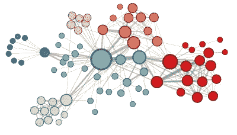
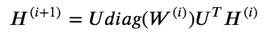
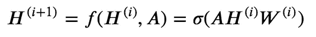
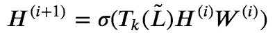
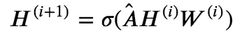
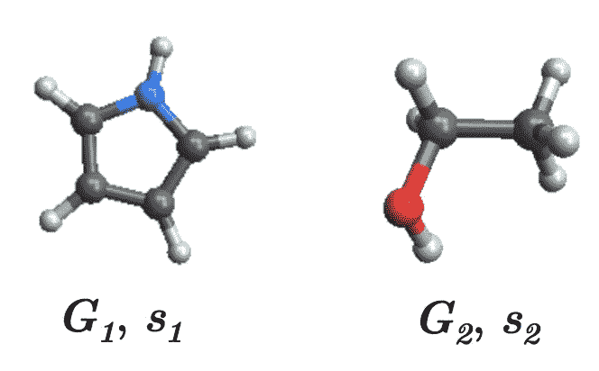
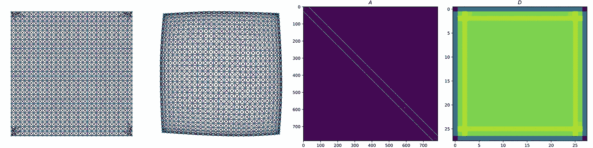
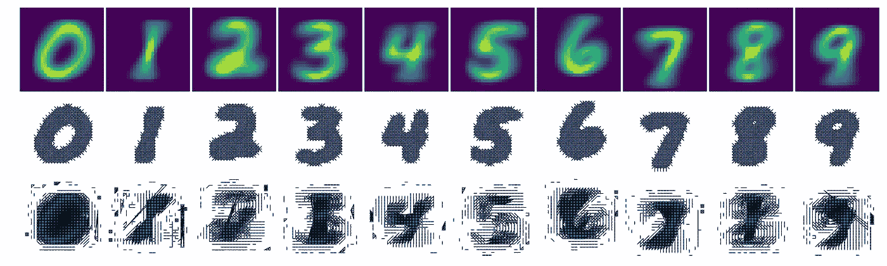
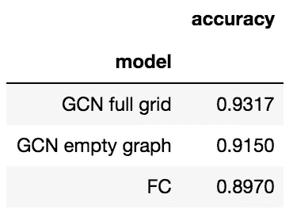
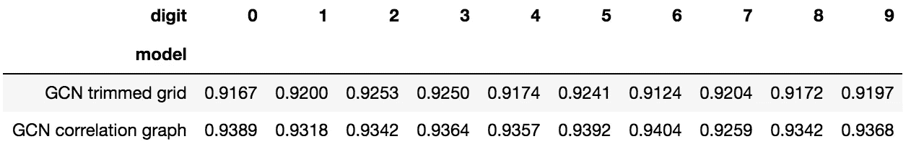

# 图形的深度学习:卷积是你所需要的

> 原文：<https://towardsdatascience.com/deep-learning-on-graphs-convolution-is-all-you-need-3c1cf8f1e715?source=collection_archive---------8----------------------->

## 图卷积网络及其应用介绍

# 0.动机

你有没有想过为什么深度神经网络(DNNs)比传统的机器学习模型(嗯，有时候)更好？当然也有很多例外，在表格数据上，梯度推进机器优于全连接神经网络。在 DNNs 的独特特征中，我不认为非线性变换使它们从传统的 ML 模型中脱颖而出。许多传统的 ML 模型，如决策树和 SVM，也能够处理数据空间中的非线性。我很少遇到一个简单的全连接 DNN 在任何基准上都达到了最先进的性能。

真正使 DNNs 区别于传统 ML 模型的是那些支持参数共享的专用神经网络层，例如时间的递归层和空间的卷积层。有了这些专门的神经元层，DNN 作为自动特征提取器蓬勃发展，以取代手工设计的特征。LSTM 和 GRU 等递归层利用数据的时间依赖性，非常适合文本和语音，而卷积层利用空间平移不变性，适用于文本(Conv1D)、图像(Conv2D)和 3D 图像(Conv3D)。

但是没有时间或空间结构的数据怎么办？许多类型的数据实际上都有底层的图形结构，包括:

*   **社交**:社交媒体如脸书、推特以及引文网络等。
*   **知识**:知识可以组织成图， [Google 的知识图](https://www.google.com/intl/bn/search/about/)可以更好的检索相关搜索结果；维基百科的文章也可以通过超链接连接成图。
*   **生物学**:蛋白质和基因可以分别根据它们的物理或调控相互作用组织成图，如蛋白质-蛋白质相互作用网络和基因调控网络。

鉴于图的普遍性，我们是否可以开发神经网络层，利用图的拓扑来更好地表示和推断图中的节点？

# 1.图形的深度学习

2019 年，图形神经网络(GNNs)正式成为 NeurIPS 2019 的热门研究课题[。但是它的起源要追溯到更早。](https://huyenchip.com/2019/12/18/key-trends-neurips-2019.html)

一些将深度学习应用于图表的早期尝试受到了开创性的 [Word2vec 模型的启发(米科洛夫*等人*)。2013)](https://arxiv.org/abs/1301.3781) 在文字嵌入。我们知道，Word2vec 通过使用向量表示预测大型语料库中任何给定单词的上下文，来学习低维空间中的单词嵌入。与图中的节点不同，单词是按顺序出现的，因此每个单词只有两个邻居。但在某种意义上，一个句子可以被认为是一个以单个单词为节点的[路径图](https://en.wikipedia.org/wiki/Path_graph)。如果我们能把一个图形转换成一个序列，或者多个序列，我们就可以采用自然语言处理的模型。

为此， [DeepWalk(佩罗齐*等人*。2014)](https://arxiv.org/pdf/1403.6652.pdf) 使用随机漫步将图展平为序列，随机漫步是一种随机过程，随机漫步通过沿着相邻节点移动来遍历图。更具体地，DeepWalk 使用从截断的随机行走获得的局部信息，通过将随机行走访问的节点视为句子的等价物来学习潜在表示。同样，[node 2 vec(Grover&lesko vec 2016)](https://arxiv.org/pdf/1607.00653.pdf)模拟有偏随机游走，可以高效地探索多样的邻域。

由 node2vec 生成的 les missérables 同现网络，标签颜色反映同质性(图 3 来自[Grover&lesko vec 2016](https://arxiv.org/pdf/1607.00653.pdf)

DeepWalk 和 Node2vec 都以智能方式将图转换为序列，以应用神经方法对序列进行建模，但是没有开发神经机制来直接使用图中的局部邻域信息。

# 2.图上的卷积

也许研究人员的动机是与图中的相邻节点共享参数，而不是采用递归，图像中常用的**卷积**现在在图上也是可能的。

根据定义，卷积是对两个函数( *f* 和 *g* )的数学运算，产生第三个函数，表示一个函数的形状如何被另一个函数修改。直观地说，你可以把卷积想象成沿着一个函数移动另一个函数，它们重叠的区域就是最终的卷积函数。

显然，根据一位深度学习大师和他的拙劣描述，卷积比你想象的要常见得多:

玩笑归玩笑，我们如何将卷积应用于图形呢？

理论上，卷积运算可以在空间(欧几里德)域或频谱(频率)域中进行。图的局部邻域信息不容易在空间域表示，图的卷积是在谱域进行的。

根据卷积定理，全图卷积包括对图的[拉普拉斯矩阵](https://en.wikipedia.org/wiki/Laplacian_matrix)(**)𝐿**进行[特征分解](/pca-and-svd-explained-with-numpy-5d13b0d2a4d8)，然后对图进行傅立叶变换:

全图形卷积正向传递

这里，上标(I)表示神经网络层， ***H*** 是𝑁× *F_i* 特征矩阵( *N* :图中的节点数； *F_i* :图层特征数量*I*)；***W***(*F _ I*×*F _ { I+1 }*)为权重矩阵；***U***(*N*×*N*)是 ***L.*** 的特征向量

然而，计算全图卷积代价太大，于是研究人员开发了局部卷积方法来近似全图卷积。图形卷积的一般正向传递可以写成:

局部图形卷积正向传递

其中前向传递函数 *f* 采用来自前一层的特征和图邻接矩阵*(通常是归一化的或变换的)来表示图的邻域信息，然后应用诸如 ReLU 的非线性激活函数𝜎(⋅来传播到下一层。*

*在这里，我们重点关注两种早期开发的近似方法:*

*   *[Defferrard 等人 *NIPS* 2016](https://arxiv.org/abs/1606.09375) :切比雪夫多项式基滤波器*

**

*切比雪夫多项式基滤波器的前向传递*

*，其中 *T_k* (⋅)是[切比雪夫多项式函数](https://en.wikipedia.org/wiki/Chebyshev_polynomials)，𝑘定义了 k 阶邻域，𝐿̃是由其最大特征值归一化的拉普拉斯矩阵。*

*   *[Kipf &威灵 ICLR 2017](https://arxiv.org/abs/1609.02907) :本地汇集过滤器:*

**

*图卷积网络的正向传递*

*，其中𝐴̂是对称归一化邻接矩阵。*

# *3.图卷积网的应用*

*由于图在许多类型的真实世界数据中普遍存在，GCNs 也可以用于解决各种问题。这些应用程序可以分为以节点为中心的问题和以图形为中心的问题。*

## *3.1.GCNs 的以节点为中心的应用(学习图中节点的标签或表示):*

*   ***半监督节点分类**:利用图结构和节点特征来预测未标记节点的标签。示例包括在文档的引用网络上预测文档分类，其中仅标注引用网络中的文档子集(节点)。*
*   ***节点表示学习:**给定一个图和一个节点的特征矩阵，学习图中节点的低维表示。前面提到的 DeepWalk 和 Node2vec 都是为此应用程序开发的。*

## *3.2.GCNs 的以图形为中心的应用(学习给定节点特征和图形结构的图形的标签或表示)*

*   ***图形信号处理(分类/回归):**给定一个具有 *N* 个节点的固定图形( *G* ，以及一个特征矩阵***X***(*M*个实例由 *N* 个特征构成)，目标是学习一个函数 *f* 来对那些 *M* 个实例做出预测: *y* = *这本质上是监督学习的一个特例，可以将特征组织成一个图。这也是图像分类的图等价:其中像素被组织成二维网格，并且卷积(CNN)被应用于空间域。图形信号处理的一个实例，由 [Dutil *等人*演示。2018](https://arxiv.org/abs/1806.06975) ，将 GCNs 应用于基因表达数据(由 *N* 个基因组成的 *M* 个样本的矩阵)，连同基因网络(由 *N* 个基因组成的代表调控关系的图)一起预测单个基因的表达水平。**
*   ***图的表征学习**:给定一组图，目标是学习图的潜在表征: *f* ( *G* )。小分子化合物的化学结构可以被视为图形，其中原子是节点，键是边。GCNs 可用于学习分子指纹( [Duvenaud *et al* )。，2015](https://papers.nips.cc/paper/5954-convolutional-networks-on-graphs-for-learning-molecular-fingerprints) )，这样的分子图表示也可以用来预测分子性质( [Ryu *等*)。，2018](https://arxiv.org/abs/1805.10988) )。*

**

*有机化合物可以表示为由化学键(边)连接的原子(节点)的图形*

# *4.GCN 对 MNIST 在图形信号处理问题上的实验*

*[Defferrard 等人(2016)](https://arxiv.org/abs/1606.09375) 在优秀的老 MNIST 手写数字分类数据集上设计了一个有趣的实验，以展示 GCNs 的效用。他们没有在原始空间中组织像素，而是创建了一个网格图，使用最近邻将像素连接到原始欧几里得空间中的邻居。然后，该 2D 网格图可以用于表示 gcn 的那些像素的相同空间信息。在这里，我复制了他们的 2D 网格，并对图做了一些可视化处理，以及它的邻接矩阵 ***A*** 和度矩阵 ***D*** 。请注意，网格图的四个角有一些伪像。*

**

*GCN 使用的全网格图*

*他们的实验发现，在对数字进行分类时，GCN 利用 2D 网格图获得了与经典 CNN 相当的性能。受此实验的启发，我非常好奇潜在的图形结构是否会影响 GCN 的预测性能。具体来说，我们是否可以从数据集本身创建一些有意义的图表来为标注的预测提供信息？*

**

*训练集中的平均数字和数字特定的图形(第 2 行:修剪的网格；第 3 行:相关图)*

*因此，我创建了 20 个上面可视化的像素图:第一行绘制了来自训练集的平均位数；第二行是通过使用平均信号修整完整的 2D 网格图创建的图(数字特定的修整网格图)；第三行是根据来自各个数字的像素之间的相关性构建的图(特定于数字的像素相关性图)。*

*为了设置我的实验，我使用了来自[speck tral](https://spektral.graphneural.network/)的 GCN 层来实现我的简单 GCN，它有 10 个图形卷积滤波器，后面是输出层。首先，我用完全相同的 2D 网格和没有任何图形的 GCN 获得了 GCN 的基线性能，以显示我的 GCN 模型确实在工作，并且与没有图形卷积机制的模型相比，实现了更好的性能:*

**

*基线模式 MNIST 分类任务的测试集精度:全网格、空图的 GCN 模式；和全连接(FC)网络*

*接下来，我将完整的 2D 网格切换到不同数字形状的修剪网格。从下表中可以看出，与全网格(0.932)相比，GCNs 的性能下降了一点点(平均为 0.920)，这有点出乎意料，因为神经网络现在只能看到组织成网格的像素的子集，其余的是分散的。也许让我有点惊讶的是，虽然 2D 网格被修剪成单个数字的形状，但 GCNs 并没有获得识别相应数字的卓越能力。*

**

*用修剪网格和相关图对 20 个 GCN 模式的 MNIST 分类的测试集精确度*

*我没有修剪网格图，而是考虑从数据本身构建要素(像素)的相似度图，看看这是否能提高性能。对于任何数据集来说，这可能是一种更通用的方法，即使要素之间没有基础的图表结构。通过连接训练集中各个数字实例中具有高相关性的像素，我创建了那些特定于数字的相关图，并发现它们有助于提高 GCN 模型的预测精度(跨数字平均为 0.935)。然而，这些数字特定的相关图也没有更好地识别它们各自的数字。*

## *结论:*

*GCNs 对于图形信号处理问题非常有用，并且当与特征图结合时，可以潜在地提高神经网络对表格数据的适用性。*

*感谢阅读！如果你有兴趣，这篇文章中描述的实验的 Jupyter 笔记本可以在这里找到:【https://github.com/wangz10/gcn-playground*

# *主要参考文献:*

*   *[Defferrard 等人(2016):具有快速局部频谱滤波的图上的卷积神经网络](https://arxiv.org/abs/1606.09375)*
*   *[Kipf & Welling (2017):使用图卷积网络的半监督分类](https://arxiv.org/abs/1609.02907)*
*   *泽维尔·布列松:图上的卷积神经网络*
*   *[托马斯·基普夫:图卷积网络](https://tkipf.github.io/graph-convolutional-networks/)*
*   *[如何用图卷积网络在图上做深度学习](/how-to-do-deep-learning-on-graphs-with-graph-convolutional-networks-7d2250723780)*