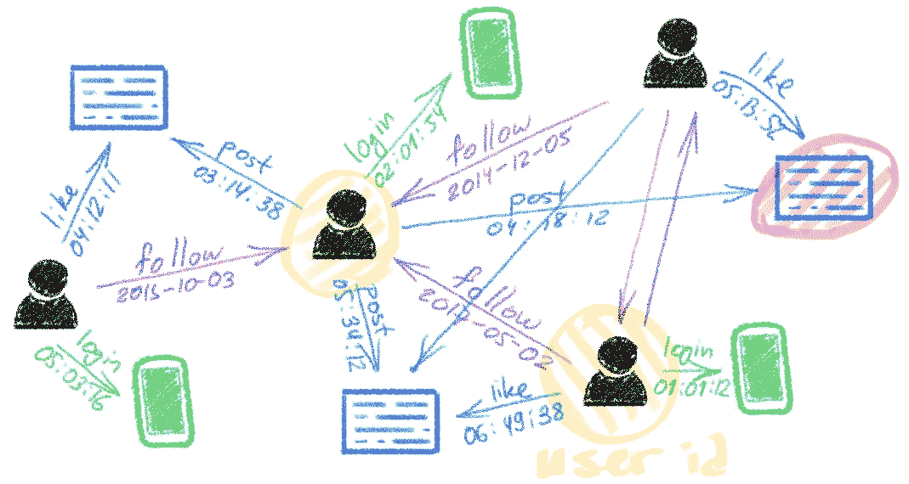

# 图的深度学习:成功、挑战和下一步

> 原文：<https://towardsdatascience.com/deep-learning-on-graphs-successes-challenges-and-next-steps-7d9ec220ba8?source=collection_archive---------15----------------------->

## 图形神经网络的下一步是什么？

## *这是* [*系列帖子*](https://towardsdatascience.com/graph-deep-learning/home) *中的第一篇，我将在这里讨论图形深度学习领域的演变和未来趋势。*

图的深度学习，也称为几何深度学习(GDL) [1]，图表示学习(GRL)，或关系归纳偏差[2]，最近已经成为机器学习中最热门的话题之一。虽然图形学习的早期工作可以追溯到至少十年[3]如果不是二十年[4]，但毫无疑问，过去几年的进展使这些方法从一个小众领域成为了 ML 社区 T11 的焦点，甚至成为了大众科学出版社的焦点(其中*Quanta Magazine*为流形 T15、T16 药物发现 T17 和 T18 蛋白质科学 T19 的研究发表了一系列关于几何深度学习的优秀文章)。

图形是强大的数学抽象，可以描述从生物学和高能物理学到社会科学和经济学等领域的复杂关系和相互作用系统。由于如今这些领域中的一些领域产生的图形结构数据量非常巨大(突出的例子是 Twitter 和脸书等社交网络)，尝试应用在其他数据丰富的环境中非常成功的深度学习技术是非常诱人的。

很大程度上依赖于应用程序的图形学习问题有多种风格。一个二分法是在*节点方式的*和*图方式的*问题之间，其中前者试图预测图中各个节点的属性(例如识别社交网络中的恶意用户)，而后者试图对整个图进行预测(例如预测分子的溶解度)。再者，和传统的 ML 问题一样，我们可以区分*监督*和*非监督*(或*自监督*)设置，以及*直推式*和*归纳式*问题。

与图像分析和计算机视觉中使用的卷积神经网络类似，在图上有效学习的关键是设计具有共享权重的局部操作，在每个节点和它的邻居之间传递消息。与处理网格结构数据的经典深度神经网络相比，一个主要区别在于，在图形上，这种操作是*置换不变的*，即独立于相邻节点的顺序，因为通常没有对它们进行排序的规范方式。

尽管他们做出了承诺，也有一系列图形表示学习的成功故事(其中我可以自私地列举出 Twitter 收购了我和我的学生一起创立的基于图形的假新闻检测初创公司 Fabula AI 的[)，但迄今为止，我们还没有看到卷积网络在计算机视觉方面取得的巨大成功。在下文中，我将尝试概述我对可能原因的看法，以及该领域在未来几年将如何发展。](https://blog.twitter.com/en_us/topics/company/2019/Twitter-acquires-Fabula-AI.html)

**像 ImageNet 这样的标准化基准**无疑是计算机视觉中深度学习的关键成功因素之一，有些人甚至认为对于深度学习革命来说，数据比算法更重要。在图形学习社区中，我们还没有和 ImageNet 在规模和复杂性上类似的东西。2019 年推出的 [Open Graph Benchmark](https://ogb.stanford.edu/) 可能是朝着这个目标的第一次尝试，试图在有趣的真实世界图结构数据集上引入具有挑战性的图学习任务。障碍之一是，从用户活动中产生多样化和丰富图表的科技公司不愿意分享这些数据，因为担心隐私法，如 GDPR。一个值得注意的例外是 Twitter，作为 RecSys 挑战赛的一部分，它在某些隐私保护限制下向研究社区提供了 1.6 亿条推文的数据集以及相应的用户参与度图。希望以后有很多公司效仿。

在公共领域可用的软件库在深度学习的“民主化”和使其成为一种流行工具方面发挥了至关重要的作用。如果说直到最近，图形学习实现主要是一堆写得很差且很少测试的代码，那么现在已经有了像 [PyTorch Geometric](https://pytorch-geometric.readthedocs.io/en/latest/) 或 [Deep Graph Library (DGL)](https://www.dgl.ai/) 这样的库，它们是在行业赞助的帮助下专业编写和维护的。在 arxiv 上出现一个新的图形深度学习架构几周后，看到它的实现并不罕见。

**可扩展性**是限制工业应用的关键因素之一，这些工业应用通常需要处理非常大的图(想想拥有数亿个节点和数十亿条边的 Twitter 社交网络)和低延迟约束。直到最近，学术研究团体几乎忽略了这一方面，文献中描述的许多模型完全不适用于大规模设置。此外，图形硬件(GPU)与经典深度学习架构的幸福婚姻是推动它们共同成功的主要力量之一，但它不一定最适合图形结构数据。从长远来看，我们可能需要专门的图形硬件[7]。

**动态图**是文献中很少涉及的另一个方面。虽然图是对复杂系统建模的一种常见方式，但这种抽象往往过于简单，因为现实世界的系统是动态的，会随着时间的推移而演变。有时是时间行为提供了关于系统的关键见解。尽管最近取得了一些进展，设计能够有效处理连续时间图的图神经网络模型仍然是一个开放的研究问题。

**已知更高级的结构**如基序、graphlets 或单纯复合物在复杂网络中很重要，例如在生物学应用中描述蛋白质-蛋白质相互作用。然而，大多数图形神经网络仅限于节点和边。[将这样的结构结合到消息传递机制中](/beyond-weisfeiler-lehman-using-substructures-for-provably-expressive-graph-neural-networks-d476ad665fa3)可以给基于图的模型带来更大的表达能力。

对图形神经网络表达能力的理论理解相当有限。常见的情况是，在某些设置中使用图形神经网络可以显著提高性能，而在其他设置中几乎没有差异。目前还不完全清楚图形神经网络何时以及为什么工作良好或失败。这个问题很困难，因为人们既要考虑底层图的结构，又要考虑图上的数据。对于只涉及图连通性的图分类问题，最近的工作表明，图神经网络等价于 [*Weisfeiler-Lehman 图同构测试*](/expressive-power-of-graph-neural-networks-and-the-weisefeiler-lehman-test-b883db3c7c49)【8】(一种启发式方法，用于解决图论中的一个经典问题，即确定两个图在其节点排列上是否相同)。这种形式主义揭示了为什么，例如，图神经网络在不能通过这种简单测试来区分的非同构图的实例上失败。超越 Weisfeiler-Lehman 等级测试，同时保持使图形神经网络如此有吸引力的低线性复杂度是一个开放的研究问题。

**图神经网络在存在噪声数据或遭受敌对攻击时的鲁棒性和有保证的性能**[9]是另一个有趣且基本上未开发的研究领域。

应用程序也许是这个领域最令人满意的部分。从事图形学习多年后，我已经和粒子物理学家[10]、临床医生[11]、生物学家和化学家[12]交了朋友——如果我们没有在他们各自的领域进行应用研究，我是不可能认识这些人的。如果我要打赌图形深度学习在未来几年可能产生最大影响的一个领域，我会指出结构生物学和化学。在这些领域中，基于图的模型既可以用作分子的低级模型[5]，也可以用作它们之间相互作用的高级模型[13，11]。将这些结合起来可能是达到对制药行业有用的水平的关键——我们看到了这方面的初步迹象，今年早些时候，图形神经网络被用于发现一种新的抗生素[14]或预测蛋白质之间的相互作用[12]。如果图形深度学习实现了它的承诺，那么传统上非常漫长且极其昂贵的发现、开发和测试新药的过程可能永远不会变了。

[1] M. M. Bronstein 等人[几何深度学习:超越欧几里德数据](https://arxiv.org/abs/1611.08097) (2017)，IEEE 信号处理杂志 34(4):18–42。

[2] P .巴塔格利亚等人，[关系归纳偏差、深度学习和图网络](https://arxiv.org/abs/1806.01261) (2018)，arXiv:1806.01261。

[3] F. Scarselli 等.图形神经网络模型(2008)，IEEE 神经网络汇刊 20(1):61–80 .

[4] A .屈希勒尔，c .戈勒(1996 年)。使用结构驱动的递归神经网络在符号域中进行归纳学习。Künstliche Intelligenz。

[5] J. Gilmer 等人，[量子化学的神经信息传递](https://arxiv.org/abs/1704.01212) (2017)，ICML。

[6] A. Wissner-Gross，[数据集超过算法](https://www.edge.org/response-detail/26587) (2016)。

[7] C.-Y .桂等..[关于图形处理加速器的调查:挑战与机遇](https://arxiv.org/pdf/1902.10130.pdf) (2019)，arXiv:1902.10130。

[8] K. Xu 等[图神经网络到底有多强大？](https://arxiv.org/abs/1810.00826) (2019)，ICLR。

[9] D. Zügner 等人，[图数据对神经网络的对抗性攻击](https://arxiv.org/abs/1805.07984) (2018)，Proc .KDD。

[10] N. Choma 等人[ice cube 信号分类的图形神经网络](https://arxiv.org/abs/1809.06166) (2018)，Proc .ICMLA。

[11] K. Veselkov 等人 [HyperFoods:食品中抗癌分子的机器智能图谱](https://www.nature.com/articles/s41598-019-45349-y) (2019)，科学报告 9。

[12] P .盖恩萨等人[利用几何深度学习从蛋白质分子表面破译相互作用指纹](https://www.biorxiv.org/content/10.1101/606202v1) (2020)，自然方法 17:184–192。

[13] M. Zitnik 等人[用图卷积网络建模多药副作用](https://arxiv.org/abs/1802.00543) (2018)，生物信息学 34(13):457–466。

[14] J. Stokes 等.抗生素发现的深度学习方法(2020)，细胞，180(4)。

*A* [*中文翻译*](https://www.infoq.cn/article/DOWRupsyGtUX60vhrT1c) *本帖由* [*刘止庸*](https://medium.com/@zhiyongliu) *提供。另见* [*丹麦语版*](https://pro.ing.dk/datatech/artikel/deep-learning-paa-grafer-succeser-udfordringer-og-naeste-skridt-7322) *。对图形深度学习感兴趣？参见我的* [*博客*](https://towardsdatascience.com/graph-deep-learning/home) *关于走向数据科学，* [*订阅我的*](https://michael-bronstein.medium.com/subscribe) *帖子，获取* [*中等会员*](https://michael-bronstein.medium.com/membership) *，或者关注我的* [*推特*](https://twitter.com/mmbronstein) *。*