# 点云深度学习:在 Google Colab 中实现 PointNet

> 原文：<https://towardsdatascience.com/deep-learning-on-point-clouds-implementing-pointnet-in-google-colab-1fd65cd3a263?source=collection_archive---------2----------------------->

## 点网是一种简单有效的点云识别神经网络。在本教程中，我们将使用 PyTorch 实现它。

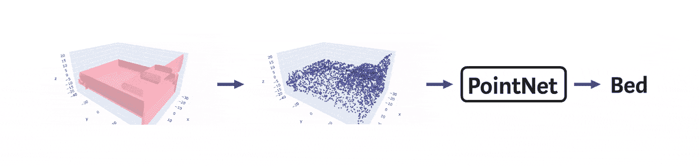

# 1.介绍

3D 数据对于自动驾驶汽车、自主机器人、虚拟和增强现实至关重要。与用像素阵列表示的 2D 图像不同，它可以表示为[多边形网格](https://en.wikipedia.org/wiki/Polygon_mesh)、[体积像素网格](https://en.wikipedia.org/wiki/Voxel)、[点云](https://en.wikipedia.org/wiki/Point_cloud)等。

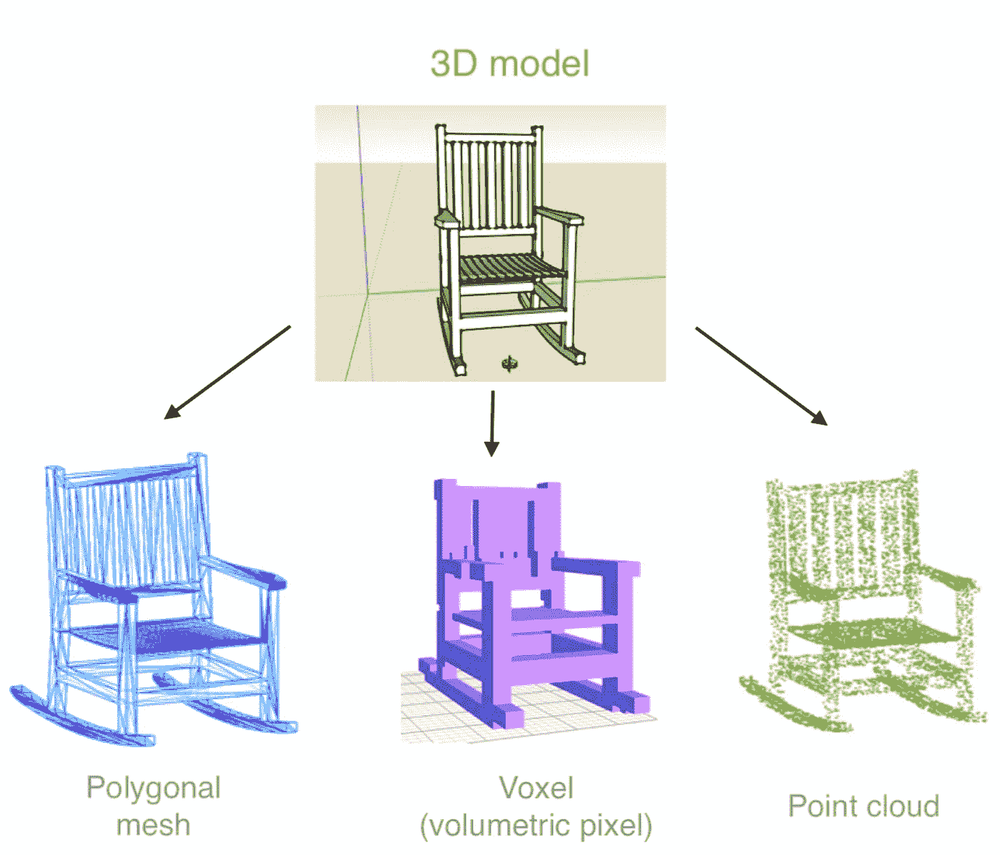

图片来自:[用 PyTorch 中的一张 2D 图片创建 3D 模型](https://medium.com/vitalify-asia/create-3d-model-from-a-single-2d-image-in-pytorch-917aca00bb07)

在今天的计算机视觉和机器学习中， [90%的进步只处理二维图像](http://news.mit.edu/2019/deep-learning-point-clouds-1021)。

## 1.1.点云

点云是一种广泛使用的 3D 数据形式，可以由深度传感器产生，如[激光雷达](https://oceanservice.noaa.gov/facts/lidar.html)和 [RGB-D](https://www.quora.com/What-is-an-RGB-D-image) 相机。

它是 3D 物体最简单的表示**:**仅点**于 3D 空间**，**无连通性。点云也可以包含点的法线。**

> 几乎所有的 3d 扫描设备都会产生点云。

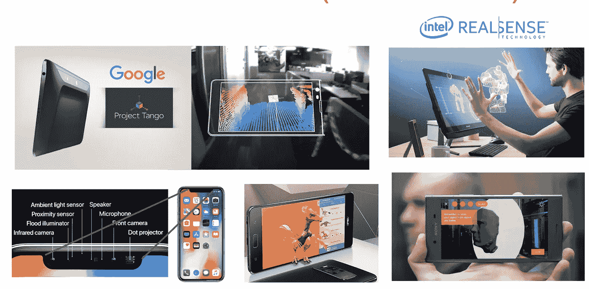

可以捕捉点云的设备(Iphone 11、华硕 Zenfone AR、索尼 Xperia XZ1)。图片来自:[本课程](http://www.enseignement.polytechnique.fr/informatique/INF555/)

此外，最近苹果[推出了](https://www.apple.com/newsroom/2020/03/apple-unveils-new-ipad-pro-with-lidar-scanner-and-trackpad-support-in-ipados/)带有激光雷达扫描仪的 Ipad Pro，可以测量 5 米以外的周围物体的距离。

## 1.2.点云深度学习

所以，让我们想想如何处理点云。CNN 对图像非常有用。我们能把它们用于 3D 吗？

> 想法:将 2D 卷积推广到规则三维网格

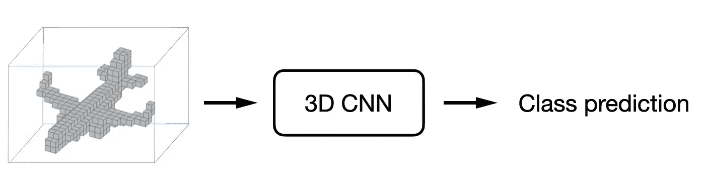

图片来自: [arxiv 论文](https://arxiv.org/pdf/1604.03265.pdf)

这个其实[管用](https://arxiv.org/pdf/1604.03265.pdf)。

主要的**问题**是**低效表示:**大小为 100 的立方体素网格将有 1，000，000 个体素。

## 1.3.点网

但是如果我们尝试处理点云呢？

有三个主要的**约束**:

*   点云是无序的。算法必须对输入集的排列不变。
*   如果我们旋转椅子，它还是椅子，对吗？网络必须是**不变的** [**刚性变换**](https://en.wikipedia.org/wiki/Rigid_transformation) 。
*   网络应该捕捉点之间的相互作用。

PointNet [的作者介绍了](https://arxiv.org/pdf/1612.00593.pdf)一种考虑了所有这些特性的神经网络。它设法解决**分类**，部件和语义**分割**任务。来实施吧！

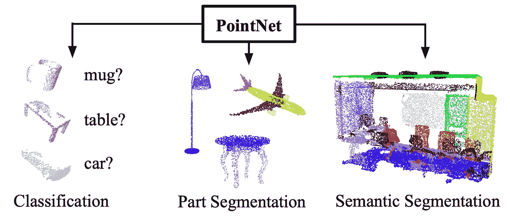

图片来自: [arxiv 论文](https://arxiv.org/pdf/1612.00593.pdf)

# 2.履行

在本节中，我们将使用 **PyTorch 从 [**Google Colab**](https://medium.com/deep-learning-turkey/google-colab-free-gpu-tutorial-e113627b9f5d) 中的[原始论文](https://arxiv.org/pdf/1612.00593.pdf)重新实现**分类模型**。**

你可以在[https://github . com/nikitakaraevv/pointnet/blob/master/nbs/pointnet class . ipynb](https://github.com/nikitakaraevv/pointnet/blob/master/nbs/PointNetClass.ipynb)找到**完整笔记本**

## 2.1.资料组

在原始论文中，作者在 ModelNet40 形状分类基准上评估了 PointNet。它包含来自 40 个对象类别的 12，311 个模型，分为 9，843 个训练模型和 2，468 个测试模型。

为了简单起见，让我们使用同一个数据集的较小版本: **ModelNet10。**它由来自 **10 个类别的对象、**3991 个用于训练的模型和 908 个用于测试的模型组成。

 [## 3D 形状网:体积形状的深层表示

### 在物体识别中，3D 形状是一个至关重要但严重未被充分利用的线索，主要是因为缺乏一个好的通用…

3dvision.princeton.edu](http://3dvision.princeton.edu/projects/2014/3DShapeNets/) 

> 想直接开始训练别忘了打开 GPU

让我们导入必要的库:

我们可以将数据集直接下载到 Google Colab 运行时:

这个数据集由**组成。关闭包含由顶点和三角面表示的[网格](https://en.wikipedia.org/wiki/Polygon_mesh)的**文件。**顶点**只是三维空间中的点，每个**三角形**由 3 个顶点索引组成。

我们将需要一个函数来读取**。关闭**文件:

完整网格看起来是这样的:

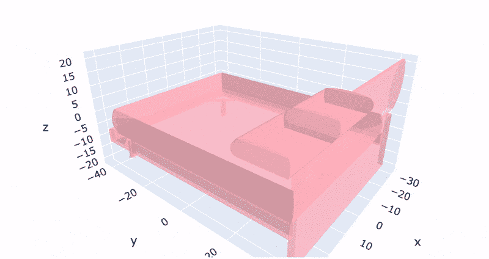

啮合其中一个**。关闭**文件。使用[创建 plotly](https://plotly.com/python/)

如你所见，这是一张🛏床

但是如果我们去掉人脸，只保留 3D 点，它看起来就不再像一张床了！

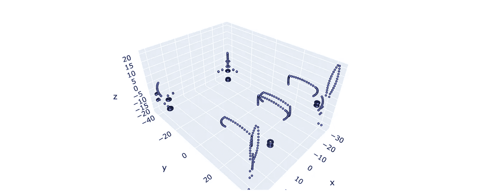

网格顶点

实际上，曲面的平坦部分不需要任何点来构建网格。这就是为什么点主要位于床的角度和圆形部分。

## 2.2.点取样

因此，由于**点不是均匀分布在物体表面的**，我们的点网很难对它们进行分类。(尤其是知道这个点云看起来连床都不像)。

这个问题的解决方案可能非常简单:让我们在物体的表面上均匀地采样点。

> 我们不应该忘记脸可以有不同的区域。

因此，我们可以将选择特定面**的概率与其面积**成比例分配。这是可以做到的:

我们的网络架构中将会有密集层。这就是为什么我们希望**点云中有固定数量的点**。让我们从构建的分布中抽取人脸样本。之后，我们在每个选择的面上采样一个点:

> 一些面可以有多个采样点，而另一些面根本没有采样点。

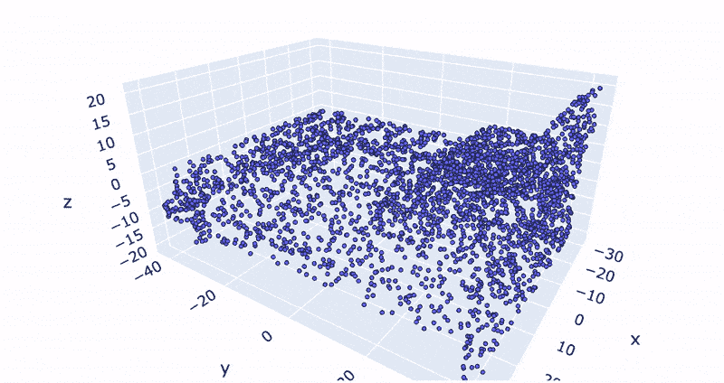

由网格曲面上的采样点创建的点云

这个点云看起来更像一张床！🛏

## 2.3.增加

让我们想想其他可能的问题。我们知道**物体可以有不同的大小**，可以放**在我们坐标系**的不同部分。

因此，让我们**将**物体**平移到原点**，从其所有点中减去平均值，并将**的点归一化**到一个单位球。为了在训练期间增加数据，我们**围绕 Z 轴随机旋转**对象，并添加**高斯噪声**，如本文所述:

这是标准化的同一张床，带有**旋转**和**噪音**:

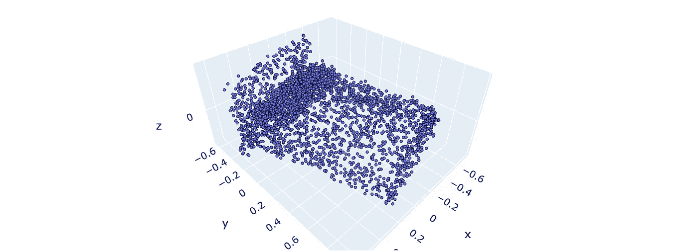

添加噪声的旋转点云

## 2.4.模型

好了，我们已经完成了数据集和预处理。让我们考虑一下模型架构。该架构及其背后的关键思想已经得到了很好的解释，例如，在本文中:

 [## 深入了解 PointNet

### PointNet 是 3D 感知领域的开创性论文，将深度学习应用于点云，用于对象分类和…

medium.com](https://medium.com/@luis_gonzales/an-in-depth-look-at-pointnet-111d7efdaa1a) 

我们记得结果应该是对输入点的**不变***排列*和几何*变换*，比如[刚性变换](https://en.wikipedia.org/wiki/Rigid_transformation)。

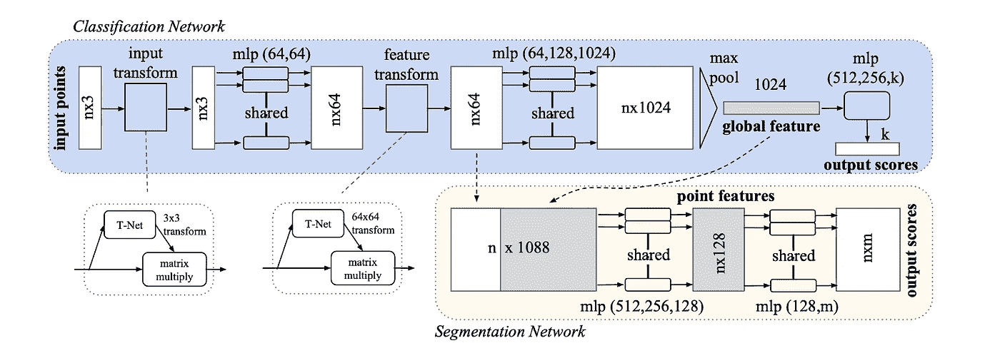

图片来自: [arxiv 论文](https://arxiv.org/pdf/1612.00593.pdf)

让我们在 [**PyTorch**](https://pytorch.org/tutorials/) 中开始实现它:

首先，我们的张量会有大小`(batch_size, num_of_points, 3)`。在这种情况下，具有[共享权重](https://www.quora.com/What-exactly-is-meant-by-shared-weights-in-convolutional-neural-network)的 *MLP* 只是具有大小为 1 的内核的 [1-dim *卷积*](https://jdhao.github.io/2017/09/29/1by1-convolution-in-cnn/) 。

为了确保**对变换**的不变性，我们将 T-Net 预测的 3x3 变换矩阵应用于输入点的坐标。有趣的是，我们[不能通过三维矩阵对 3D 空间](https://gamedev.stackexchange.com/questions/161771/why-do-transformation-matrices-always-have-an-extra-dimension)中的翻译进行编码。无论如何，我们已经在预处理中将点云平移到原点。

> 这里重要的一点是输出矩阵的初始化。我们希望它默认为 identity，开始训练时没有任何转换。因此，我们只需在输出中添加一个单位矩阵:

在应用 *MLP* 后，我们将使用相同但 64 维的 T 网来对齐提取的点特征。

为了提供**置换不变性，**我们将对称函数(max pooling)应用于提取和转换的特征，因此结果不再依赖于输入点的顺序。

让我们把它们结合在一起:

然后，让我们用输出端的最后一个 *MLP* 和*[*LogSoftmax*](https://pytorch.org/docs/stable/nn.html)*将它们打包在一个类中:**

**最后我们将定义**损失函数**。正如我们使用 *LogSoftmax* [获得稳定性](https://medium.com/@zhang_yang/understanding-cross-entropy-implementation-in-pytorch-softmax-log-softmax-nll-cross-entropy-416a2b200e34) *，*一样，我们应该使用 *NLLLoss* 而不是 *CrossEntropyLoss。*此外，我们将添加两个正则化项，以使变换矩阵接近正交( *AAᵀ = I )* :**

## **2.5.培养**

****最后一步！**我们可以用一个经典的 [PyTorch 训练循环](https://pytorch.org/tutorials/beginner/blitz/cifar10_tutorial.html)。这肯定不是最有趣的部分，所以让我们省略它。**

**同样，带有训练循环的完整 Google Colab 笔记本可以在此链接 **后找到 [**。**](https://github.com/nikitakaraevv/pointnet/blob/master/nbs/PointNetClass.ipynb)****

**我们就来看看在 GPU 上训练 **15 个纪元**后的结果吧。培训本身大约需要 **3 个小时**，但是[根据 Colab 分配给当前会话的 GPU 类型，培训时间可能会有所不同](https://research.google.com/colaboratory/faq.html#gpu-availability)。**

**通过一个简单的训练循环，在 13 个时期后可以达到 85% 的总体验证**准确度，相比之下，在[原始作品](https://arxiv.org/pdf/1612.00593.pdf)中对于 40 个类，该准确度为 89%。这里的要点是实现完整的模型，而不是真的获得最好的分数。因此，我们将把调整训练循环和其他实验作为练习。****

> **有趣的是，我们的模型有时会混淆梳妆台和床头柜，厕所和椅子，书桌和桌子，这很容易理解(厕所除外):**

**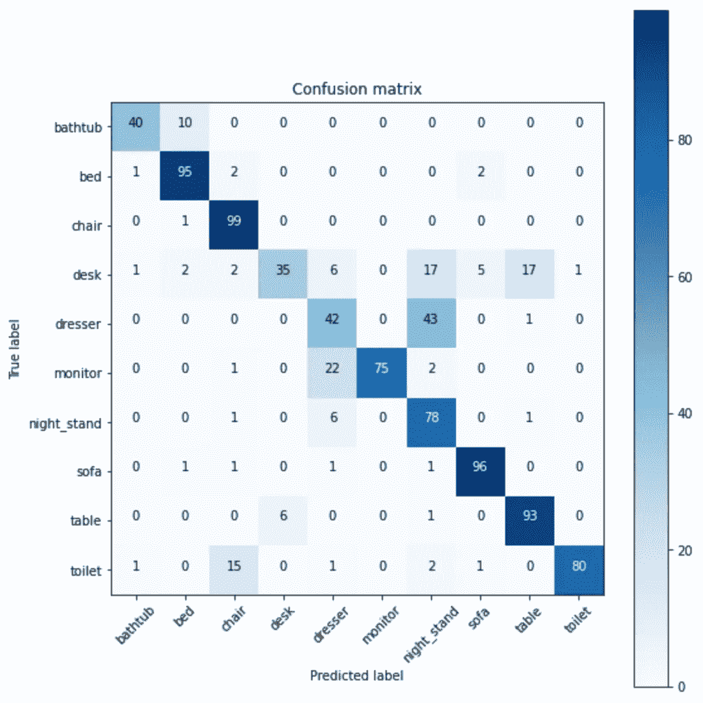**

# **3.最后的话**

**你做到了！🎉🎊👏**

**你实现了 **PointNet** ，这是一个深度学习架构，可以用于各种 3D 识别任务。尽管我们在这里实现了**分类**模型，但是**分割**、**正常评估**或其他任务只需要对模型和数据集类进行微小的修改。**

**完整的笔记本可在[https://github . com/nikitakaraevv/point net/blob/master/nbs/point net class . ipynb](https://github.com/nikitakaraevv/pointnet/blob/master/nbs/PointNetClass.ipynb)获得。**

***感谢您的阅读！我希望这篇教程对你有用。如果是这样，请在评论中告诉我。顺便说一句，这是我的第一篇媒体文章，所以我将非常感谢您的评论或私信反馈！***

# **参考资料:**

**[1] Charles R. Qi，，Kaichun Mo，Leonidas J. Guibas， [PointNet:用于三维分类和分割的点集深度学习](http://stanford.edu/~rqi/pointnet/) (2017)，CVPR 2017**

**[2]亚当·康纳-西蒙斯，[点云深度学习](http://news.mit.edu/2019/deep-learning-point-clouds-1021) (2019)，麻省理工学院计算机科学&人工智能实验室**

**[2] Loic Landrieu，[3D 点云的语义分割](http://bezout.univ-paris-est.fr/wp-content/uploads/2019/04/Landrieu_GT_appr_opt.pdf) (2019)，巴黎东方大学—机器学习与优化工作组**

**[4] Charles R. Qi 等，[用于 3D 数据上对象分类的体积和多视图 CNN](https://arxiv.org/pdf/1604.03265.pdf)(2016)，**