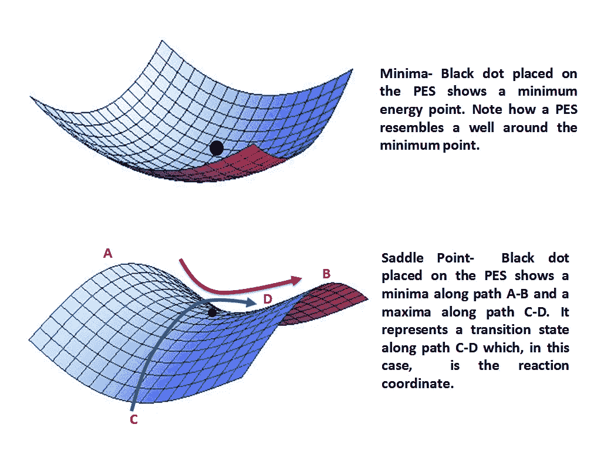

# 深度学习优化器——难？不是。[1]

> 原文：<https://towardsdatascience.com/deep-learning-optimizers-hard-not-3f5c4f7b4e96?source=collection_archive---------34----------------------->

## 让优化器更容易理解

在 [Unsplash](https://unsplash.com?utm_source=medium&utm_medium=referral) 上由 [Franck V.](https://unsplash.com/@franckinjapan?utm_source=medium&utm_medium=referral) 拍摄的照片

你说优化？—哇，伙计，那是一些超级复杂的数学；对吗？对吗？不对！大多数人回避优化算法，因为它们大多是通过在 PyTorch 或 TensorFlow 中编写一行代码来实现的。然而，对于神经网络训练来说，优化算法通常是训练模型中最有影响力的因素。他们对如何更新权重、模型学习什么和丢弃什么有完全的发言权。

深度学习是当今最先进的技术之一。这真的不难理解为什么这么多人对人工智能或神经网络感兴趣。互联网上大量的课程材料使得新手很难选择一种正确的教学方法。因此，大量对人工智能感兴趣的人很少知道基础知识。

深入主题，深度学习涉及许多方式和上下文的优化。深度学习中最难的优化问题之一是神经网络训练。与神经网络训练相关联的优化围绕寻找减小损失函数 *J(θ)的参数 *θ* 。*

> 在数学优化和决策理论中，**损失函数**或成本函数**是一个**函数**，它将一个事件或一个或多个变量的值映射到一个实数上，直观地表示与该事件相关的一些“成本”——[https://en.wikipedia.org/wiki/Loss_function](https://en.wikipedia.org/wiki/Loss_function)**

人们最常犯的一个错误是他们不能区分优化和反向传播。这确实令人困惑，所以让我给你解释一下。在反向传播中，我们计算梯度，并且不基于这些梯度更新权重。我们*只是*计算梯度。在优化过程中，我们根据计算的梯度和我们选择的优化算法来更新权重。因此，优化算法因网络而异，但反向传播保持不变。

神经网络中的优化不同于在各种机器学习模型中观察到的优化。在最大似然模型中，我们已经能够仔细地设计目标函数，使得损失函数是凸的，从而优化问题变得相当容易。然而，在训练神经网络时，由于以下普遍面临的问题，事情变得复杂和失控:

1.  神经网络具有高维凸优化问题。结果，我们经常遇到零梯度的鞍点。鞍点的问题是，当从一个横截面观察它们时，我们得到一个局部最小值，而从另一个横截面，我们得到一个全局最大值。

鞍点 v/s Minima—[https://commons . wikimedia . org/wiki/File:Minima _ and _ Saddle _ point . png](https://commons.wikimedia.org/wiki/File:Minima_and_Saddle_Point.png)

2.最优化的问题并不以鞍点结束。目标函数导数中的悬崖是与训练相关联的另一个优化问题。由于几个重量相乘，我们有陡峭的区域，称为悬崖。当算法在这样的悬崖之前时，它可能采取太大的步骤，并且可能跳下悬崖，从而扰乱算法的正常流程。

3.如果局部表面不指向全局最小值，则基于局部梯度计算的优化失败。当成本函数导数包含某个“悬崖”并且不能穿越它时，可能会发生这种情况。它可能在更高维度的空间中穿行，但是在训练期间花费的过多时间会使网络太慢。

4.在神经网络中也观察到“消失”和“爆炸”梯度的问题。当神经网络涉及相同矩阵的重复乘法(如在 RNNs 中)导致具有高指数的矩阵时，出现消失和爆炸梯度。当执行矩阵的特征分解以获得特征值时，任何不接近 1 的特征值将爆炸(如果大于 1)或消失(如果小于 1 ),产生消失和爆炸梯度的问题。

因此，我们可以看到，如果我们试图优化和训练一个神经网络，我们可能会面临许多问题。幸运的是，我们已经准备好了一些优化算法，这些算法是研究人员经过数月甚至数年的工作后留给我们的。我将讨论非常流行的 SGD 优化算法。(随机梯度下降)

# 签名于

随机梯度下降可能是深度学习中最常用的优化算法之一。要理解随机梯度下降，就必须理解什么是梯度下降。梯度下降意味着沿着梯度的斜坡移动。你是如何“移动”的？

梯度下降算法首先决定斜率指向哪个方向。然后它向降低斜率迈出了一步。这背后的直觉是，我们最终寻求最小化成本函数，我们可以在斜率为零的地方得到最小值。但是，嘿——一个最大值也有零斜率！这就是为什么我们使用海森矩阵。海森矩阵存储了成本函数的二阶导数，帮助我们区分最大值和最小值。

现在，主要有三种类型的梯度下降—

1.  批量梯度下降:在这种类型的梯度下降中，在评估所有训练样本之后更新权重。
2.  在线训练:在这种类型的梯度下降中，一旦一个训练样本被评估，权重就被更新。训练样本是随机选择的。
3.  小批量梯度下降(SGD):小批量梯度下降结合了两个世界的优点。在这种情况下，我们从训练样本中随机抽取一小批样本，并在评估后更新权重。然后我们对另一个小批量样品进行取样，这个过程一次又一次地重复。

现在，我们知道权重是根据我们定义的学习率更新的。然而，在编写 SGD 优化算法时，我们必须记住的一个最重要的因素(你通常不会)是，学习速率**必须**随着时间的推移而降低。

需要降低学习率，因为 SGD 使用小批量。从训练数据中采样小批量，并且这种数据采样导致噪声的存在。即使我们到达最低限度，噪音也不会消失。因此，我们需要密切监控学习率，以使模型收敛。

**为什么用 SGD 而不用梯度下降(批量)？**

神经网络需要大量数据才能正常工作。与机器学习模型相比，即使在简单的分类器中也需要更多的训练数据。对大量的训练样本使用梯度下降在计算上将是非常昂贵的，并且将成倍地增加学习时间。SGD 和使用基于小批量的模型的主要特征之一是每次更新的学习时间不会随着训练数据的增加而增加。这是非常有用的，因为我们最终可以突破梯度下降对我们可以使用的训练数据大小的限制。

我希望这篇文章有助于打破优化算法的概念及其在深度学习领域的必要性。如果有任何问题，请在评论区告诉我:)

**参考:**深度学习作者:伊恩·古德菲勒、约舒阿·本吉奥、亚伦·库维尔(2017)