# 自然语言处理(NLP)的深度学习管道

> 原文：<https://towardsdatascience.com/deep-learning-pipeline-for-natural-language-processing-nlp-c6f4074897bb?source=collection_archive---------10----------------------->

## NLP、无监督机器学习和深度学习概念在无标签文本数据上的实际实现。


照片由 [Unsplash](https://unsplash.com?utm_source=medium&utm_medium=referral) 上的 [h heyerlein](https://unsplash.com/@heyerlein?utm_source=medium&utm_medium=referral) 拍摄

在本文中，我将探索自然语言处理(NLP)的基础知识，并演示如何实现一个管道，该管道将传统的无监督学习算法与深度学习算法相结合，以训练无标签的大型文本数据。因此，主要目标是演示如何建立管道，以促进原始文本数据的收集和创建，预处理和分类未标记的文本数据，最终在 Keras 中训练和评估深度学习模型。

阅读完本教程后，您将能够执行以下操作:

1.  如何通过 Twitter API 和 Tweepy Python 包从 Twitter 收集数据
2.  如何用 pandas 高效地读取和清理大型文本数据集
3.  如何使用基本的自然语言处理技术预处理文本数据并生成特征
4.  如何对未标记的文本数据进行分类
5.  如何在 Keras 中训练、编译、拟合和评估深度学习模型

在我的 GitHub [中找到我的带有 Python 代码的 Jupyter 笔记本。](https://github.com/bauyrjanj/NLP-TwitterData)

卷起袖子，我们有很多工作要做，让我们开始吧…..

# 数据

在做这个项目的时候，美国 2020 年大选即将到来，对与即将到来的选举相关的推文进行情感分析，以了解在选举日之前大约两周 Twitter 世界中正在讨论的观点和话题是有意义的。Twitter 是一个未经过滤的意见的伟大来源，而不是我们从主要媒体渠道看到的典型的过滤新闻。因此，我们将通过使用 Twitter API 和 python 包 Tweepy 从 Twitter 收集 tweets 来构建我们自己的数据集。

# 步骤 1:数据收集

## 先决条件

在开始使用来自 Twitter 的流数据之前，您必须具备以下条件:

1.  Twitter 帐户和 Twitter API 消费者密钥(访问令牌密钥、访问令牌秘密密钥、消费者密钥和消费者秘密密钥)
2.  安装在您的 Jupyter 笔记本中的 Tweepy 软件包

设置 Twitter 帐户和检索您的 Twitter API 消费者密钥超出了本文的范围。如果你在这些方面需要帮助，看看这个[帖子](https://medium.com/@divyeshardeshana/create-twitter-developer-account-app-4ac55e945bf4)。

Tweepy 可以通过 Jupyter 笔记本中的 pip install 进行安装，下面一行代码就可以完成。

```
# Install Tweepy
!pip install tweepy
```

安装完成后，继续将软件包导入您的笔记本电脑。

## 1.1 设置数据流管道

在这一节中，我将向您展示如何使用 Twitter API、Tweepy 和一个自定义函数来设置您的数据流管道。我们可以通过三个步骤实现这一目标:

1.  设置您的 Twitter API 消费者密钥
2.  设置 Twitter API 授权处理程序
3.  编写一个自定义函数来监听和流式传输实时推文

```
# Twitter API consumer keys
access_token = "  insert your key here  "
access_token_secret = "  insert your key here  "
consumer_key = "  insert your key here  "
consumer_secret = "  insert your key here  "# Twitter API authorization
auth = tweepy.OAuthHandler(consumer_key, consumer_secret)
auth.set_access_token(access_token, access_token_secret)# Custom function that streams data from Twitter (20,000 tweets at most per instance)
class MyStreamListener(tweepy.StreamListener):
    """Function to listen and stream Twitter data"""
    def __init__(self, api=None):
        super(MyStreamListener, self).__init__()
        self.num_tweets = 0
        self.file = open("tweets.txt", "w")def on_status(self, status):
        tweet = status._json
        self.file.write( json.dumps(tweet) + '\n' )
        self.num_tweets += 1
        if self.num_tweets < 20000: 
            return True
        else:
            return False
        self.file.close()def on_error(self, status):
        print(status)
```

## 1.2 开始直播推文

既然环境已经设置好了，您就可以开始从 Twitter 流式传输实时推文了。在此之前，确定一些你想用来收集你感兴趣的相关推文的关键词。由于我将发布与美国大选相关的推文，我选择了一些相关的关键词，如“美国大选”、“特朗普”、“拜登”等。

我们的目标是收集至少 400，000 条推文，使其成为足够大的文本数据，一次性收集所有这些数据的计算量很大。因此，我将建立一个管道，以高效地传输数据。请注意上面的自定义函数，它将在每个块中最多监听和传输 20，000 条 tweets。因此，为了收集超过 40 万条推文，我们需要运行至少 20 个区块。

下面是代码如何寻找用于监听和流式传输实时推文到熊猫数据帧的块:

```
# Listen and stream live tweets
listener = MyStreamListener()
stream = tweepy.Stream(auth, listener)
stream.filter(track = ['US Election', 'election', 'trump', 'Mike Pence', 'biden', 'Kamala Harris', 'Donald Trump', 'Joe Biden'])# Read the tweets into a list
tweets_data_path = 'tweets.txt'
tweets_data=[]
tweets_file_1 = open(tweets_data_path, 'r')# Read in tweets and store in list: tweets_data
for line in tweets_file_1:
    tweet = json.loads(line)
    tweets_data.append(tweet)# Close connection to file
tweets_file_1.close()# Print the keys of the first tweet dict
print(tweets_data[0].keys())# Read the data into a pandas DataFrame
names = tweets_data[0].keys()
df1 = pd.DataFrame(tweets_data, columns= names)
```

如上所述，为了收集 400，000 条推文，您必须运行上述代码至少 20 次，并将收集的推文保存在单独的 pandas dataframe 中，该 dataframe 将在以后连接起来，以将所有推文整合到单个数据集。

## 1.3 将所有数据块组合成一个数据集

```
# Concatenate dataframes into a single pandas dataframe
list_of_dataChunks = [df1, df2, df3, df4, df5, df6, df7, df8, df9, df10, df11, df12, df13, df14, df15, df16, df17, df18, df19, df20]
df = pd.concat(list_of_dataChunks, ignore_index=True)# Export the dataset into a CSV file
df.to_csv('tweets.csv', index=False)
```

现在，您已经将组合数据集导出到 CSV 文件中，您可以在接下来的数据清理和可视化步骤中使用它。

我已经捐赠了我创建的数据集，并在 [Kaggle](https://www.kaggle.com/bauyrjanj/2020-us-election-tweets-unlabeled) 中公开。

# 第二步:数据争论

在本节中，我们将清理刚刚收集的数据。在可视化数据之前，必须清理数据集并将其转换为可以高效可视化的格式。给定具有 440，000 行的数据集，必须找到一种有效的方法来读取和清理它。为此，pandas chunksize 属性可用于将 CSV 文件中的数据以块的形式读入 pandas 数据帧。此外，我们可以指定感兴趣的列的名称，而不是读取包含所有列的数据集。使用 chunksize 和更少量的感兴趣的列，大型数据集可以非常高效和快速地读入数据帧，而不需要其他替代方案，例如在集群上使用 PySpark 的分布式计算。

为了将数据集转换成可视化所需的形状，将应用以下基本 NLP 技术:

1.  提取仅有的英语推特
2.  删除重复项(如果有)
3.  删除丢失的值(如果有)
4.  标记化(将推文分成单个单词)
5.  将单词转换成小写
6.  删除标点符号
7.  删除停用词
8.  删除网址,“twitter”和其他缩写词

我将遵循以下方法来实现上述步骤:

1.  编写一个自定义函数来标记推文
2.  编写另一个自定义函数，对数据应用上述所有清理步骤。
3.  最后，读取数据块，并在读取数据块时，通过自定义函数将这些争论步骤应用于每个数据块。

让我们看看所有这些都在起作用…

```
# Function to tokenize the tweets
def custom_tokenize(text):
    """Function that tokenizes text"""
    from nltk.tokenize import word_tokenize
    if not text:
        print('The text to be tokenized is a None type. Defaulting to blank string.')
        text = ''
    return word_tokenize(text)# Function that applies the cleaning steps
def clean_up(data):
    """Function that cleans up the data into a shape that can be further used for modeling"""
    english = data[data['lang']=='en'] # extract only tweets in english language
    english.drop_duplicates() # drop duplicate tweets
    english['text'].dropna(inplace=True) # drop any rows with missing tweets
    tokenized = english['text'].apply(custom_tokenize) # Tokenize tweets
    lower_tokens = tokenized.apply(lambda x: [t.lower() for t in x]) # Convert tokens into lower case
    alpha_only = lower_tokens.apply(lambda x: [t for t in x if t.isalpha()]) # Remove punctuations
    no_stops = alpha_only.apply(lambda x: [t for t in x if t not in stopwords.words('english')]) # remove stop words
    no_stops.apply(lambda x: [x.remove(t) for t in x if t=='rt']) # remove acronym "rt"
    no_stops.apply(lambda x: [x.remove(t) for t in x if t=='https']) # remove acronym "https"
    no_stops.apply(lambda x: [x.remove(t) for t in x if t=='twitter']) # remove the word "twitter"
    no_stops.apply(lambda x: [x.remove(t) for t in x if t=='retweet']) # remove the word "retweet"
    return no_stops# Read and clean the data
warnings.filterwarnings("ignore")
use_cols = ['text', 'lang'] # specify the columns
path = 'tweets.csv' # path to the raw dataset
data_iterator = pd.read_csv(path, usecols=use_cols, chunksize=50000)
chunk_list = []
for data_chunk in data_iterator:
    filtered_chunk = clean_up(data_chunk)
    chunk_list.append(filtered_chunk)
tidy_data = pd.concat(chunk_list)
```

在这种情况下，块大小是 50，000，这就是熊猫如何读取每个块中的 50，000 条推文，并在读取下一批推文之前对它们应用清理步骤，等等。

在此过程之后，数据集将变得干净，并为可视化做好准备。为了避免每次打开笔记本时执行数据争论步骤，您可以简单地将整齐的数据导出到一个外部文件中，以便将来使用。对于大型数据集，将其导出到 JSON 文件比导出到 CSV 文件更有效。

```
# Explort the tidy data to json file for ease of use in the next steps
tidy_data.to_json('tidy_tweets.json', orient='table')
```

这些整洁的数据看起来是这样的:

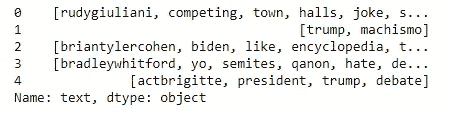

# 步骤 3:探索性数据分析(可视化)

既然数据是干净的，让我们可视化并理解我们的数据的本质。我们可以关注的几个明显的事情如下:

1.  每条推文的字数
2.  一条推文中单词的平均长度
3.  Unigram
4.  二元模型
5.  三元模型
6.  Wordcloud

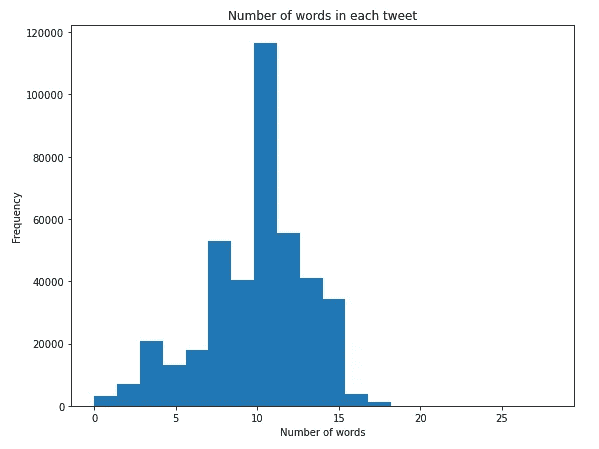

似乎每条推文的字数在 1 到 19 个词之间，平均在 10 到 12 个词之间。

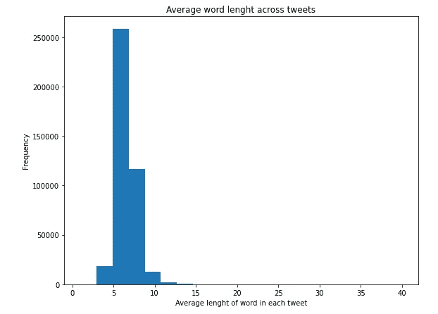

推特中一个单词的平均字符数似乎在 3 到 14 个字符之间，平均出现在 5 到 7 个字符之间。人们可能会在 Twitter 设定的 280 个字符的限制内，选择简短的词语来以最佳方式表达自己的观点。

## Unigram

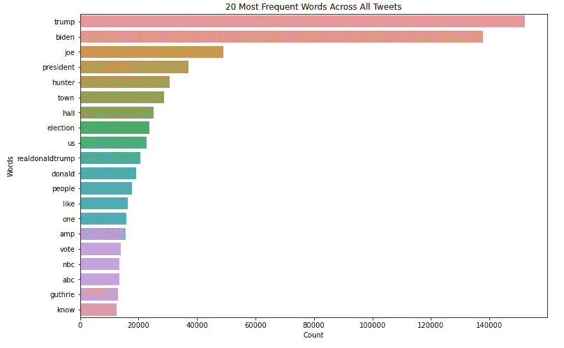

正如所料，“特朗普”和“拜登”这两个词主导了 10 月 15 日至 10 月 16 日期间发布的 2020 年美国大选相关推文。

## 二元模型(最常出现的一对连续单词)

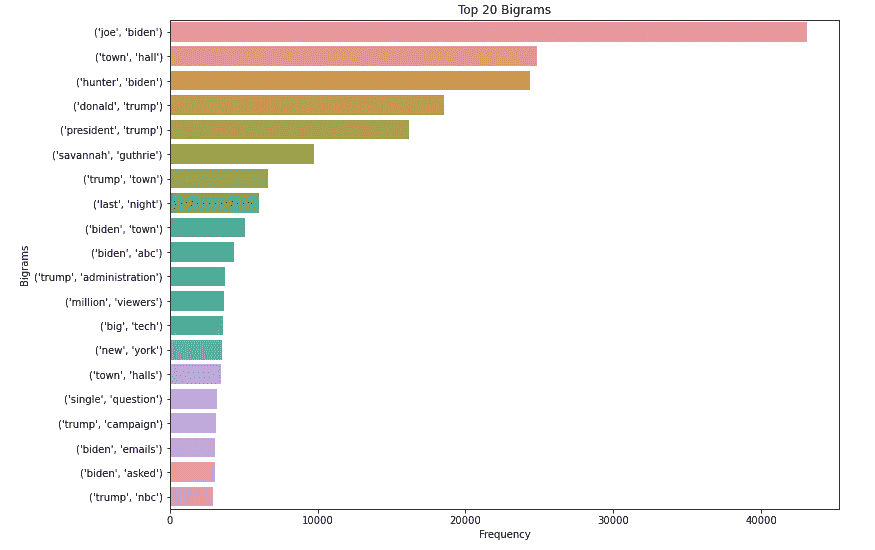

## 三元模型(三个单词的最常见序列)

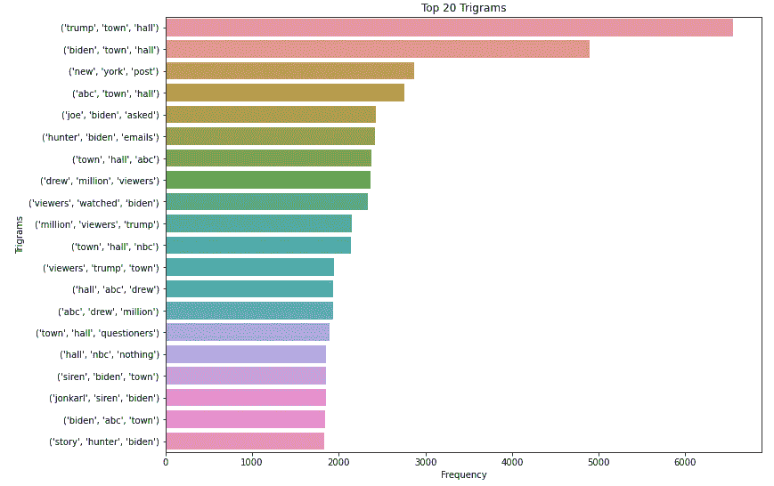

## Wordcloud

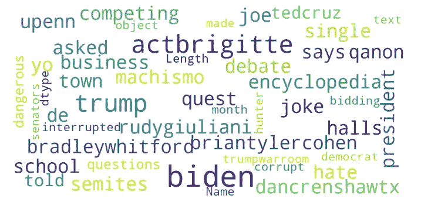

通过可视化数据，注意单词没有被词条化。词汇化是将单词转换成基本形式或词典形式的过程。这是 NLP 和机器学习中常用的技术。因此，在下一步中，我们将使用以下代码对令牌进行符号化。

```
# Convert tokens into format required for lemmatization
from nltk.corpus import wordnet
def get_wordnet_pos(word):
    """Map POS tag to first character lemmatize() accepts"""
    tag = nltk.pos_tag([word])[0][1][0].upper()
    tag_dict = {"J": wordnet.ADJ,
                "N": wordnet.NOUN,
                "V": wordnet.VERB,
                "R": wordnet.ADV}return tag_dict.get(tag, wordnet.NOUN)# Lemmatize tokens
lemmatizer = WordNetLemmatizer()
tidy_tweets['lemmatized'] = tidy_tweets['text'].apply(lambda x: [lemmatizer.lemmatize(word, get_wordnet_pos(word)) for word in x])# Convert the lemmatized words back to the text format
tidy_tweets['tokens_back_to_text'] = [' '.join(map(str, l)) for l in tidy_tweets['lemmatized']]
```

现在，让我们将符号化的标记保存到另一个 JSON 文件中，以便在管道的下一步中使用。

```
# Explort the lemmatized data to json file for ease of use in the next steps
tidy_tweets.to_json('lemmatized.json', orient='table')
```

# 方法

在进行预处理和建模的步骤之前，让我们回顾并明确我们在管道中的下一个步骤的方法。在我们可以预测一条推文属于哪个类别之前，我们必须首先用类别来标记原始推文。请记住，我们从 Twitter 上以原始推文的形式传输我们的数据，因此数据并没有标记出来。因此，实施以下方法是合适的:

1.  用 k-means 聚类算法标记数据集
2.  训练深度学习模型来预测推文的类别
3.  评估模型并确定潜在的改进

# 步骤 4:标记未标记的文本数据并预处理

在这一部分，我们的目标是给推文贴上两个标签，分别对应积极或消极的情绪。然后进一步预处理，将标注后的文本数据转换成可以进一步用于训练深度学习模型的格式。

有许多不同的方法来对未标记的文本数据进行分类，这些方法包括但不限于使用 SVM、分层聚类、余弦相似度甚至亚马逊 Mechanical Turk。在这个例子中，我将向您展示另一种更简单的，也许不是最准确的，对文本数据进行分类的快速而又麻烦的方法。为此，我将首先对 VADER 进行情绪分析，以确定推文是积极的、消极的还是中立的。接下来，我将使用一个简单的 k-means 聚类算法，根据从推文的积极、消极和中立程度得出的计算复合值对推文进行聚类。

## **4.1 创造情绪**

让我们先来看看数据集

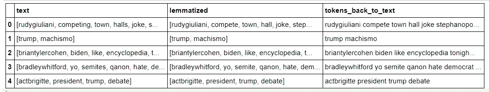

列“tokens_back_to_text”是转换回文本格式的词汇化标记，我将使用 tidy 数据集中的此列来创建 VADER 包中的 SenitmentIntensityAnalyzer 情感。

```
# Extract lemmatized text into a list
tweets = list(df['tokens_back_to_text'])# Create sentiments with SentimentIntensityAnalyzer
**from** **vaderSentiment.vaderSentiment** **import** SentimentIntensityAnalyzer 
sid = SentimentIntensityAnalyzer()
sentiment = [sid.polarity_scores(tweet) **for** tweet **in** tweets]
```

下面是情绪的前 5 行

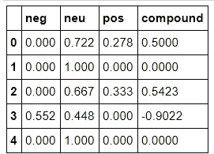

## **4.2 用 k-means 聚类对未标记数据进行标记**

现在，我将使用上述数据帧中的“复合”列，并将其输入 k-means 聚类算法，以 0 或 1 分别代表“消极”或“积极”情绪。也就是说，我会将相应复合值大于或等于 0.05 的推文标记为积极情绪，而小于 0.05 的值将被标记为消极情绪。这里没有硬性规定，只是我如何设置我的实验。

下面是如何用 python 中的 scikit-learn 中的 k-means 聚类算法实现文本标注工作。记住，给标签和原始数据框都指定相同的索引，在那里你有你的推文/文本。

```
*# Tag the tweets with labels using k-means clustering algorithm*
**from** **sklearn.cluster** **import** KMeans
kmeans = KMeans(n_clusters=2, random_state=0).fit(compound)
labels = pd.DataFrame(kmeans.labels_, columns=['label'], index=df.index)
```

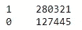

标签计数

查看 0 和 1 的标签计数，注意数据集是不平衡的，其中超过两倍的推文被标记为 1。这将影响模型的性能，因此我们必须在训练模型之前平衡数据集。

此外，我们还可以借助一种称为“潜在狄利克雷分配”的强大 NLP 算法，从每个类别中识别推文的主题，这种算法可以提供负面和正面推文中主题的直觉。稍后，我将在另一篇文章中展示这一点。现在，为了这个练习，让我们使用类别 0 和 1。所以现在，我们已经成功地将我们的问题转化为监督学习问题，接下来我们将继续使用我们现在标记的文本数据来训练深度学习模型。

# 第五步:建模

我们有一个相当大的数据集，有超过 400，000 条推文，超过 60，000 个独特的单词。在如此大的数据集上训练具有多个隐藏层的 rnn 在计算上是繁重的，如果你试图在 CPU 上训练它们，可能需要几天(如果不是几周的话)。训练深度学习模型的一种常见方法是使用 GPU 优化的机器来获得更高的训练性能。在本练习中，我们将使用预装了 TensorFlow 后端和 CUDA 的 Amazon SageMaker p2.xlarge 实例。我们将使用 Keras 接口到张量流。

让我们开始吧，我们将应用以下步骤。

## 培训步骤

1.  对数据集进行标记化、填充和排序
2.  用 SMOTE 平衡数据集
3.  将数据集分成训练集和测试集
4.  训练简单神经网络和 LSTM 模型
5.  评估模型

数据集必须转换成数字格式，因为机器学习算法不理解自然语言。在对数据进行矢量化之前，我们先来看看数据的文本格式。

```
tweets.head()
```

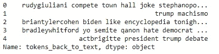

## **5.1 对数据集进行标记化、填充和排序**

```
*# prepare tokenizer* tokenizer = Tokenizer() tokenizer.fit_on_texts(tweets)*# integer encode the documents*
sequences = tokenizer.texts_to_sequences(tweets)*# pad documents to a max length of 14 words* maxlen = 14 X = pad_sequences(sequences, maxlen=maxlen)
```

## 5.2 用 SMOTE 平衡不平衡的数据

```
**from** **imblearn.over_sampling** **import** SMOTE
**from** **imblearn.under_sampling** **import** RandomUnderSampler
**from** **imblearn.pipeline** **import** Pipeline*# define pipeline*
over = SMOTE(sampling_strategy=0.5)
under = RandomUnderSampler(sampling_strategy=0.8)
steps = [('o', over), ('u', under)]
pipeline = Pipeline(steps=steps)*# transform the dataset*
X, y = pipeline.fit_resample(X, labels['label'])*# One-hot encoding of labels*
**from** **keras.utils.np_utils** **import** to_categorical
y = to_categorical(y)
```

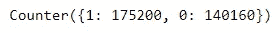

从上面 0 和 1 之间的数据分布可以看出，与以前相比，现在的数据看起来相当平衡。

## 5.3 将数据分为训练集和测试集

既然数据已经平衡，我们就可以将数据分成训练集和测试集了。我将收集 30%的数据集进行测试。

```
# Split the dataset into train and test sets
from sklearn.model_selection import train_test_split
X_train, X_test, y_train, y_test = train_test_split(X, y, test_size=0.3, random_state=43) 
```

## 5.4 培训注册护士

在这一部分，我将向您展示如何实现 RNN 深度学习架构的几个变体，3 层 SimpleRNN 和 3 层 LSTM 架构。默认情况下，SimpleRNN 和 LSTM 图层的激活函数都设置为“tanh ”,所以让我们保留其默认设置。我将使用所有 65，125 个唯一单词作为词汇表的大小，将每个输入的最大长度限制为 14 个单词，因为这与 tweet 中的最大单词长度一致，并将嵌入矩阵的输出维度设置为 32。

**SimpleRNN**

脱落层将用于强制正则化项以控制过度拟合。由于我的数据集被标记为二进制类，我将使用二进制交叉熵作为损失函数。就优化器而言，Adam optimizer 是一个不错的选择，我将准确性作为衡量标准。我将在训练集上运行 10 个时期，其中 70%的训练集将用于训练模型，而剩余的 30%将用于验证。这不能和我们放在一边的测试设备混淆。

```
*# SimpleRNN*
model = Sequential()
model.add(Embedding(input_dim = vocab_size, output_dim = output_dim, input_length = maxlen, embeddings_constraint=maxnorm(3)))
model.add(SimpleRNN(output_dim=output_dim, return_sequences=True, kernel_constraint=maxnorm(3)))
model.add(Dropout(0.2))
model.add(SimpleRNN(output_dim=output_dim, return_sequences=True, kernel_constraint=maxnorm(3)))
model.add(Dropout(0.2))
model.add(SimpleRNN(output_dim=output_dim))
model.add(Dense(2,activation='softmax'))
```

**型号汇总如下:**

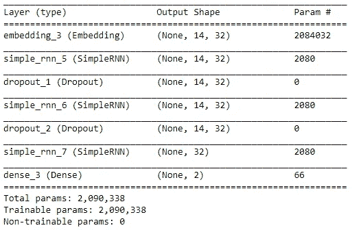

**SimpleRNN 模型结果如下— 10 个历元:**

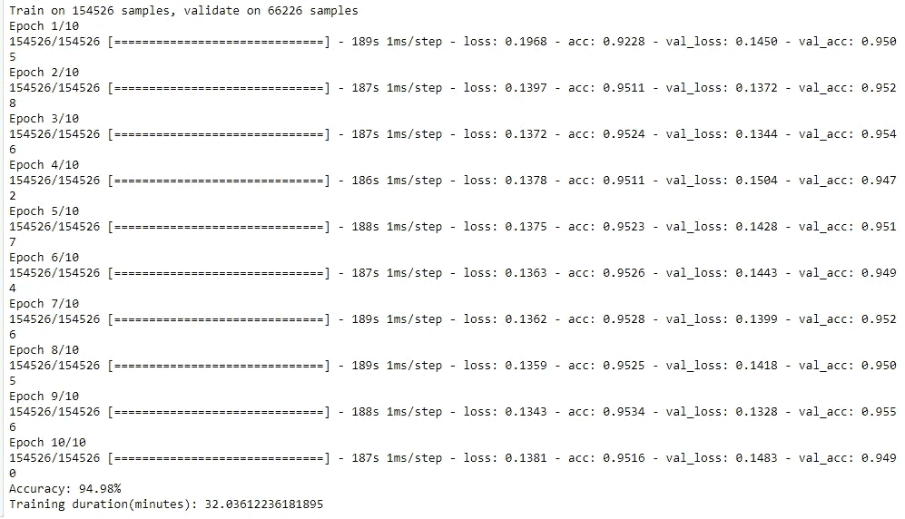

**LSTM**

3 层 LSTM 模型将使用漏失层进行训练。我将在训练集上运行 10 个时期，其中 70%的训练集将用于训练模型，而剩余的 30%将用于验证。这不能和我们放在一边的测试设备混淆。

```
# LSTM
model.add(Embedding(input_dim = vocab_size, output_dim = output_dim, input_length = maxlen, embeddings_constraint=maxnorm(3)))
model.add(LSTM(output_dim=output_dim, return_sequences=True, kernel_constraint=maxnorm(3)))
model.add(Dropout(0.2))
model.add(LSTM(output_dim=output_dim, return_sequences=True, kernel_constraint=maxnorm(3)))
model.add(Dropout(0.2))
model.add(LSTM(output_dim=output_dim, kernel_constraint=maxnorm(3)))
model.add(Dense(2,activation='softmax'))
```

**型号汇总如下:**

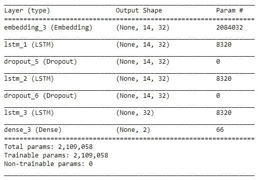

**LSTM 模型结果如下— 10 个历元:**

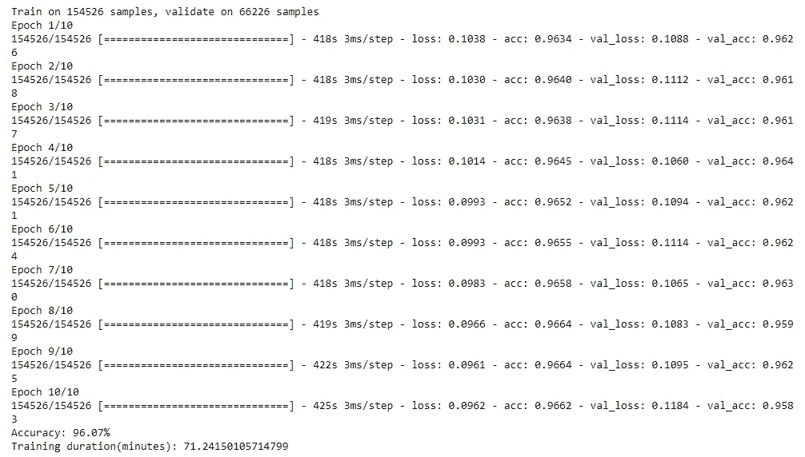

# 第六步:模型评估

现在，让我们绘制模型随时间变化的性能图，并查看它们在 10 个时期的精度和损失。

**简单:精度**

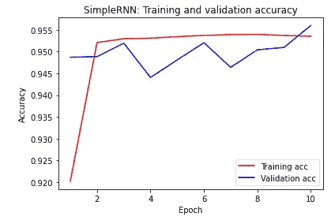

**简单:损失**

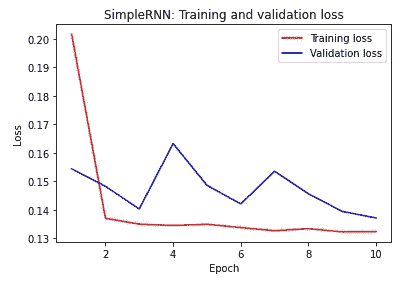

请注意训练精度，SimpleRNN 模型很快开始过度拟合，并且由于相同的原因，验证精度具有很高的方差。

**LSTM:精确度**

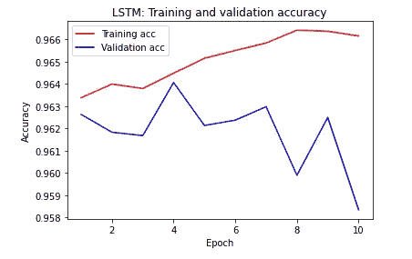

**LSTM:损失**

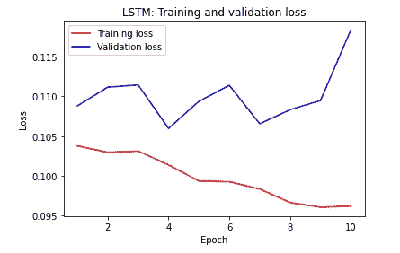

从 LSTM 的精度和损失图来看，模型过度拟合，验证精度不仅方差高，而且由于同样的原因下降很快。

# 结论

在这个项目中，我试图演示如何建立一个深度学习管道，来预测与 2020 年美国大选相关的推文的情绪。为此，我首先通过 Twitter API 和 Tweepy 包抓取原始推文，创建了自己的数据集。

超过 440，000 条推文通过 Twitter API 传输，并存储在一个 CSV 文件中。在争论和可视化数据之后，传统的聚类算法，在这种情况下是 k-means 聚类，被用来给推文贴上两个不同的标签，代表积极或消极的情绪。也就是说，在用数据训练深度学习模型之前，该问题被转换成监督学习问题。然后数据集被分成训练集和测试集。

随后，训练集分别用于训练 SimpleRNN 和 LSTM 模型，并使用每个时期模型性能的损失和精度曲线进行评估。总的来说，这两个模型都表现出应有的性能，并且根据从精度图中看到的情况，可能会过度拟合数据，因此，我为下一步提出以下建议。

## **建议:**

*   找到另一种方法或不同的学习算法来标记数据集
*   尝试亚马逊机械土耳其人或地面真相来标记数据集
*   尝试不同的 RNN 建筑
*   对 RNN 架构执行更高级的超参数调整
*   执行交叉验证
*   使数据成为多类问题

## **本项目/教程中练习的技能:**

1.  如何通过 Tweepy 和 Twitter API 高效地从 Twitter 收集数据
2.  如何有效地处理大型数据集

3.如何构建深度学习架构，编译并适应 Keras

4.如何将基本的自然语言处理概念和技术应用于文本数据

同样，在我的 GitHub [中找到我的带有 Python 代码的 Jupyter 笔记本，在这里](https://github.com/bauyrjanj/NLP-TwitterData)，让我们在 [LinkedIn](https://www.linkedin.com/in/bjenis/) 上连接。

享受深度学习:)我很想听到你的反馈和建议，所以请使用鼓掌按钮或在下面的部分评论。

谢谢大家！

# 在线参考和有用资料:

*   [使用 RNN 和 LSTM 的 NLP](/natural-language-processing-from-basics-to-using-rnn-and-lstm-ef6779e4ae66)
*   [用 LSTM 进行序列分类](https://machinelearningmastery.com/sequence-classification-lstm-recurrent-neural-networks-python-keras/)
*   [了解 LSTM](/understanding-lstm-and-its-quick-implementation-in-keras-for-sentiment-analysis-af410fd85b47)
*   [Gensim 中的单词嵌入](https://machinelearningmastery.com/develop-word-embeddings-python-gensim/)
*   [词汇化方法](https://www.machinelearningplus.com/nlp/lemmatization-examples-python/)