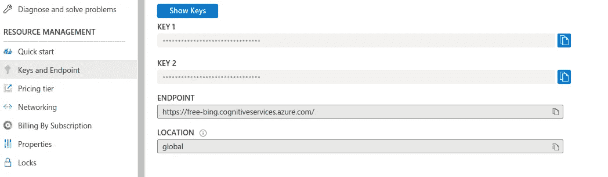
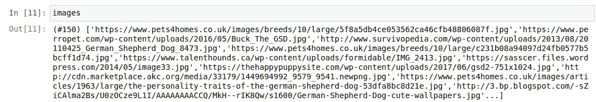
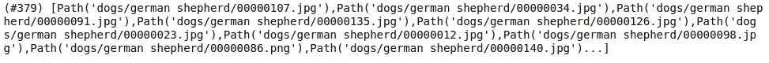
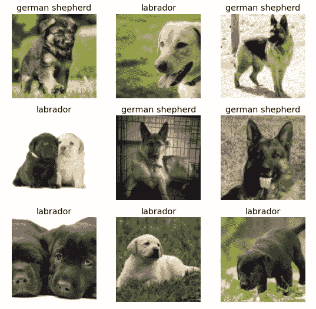
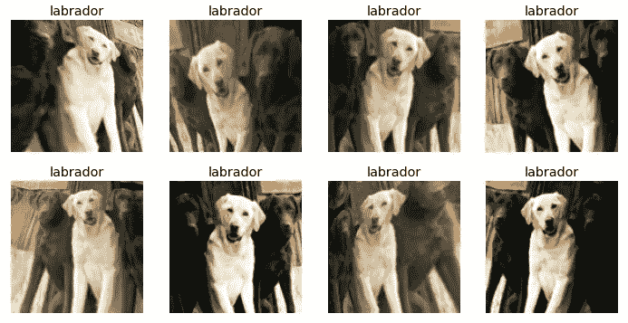
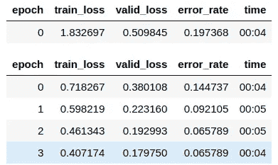
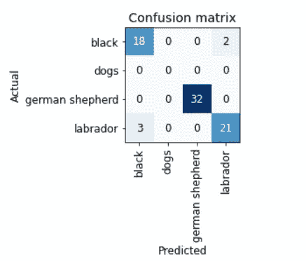
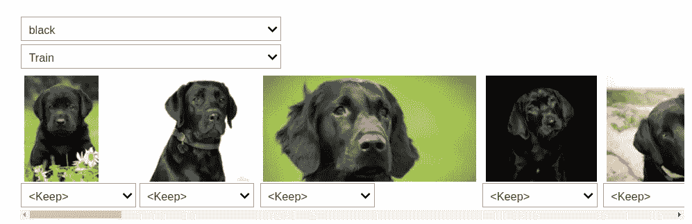
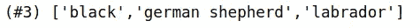

# 用 fastai 构建深度学习项目——从模型训练到部署

> 原文：<https://towardsdatascience.com/deep-learning-projects-with-fastai-from-model-training-to-deployment-2be3135bd757?source=collection_archive---------20----------------------->

## 用 fastai 开发计算机视觉应用的入门指南


[去飞溅](https://unsplash.com/s/photos/neural-network)

深度学习正在引发许多学科的革命性变化。随着 TensorFlow、PyTorch 和现在的 **fastai** 等库的出现，领域专家和人工智能爱好者也越来越容易访问它。

以民主化深度学习为使命， **fastai** 是一家研究机构，致力于帮助每个人，从初级程序员到熟练的深度学习实践者，通过该领域最新研究的最先进模型和技术实现世界级的结果。

# 目标

这篇博文将带你了解使用 **fastai** 开发**狗分类器**的过程。目标是学习如何轻松地开始深度学习模型，并能够使用预先训练的模型，用有限的数据量获得近乎完美的结果。

# 先决条件

开始的唯一先决条件是你**知道如何用 python** 编码，并且你熟悉高中数学。

# 你会学到什么

1.  导入库并设置笔记本
2.  使用 Microsoft Azure 收集影像数据
3.  将下载的数据转换为 DataLoader 对象
4.  数据扩充
5.  使用模型训练清理数据
6.  导出定型模型
7.  用你的 Jupyter 笔记本构建一个应用程序

# 导入库并设置笔记本

在我们开始构建我们的模型之前，我们需要从名为 [fastbook](https://github.com/fastai/fastbook) 的笔记本[集合中导入所需的库和实用函数，该集合旨在介绍使用 fastai 和 PyTorch 的深度学习。](https://github.com/fastai/fastbook)

让我们安装 fastbook 包来设置笔记本:

```
!pip install -Uqq fastbook
import fastbook
fastbook.setup_book()
```

然后，让我们从 fastbook 包和 fastai vision widgets API 导入所有函数和类:

```
from fastbook import *
from fastai.vision.widgets import *
```

# 使用 Microsoft Azure 收集影像数据

对于大多数类型的项目，你可以从各种[数据仓库和网站](/data-repositories-for-almost-every-type-of-data-science-project-7aa2f98128b?source=---------6----------------------------)找到在线数据。为了开发一个狗分类器，我们需要有狗的图像，在互联网上有很多狗的图像。

为了下载这些图片，我们将使用微软 Azure 提供的 [Bing 图片搜索 API](https://azure.microsoft.com/en-us/services/cognitive-services/bing-image-search-api/) 。因此，在 Microsoft Azure 上注册一个免费帐户，您将获得价值 200 美元的点数。

转到您的门户网站，使用[快速入门创建一个新的认知服务资源。](https://docs.microsoft.com/en-us/azure/cognitive-services/cognitive-services-apis-create-account?tabs=multiservice%2Clinux)启用 Bing 图像搜索 API，然后从左侧面板中的`Keys and Endpoint`选项将**键**复制到您的资源中。



使用检索到的密钥，将这些密钥设置为环境，如下所示:

```
key = os.environ.get('AZURE_SEARCH_KEY', '<YOUR_KEY>')
```

现在，fastbook 附带了几个实用函数，如`search_images_bing`，它返回与您的搜索查询相对应的 URL。我们可以使用帮助功能了解这些功能:

```
help(fastbook)
```


您可以查看本帮助指南中的`search_image_bing`功能。该函数接受您在上面定义的资源和搜索查询的关键字，我们可以使用`attrgot`方法访问搜索结果的 URL:

```
results = search_images_bing(key, 'german shepherd dogs')
images = results.attrgot('content_url')
len(images)
```

我们有 150 个德国牧羊犬图片的网址:



现在，我们可以使用`download_url`功能下载这些图像。但是让我们首先定义我们想要的狗的类型。在本教程中，我将和三种类型的狗一起工作，德国牧羊犬、黑狗和拉布拉多。

所以，让我们定义一个狗的类型列表:

```
dog_types = ['german shepherd', 'black', 'labrador']
path = Path('dogs')
```

然后你需要定义你的图片下载的路径，以及每一类狗的文件夹的语义名称。

```
if not path.exists():
    path.mkdir()
    for t in dog_types:
        dest = (path/t)
        print(dest)
        dest.mkdir(exist_ok=True)
        results = search_images_bing(key, '{} dog'.format(t))
        download_images(dest, urls=results.attrgot('content_url'))
```

这将创建一个“狗”目录，其中进一步包含每种类型的狗图像的 3 个目录。

之后，我们传递了搜索查询(也就是 dog_type)和搜索函数的键，然后是下载函数，从搜索结果中下载所有的 URL 到它们各自的目的地(`dest`)目录中。

我们可以使用`get_image_file`功能检查下载到某个路径的图像:

```
files = get_image_files(path)
files
```



## 验证图像

您还可以检查文件中损坏文件/图像的数量:

```
corrupt = verify_images(files)
corrupt##output: (#0) []
```

通过将 unlink 方法映射到损坏文件列表，可以删除所有损坏的文件(如果有):

```
corrupt.map(Path.unlink);
```

就这样，我们准备了 379 张狗的图片来训练和验证我们的模型。

# 将下载的数据转换为 DataLoader 对象

现在，我们需要一种机制来为我们的模型提供数据，fastai 有数据加载器的概念，它存储传递给它的多个数据加载器对象，并使它们作为`training`和`validation`集合可用。

现在，要将下载的数据转换成 DataLoader 对象，我们必须提供四样东西:

*   我们正在处理什么样的数据
*   如何获取项目列表
*   如何给这些物品贴标签
*   如何创建验证集

现在，为了创建这些数据加载器对象以及上面提到的信息，fastai 提供了一个称为 ***数据块 API 的灵活系统。*** 我们可以使用 API 提供的参数和一系列转换方法来指定数据加载器创建的所有细节:

```
dogs = DataBlock(
        blocks=(ImageBlock, CategoryBlock),
        get_items=get_image_files,
        splitter=RandomSplitter(valid_pct=0.2, seed=41),
        get_y=parent_label,
        item_tfms=Resize(128)
        )
```

这里，我们有一堆我们应该理解的论点:

*   **块** —指定特征变量(图像)和目标变量(每个图像的类别)
*   **get_items** —检索底层项目，在我们的例子中是图像，我们有`**get_image_files**`函数返回该路径中所有图像的列表。
*   **拆分器** —按照提供的方法拆分数据；我们使用随机分割，为验证集保留 20%的数据，并指定种子在每次运行时得到相同的分割。
*   **get_y —** 目标变量称为 y；为了创建标签，我们使用了`**parent_label**`函数，它获取文件所在文件夹的名称作为标签。
*   **item_tfms** —我们有不同大小的图像，这导致了一个问题，因为我们总是向模型发送一批文件，而不是单个文件；因此，我们需要对这些图像进行预处理，将它们调整到标准大小，然后将它们分组到一个张量中以通过模型。我们在这里使用了`**Resize**`转换。

现在，我们有了 DataBlock 对象，需要通过提供数据集的路径将它转换为 DataLoader:

```
dls = dogs.dataloaders(path)
```

然后，我们可以使用`show_batch`方法检查 dataloader 对象中的图像:

```
dls.valid.show_batch()
```



# 数据扩充

我们可以向这些图像添加变换，以创建输入图像的随机变化，这样它们看起来不同，但仍然代表相同的事实。

我们可以旋转、扭曲、翻转或改变图像的亮度/对比度来创造这些变化。我们也有一套标准的增强功能封装在`aug_transforms`函数中，对于大多数计算机视觉数据集来说都非常适用。

我们现在可以将这些变换应用于整批图像，因为所有图像都具有相同的大小(224 像素，图像分类问题的标准)，现在使用如下:

```
##adding item transformationsdogs = dogs.new(
                item_tfms=RandomResizedCrop(224, min_scale=0.5), 
                batch_tfms=aug_transforms(mult=2)
               )
dls = dogs.dataloaders(path)
dls.train.show_batch(max_n=8, nrows=2, unique=True)
```



# 模型训练和数据清理

是时候用这些数量有限的图片来训练模型了。fastai 提供了许多可供使用的架构，这使得使用迁移学习变得非常容易。我们可以使用适用于大多数应用程序/数据集的预训练模型来创建卷积神经网络(CNN)模型。

我们将使用 ResNet 架构，它对于许多数据集和问题来说既快速又准确。`**resnet18**`中的 18 代表神经网络的层数。我们还使用来自数据加载器的验证集传递度量来测量模型预测的质量。我们使用 **error_rate** 来说明模型做出错误预测的频率:

```
model = cnn_learner(dls, resnet18, metrics=error_rate)
model.fine_tune(4)
```

`fine_tune`方法类似于其他 ML 库中的`fit()`方法。现在，为了训练模型，我们需要指定我们想要在每个图像上训练模型的次数(时期)。

这里，我们只训练 4 个时期:



我们还可以使用混淆矩阵将预测可视化并与实际标签进行比较:

```
interp = ClassificationInterpretation.from_learner(learn)
interp.plot_confusion_matrix()
```



如你所见，我们只有五个不正确的预测。让我们检查一下最大损失，即数据集中损失最大的图像:

```
interp.plot_top_losses(6, nrows=3)
```


你可以看到模型混淆了黑色和拉布拉多。因此，我们可以使用 ImageClassifierCleaner 类将这些图像指定到特定的类别中。

将模型传递给班级，它将打开一个带有直观 GUI 的小部件，用于数据清理。我们可以更改训练集和验证集图像的标签，并查看损失最大的图像。



在将每个图像添加到它们各自正确的类后，我们必须使用以下命令将它们移动到正确的目录:

```
for idx,cat in cleaner.change():
    shutil.move(str(cleaner.fns[idx]), str(path/cat).split('.')[0] +"_fixed.jpg")
```

# 导出定型模型

在几轮超参数调整之后，一旦您对您的模型满意了，您就需要保存它，以便我们可以将它部署到服务器上用于生产。

当保存一个模型时，我们拥有对我们有价值的模型架构和训练参数。fastai 提供了用扩展名`.pkl`将模型保存在 pickle 文件中的`export()`方法。

```
model.export()
path = Path()
path.ls(file_exts='.pkl')
```

然后，我们可以加载模型，并通过向加载的模型传递图像来进行推断:

```
model_inf = load_learner(path/'export.pkl')
```

使用这个加载的模型进行推理:

```
model_inf.predict('dogs/labrador/00000000.jpg')
```


我们可以从模型数据加载器词汇表中检查标签:

```
model_inf.dls.vocab
```



# 用你的 Jupyter 笔记本构建一个应用程序

下一步是创建一个我们可以与朋友、同事、招聘人员等分享的应用程序。要创建一个应用程序，我们需要添加交互式元素，以便我们可以尝试和测试应用程序的功能，我们需要将它作为一个网页在 web 上提供，包括通过一些框架(如 flask)或简单地使用 Voila 来部署它。

你可以简单地使用 Voila 将这个 Jupyter 笔记本转换成一个独立的应用程序。我在这里没有涉及到它，但是你可以通过我的博客/视频完整地了解它。

[](/building-covid-19-analysis-dashboard-using-python-and-voila-ee091f65dcbb) [## 使用 Python 和 Voila 构建新冠肺炎分析仪表板

### 用你的 jupyter 笔记本创建一个具有交互式可视化和灵活性的仪表板。

towardsdatascience.com](/building-covid-19-analysis-dashboard-using-python-and-voila-ee091f65dcbb) 

## 部署

我已经在我的文章中介绍了 ML 模型的部署:

[](/deploying-a-trained-ml-model-using-flask-541520b3cbe9) [## 使用 Flask 部署已训练的 ML 模型

### 端到端 ML 项目教程系列的第 2 部分

towardsdatascience.com](/deploying-a-trained-ml-model-using-flask-541520b3cbe9) 

但是如果你想要另一种简单自由的方式来部署你的 Voila 应用程序，你可以使用 [Binder](https://mybinder.org/) 。按照以下步骤在 Binder 上部署应用程序:

1.  将你的笔记本添加到一个 [GitHub 库](http://github.com/)。
2.  将该回购的 URL 插入活页夹的 URL 字段。
3.  将文件下拉列表改为选择 URL。
4.  在“要打开的 URL”字段中，输入`/voila/render/<*name>*.ipynb`
5.  单击右下角的剪贴板按钮复制 URL 并粘贴到安全的地方。
6.  单击启动。

这就对了，你的狗分类器是活的！

如果你喜欢看我执行所有这些步骤，这里有这个博客的视频版本:

# [数据科学与 Harshit](https://www.youtube.com/c/DataSciencewithHarshit?sub_confirmation=1)

通过这个渠道，我计划推出几个覆盖整个数据科学领域的[系列](/hitchhikers-guide-to-learning-data-science-2cc3d963b1a2?source=---------8------------------)。以下是你应该订阅[频道](https://www.youtube.com/channel/UCH-xwLTKQaABNs2QmGxK2bQ)的原因:

*   这些系列将涵盖每个主题和子主题的所有必需/要求的高质量教程，如[数据科学的 Python 基础](/python-fundamentals-for-data-science-6c7f9901e1c8?source=---------5------------------)。
*   解释了为什么我们在 ML 和深度学习中这样做的数学和推导。
*   [与谷歌、微软、亚马逊等公司的数据科学家和工程师以及大数据驱动型公司的首席执行官的播客](https://www.youtube.com/watch?v=a2pkZCleJwM&t=2s)。
*   [项目和说明](/building-covid-19-analysis-dashboard-using-python-and-voila-ee091f65dcbb?source=---------2------------------)实施到目前为止所学的主题。了解新的认证、训练营以及破解这些认证的资源，如谷歌的 [**TensorFlow 开发者证书考试。**](https://youtu.be/yapSsspJzAw)

请随时在 [Twitter](https://twitter.com/tyagi_harshit24) 或 [LinkedIn](https://www.linkedin.com/in/tyagiharshit/) 上与我联系。