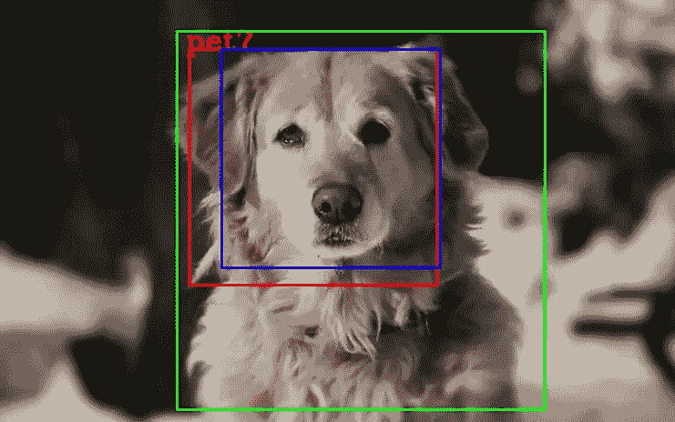
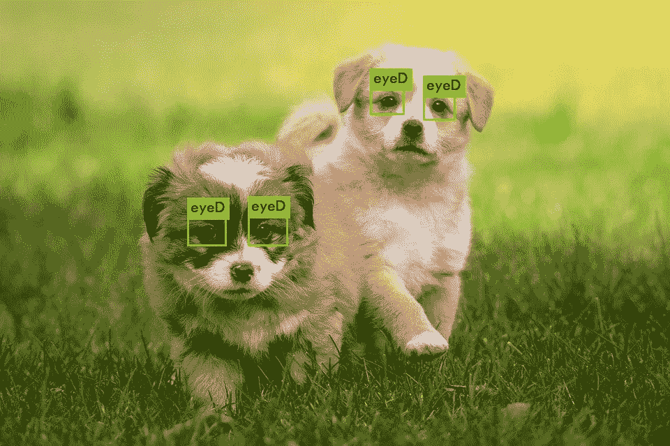
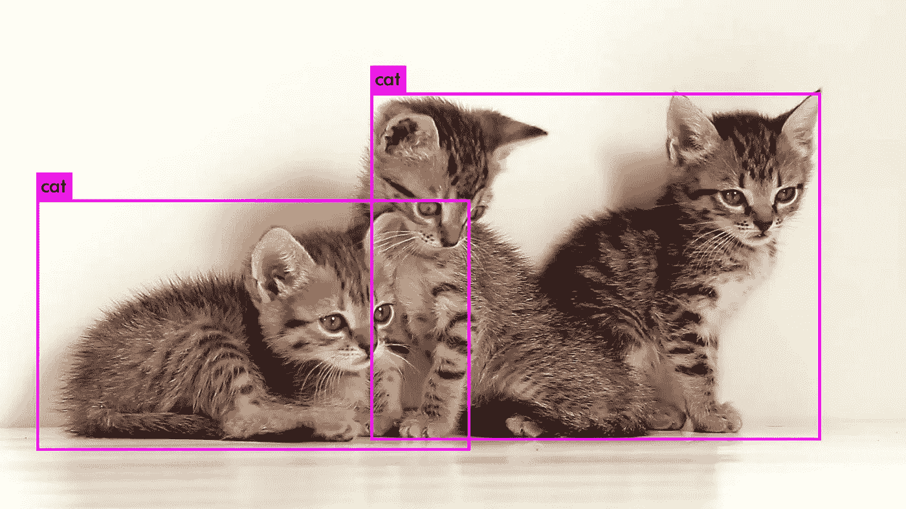
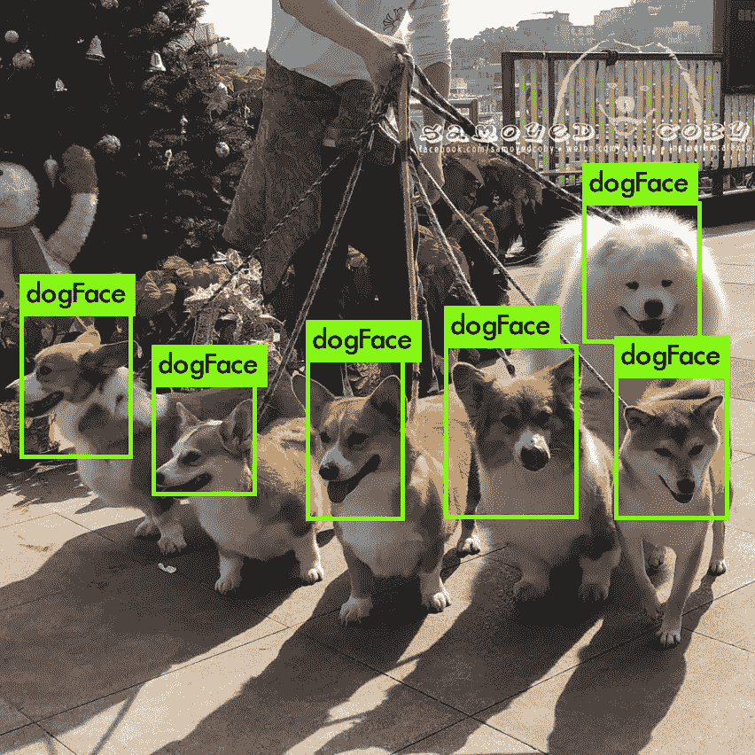
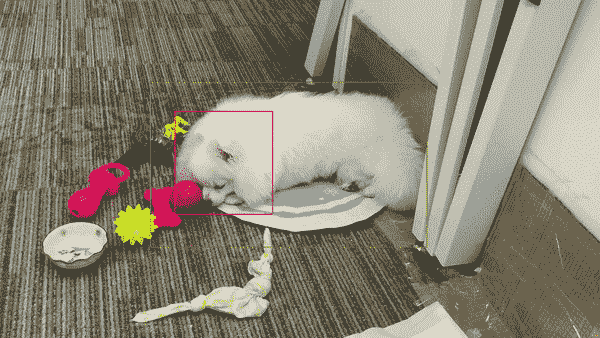

# 深度学习:认识你家的宠物！

> 原文：<https://towardsdatascience.com/deep-learning-recognise-your-home-pets-82a35d524703?source=collection_archive---------46----------------------->

## 深度学习对象检测

## 想知道宠物的面部识别是如何工作的吗？手机解锁？我会用一种你们也能认出自己宠物的方式来展示这个项目。



(权利:自己的形象)

检查我的 GitHub 库中的[源代码](https://github.com/miki998/pet_recognition)。如果遇到任何问题，请给我发电子邮件。

[](https://github.com/miki998) [## miki998 -概述

### 在 GitHub 上注册你自己的个人资料，这是托管代码、管理项目和构建软件的最佳地方…

github.com](https://github.com/miki998) 

## 路标

下面是本文的路线图:

**1】简介**

**2】演示和使用的前提条件**

**3]示例和结果**

**4】未来的改进**

开始了。

## 1]简介

如果您不熟悉对象检测，请查看我最近写的一篇关于 Yolo 架构的文章，尽管在那里谈到了 yolov4，在这里使用了 yolov3，但主要概念仍然存在。

[](https://medium.com/analytics-vidhya/faster-real-time-object-detection-yolov4-in-pytorch-6eef8436ba75) [## 更快的实时物体检测:Pytorch 中的 YoloV4

### 我发现我可爱的猫比以前更快了！

medium.com](https://medium.com/analytics-vidhya/faster-real-time-object-detection-yolov4-in-pytorch-6eef8436ba75) 

## 2]演示和使用的先决条件

系统先决条件与我的 Github 库中的相同。所以继续克隆我的库吧。

```
git clone [https://github.com/miki998/pet_recognition](https://github.com/miki998/pet_recognition)
```

一旦你完成了下载，你将不得不获得一些额外的文件，不幸的是，由于其大小，我不能上传到 git。你要问我，我会通过谷歌驱动器与你分享链接。

将它们放在下面的文件夹**中。/暗/重**。仔细检查你是否符合所有要求，(requirements.txt)。好了，你现在可以走了。

**标准运行**

假设所有的，如果一切都按顺序，你只需要把你想让模型记住/认出的宠物的图像放进去。然后

```
python3 train.py -<arguments>
```

当你简单地运行 python3 train.py 时，参数将被解释。

如果你想添加更多的宠物(如猫或狗)让模型识别，那么就分别训练它们，并以递增的方式(也就是说，一个接一个，你可以添加同一宠物的多个图像)

认出一只宠物

```
python3 recog.py -<arguments>
```

当你简单地运行 python3 train.py 时，参数将被解释。

**Docker 容器运行(首选方法)**

这些命令与前面的命令类似，只需在开始之前执行以下操作(使用您应该预先构建的映像启动一个容器，您可以在存储库中的 README.md 中找到相关说明)

```
docker run -it -p 9999 --ipc=host <docker-image-name>
```

注意<docker-image-name>是您在构建映像时给它起的名字。</docker-image-name>

## 3]示例和结果

首先，我们支持的两种宠物(猫和狗)的不同训练检测的一批例子

我们有**眼睛检测:**



(自己的形象)

**身体检测:**



(自己的形象)

**人脸检测:**



(自己的形象)

在对 7 种不同的宠物进行识别模型训练(即 lbph 特征创建和存储)后(我们没有测试出识别的极限，请注意，我们在相似的环境中测试了所有宠物),以下是我的首选宠物！



(自己创建的 gif)

## 4]未来的改进

我们对有限的一组宠物进行了“某种”实时识别(因为我们将它用于家庭宠物的产品上，这显然限制了我们需要识别的宠物的范围)，通过一些实时技巧，包括不从视频中捕捉所有时间的图像或降低分辨率或使用功率过大的芯片(我不负责这一部分)。我们仍在尝试改进识别部分，因为在数量上有明显的限制(权重的大小至少与宠物的数量成线性增加)，涉及自动人脸标志的其他特征加上大规模微分同胚注册可以帮助标准化人脸，并且找到其他特征也可以有所帮助(即行为，因为我们有身体检测)。在检测部分，可以做大量的事情，例如，用 EfficientDet 和 TensorRT 进行替换，当我们进行第一次人体检测时，通过图像分割进行并行化。

**结论**

感谢您的阅读，如果您喜欢或发现这篇文章有用，请在 medium 和 GitHub 上关注我的更多项目。

[](https://medium.com/@michaelchan_2146) [## 陈宸-中等

### 阅读媒体上的陈宸作品。数据驱动投资者主网站作家数学和计算机科学理学士…

medium.com](https://medium.com/@michaelchan_2146)