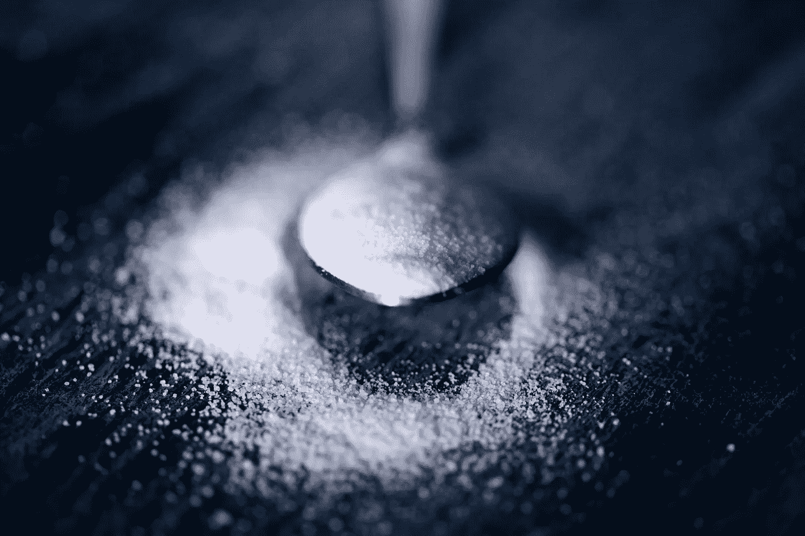
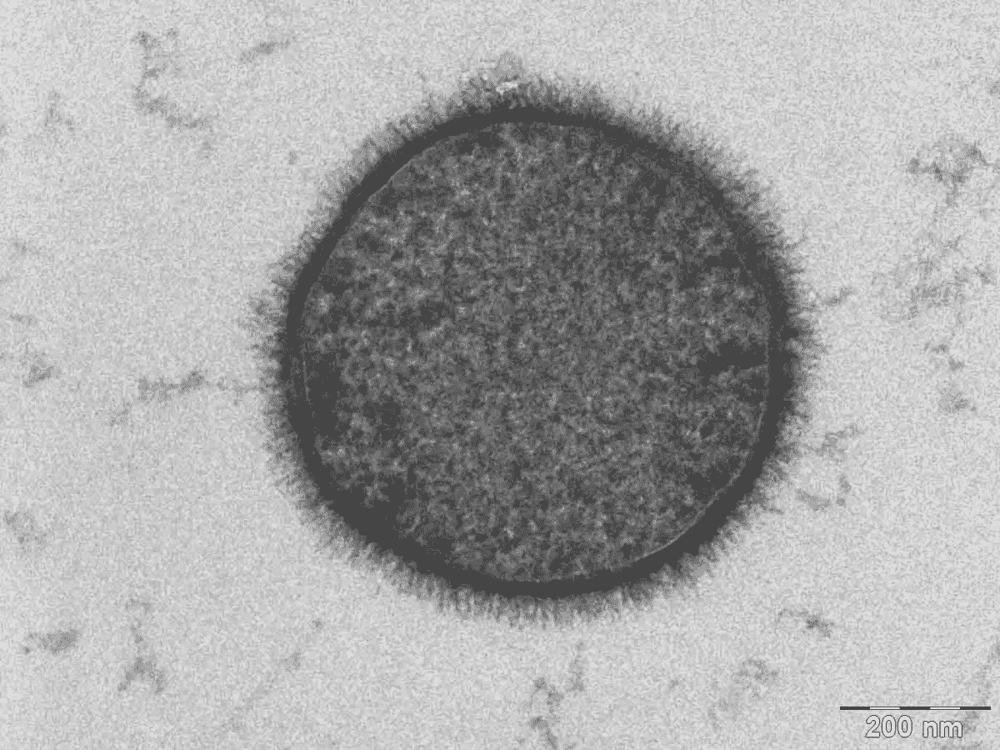
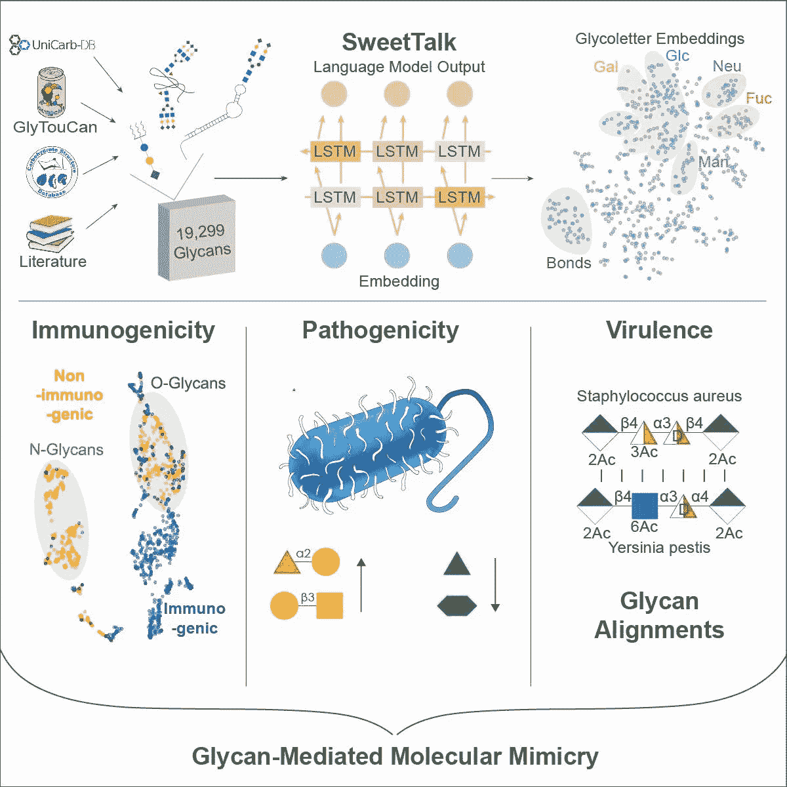
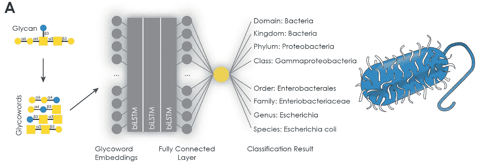
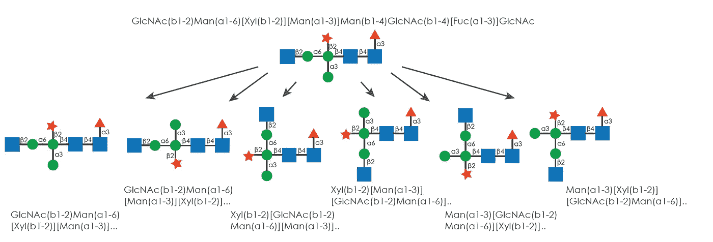

# 用于研究聚糖介导的宿主-微生物相互作用的深度学习资源

> 原文：<https://towardsdatascience.com/deep-learning-resources-for-studying-glycan-mediated-host-microbe-interactions-ab11b8621f4b?source=collection_archive---------55----------------------->

## 一个关于糖、细菌和人类健康的故事

莎伦·麦卡琴在 [Unsplash](https://unsplash.com/s/photos/sugar?utm_source=unsplash&utm_medium=referral&utm_content=creditCopyText) 上的照片

生物学家非常熟悉 DNA、RNA 和蛋白质——正如我们所知，这三种生物序列使生命成为可能。不太熟悉的(尽管至少同样重要)是多聚糖或复杂碳水化合物。这些各种糖(或技术上称为单糖)的链可以单独存在，例如构成细菌、真菌以及植物细胞的荚膜，或者修饰各种其他生物分子，如蛋白质、脂质或 RNA。与蛋白质物理连接的特定聚糖序列从根本上改变了蛋白质的性质和功能，微调了稳定性、结构和功能。这导致了令人难以置信的复杂相互作用的混杂，进而产生了我们所知的极其复杂的现象，即生命。它确实非常复杂，因为聚糖拥有数百种单糖，相比之下，蛋白质只有区区 20 个氨基酸，DNA 只有 4 个核苷酸。

此外，聚糖不仅是唯一的非线性生物序列(导致分子具有多个分支)，而且是唯一的非模板序列，是通过密切依赖于细胞当前状态的几十种专门酶的相互作用而产生的。所有这些使聚糖成为最多样化的生物序列，也是最动态的序列，能够在没有基因突变的情况下即时调整序列。最重要的是，从炎症到癌症，多聚糖与基本上所有人类疾病都有关联[。因此，鉴于这一切，你会认为一个名副其实的研究大军将致力于解开聚糖在生物学各个方面的作用，对吗？结果……不完全是这样。](https://www.nature.com/articles/nrd1751)

这是细胞实际上看起来的样子…被聚糖覆盖着。

虽然有一个名为“糖生物学”的研究领域，但与它们的相关性相比，聚糖在生命科学中的突出地位仍然微不足道。尽管深度学习最近彻底改变了对其他复杂生物序列的分析，如[蛋白质](https://www.biorxiv.org/content/10.1101/2020.03.07.982272v2)或 [RNA](https://www.nature.com/articles/s41467-020-18676-2) ，但聚糖迄今仍未被机器学习所捕获。其原因主要在于它们的非线性，这阻止了为线性序列开发的标准自然语言处理工具的应用。然而，我们相信，作为最多样和最复杂的生物聚合物，多聚糖将从最先进的深度学习技术中受益最多，这些技术最终可以促进从序列到功能的映射，并允许对糖生物学采取全面的方法。这就是为什么在我们[最近发表在杂志*细胞宿主&微生物*上的工作](https://www.sciencedirect.com/science/article/pii/S193131282030562X)中，我们开发了第一个多聚糖的语言模型，我们称之为 SweetTalk。

我们工作的概述。doi:[10.1016/j . chom . 2020 . 10 . 004](https://doi.org/10.1016/j.chom.2020.10.004)

当然，在此之前，我们必须收集数据。我们收集了尽可能多的聚糖序列，并将所有 19，299 个聚糖序列收集在我们自己的数据库 [SugarBase](https://webapps.wyss.harvard.edu/sugarbase/) 中。当时，SweetTalk 由一个具有长短期记忆(LSTM)单元的双向递归神经网络(RNN)组成。基本上，我们训练 SweetTalk 通过预测前面给出的糖链中的下一个单糖或键(我们定义为糖链)来学习糖链中的序列依赖性。这为我们提供了一个训练有素的多聚糖语言模型，以及我们可以用于可视化目的的每个乙醇字母的学习表示。为了避免聚糖序列的非线性性质，我们通过从聚糖序列中提取“糖字”来处理序列，聚糖序列是由五个字母组成的集合，为 SweetTalk 提供了学习正确的字母之间的上下文关系的机会。在[的论文](https://www.sciencedirect.com/science/article/pii/S193131282030562X)和[相关的](https://www.biorxiv.org/content/10.1101/2020.01.10.902114v1) [预印本](https://www.biorxiv.org/content/10.1101/2020.04.08.031948v1?rss=1)中，我们对学习到的聚糖表达进行了大量分析，并开发了聚糖比对算法，但我想在这里重点介绍我们的分类器，所以如果你想了解更多关于聚糖嵌入的信息，请随意阅读论文。

由于我们肠道的整个内层都覆盖着聚糖(粘液中的粘蛋白)，每个细胞表面也都覆盖着聚糖(包括肠道细菌)，我们推断，我们的微生物组(或病原体)和我们之间的相互作用可能为我们的方法提供了一个有前途的应用领域。这一点尤其重要，因为研究表明，一些细菌[模仿](https://europepmc.org/article/NBK/nbk453034)我们的聚糖来欺骗我们的免疫系统。因此，我们想看看我们能否预测特定的聚糖是否会被人类免疫系统识别。为此，我们在标记了免疫原性的聚糖的较小数据集上微调了我们预先训练的 SweetTalk 模型，并实现了超过 90%的准确率，优于随机森林等其他机器学习方法。这项分析支持了分子模拟的概念，与人类聚糖相似的细菌聚糖具有较低的免疫原性得分。我们还成功训练了准确率接近 90%的分类器，用于纯粹根据聚糖预测常见细菌*大肠杆菌*菌株的致病性，这清楚地支持了我们的假设，即聚糖可以提供致病性等特性的信息。重要的是，我们甚至可以识别出似乎最能预测致病性的序列基序，再次强烈地指向聚糖的分子模拟。我们做的另一个有趣的观察是，尽管使用了致病性的二元标签，我们的模型预测了致病性的连续性，反映了致病性对环境条件的依赖性，并支持[早期关于这一现象的报道](https://msphere.asm.org/content/2/1/e00015-17.short)。

我们的基准任务&模型 SweetOrigins。doi:[10.1016/j . chom . 2020 . 10 . 004](https://doi.org/10.1016/j.chom.2020.10.004)

最后，我们解决了与高维数的聚糖序列相比缺乏数据的紧迫问题。虽然我们使用无监督语言模型的迁移学习方案已经改善了模型结果，但我们开始设计一种数据增强方案，以进一步提高以聚糖为中心的机器学习的效率。为此，我们设计了一个多类基准问题，我们称之为 SweetOrigins:预测给定聚糖序列来自哪个分类组。这代表了一系列的困难，从预测四个分类领域中的一个到预测成百上千个物种中的一个。对于我们的数据扩充方法，我们利用了众所周知的用于聚糖序列的模糊符号，括号表示分支。这个明显的缺点允许我们为同一聚糖分子制定不同的括号符号字符串，有效地扩大了我们的序列数量。这使得我们的模型更加健壮，并且确实在我们的基准测试任务中显著提高了性能，对于最困难的任务，绝对精度提高了 6%。

以聚糖为中心的机器学习的数据扩充。doi:[10.1016/j . chom . 2020 . 10 . 004](https://doi.org/10.1016/j.chom.2020.10.004)

我们预计，我们开发的基准任务可以用于继续改善以聚糖为中心的机器学习，以解决聚糖在其中发挥重要作用的大量潜在应用。类似于以蛋白质为重点的机器学习对蛋白质工程和全新设计蛋白质的设计的影响，我们相信，以聚糖为重点的机器学习可以在不久的将来以类似的效果提升糖工程。

如果你想了解更多，这里有[论文](https://www.sciencedirect.com/science/article/pii/S193131282030562X)和[相关](https://www.biorxiv.org/content/10.1101/2020.01.10.902114v1) [预印本](https://www.biorxiv.org/content/10.1101/2020.04.08.031948v1?rss=1)的链接。此外，这里有一些易于理解的新闻文章，介绍哈佛大学 Wyss 生物工程研究所和 Branco Weiss Fellowship-Society in Science 项目的工作。当然，这里是 GitHub 上的[代码](https://github.com/midas-wyss/sweetorigins)和我们在 [SugarBase](https://webapps.wyss.harvard.edu/sugarbase/) 上的数据。如果您对以聚糖为中心的机器学习感兴趣，请随时联系我们！