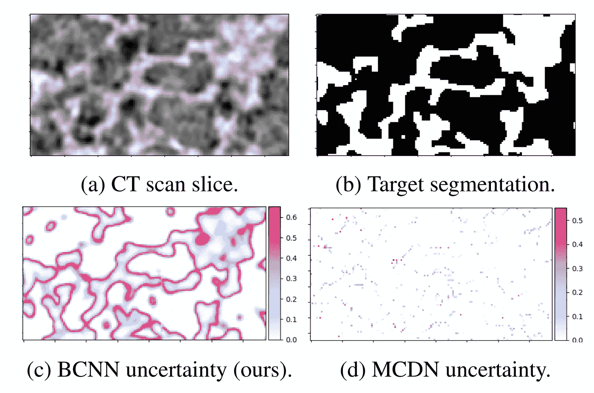
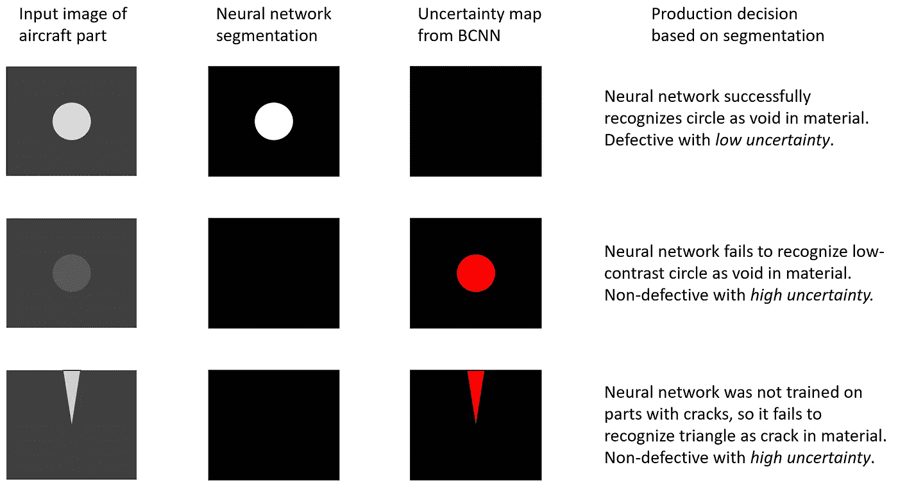
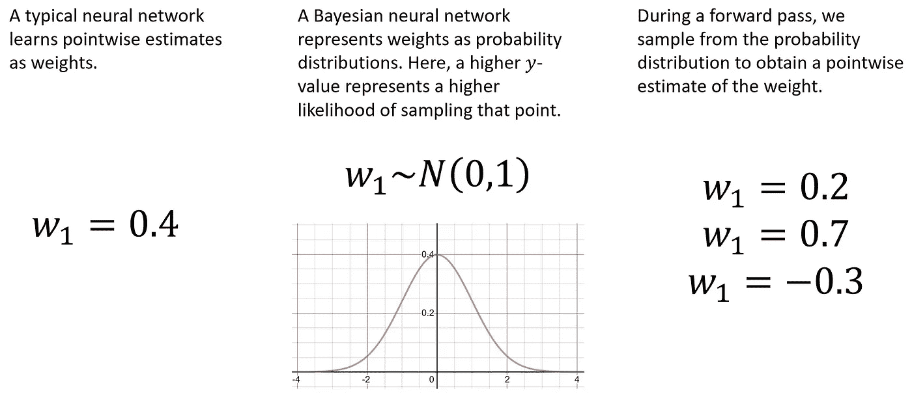
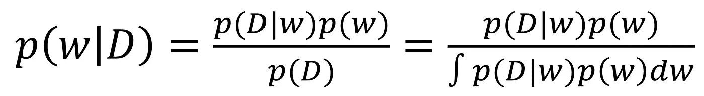
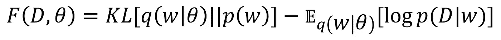
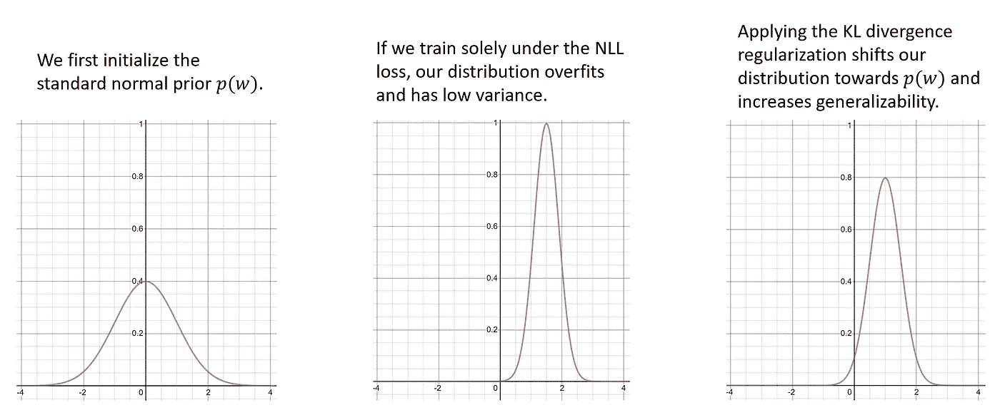
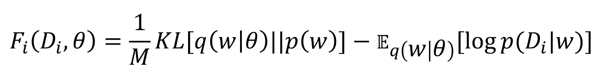
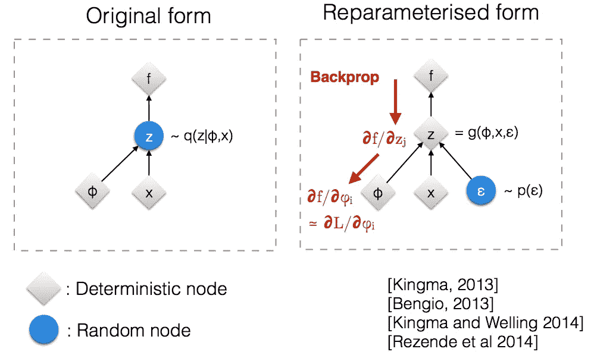
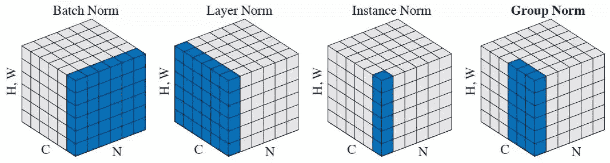
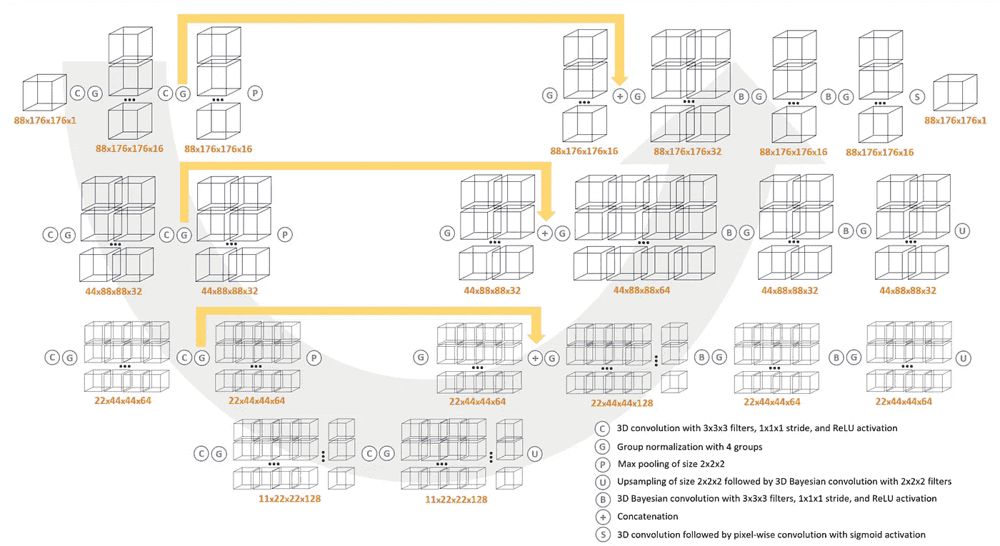

# 基于三维贝叶斯卷积神经网络的不确定性深度学习分割

> 原文：<https://towardsdatascience.com/deep-learning-segmentation-with-uncertainty-via-3d-bayesian-convolutional-neural-networks-6b1c7277b078?source=collection_archive---------25----------------------->

## 神经网络如何学习概率分布来量化其预测中的不确定性？



我们的贝叶斯卷积神经网络(BCNN)在材料数据集的不确定性量化方面击败了以前的最先进的结果。请注意，BCNN 不确定性地图捕捉连续性和视觉梯度，而 MCDN 不确定性地图是像素化和不可解释的。

**论文:**【https://arxiv.org/abs/1910.10793】T2

【https://github.com/sandialabs/bcnn】代号:

**关键要点:**

测量不确定性在常规的深度神经网络中是不可能的，但是对于可解释性和有效性是极其重要的

贝叶斯神经网络学习概率分布而不是点估计，允许它们测量不确定性

我们为 3D 分割设计了第一个成功的贝叶斯卷积神经网络(BCNN)架构

我们的 BCNN 在不确定性量化方面击败了当前最先进的神经网络，同时实现了相同或更好的分割精度

我们的学术论文和完整的开源代码实现可在线获得

# **简介**

C 考虑这个场景:某飞机制造公司为商用飞机生产安全关键的发动机零件。由于必须保证发动机零件能够工作，该公司在长达数月的艰苦过程中验证了每一个零件，他们对零件进行 3D CT 扫描，手工注释数亿个体素，并使用注释扫描来分析零件的缺陷。


丹尼尔·埃勒杜特在 [Unsplash](https://unsplash.com?utm_source=medium&utm_medium=referral) 上拍摄的照片

这既不省时也不划算，因此该公司雇佣了一个数据科学家团队来设计一个深度神经网络，该网络使用最先进的体积分割技术自动验证零件。神经网络看似成功，但有一天由神经网络验证的零件在使用过程中莫名其妙地出现故障，导致飞机发动机故障，并导致数百人死亡和公司数十亿美元的损失。

那么是哪里出了问题呢？嗯，深度神经网络以做出准确的预测而闻名，但它们最大的弱点之一是缺乏测量预测中不确定性的能力。因此，深度学习系统没有能力区分 100%认证的部分和勉强合格的部分。

人们可能认为 sigmoid 输出的值可用作不确定性的度量，但这不是真的，因为这些值取决于推断样本是否“接近”训练分布。如果根据远离训练分布的样本(即，其中有缺陷的零件)进行推断，则 sigmoid 输出不能用作模型不确定性的代理。

换句话说，当测试集与训练集“相似”时，深度神经网络的性能最佳；换句话说，测试集中可能存在神经网络不确定的示例，因为没有类似的训练示例。但由于没有“我不知道”的输出可用，有缺陷的零件最终可能会被深度学习系统验证并转移到生产中。



图像分割如何在实践中导致不良预测，以及贝叶斯神经网络生成的不确定性图的分析如何有助于决策。

这个例子说明了深度神经网络中不确定性量化的至关重要性，其研究和开发在过去五年中飞速发展。最近的技术铸造神经网络，通常逐点估计，作为概率或贝叶斯模型。用于此目的的两种最常见的神经网络架构是蒙特卡洛漏失网络(MCDNs)和贝叶斯卷积神经网络(BCNNs)。

mcdns 使用漏失层来近似深高斯过程，虽然易于实现，但是它们的统计可靠性已经被称为 question⁹.BCNNs 使用变分推理来学习给定数据集的权重的后验分布，并且更加难以实现，但是给出了大大改善的不确定性结果。

已经假定，用于大问题的贝叶斯神经网络，包括在 3D 图像分割空间中，由于过高的计算成本而不可行。在这里，我们反驳了这种说法，并首次成功实现了用于体积分割中不确定性量化的 3D BCNN，详细说明了它是如何工作的，并解释了开源代码库的一些部分。

特别地，与 MCDNs 相比，这种新颖的神经网络架构提供了改进的不确定性量化，同时实现了相等或更好的分割精度。通过对电池电极和激光焊接金属的 CT 扫描的实验，我们表明由 BCNN 产生的不确定性图捕获连续性和视觉梯度，使它们可解释为分割的置信区间。

# **BCNN 概况**

虽然大多数神经网络学习其权重的逐点估计，但更严格的观点是，这些估计并没有完全包含权重值中固有的不确定性。相反，在 BCNN 中，每个权重都被隐式描述为(多元)概率分布。



典型与贝叶斯神经网络中的权重表示

将神经网络的权重描述为概率分布有几个结果。首先，它使神经网络具有不确定性；每次我们计算向前传递时，我们必须从每个重量分布中取样，以获得可用于推断的点估计。重复应用这种抽样技术，称为蒙特卡罗抽样，将产生不同的预测，然后可以分析不确定性。第二，它改变了反向传播算法，因为我们不能通过采样操作反向传播(它没有梯度)。在后面的部分中，我们将讨论如何使用 Bayes by Backprop 算法来解决这个问题。最后，这使得神经网络更加难以可靠地训练，尤其是在 3D 中，并且容易受到消失/爆炸梯度的影响。我们使用一种称为组规范化的巧妙的规范化技术来解决这个问题，这也将在后面的部分中详细介绍。

# **贝叶斯学习**

我们如何准确地得到权重的分布？嗯，在一个完美的世界里，我们可以用贝叶斯法则精确地计算它们。为此，我们将从权重的先验分布开始；这是我们对体重分布的“初步猜测”。表示为 *p(w)* ，一般为标准正态分布。然后，我们将使用我们的数据来计算给定数据集的权重的后验分布，表示为 *p(w|D)* 。这相当于找到一个 *w* ，它在给定这些权重的情况下最大化数据集的可能性，表示为 *p(D|w)* ，我们可以通过贝叶斯规则来执行此计算:



然而，由于在神经网络中发现的极端过度参数化，分母中的积分通常是难以处理的。所以，我们需要*学习*后验分布，而不是精确地计算它。辛顿、范·camp⁵和 Graves⁴之前的工作提出了*变分学习*(也称为变分推断)作为一种近似后验分布的方法。变分学习通过变分自由能代价函数 *F* 的最小化，找到分布 *p(w|θ)* 的参数 *θ* ，称为变分分布，通常称为期望下界(ELBO)。

变分自由能由 Kullback-Leibler (KL)散度和负对数似然性之和组成，前者衡量先验分布和变分分布之间的距离，后者衡量模型的拟合优度。布伦德尔*等人* 将变分自由能损失函数解释为满足简单先验(由 KL 项表示)和满足数据集复杂性(由 NLL 项表示)之间的折衷:



我们训练神经网络的时间越长，我们就越接近最小化这个成本函数，我们的变分分布就越接近真实的后验分布。在实践中，KL 项对神经网络的输出具有正则化效果，以训练集中较低的 NLL 项为代价，防止学习的分布过度拟合。



单重变分自由能损失函数下的训练可视化

该损失函数可通过如下缩放小批量 *i* 的成本来服从小批量优化，本质上在整个数据集上展开 KL 散度损失:



如果在[张量流概率](https://www.tensorflow.org/probability)中实现贝叶斯神经网络，下面是变分自由能损失的有效 Python 实现(注意，二进制交叉熵只是否定 NLL):

```
from tensorflow.keras.losses import binary_crossentropydef vfe_loss(model, dataset_size, batch_size, alpha=1):
    """Defines variational free energy loss. 
       Sum of KL divergence and binary cross-entropy."""

    # KL Divergence should be applied once per epoch only.
    kl = sum(model.losses) / (dataset_size / batch_size) def loss(y_true, y_pred):
        bce = binary_crossentropy(y_true, y_pred)
        return alpha * kl + (1\. / alpha) * bce return loss
```

**贝叶斯学习的挑战**

变分贝叶斯学习通常被认为在统计上比例如通过丢失 layers⁹.的近似贝叶斯推断更合理然而，这是以一些计算挑战为代价的。

首先，从分布中采样的随机变量没有梯度，因此贝叶斯神经网络似乎与反向传播不兼容。然而，金马*等人* ⁶表明，将随机变量重新参数化为确定性变量进行计算是可能的。作为一个例子，假设从具有平均值 *μ* 和方差 *σ* 的正态分布中采样一个权重 *w* 。那么，有效的重新参数化是 *w=μ+σϵ* ，其中 *ϵ* 是从标准正态分布采样的辅助噪声变量。现在，代替采样操作，我们有一个仿射组合，它很容易在反向传播中使用。需要更复杂的计算来有效地缩放该计算；详见金玛的论文。这通常被称为*局部重新参数化技巧*。



局部重新参数化技巧的可视化，从[到](https://stats.stackexchange.com/questions/199605/how-does-the-reparameterization-trick-for-vaes-work-and-why-is-it-important)。

接下来，贝叶斯学习以前被认为在计算上是不可行的，因为如果使用集成方法训练，需要大量的权重更新。为了解决这个问题，Blundell *等人*设计了贝叶斯反推算法。先前的工作集中于训练随机隐藏单元，但是权重比隐藏单元容易多两个数量级，并且 Backprop 的 Bayes 是第一个在神经网络中有效训练概率权重的算法。Bayes by Backprop 通过使用反向传播中计算的梯度来“缩放和移动”后验的变化参数，从而以最小的额外计算更新后验。

由于 3D 训练量可能非常大，我们的批处理大小受到可用 GPU 内存量的限制，导致批处理大小太小，无法进行批处理标准化来准确计算批处理统计数据。因此，我们使用一种由吴和何提出的称为组归一化的技术，该技术将通道组归一化，并且显示出具有与批量大小无关的精确性能。观察到适当的标准化是我们模型收敛的关键因素，因为它有助于避免消失/爆炸梯度；通过调整组标准化图层中使用的组数，我们发现当使用 4 个组时，BCNN 收敛最可靠。



群体规范化的可视化，从[到这里](https://arxiv.org/abs/1803.08494)。

最后，与概率权重相关的一个挑战是，小批量中的所有样本通常具有相似的采样权重，这限制了大批量的方差减少效果。上面提到的局部重新参数化 trick⁶的一个副作用是，它通过将全局权重不确定性转化为小批量样本中的独立局部噪声，极大地降低了随机采样权重的方差。同样，Wen *等人*提出了 Flipout 估计量，该估计量通过对每个样本伪独立地采样权重，根据经验实现了理想的方差减少。一个重要的区别是，本地重新参数化只对全连接网络有效，而 Flipout 可以有效地用于全连接、卷积和递归网络。

# **BCNN 建筑**

O ur 3D BCNN 架构利用 V-Net⁷和 3D U-Net 中常见的编码器-解码器设置，从图像分割文献中提取，3D u-net 是最初分别用于人类前列腺和青蛙肾脏的 3d 分割的深度神经网络。在这种架构中，网络的编码器部分(左)将输入压缩到潜在空间中，而解码器部分(右)将输入的潜在表示解压缩到分段图中。



我们的 BCNN 建筑示意图，包括体积尺寸样本。尺寸为(深度、高度、宽度、通道)。

BCNN 的编码器部分使用典型的 3D 卷积来最大化原始音量和潜在空间之间的信息传输，但是网络的解码器部分使用 3D 贝叶斯卷积层。这些中的每一个都用标准的正态先验来初始化，并采用前述的翻转估计器来近似正向传递期间的分布。请注意黄色的跳过连接，它有助于整个网络的功能转发。我们的实现利用了包含在[张量流概率](https://www.tensorflow.org/probability)中的贝叶斯层库⁰，其跟踪表示层的后验分布相对于其先验的 KL 散度的损失，并使得计算变化的自由能损失变得简单。

这个 BCNN 架构的实现可以在[https://github . com/Sandia labs/bcnn/blob/master/Bayesian _ vnet . py](https://github.com/sandialabs/bcnn/blob/master/bayesian_vnet.py)获得。

# **训练注意事项**

在实践中，唱 BCNN 带来了一些难以有效实现的特性。首先，目前不可能保存组合了 Keras 层和 Bayesian 层的模型的架构和权重。相反，必须只保存权重，然后将它们加载到实例化的架构中。当模型被指定为多 GPU 时，情况会变得更糟，这在处理许多 3D 数据集时实际上是必要的。当多 GPU 模型仅保存为权重时，很难重新加载模型，因为神经网络体系结构期望导入单 GPU 权重。一个巧妙的解决方案是通过提取多 GPU 模型中倒数第二层的权重，将多 GPU 权重重新保存为单 GPU。以下代码提供了一个示例:

```
from tensorflow.keras.utils import multi_gpu_model# Assumes the BCNN architecture is defined in the model file.
from model import bcnndef load_model(input_shape, weights_path, num_gpus):
    """Loads model from .h5 file. If model is
       saved as multi-gpu, re-saves it as single-gpu.""" # Loads model as multi-gpu, if possible.
    try:
        model = bcnn(input_shape)
        model = multi_gpu_model(model, gpus=num_gpus) # Converts .h5 file to single-gpu.
        model.load_weights(weights_path)
        model = model.layers[-2]
        model.save_weights(weights_path) except ValueError as e:
        pass # Loads single-gpu model.
    model = bcnn(input_shape)
    model.load_weights(weights_path) # Converts to multi-gpu model if applicable.
    if num_gpus > 1:
        model = multi_gpu_model(model, gpus=num_gpus) return model
```

此外，3D 数据集管理可能会变得非常迅速。许多 CT 和 MRI 扫描的尺寸可以是 1000 x 1000 x 1000 甚至更大，这是不可能一次对所有的进行推断的。相反，需要一种“分块”技术，将大量数据分成重叠的数据块，然后输入 BCNN。然后，在组块上训练神经网络，并预测相同大小的组块，可以通过反转组块过程来重建这些组块，以获得完全推断的完整体积。

分块过程包括以一定的重叠比例(称为“步长”)穿过原始体积的滑动矩形棱柱“窗口”。我们必须小心避免一个接一个的错误，我们还需要保存每个块的坐标，以便在重建过程中使用。该算法的输出是一个巨大的 5D 数数组，它包含数据集中的所有组块。此外，有一个 [Keras bug](https://github.com/keras-team/keras/issues/11434) ，每当一个 epoch 中的最后一批不能在所有 GPU 之间划分时，它都会导致错误；避免这个错误需要截断数组的末尾。

这个算法的一个实现在这里的“块”方法中:【https://github.com/sandialabs/bcnn/blob/master/dataset.py[。](https://github.com/sandialabs/bcnn/blob/master/dataset.py)

# **计算 BCNN 预测和不确定性**

因为 BCNNs 是不确定的，所以当对一个组块进行多次预测时，人们将获得许多不同的(并且可能非常错误的)预测。为了获得准确的预测以及不确定性图，我们必须对每个块进行多次预测，以获得 sigmoid 值的分布。这被称为蒙特卡罗抽样。这个过程是高度可定制的，但是这里我们将分割表示为所有 sigmoid 值的平均值(对于二进制分割，转换为 0 和 1)，不确定性映射表示为第 20 个和第 80 个百分点之间的差。

关键的是，分块重建过程可能导致输出分割体积中的严重伪像。这是因为神经网络没有足够的空间上下文来有效地预测每个块的边缘；相反，我们丢弃了每个块周围的某个百分比(大约 5%)，以确保我们只保留合理的预测。

这个算法的一个实现在这里的“预测”方法中:[https://github.com/sandialabs/bcnn/blob/master/test.py](https://github.com/sandialabs/bcnn/blob/master/test.py)。

# **验证和结论**

BCNN 是体积分割不确定性量化的最新技术；特别是，我们使用锂离子电池石墨电极和激光焊接金属接头的 CT 扫描验证了 BCNN。与先前优越的 MCDN 相比，BCNN 提供了大大改进的不确定性图，同时实现了相等或更好的分割精度。下面是我们论文中的一个样本图像，它突出了 BCNN 不确定性图的连续性和视觉梯度，而 MCDN 生成了一个无法解释的逐点不确定性图。


此外，我们采用了帕夫普 metric⁸，一种最近设计的验证不确定性结果的方法，并发现在编码不确定性和准确性之间的关系时，BCNN 始终并大大优于 MCDN。参见我们在[https://arxiv.org/pdf/1910.10793.pdf](https://arxiv.org/pdf/1910.10793.pdf)的论文，深入分析和验证 BCNN 及其相对于 MCDN 的优势，并在[https://github.com/sandialabs/bcnn](https://github.com/sandialabs/bcnn)随意使用和分叉开源代码库。虽然我们的新颖贡献是在 3D 空间中，但是我们也为典型的图像分割提供了 2D 实现。

# 参考

[1]查尔斯·布伦德尔、朱利安·科尔内比斯、科雷·卡武克库奥卢和金奎大·威斯特拉。神经网络中的权重不确定性。2015 年第 32 届机器学习国际会议论文集。【https://arxiv.org/abs/1505.05424 

[2]奥兹冈·希切克、艾哈迈德·阿卜杜勒卡迪尔、苏伦·s·连坎普、托马斯·布罗克斯和奥拉夫·龙内贝格。3d u-net:从稀疏注释中学习密集体积分割。2016 年第 19 届国际医学图像计算和计算机辅助介入会议论文集。[https://arxiv.org/abs/1606.06650](https://arxiv.org/abs/1606.06650)

[3]亚林·加尔和邹斌·格拉马尼。作为贝叶斯近似的辍学:表示深度学习中的模型不确定性。2016 年第 33 届机器学习国际会议论文集。[https://arxiv.org/abs/1506.02142](https://arxiv.org/abs/1506.02142)

[4]亚历克斯·格雷夫斯。神经网络的实用变分推理。2011 年第 24 届神经信息处理系统进展会议论文集。[https://papers . nips . cc/paper/4329-神经网络的实用变分推理](https://papers.nips.cc/paper/4329-practical-variational-inference-for-neural-networks)

5 杰弗里·e·辛顿和德鲁·范·坎普。通过最小化权重的描述长度来保持神经网络的简单性。《第 16 届学习理论会议论文集》，1993 年。[https://www.cs.toronto.edu/~hinton/absps/colt93.html](https://www.cs.toronto.edu/~hinton/absps/colt93.html)

[6]迪德里克·p·金马、蒂姆·萨利曼斯和马克斯·韦林。变分丢失和局部重新参数化技巧。2015 年第 28 届神经信息处理系统进展会议论文集。[https://arxiv.org/abs/1506.02557](https://arxiv.org/abs/1506.02557)

[7] Fausto Milletari、Nassir Navab 和 Seyed-Ahmad Ahmadi。V-net:用于体积医学图像分割的全卷积神经网络。2016 年第四届 3D 视觉国际会议论文集。https://arxiv.org/abs/1606.04797

[8]吉什努·穆克霍蒂和亚林·加尔。评估用于语义分割的贝叶斯深度学习方法。arXiv 预印本 1811.12709，2019 年。【https://arxiv.org/abs/1811.12709 

[9]伊恩·奥斯本。深度学习中的风险与不确定性:贝叶斯、自助和辍学的危险。《第 29 届神经信息处理系统进展会议论文集:贝叶斯深度学习研讨会》，2016 年。[https://pdfs . semantic scholar . org/DDE 4/b95be 20 a 160253 a 6 cc 9 ECD 75492 a 13d 60 c 10 . pdf](https://pdfs.semanticscholar.org/dde4/b95be20a160253a6cc9ecd75492a13d60c10.pdf)

[10]达斯汀·特兰、迈克尔·w·杜森伯里、马克·范德维尔克和达尼亚尔·哈夫纳。贝叶斯层:神经网络不确定性的模型。2019.[https://arxiv.org/abs/1812.03973](https://arxiv.org/abs/1812.03973)

[11]叶明·温、保罗·维科尔、吉米·巴、达斯汀·特雷恩和罗杰·格罗斯 Flipout:小批量的有效伪独立重量扰动。2018 年第六届国际学习表征会议论文集。[https://arxiv.org/abs/1803.04386](https://arxiv.org/abs/1803.04386)

[12]吴雨欣和明凯·何。群体规范化。2018 年欧洲计算机视觉会议论文集，2018。[https://arxiv.org/abs/1803.08494](https://arxiv.org/abs/1803.08494)

# 资金报表

这项工作是在作者在桑迪亚国家实验室实习期间完成的。桑迪亚国家实验室是一个多任务实验室，由霍尼韦尔国际公司的全资子公司桑迪亚国家技术和工程解决方案有限责任公司根据合同 DE-NA0003525 为美国能源部国家核安全局管理和运营。2020 年至 1419 年