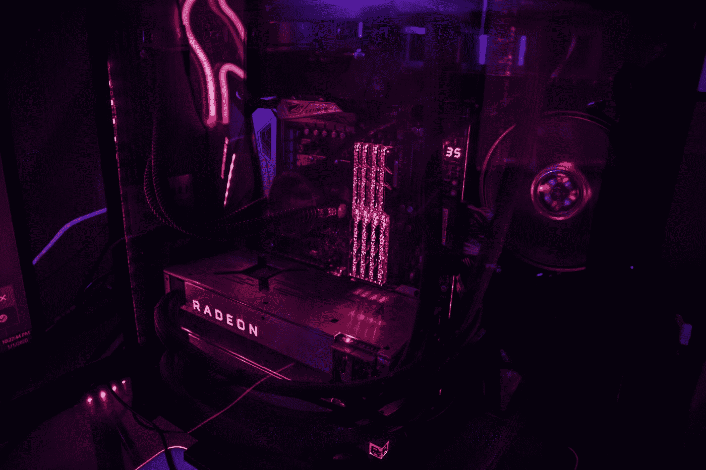

# 深度学习并驾齐驱:Julia v.s. Python

> 原文：<https://towardsdatascience.com/deep-learning-side-by-side-julia-v-s-python-5ac0645587f6?source=collection_archive---------7----------------------->

## 你能说出哪一种是未来的语言吗？


由 [SuperRGB](https://unsplash.com/@srgbco?utm_source=medium&utm_medium=referral) 在 [Unsplash](https://unsplash.com?utm_source=medium&utm_medium=referral) 上拍摄的照片

Julia 可能是 Python 最大的威胁。对于各种应用程序来说，Julia 无疑比 Python 更快，几乎和 C 语言一样快。Julia 还提供了多分派和元编程等特性，这些特性让它比 Python 更有优势。

与此同时，Python 被建立，被广泛使用，并拥有各种经过时间考验的包。切换到朱莉娅的问题是一个很难解决的问题。通常答案是令人沮丧的，“看情况”。

为了帮助展示 Julia 并解决是否使用它的问题，我从两种语言中提取了深度学习代码的样本，并将它们串联起来以便于比较。我将在 CIFAR10 数据集上训练 VGG19 模型。

# 模型


照片由[汤姆·帕克斯](https://unsplash.com/@tomparkes?utm_source=medium&utm_medium=referral)在 [Unsplash](https://unsplash.com?utm_source=medium&utm_medium=referral) 上拍摄

深度学习模型可能非常庞大，通常需要大量的工作来定义，尤其是当它们包含像 ResNet [1]这样的专门层时。我们将使用一个中等大小的模型(没有双关的意思)，VGG19，来进行比较[2]。

**Python 中的 vgg 19**

我选择 Keras 作为我们的 Python 实现，因为它的轻量级和灵活的设计与 Julia 具有竞争力。

```
from keras.models import Sequential
from keras.layers import Dense, Conv2D, MaxPool2D , Flattenvgg19 = Sequential()
vgg19.add(Conv2D(input_shape=(224,224,3),filters=64,kernel_size=(3,3),padding="same", activation="relu"))
vgg19.add(Conv2D(filters=64,kernel_size=(3,3),padding="same", activation="relu"))
vgg19.add(MaxPool2D(pool_size=(2,2),strides=(2,2)))
vgg19.add(Conv2D(filters=128, kernel_size=(3,3), padding="same", activation="relu"))
vgg19.add(Conv2D(filters=128, kernel_size=(3,3), padding="same", activation="relu"))
vgg19.add(MaxPool2D(pool_size=(2,2),strides=(2,2)))
vgg19.add(Conv2D(filters=256, kernel_size=(3,3), padding="same", activation="relu"))
vgg19.add(Conv2D(filters=256, kernel_size=(3,3), padding="same", activation="relu"))
vgg19.add(Conv2D(filters=256, kernel_size=(3,3), padding="same", activation="relu"))
vgg19.add(MaxPool2D(pool_size=(2,2),strides=(2,2)))
vgg19.add(Conv2D(filters=512, kernel_size=(3,3), padding="same", activation="relu"))
vgg19.add(Conv2D(filters=512, kernel_size=(3,3), padding="same", activation="relu"))
vgg19.add(Conv2D(filters=512, kernel_size=(3,3), padding="same", activation="relu"))
vgg19.add(MaxPool2D(pool_size=(2,2),strides=(2,2)))
vgg19.add(Conv2D(filters=512, kernel_size=(3,3), padding="same", activation="relu"))
vgg19.add(Conv2D(filters=512, kernel_size=(3,3), padding="same", activation="relu"))
vgg19.add(Conv2D(filters=512, kernel_size=(3,3), padding="same", activation="relu"))
vgg19.add(MaxPool2D(pool_size=(2,2),strides=(2,2)))
vgg19.add(Flatten())model.add(Dense(units=4096,activation="relu"))
vgg19.add(Dense(units=4096,activation="relu"))
vgg19.add(Dense(units=10, activation="softmax"))# Code from [Rohit Thakur](https://github.com/1297rohit) on [GitHub](https://github.com/1297rohit/VGG16-In-Keras)
```

这里的任务是连接 21 层深度学习机器。Python 很好地处理了这一点。语法简单易懂。虽然`.add()`函数可能有点难看，但它的作用是显而易见的。此外，代码中很清楚每个模型层做什么。(卷积、合并、扁平化等..)

**茱莉亚中的 vgg 19**

```
using Fluxvgg16() = Chain(            
    Conv((3, 3), 3 => 64, relu, pad=(1, 1), stride=(1, 1)),
    Conv((3, 3), 64 => 64, relu, pad=(1, 1), stride=(1, 1)),
    MaxPool((2,2)),
    Conv((3, 3), 64 => 128, relu, pad=(1, 1), stride=(1, 1)),
    Conv((3, 3), 128 => 128, relu, pad=(1, 1), stride=(1, 1)),
    MaxPool((2,2)),
    Conv((3, 3), 128 => 256, relu, pad=(1, 1), stride=(1, 1)),
    Conv((3, 3), 256 => 256, relu, pad=(1, 1), stride=(1, 1)),
    Conv((3, 3), 256 => 256, relu, pad=(1, 1), stride=(1, 1)),
    MaxPool((2,2)),
    Conv((3, 3), 256 => 512, relu, pad=(1, 1), stride=(1, 1)),
    Conv((3, 3), 512 => 512, relu, pad=(1, 1), stride=(1, 1)),
    Conv((3, 3), 512 => 512, relu, pad=(1, 1), stride=(1, 1)),
    MaxPool((2,2)),
    Conv((3, 3), 512 => 512, relu, pad=(1, 1), stride=(1, 1)),
    Conv((3, 3), 512 => 512, relu, pad=(1, 1), stride=(1, 1)),
    Conv((3, 3), 512 => 512, relu, pad=(1, 1), stride=(1, 1)),
    BatchNorm(512),
    MaxPool((2,2)),
    flatten,
    Dense(512, 4096, relu),
    Dropout(0.5),
    Dense(4096, 4096, relu),
    Dropout(0.5),
    Dense(4096, 10),
    softmax
)# Code from [Flux Model Zoo on Github](https://github.com/FluxML/model-zoo/blob/master/vision/cifar10/cifar10.jl)
```

**讨论**

乍看之下，Julia 看起来没有 Python 那么杂乱。导入语句更简洁，代码更容易阅读。和 Python 一样，每一层做什么都很清楚。`Chain`类型有点不明确，但是很明显它将各层连接在一起。

需要注意的是没有模型类。事实上，Julia 不是面向对象的，所以每一层都是类型而不是类。这一点值得注意，因为它强调了 Julia 模型是非常轻量级的。这些层中的每一层都是独立定义的，然后链接在一起，没有任何类结构来控制它们如何交互。

然而，在训练巨型模型时，避免一点混乱并不重要。Python 的优势在于它对故障排除和解决 bug 有大量的支持。文档非常好，网上有数百个 VGG19 示例。相比之下，Julia 在网上有五个独特的 VGG19 例子(也许)。

# 数据处理


由[桑德罗·卡塔琳娜](https://unsplash.com/@sandrokatalina?utm_source=medium&utm_medium=referral)在 [Unsplash](https://unsplash.com?utm_source=medium&utm_medium=referral) 拍摄的照片

对于数据处理，我们将查看通常与 VGG19 相关联的数据集 CIFAR10。

**Python 中的数据处理**

```
from keras.datasets import cifar10
from keras.utils import to_categorical(X, Y), (tsX, tsY) = cifar10.load_data() # Use a one-hot-encoding
Y = to_categorical(Y)
tsY = to_categorical(tsY)# Change datatype to float
X = X.astype('float32')
tsX = tsX.astype('float32')

# Scale X and tsX so each entry is between 0 and 1
X = X / 255.0
tsX = tsX / 255.0
```

为了根据图像数据训练模型，必须将图像转换成正确的格式。只需要几行代码就可以做到这一点。图像和图像标签一起被加载到变量中。为了使分类更容易，标签被转换成一个热点编码格式。这在 Python 中相对简单。

**Julia 中的数据处理**

```
using MLDatasets: CIFAR10
using Flux: onehotbatch# Data comes pre-normalized in Julia
trainX, trainY = CIFAR10.traindata(Float64)
testX, testY = CIFAR10.testdata(Float64)# One hot encode labels
trainY = onehotbatch(trainY, 0:9)
testY = onehotbatch(testY, 0:9)
```

Julia 需要与 Python 相同的图像处理来为训练过程准备图像。这些代码看起来极其相似，而且似乎不支持任何一种语言。

# 培养



照片由 [Zii Miller](https://unsplash.com/@anarchist?utm_source=medium&utm_medium=referral) 在 [Unsplash](https://unsplash.com?utm_source=medium&utm_medium=referral) 上拍摄

接下来，我们将查看模型训练循环。

**Python 培训**

```
optimizer = SGD(lr=0.001, momentum=0.9)
vgg19.compile(optimizer=optimizer, loss='categorical_crossentropy', metrics=['accuracy'])
history = model.fit(X, Y, epochs=100, batch_size=64, validation_data=(tsX, tsY), verbose=0)
```

**茱莉亚的培训**

```
using Flux: crossentropy, @epochs
using Flux.Data: DataLoadermodel = vgg19()
opt = Momentum(.001, .9)
loss(x, y) = crossentropy(model(x), y)
data = DataLoader(trainX, trainY, batchsize=64)
@epochs 100 Flux.train!(loss, params(model), data, opt)
```

这里的代码同样冗长，但是不同语言之间的差异显而易见。在 Python 中，`model.fit`返回包含准确度和损失评估的字典。它也有关键字参数来自动优化过程。朱莉娅更瘦了。训练算法要求用户提供他们自己的损失函数、优化器和包含批量数据的迭代程序以及模型。

Python 实现更加用户友好。培训过程很容易，并产生有用的输出。Julia 对用户的要求更高一些。同时，Julia 更加抽象，允许任何优化器和损失函数。用户可以以任何方式定义损失函数，而无需查阅内置损失函数列表。这种抽象是 Julia 开发人员的典型特征，他们致力于使代码尽可能的抽象和通用。

由于这个原因，Keras 对于实现已知技术和标准模型训练更实用，但使 Flux 更适合于开发新技术。

# 速度


弗洛里安·斯特丘克在 [Unsplash](https://unsplash.com?utm_source=medium&utm_medium=referral) 上拍摄的照片

不幸的是，互联网上没有比较 Flux 和 Keras 的可用基准。有几个资源给了我们一个思路，我们可以使用 TensorFlow 速度作为参考。

一项基准测试发现，在 GPU 和 CPU 上， [Flux 几乎不比 TensorFlow](https://github.com/avik-pal/DeepLearningBenchmarks) 慢。已经证明 [Keras 在 GPU 上也比 TensorFlow](https://wrosinski.github.io/deep-learning-frameworks/) 稍慢。不幸的是，这并没有给我们一个明确的赢家，但表明两个包的速度是相似的。

上面的 Flux 基准测试是在 Flux 的自动差异软件包进行重大返工之前完成的。新的软件包 Zygote.jl 大大加快了计算速度。在 CPU*上的一个更近的通量基准*发现[改进的通量比 CPU](https://estadistika.github.io//julia/python/packages/knet/flux/tensorflow/machine-learning/deep-learning/2019/06/20/Deep-Learning-Exploring-High-Level-APIs-of-Knet.jl-and-Flux.jl-in-comparison-to-Tensorflow-Keras.html) 上的 TensorFlow 更快。这表明 Flux 在 GPU 上也可以更快，但在 CPU 上获胜并不一定意味着在 GPU 上的胜利。同时，这仍然是 Flux 将在 CPU 上击败 Keras 的好证据。

# 谁赢了？

两种语言在各个领域都表现出色。两者之间的差异很大程度上是口味问题。然而，每种语言都有两个优势。

## Python 的边缘

Python 有一个庞大的支持社区，并提供经过时间考验的库。它是可靠和标准的。Python 中的深度学习要普遍得多。使用 Python 进行深度学习的开发者会很好地融入深度学习社区。

## 朱莉娅的优势

茱莉亚更干净，更抽象。深度学习代码肯定会更快，改进工作正在进行中。朱莉娅有潜力。Python 中的深度学习库要完整得多，没有那么大的发展潜力。Julia 拥有更丰富的基础语言，在未来可能会有许多新的想法和更快的代码。采用 Julia 的开发人员将更接近编程的前沿，但将不得不处理打造自己的道路。

## 赢家

深度学习很难，需要大量的故障排除。很难达到目前的精确度。正因如此， **Python 赢得了这次比较**。Julia 中的深度学习没有对深度学习故障排除的强大在线支持。这可能会使编写复杂的深度学习脚本变得非常困难。Julia 对于很多应用都很优秀，但是对于深度学习，我会推荐 Python。

[](https://medium.com/swlh/how-julia-uses-multiple-dispatch-to-beat-python-8fab888bb4d8) [## Julia 如何利用多重调度击败 Python

### 亲自看

medium.com](https://medium.com/swlh/how-julia-uses-multiple-dispatch-to-beat-python-8fab888bb4d8) [](/how-to-learn-julia-when-you-already-know-python-641ed02b3fa7) [## 已经会 Python 了怎么学 Julia

### 跳到好的方面

towardsdatascience.com](/how-to-learn-julia-when-you-already-know-python-641ed02b3fa7) 

## 参考资料:

[1]，何，，，，，，，【用于图像识别的深度残差学习，2016 .

[2]卡伦·西蒙扬，安德鲁·齐泽曼，[用于大规模图像识别的极深度卷积网络](https://arxiv.org/abs/1409.1556)，国际学习表征会议，2015