# 深度学习:用 TensorFlow 解决问题

> 原文：<https://towardsdatascience.com/deep-learning-solving-problems-with-tensorflow-3722b8eeccb1?source=collection_archive---------11----------------------->

## 了解如何解决优化问题，并使用 MNIST 数据集训练您的第一个神经网络！


图片来自 [Unsplash](https://unsplash.com/photos/_af0_qAh4K4)

# 介绍

本文的目标是用 TensorFlow 定义和解决实际用例。为此，我们将解决:

*   最优化问题
*   线性回归问题，我们将调整回归直线到数据集
*   并且我们将结束用 MINST 数据集解决深度学习分类项目的“Hello World”。

# 优化问题

网飞决定在一栋大楼里放置他们的一张著名海报。营销团队已经决定，广告海报的面积必须达到 600 平方米，上下各 2 米，左右各 4 米。

然而，他们没有被告知该建筑的立面尺寸。我们可以发一封电子邮件给业主，问他，但由于我们知道数学，我们可以很容易地解决它。我们怎样才能知道这座建筑物的尺寸？

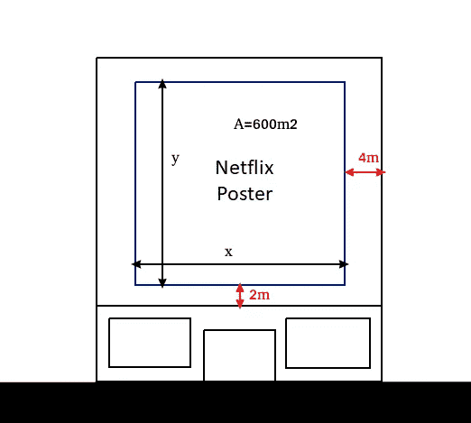

按作者分列的数字

该建筑的总面积为:

**宽度= 4 + x + 4 = x +8**

**身高= 2 + y + 2 = y +4**

**面积=宽度 x 高度= (x + 8)*(y + 4)**

并且存在约束: **x*y = 600**

这允许我们写出一个方程系统:

xy = 600 → **x = 600/y**

**S(y)**=(600/y+8)(y+4)= 600+8y+4 * 600/y+32 =**632+8y+2400/y**

在优化问题中，函数(导数)的斜率信息用于计算其最小值。我们必须使一阶导数等于 0，然后检查二阶导数是否为正。所以，在这种情况下:

**S '(y)= 8–2400/y**

**S''(y) = 4800/y**

s '(y)= 0→0 = 8–2400/y→8 = 2400/y→y = 2400/8 = 300→**y =**sqrt(300)= sqrt(100–3)= sqrt(100)-sqrt(3)= 10-sqrt(3)=**17.32**(我们舍弃负号，因为它没有物理意义)

在 x 中替换:

**x =**600/10-sqrt(3)= 60/sqrt(3)= 60-sqrt(3)/sqrt(3)-sqrt(3)= 60-sqrt(3)/3 = 20-sqrt(3)=**34.64**

至于 y = 17.32 -> S''(y) = 0.9238 > 0，我们找到了最小解。

因此，建筑的尺寸为:

**宽度:x + 8 = 42.64 米**

**高度:y + 4 = 21.32 米**

你看到衍生品有多有用了吗？我们只是分析性地解决了这个问题。我们已经能够解决它，因为这是一个简单的问题，但有许多问题，它是非常昂贵的计算来解决他们的分析，所以我们使用数值方法。这些方法之一是梯度下降。

如果我们这次用张量流数值解决这个问题，你觉得怎么样？我们走吧！

```
import numpy as np
import tensorflow as tfx = tf.Variable(initial_value=tf.random_uniform([1], 34, 35),name=’x’)
y = tf.Variable(initial_value=tf.random_uniform([1], 0., 50.), name=’y’)# Loss function
s = tf.add(tf.add(632.0, tf.multiply(8.0, y)), tf.divide(2400.0, y), ‘s’)opt = tf.train.GradientDescentOptimizer(0.05)
train = opt.minimize(s)sess = tf.Session()init = tf.initialize_all_variables()
sess.run(init)old_solution = 0
tolerance = 1e-4
for step in range(500):
 sess.run(train)
 solution = sess.run(y)
 if np.abs(solution — old_solution) < tolerance:
 print(“The solution is y = {}”.format(old_solution))
 break

 old_solution = solution
 if step % 10 == 0:
 print(step, “y = “ + str(old_solution), “s = “ + str(sess.run(s)))
```


我们已经使用梯度下降算法计算出了 y 。当然，我们现在需要计算 **x** 代入 x = 600/y

```
x = 600/old_solution[0]
print(x)
```

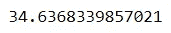

这与我们的结果相符，所以它似乎是有效的！让我们画出结果:

```
import matplotlib.pyplot as plty = np.linspace(0, 400., 500)
s = 632.0 + 8*y + 2400/y
plt.plot(y, s)
```

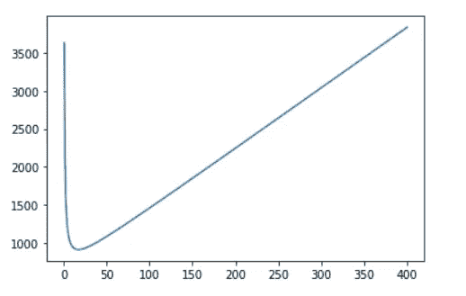

```
print("The function minimum is in {}".format(np.min(s)))
min_s = np.min(s)
s_min_idx = np.nonzero(s==min_s)
y_min = y[s_min_idx]
print("The y value that reaches the minimum is {}".format(y_min[0]))
```

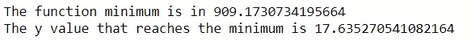

# 让我们看看其他例子

在这种情况下，我们希望找到 y = log2(x)函数的最小值。

```
x = tf.Variable(15, name='x', dtype=tf.float32)
log_x = tf.log(x)
log_x_squared = tf.square(log_x)optimizer = tf.train.GradientDescentOptimizer(0.5)
train = optimizer.minimize(log_x_squared)init = tf.initialize_all_variables()def optimize():
  with tf.Session() as session:
    session.run(init)
    print("starting at", "x:", session.run(x), "log(x)^2:", session.run(log_x_squared))
    for step in range(100):  
      session.run(train)
      print("step", step, "x:", session.run(x), "log(x)^2:", session.run(log_x_squared))

optimize()
```

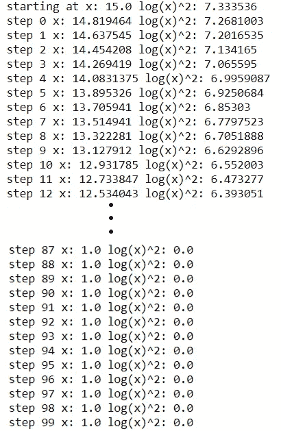

我们来策划一下吧！

```
x_values = np.linspace(0,10,100)
fx = np.log(x_values)**2
plt.plot(x_values, fx)print("The function minimum is in {}".format(np.min(fx)))
min_fx = np.min(fx)
fx_min_idx = np.nonzero(fx==min_fx)
x_min_value = x_values[fx_min_idx]
print("The y value that reaches the minimum is {}".format(x_min_value[0]))
```

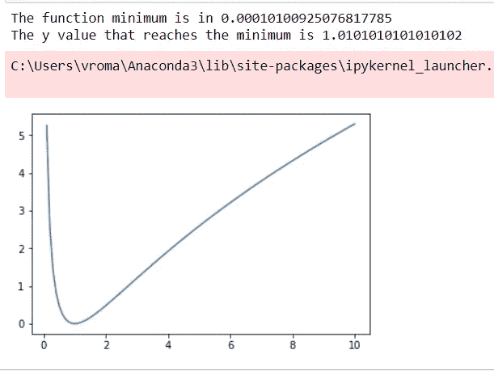

# 让我们解决一个线性回归问题

让我们看看如何将一条直线调整到一个数据集，这个数据集代表了辛普森一家中每个角色的智力，从拉尔夫·威根到弗林克医生。

让我们绘制智力随年龄的分布图，从 0 到 1 归一化，其中玛吉最小，蒙哥马利·伯恩斯最大:

```
n_observations = 50
_, ax = plt.subplots(1, 1)
xs = np.linspace(0., 1., n_observations)
ys = 100 * np.sin(xs) + np.random.uniform(0., 50., n_observations)
ax.scatter(xs, ys)
plt.draw()
```

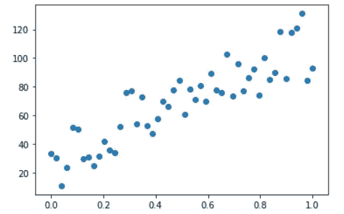

按作者分列的数字

现在，我们需要两个 tf .占位符，一个在回归算法的入口，另一个在出口。占位符是在执行网络之前不需要赋值的变量。

```
X = tf.placeholder(tf.float32)
Y = tf.placeholder(tf.float32)
```

让我们试着优化线性回归的直线。我们需要两个变量，权重(W)和偏差(b)。tf 类型的元素。变量需要初始化，并且其类型在声明后不能更改。我们可以通过“赋值”方法改变它的值。

```
W = tf.Variable(tf.random_normal([1]), name='weight')
b = tf.Variable(tf.random_normal([1]), name='bias')
Y_pred = tf.add(tf.multiply(X, W), b)
```

现在让我们把成本函数定义为我们的预测值和真实值之间的差值。

```
loss = tf.reduce_mean(tf.pow(Y_pred - y, 2))
```

我们现在定义优化方法，我们将使用梯度下降。基本上，它计算每个权重相对于总误差的变化，并更新每个权重，使得总误差在随后的迭代中减小。学习率表示权重更新的突然程度。

```
learning_rate = 0.01
optimizer = tf.train.GradientDescentOptimizer(learning_rate).minimize(loss)**# Definition of the number of iterations and start the initialization using the GPU**
n_epochs = 1000with tf.Session() as sess:
  with tf.device("/GPU:0"): **# We initialize now all the defined variables**
    sess.run(tf.global_variables_initializer()) **# Start the adjust**
    prev_training_loss = 0.0
    for epoch_i in range(n_epochs):
      for (x, y) in zip(xs, ys):
        sess.run(optimizer, feed_dict={X: x, Y: y}) W_, b_, training_loss = sess.run([W, b, loss], feed_dict={X: xs, Y: ys}) **# We print the losses every 20 epochs**
      if epoch_i % 20 == 0:
        print(training_loss) **# Ending conditions**
      if np.abs(prev_training_loss - training_loss) < 0.000001:
        print(W_, b_)
        break
      prev_training_loss = training_loss **# Plot of the result**
    plt.scatter(xs, ys)
    plt.plot(xs, Y_pred.eval(feed_dict={X: xs}, session=sess))
```

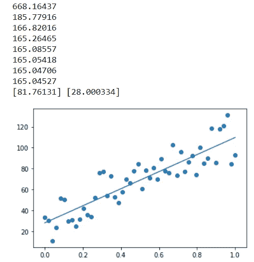

按作者分列的数字

我们有了！有了这条回归线，我们将能够预测每个辛普森的性格的智力知道年龄。

# MNIST 数据集

现在让我们看看如何用逻辑回归对数字图像进行分类。我们将使用深度学习数据集的“Hello world”。

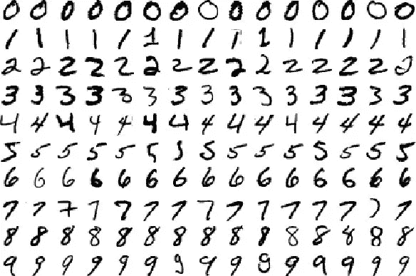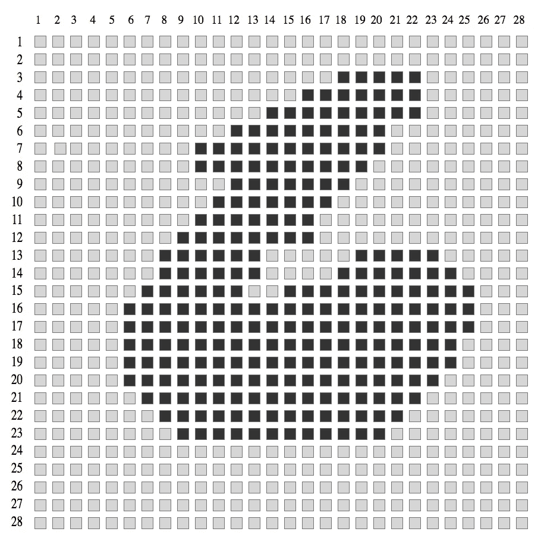

让我们导入相关的库和数据集 MNIST:

```
import numpy as np
import matplotlib.pyplot as plt
import tensorflow as tf
from tensorflow.examples.tutorials.mnist import input_data
```

我们通过用一键编码对标签进行编码来加载数据集(它将每个标签转换为长度= N_CLASSES 的向量，除了指示图像所属的类的索引(包含 1)之外，所有的 0 都是 0)。比如我们有 10 个类(数字从 0 到 9)，标签属于数字 5:label =[0 0 0 1 0 0 0 0 0]。

```
mnist = input_data.read_data_sets('MNIST_data/', one_hot=True)print("Train examples: {}".format(mnist.train.num_examples))
print("Test examples: {}".format(mnist.test.num_examples))
print("Validation examples: {}".format(mnist.validation.num_examples))**# Images are stored in a 2D tensor: images_number x image_pixels_vector
# Labels are stored in a 2D tensor: images_number x classes_number (one-hot)**
print("Images Size train: {}".format(mnist.train.images.shape))
print("Images Size train: {}".format(mnist.train.labels.shape))**# To see the range of the images values**
print("Min value: {}".format(np.min(mnist.train.images)))
print("Max value: {}".format(np.max(mnist.train.images)))**# To see some images we will acess a vector of the dataset and resize it to 28x28**
plt.subplot(131)
plt.imshow(np.reshape(mnist.train.images[0, :], (28, 28)), cmap='gray')
plt.subplot(132)
plt.imshow(np.reshape(mnist.train.images[27500, :], (28, 28)), cmap='gray')
plt.subplot(133)
plt.imshow(np.reshape(mnist.train.images[54999, :], (28, 28)), cmap='gray')
```

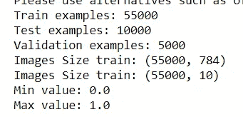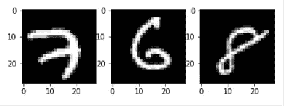

我们已经了解了 MNIST 数据集的一些内容。现在，让我们创建我们的回归变量:

首先，我们为输入数据创建占位符。在这种情况下，输入将是一组大小为 768 的向量(我们将一次传递几个图像到我们的回归器，这样，当它计算梯度时，它将在几个图像中扫描，因此估计将比它只使用一个图像更精确)

```
n_input = 784  **# Number of data features: number of pixels of the image**
n_output = 10  **# Number of classes: from 0 to 9**
net_input = tf.placeholder(tf.float32, [None, n_input])  **# We create the placeholder**
```

现在让我们定义回归方程:y = W*x + b

```
W = tf.Variable(tf.zeros([n_input, n_output]))
b = tf.Variable(tf.zeros([n_output]))
```

由于输出是多类的，我们需要一个函数返回图像属于每个可能类的概率。例如，如果我们放一个 5 的图像，可能的输出是:[0.05 0.05 0.05 0.05 0.55 0.05 0.05 0.05 0.05 0.05]其概率之和是 1，概率最高的类是 5。

我们应用 softmax 函数来归一化输出概率:

```
net_output = tf.nn.softmax(tf.matmul(net_input, W) + b)
```

## SoftMax 函数

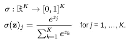

```
**# We also need a placeholder for the image label, with which we will compare our prediction And finally, we define our loss function: cross entropy**
y_true = tf.placeholder(tf.float32, [None, n_output])**# We check if our prediction matches the label**
cross_entropy = -tf.reduce_sum(y_true * tf.log(net_output))
idx_prediction = tf.argmax(net_output, 1)
idx_label = tf.argmax(y_true, 1)
correct_prediction = tf.equal(idx_prediction, idx_label)**# We define our measure of accuracy as the number of hits in relation to the number of predicted samples**
accuracy = tf.reduce_mean(tf.cast(correct_prediction, "float"))**# We now indicate that we want to minimize our loss function (the cross entropy) by using the gradient descent algorithm and with a rate of learning = 0.01.**
optimizer = tf.train.GradientDescentOptimizer(0.01).minimize(cross_entropy)
```

现在一切都设置好了！让我们执行图表:

```
from IPython.display import clear_outputwith tf.Session() as sess: sess.run(tf.global_variables_initializer()) **# Let's train the regressor**
  batch_size = 10 
  for sample_i in range(mnist.train.num_examples):
    sample_x, sample_y = mnist.train.next_batch(batch_size)
    sess.run(optimizer, feed_dict={net_input: sample_x, 
                                   y_true: sample_y}) **# Let's check how is performing the regressor**
    if sample_i < 50 or sample_i % 200 == 0:
      val_acc = sess.run(accuracy, feed_dict={net_input: mnist.validation.images, y_true: mnist.validation.labels})
      print("({}/{}) Acc: {}".format(sample_i, mnist.train.num_examples, val_acc))**# Let's show the final accuracy**
  print('Teste accuracy: ', sess.run(accuracy, feed_dict={net_input: mnist.test.images, y_true: mnist.test.labels}))
```

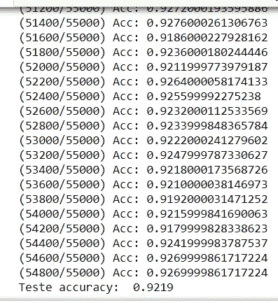

我们刚刚用 TensorFlow 训练了我们的第一个神经元网络！

想一想我们刚刚做了什么。

我们实现了一个逻辑回归，公式为:y = G(Wx + b)，其中 G = softmax()，而不是典型的 G = sigmoid()。

如果你看下图，它定义了感知器(单层神经网络)，你可以看到输出=激活 _ 功能(Wx)。你看到了吗？只差偏了！注意输入是 1？所以权重 w0 没有乘以任何东西。没错。权重 w0 是偏差，用这种符号表示只是为了能够将其实现为矩阵乘法。

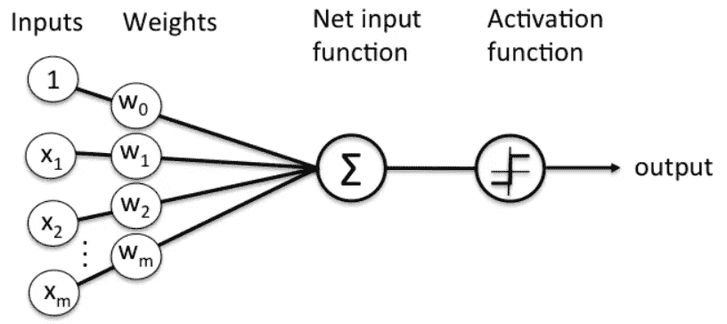

所以，我们刚刚实现的是一个感知器

*   批处理大小= 10
*   1 个纪元
*   下降梯度作为优化器
*   和 softmax 作为激活函数。

# 最后的话

一如既往，我希望你喜欢这篇文章，你已经学会了如何使用 TensorFlow 来解决线性问题，并且你已经成功地训练了你的第一个神经网络！

*如果你喜欢这篇帖子，那么你可以看看我在数据科学和机器学习方面的其他帖子*[](https://medium.com/@rromanss23)**。**

**如果你想了解更多关于机器学习和人工智能的知识* ***请在 Medium*** *上关注我，敬请关注我的下一篇帖子！**