# 深度学习跳跃

> 原文：<https://towardsdatascience.com/deep-learning-to-jump-e507103ab8d3?source=collection_archive---------50----------------------->

## Maxime Bergeron & Ivan Sergienko，Riskfuel

> 在这篇简短的笔记中，我们描述了一个**跳转单元**，它可以用来用一个简单的神经网络拟合阶跃函数。我们的动机来自于经常出现不连续性的定量金融问题。

(图片由作者提供)

***来自《走向数据科学》编辑的提示:*** *虽然我们允许独立作者根据我们的* [*规则和指导方针*](/questions-96667b06af5) *发表文章，但我们不认可每个作者的贡献。你不应该在没有寻求专业建议的情况下依赖一个作者的作品。详见我们的* [*读者术语*](/readers-terms-b5d780a700a4) *。*

# 为什么要跳？

不连续函数在金融工具中是常见的。例如，下图显示了典型的五年期固定利率债券的价格，票面利率为半年。我们设定的票面利率高于贴现率，所以债券的价值保持在票面价值 100 美元以上。如果你不熟悉债券定价，这里有一本很好的入门书。

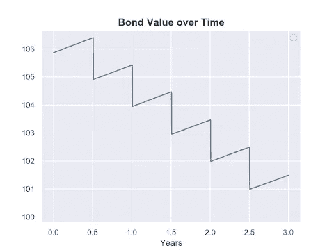

(图片由作者提供)

为了我们的目的，需要注意的重要事情是在每个息票支付日发生的跳跃。这仅仅是因为钱不可能凭空产生。证券所有者的“财富”在息票前后保持不变。因此，我们有:

> 息票前价值=息票后价值+息票现金。

在行权日，更复杂的路径依赖型金融衍生品的价值也会出现类似的跃升。这里的一个经典例子是百慕大互换期权，这是一种用于管理抵押贷款提前还款风险的流行工具。百慕大式期权可以在价值可能跃升的预定日期行使。

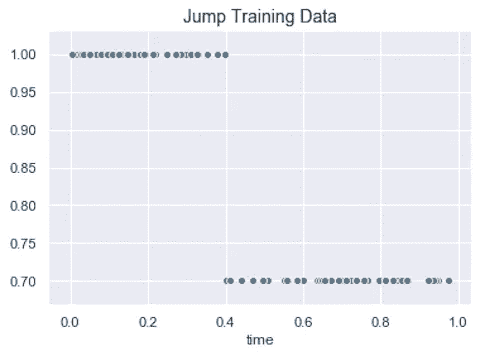

(图片由作者提供)

为了使事情具体化，我们将把注意力集中在学习具有单一向下跳跃的分段常数函数的子问题上。我们生成的训练数据如上图所示。请读者跟随我们在[这个 Jupyter 笔记本](https://github.com/Riskfuel-Collaborations/jump-unit/blob/main/notebook/JumpUnit.ipynb)中的代码。

# Sigmoid 函数

那么我们机器如何学习跳跃呢？这里一个自然的方法是使用一个 s 形*。*然而，在我们的问题中，步骤是尖锐的。息票支付日期左边的所有点都严格位于右边的点之上，这导致了真正的不连续。拟合简单的一维神经网络

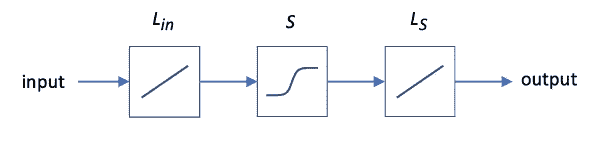

(图片由作者提供)

包括夹在两个线性层之间的 s 形激活函数需要初始线性层中的无界系数(权重)。数量无限增长对于数值方法来说总是坏消息，但对于神经网络来说情况更糟。事实上，这导致了臭名昭著的爆炸梯度问题，使最佳参数值几乎不可能学习。我们将不得不通过保持大而有限的权重来进行妥协，从而导致输入的一个区域(就在跳跃附近)难以消除显著的误差。

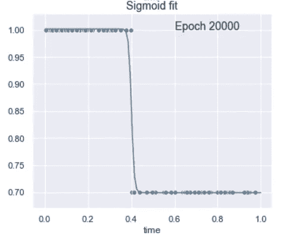

(图片由作者提供)

*我们能做得更好吗？*

# 亥维赛函数

为什么不简单地用…一个跳跃来学习一个跳跃呢？用不连续的激活来代替上面一维网络中的 sigmoid 函数是很有诱惑力的。这里最简单的候选函数是 Heaviside 阶跃函数 *H(x)* ，对于 *x < 0* 它等于 *0* ，否则等于 *1* :

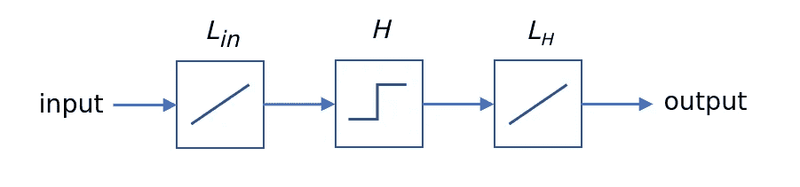

(图片由作者提供)

这是一个显而易见的想法，它会立即导致如下图所示的失败:

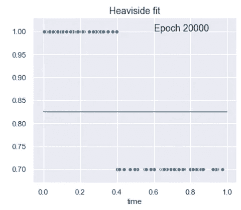

(图片由作者提供)

为了理解这里的问题，让我们看看数学。我们的小神经网络对应的损失函数是:

这里， *yᵢ* 是对应于时间 *tᵢ的训练数据值，*子脚本 *w* 项是最后一个线性层的权重，子脚本 *b* 项是来自两个线性层的偏差。敏锐的读者会注意到，在不失一般性的情况下，我们已经将第一个线性层的权重设置为 *1* ，剩余的权重和偏差决定了台阶的大小和位置。深度学习所依赖的用于最小化误差函数的梯度下降方法需要使用一阶导数。在这方面，其中一个问题很大:

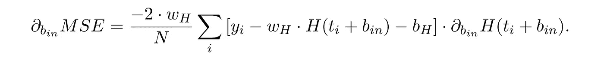

这里的问题是第二个因素，当 *b* 和 *t* 项相互抵消时，这个因素就会爆发。下面的图清楚地说明了这个问题:函数是分段常数！

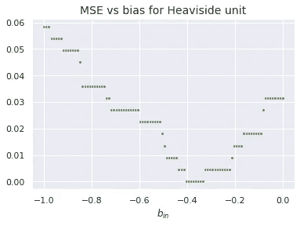

(图片由作者提供)

虽然实际的最小值是我们期望的，但基于梯度的方法永远达不到它。相反，这一过程陷入了一个小平台。

事实上，这个问题是 sigmoid 函数成为机器学习的主要内容的原因之一。用 sigmoidal 函数代替 Heaviside 函数允许通过梯度下降成功地训练复杂的神经网络，例如多层感知器。

在这一点上，可能会开始觉得我们在兜圈子。s 形函数在拟合急剧跳跃方面用处有限，但它们的引入是为了解决 Heaviside 函数的明显问题。

# 跳跃单元

下表总结了前面两个部分，并显示了当面临学习锐阶跃函数的任务时，我们对这两个激活函数的喜欢和不喜欢之处:

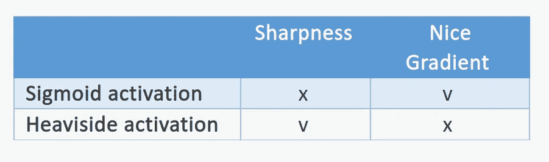

一个自然的问题是，我们是否可以将这两种功能结合起来，保留我们喜欢的功能，丢弃我们不喜欢的功能。进入*跳转单元*，如下图所示:

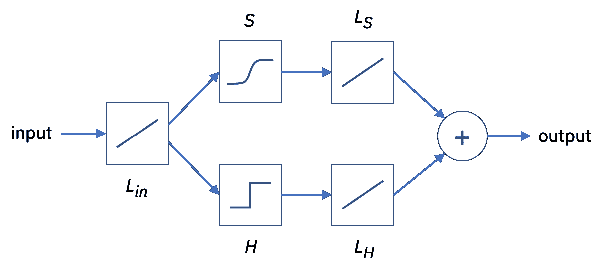

(图片由作者提供)

它由三个线性节点以及平行排列的 sigmoid 和 Heaviside 激活函数组成。为了理解这个单元如何工作，考虑它编码的等式:

为了简化方程，我们省略了 sigmoid 激活之后的线性层中的偏置项，因为它是由 Heaviside 激活之后的线性层的偏置项来解决的。现在让我们看看之前有问题的导数:

由于麻烦的偏差项现在出现在 *S(-)* 和*H(-)*的论证中，其梯度在大多数点不再消失，网络能够*学习*。请注意，在这个过程的最后，我们还希望 sigmoid 激活后的线性层的重量消失，这样只有 Heaviside 贡献保留下来。

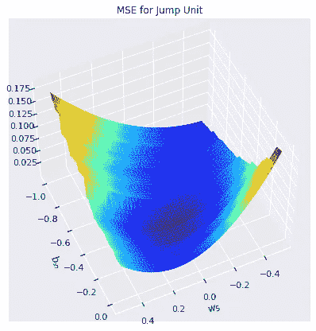

(图片由作者提供)

上面的图显示了我们的跳转单元的 MSE 误差作为它的两个关键参数的函数。我们看到，沿着偏置轴的阶跃之间的平台现在是倾斜的，允许基于梯度的算法学习全局最小值。

最后，我们画出结果函数，瞧！

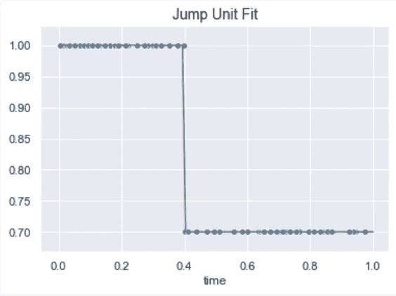

(图片由作者提供)

# 结论

总之，我们已经展示了如何结合 sigmoidal 和 Heaviside 激活函数的优点和缺点来产生能够通过梯度下降学习不连续阶跃函数的跳跃单元。

我们鼓励读者在[这款 Jupiter 笔记本中亲自尝试一下！](https://github.com/Riskfuel-Collaborations/jump-unit/blob/main/notebook/JumpUnit.ipynb)