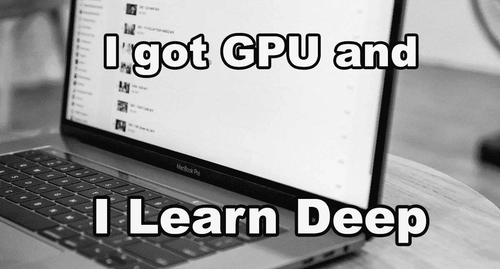
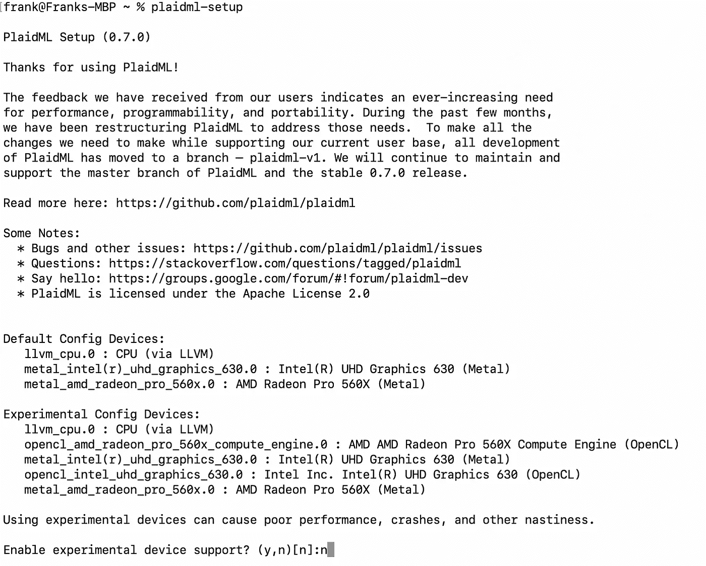
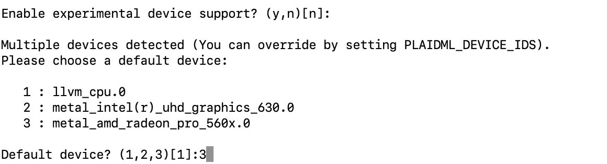
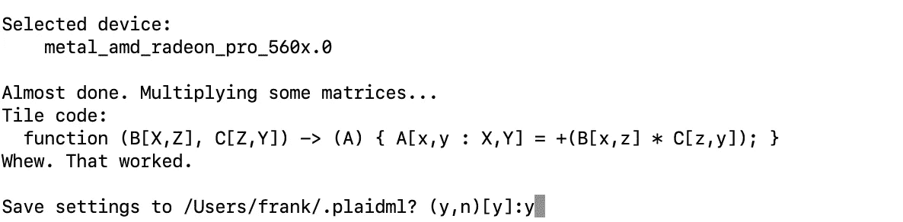
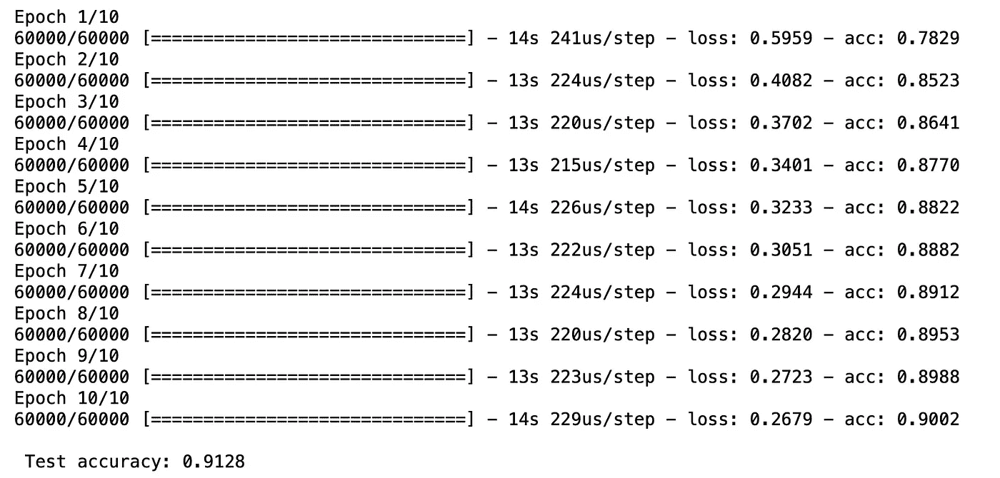
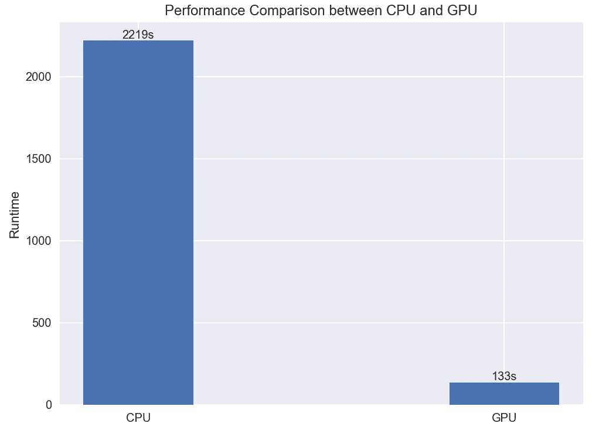

# 在 MacBook 上使用 GPU 进行深度学习

> 原文：<https://towardsdatascience.com/deep-learning-using-gpu-on-your-macbook-c9becba7c43?source=collection_archive---------2----------------------->

## 使用 PlaidML 并利用 AMD/Intel GPU 进行深度学习

我有 GPU，我学得很深

作为一名 ***MacBook Pro*** 的拥有者，我意识到无法利用其 GPU 进行深度学习的沮丧，考虑到难以置信的质量和纹理，当然还有它的**价格**。我还记得当我在 MacBook Pro 13 '和 15 '之间选择时，当时我对数据科学一点都不熟悉，我选择 15 '只是因为它有一个独立的 AMD GPU。很快我发现，在机器学习&深度学习方面，额外的一块 GPU **几乎没有带来任何帮助**。长期以来，大多数现代机器学习模型只能通过通用 GPU 库 [CUDA](https://en.wikipedia.org/wiki/CUDA) 来利用 Nvidia GPUs。

然而，现在已经是 2020 年了，今天的事情可能会有点不同: **PlaidML** 最初是由 *Vertex 在 2017 年发布的。AI* 旨在带来*“面向每个平台的深度学习”*。自从 2018 年被*英特尔*收购以及之后的 0.3.3 版本发布以来，你可以利用你的 AMD 和英特尔 GPU 用 Keras 做并行深度学习工作。自今年 1 月 15 日发布 0.7.0 版本以来， **PlaidML** 为所有主要目标的 GPU & CPU 提供了完整的条带后端。但首先，**我们为什么需要用 GPU 做并行计算？**

房屋建筑的例子

让我们以建造一所房子为例:如果你独自一人，比方说建造房子可能需要 400 个小时。然而，如果你雇佣一个额外的建筑工人和你一起建造，只需要 200 个小时，因为你把工作分成了一半。同样，你雇佣的工人越多，你就能越快地把房子建好。有一个众所周知的[阿姆达尔定律](https://en.wikipedia.org/wiki/Amdahl%27s_law)描述了当我们增加更多的处理器(工作者)时，一个程序可以加速到什么程度。

好吧，那么**为什么要用 GPU 呢？**GPU，也就是众所周知的图形处理单元，显然一开始就不是为做深度学习而设计的。然而，**并行计算的本质似乎与图形处理**类似:GPU 的内核虽然较弱，但由于其**高度并行的结构和内核数量**，对于处理大数据块的算法来说，GPU 的内核比 CPU 更高效(GPU 由数百个计算能力较弱的内核组成，而 CPU 通常由 4 到 32 个更强大的内核组成)。由于图形处理和深度学习的内在本质相似(大多数操作可以同时完成，而不是一个接一个)，GPU 成为深度学习和并行计算时自然的首选。

正如我最喜欢的一句来自 [*Linus Torvalds*](https://en.wikipedia.org/wiki/Linus_Torvalds) 的名言所说:

> “空谈是廉价的。给我看看代码。”

让我们动手，使用您自己的笔记本电脑，使用您的 GPU 运行一个简单的 CNN 案例！

# 1.安装和设置 PlaidML 和相关组件

首先，确保你的笔记本电脑有一个工作的 Python3 环境。我建议随时在虚拟环境下运行:

请记住，TensorFlow 下的 Keras 将无法使用 PlaidML。

设置 PlaidML 第 1 部分

首先你会看到一个欢迎页面和一个询问你是否使用实验设备支持的问题。正如它所建议的，使用实验设备会导致性能下降、崩溃和其他问题，您可以键入“n”或什么都不输入，然后返回选择使用默认配置设备。

设置 PlaidML 第 2 部分

现在你得到了一个你可以选择的所有设备的列表。对于我的 Macbook Pro 15' 2018，以下选项为:

1.  我的 CPU
2.  我的英特尔 UHD 显卡 630 GPU
3.  我的 AMD 镭龙 pro 560x GPU

我选择 3 是因为 AMD 是目前最强大的。

设置 PlaidML 第 3 部分

最后，键入“y”或什么都不输入，然后返回保存设置。现在，您已经完全设置好了，并准备好使用您的 GPU 进行深度学习项目。

# 2.在时尚 mnist 数据集上构建简单 CNN 分类器的教程:

首先，让我们启动一个 Jupyter 笔记本。(不确定为什么使用 Jupyter 笔记本或如何使用？查看我的[上一篇文章](/how-to-start-a-data-science-project-using-google-cloud-platform-6618b7c6edd2)了解更多详情)。

您需要按照正确的顺序运行这几行代码，以利用 PlaidML 作为 Keras 后端，否则它将默认使用 TensorFlow。

现在我们导入包并下载时尚数据集。

我们将使用 Keras 序列模型构建一个简单的 CNN(卷积神经网络)并编译它。

现在我们拟合模型并测试准确性。

模型结果

我们训练了一个 CNN 模型，仅用了大约 2 分钟就对时尚数据集进行了 91%的分类。你可能认为这并不令人印象深刻，但是看看与我的笔记本电脑的 CPU 的比较:

# 结论

从上面的比较中我们可以看到，在我的 MacBook Pro 上使用 GPU 比使用 CPU 运行这个简单的 CNN 代码快大约 15 倍。在 **PlaidML** 的帮助下，用自己的笔记本电脑做深度学习不再是无法忍受的事情。这个项目的完整脚本可以在我的 [github](https://github.com/Frank-Xu-Huaze/Medium/blob/master/PlaidML_CNN/PlaidML_Fashion_mnist.ipynb) 找到。

截止到今天(2020 年 2 月)， **PlaidML** 已经支持 [Keras](https://keras.io) 、 [ONNX](https://onnx.ai) 和 [NGraph](https://pypi.org/project/ngraph-core/) 。它在 GPU 上运行良好，并且不需要在 *Nvidia* 硬件上使用 CUDA/cuDNN，同时实现可比的性能。在 [PlaidML github 页面](https://github.com/plaidml/plaidml)上有更多的演示和相关项目。现在你 GPU 可能还不能得到 PlaidML 的完全支持，但是我相信很快 GPU 学习将不再是 Nvidia T21 的特权。