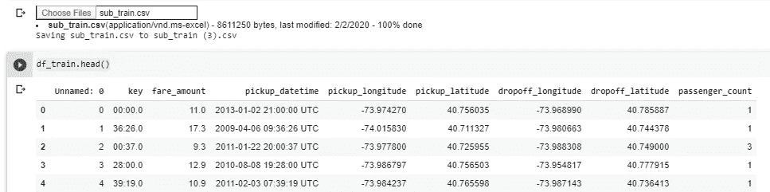
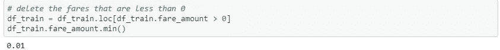
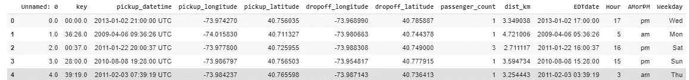
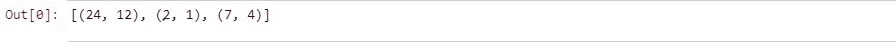
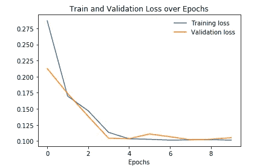
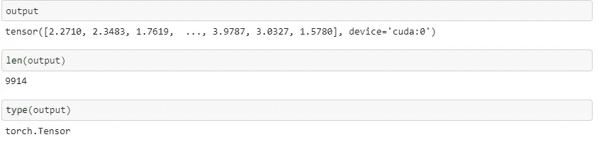
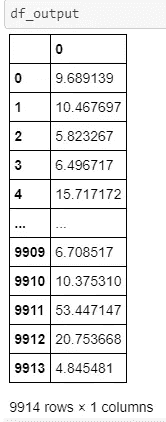

# 用 PyTorch 深度学习表格数据

> 原文：<https://towardsdatascience.com/deep-learning-using-pytorch-for-tabular-data-c68017d8b480?source=collection_archive---------8----------------------->


[来源](https://www.google.com/search?q=pytorch+tabular&tbm=isch&ved=2ahUKEwjFutjhwcLnAhUO8RoKHXtJA_MQ2-cCegQIABAA&oq=pytorch+tabular&gs_l=img.3..0i24l3.1266.1266..1689...0.0..0.117.117.0j1......0....1..gws-wiz-img.3jTVXIAcmxU&ei=XfQ-XoWYGI7ia_uSjZgP#imgrc=-V_4ZwNzB2UELM)

这篇文章将通过一个真实的例子为您提供使用 Pytorch 处理表格数据的详细的端到端指南。在本文结束时，您将能够构建您的 Pytorch 模型。

## 开始前有几件事:

课程:我同时开始了 [fast.ai](https://www.fast.ai/) 课程和[deep learning . ai](https://www.deeplearning.ai/)specialization(Coursera)。他们给了我关于深度学习的基础知识。伟大的斯坦福 [cs231n](http://cs231n.stanford.edu/) 也强烈推荐。

看的课程越来越多，非常容易。我认为最重要的是**【动手】**。写代码！开始一个项目或尝试解决一个难题。

*   使用 Python 的 set_trace()全面理解每一步。
*   **你可以在这里找到完整的代码**[](https://github.com/offirinbar/NYC_Taxi/blob/master/NYC_Taxi_PyTorch.ipynb)

## **T 何数据**

**我选择从事 Kaggle 的纽约市出租车费用预测工作，该公司的任务是预测乘客的出租车费用。请注意，这是一个回归问题。你可以在这里找到更多细节和完整数据集[。](https://www.kaggle.com/c/new-york-city-taxi-fare-prediction)**

**训练数据包含超过 200 万个样本(5.31 GB)。为了最大限度地减少训练时间，我们随机抽取了 100k 个训练样本。**

```
import pandas
import randomfilename = r"C:\Users\User\Desktop\offir\study\computer learning\Kaggle_comp\NYC Taxi\train.csv"n = sum(1 for line in open(filename)) - 1 #number of records in file (excludes header)
s = 100000 #desired sample size
skip = sorted(random.sample(range(1,n+1),n-s)) #the 0-indexed header will not be included in the skip listdf = pandas.read_csv(filename, skiprows=skip)
df.to_csv("temp.csv")
```

## **国家政治保卫局。参见 OGPU**

**我用免费的谷歌实验室写了我的代码。**

**要使用 GPU:运行时->更改运行时设置->硬件加速器-> GPU。**

# **密码**

## **导入相关库**

**运行以下命令后，您需要从您的计算机上传 CSV 文件。检查您上传的 CSV 文件是否命名为 sub_train。**

****

**也上传测试集**

****

# **数据预处理**

**下一步是删除所有小于 0 的票价(它们没有意义)**

****

**df_train 现在的长度是 99990。在每个步骤中记录不同数据集的类型和长度非常重要。**

## **堆叠训练集和测试集，使它们经历相同的预处理**

**目标是预测票价金额。因此，将其从 train_X 数据帧中删除。**

**而且，我选择了一边训练一边预测价格的 log。解释超出了这篇博客的范围。**

## **特征工程**

**让我们做一些特征工程。**

**一个是定义 haverine_distatance 函数，并添加一个 DateTime 列来导出有用的统计信息。你可以在 [**GitHub 回购**](https://github.com/offirinbar/NYC_Taxi/blob/master/NYC_Taxi_PyTorch.ipynb) **中看到完整的流程。****

**在这个阶段之后，数据帧看起来像这样:**

****

# **准备模型**

**定义分类列和连续列，并且只采用相关的列。**

**将 cat 类别设为“category”类型，并将其标记为 encoder。**

**定义分类列的嵌入大小。确定嵌入大小的经验法则是将每列中唯一条目的数量除以 2，但不超过 50。**

****

**现在我们来处理连续变量。在规范化它们之前，重要的是在训练集和测试集之间进行划分，以防止数据泄漏。**

## **列车有效分离**

**在定型集和验证集之间拆分。在这种情况下，验证集占总训练集的 20%。**

```
X_train, X_val, y_train, y_val = train_test_split(X, Y, test_size=0.20, random_state=42,shuffle=**True** )
```

**在这一步之后，重要的是看看不同的形状。**

# **模型**

**目前，我们的数据存储在熊猫数组中。PyTorch 知道如何与张量合作。以下步骤将把我们的数据转换成正确的类型。跟踪每一步中的数据类型。我添加了当前数据类型的注释。**

**是时候使用 PyTorch DataLoader 了。我选择的批量是 128，随便玩玩吧。**

## **定义一个表格模型**

**目标是基于连续列的数量+分类列的数量及其嵌入来定义一个模型。输出将是一个单浮点值，因为它是一个回归任务。**

*   **ps:每层的丢失概率**
*   **emb_drop:提供嵌入丢弃**
*   **emd_szs:元组列表:每个分类变量的大小与一个嵌入大小成对出现**
*   **连续变量的数量**
*   **out_sz:输出大小**

**为预测设置 y_range(可选)，并调用模型。请随意使用输入。**

**该模型如下所示:**

****

**定义一个优化器。我选择了学习率为 1e-2 的亚当。学习是你应该调整的第一个超参数。此外，使用学习率有不同的策略(拟合一个周期、余弦等)。这里我使用一个恒定的学习率。**

## **训练和健身**

**训练你的模型。试着跟踪和理解每一步。使用 set_trace()命令非常有帮助。评估指标是 RMSE。**

**将输入传递给 fit 函数。在这种情况下，损失函数是 MSEloss。**

**绘制列车与验证损失图**

****

## **完成培训部分**

**在玩了模型和调整了超参数之后，你就达到了满意的程度。只有这样，你才能进入下一步:在测试集上测试你的模型。**

# **测试集**

**请记住:您的测试必须经历与训练集相同的过程(我们已经这样做了)。接下来的步骤是“准备”接受评估。**

**分为分类列和连续列，并使它们成为张量。**

****

**做一个预测**

****好吧，你终于做出了预测！恭喜你。****

**注意，预测现在是一个张量。如果您想将其更改为熊猫数据框，请完成回购中的步骤。接下来，您可以将其导出为 CSV 文件。**

**如果你在做 Kaggle 比赛，上传到 Kaggle 看看你的分数。**

****

# **结论**

**总之，您了解了如何从头开始为表格数据构建 PyTorch 模型。你必须扔掉全部代码，并努力理解每一行。**

**如果您有任何问题、意见或担忧，请不要忘记通过 [Linkedin](https://www.linkedin.com/in/offir-inbar-526297b1/) 与我联系。**

**开始工作！**

****参考文献:****

*   **[https://towardsdatascience . com/deep-learning-for-table-data-using-py torch-1807 f 2858320](/deep-learning-for-tabular-data-using-pytorch-1807f2858320)**
*   **[https://yashuseth . blog/2018/07/22/py torch-neural-network-for-tabular-data-with-category-embedding/](https://yashuseth.blog/2018/07/22/pytorch-neural-network-for-tabular-data-with-categorical-embeddings/)**
*   **[http://francescopochetti . com/py torch-for-table-data-predicting-NYC-taxi-fares/](http://francescopochetti.com/pytorch-for-tabular-data-predicting-nyc-taxi-fares/)**