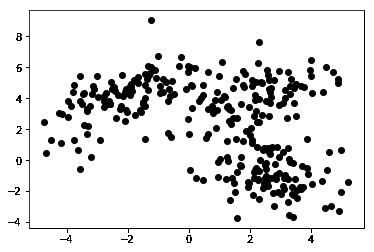
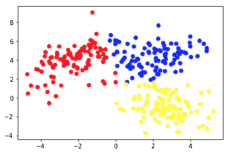
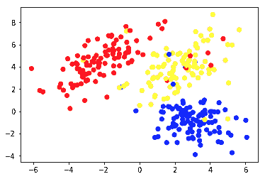
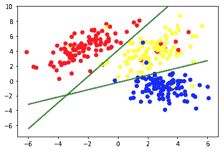
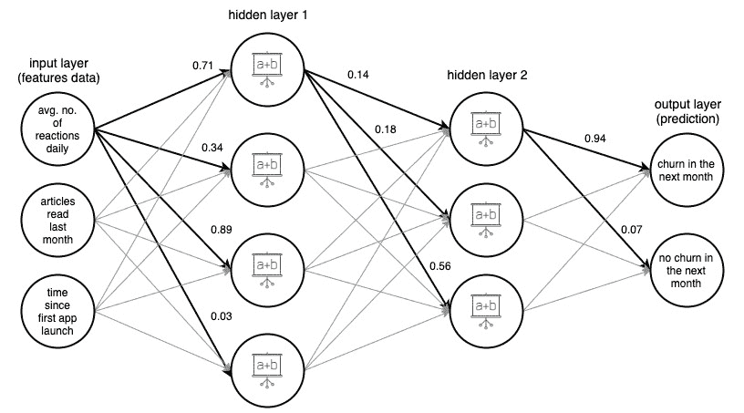
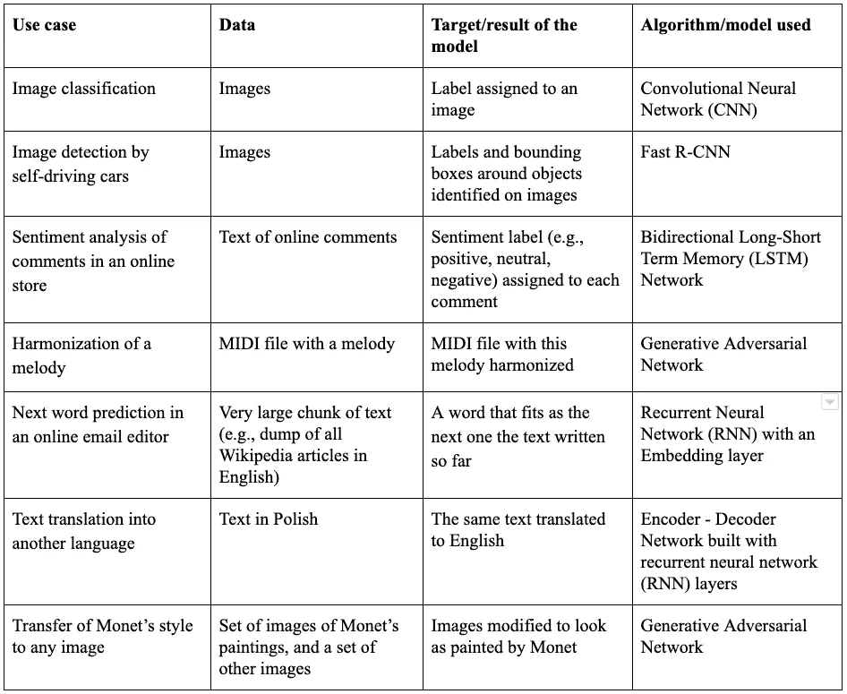

# 深度学习与机器学习

> 原文：<https://towardsdatascience.com/deep-learning-vs-machine-learning-e0a9cb2f288?source=collection_archive---------9----------------------->

由 [Unsplash](https://unsplash.com/s/photos/machine-learning?utm_source=unsplash&utm_medium=referral&utm_content=creditCopyText) 上的 [Pietro Jeng](https://unsplash.com/@pietrozj?utm_source=unsplash&utm_medium=referral&utm_content=creditCopyText) 拍摄

## 这些流行语到底是什么意思？而机器和深度学习的区别是什么？

介绍

近年来，机器学习、深度学习和人工智能已经成为热门词汇，在越来越多公司的营销材料和广告中随处可见。但是什么是机器学习和深度学习，它们之间有什么区别？在本文中，我将尝试回答这些问题，并向您展示一些深度和机器学习应用的案例。

什么是机器学习？

机器学习是计算机科学的一部分，它基于数据，用数学模型来表示现实世界的事件或对象。这些模型是用特殊算法构建的，这些算法调整模型的一般结构，使其适合训练数据。根据所解决问题的类型，我们定义了有监督和无监督的机器学习以及机器学习算法。受监督的机器学习专注于创建模型，这些模型能够将我们手头已经拥有的关于数据的知识转移到新数据，在训练阶段建模(训练)算法看不到这些新数据。我们提供了一种算法，该算法具有特征数据以及该算法应该学会从中推断的相应值(所谓的目标变量)。在无监督的机器学习中，我们只为算法提供特征，允许它自己找出它们的结构和/或依赖性。没有指定明确的目标变量。无监督学习的概念一开始可能很难理解，但是看一看下面四个图表中提供的例子应该会让这个想法变得清晰。

图表 1a

图表 1b

图表 1a 给出了一些数据，这些数据用轴 *x* 和 *y* 上的两个特征来描述。图表 1b 显示了相同颜色的数据。我们使用 *K-means* 聚类算法将这些点分组为 3 个簇，并相应地对它们进行着色。这是一个*无监督*机器学习算法的例子。算法只给出特征，标签(聚类数)要算出来。

图表 2a

图表 2b

图表 2a 显示了一组不同的标记(并相应地着色)数据。我们先验地知道每个数据点所属的组*。我们使用 *SVM* 算法找到两条直线，这两条直线将向我们展示如何分割数据点以最适合这些组。这种分割并不完美，但这是用直线能做到的最好的了。如果我们想要将一个组分配给一个新的、未标记的数据点，我们只需要检查它在平面上的位置。这是一个由*监督的*机器学习应用的例子。*

*机器学习模型的应用*

*创建标准的机器学习算法是为了处理表格形式的数据。这意味着，为了使用它们，我们需要某种类型的表，其中的行可以被认为是建模对象的实例(例如，贷款)，而列是这个特定实例的特征(特性)(例如，贷款的月还款额、借款人的月收入)。表 1。是这类数据的一个很短的例子。当然，这并不意味着纯数据本身必须是表格和结构化的。但如果我们想在一些数据集上应用标准的机器学习算法，我们通常必须首先清理、混合并将其转换为表格。在监督学习中，还有一个包含目标值的特殊列(例如，贷款是否违约的信息)。训练算法通过调整模型的参数来尝试使模型的一般结构适合这些数据，以便得到的模型尽可能准确地描述给定数据和目标变量之间的关系。重要的是，该模型不仅很好地符合给定的训练数据，而且还能够进行概括。一般化意味着我们可以使用该模型来推断训练期间没有使用的实例的目标。泛化是一个有用模型的关键特征。构建一个良好概括的模型不是一件容易的事情，通常需要复杂的验证技术和全面的模型测试。*

**

*表 1。表格形式的贷款数据*

*机器学习算法被用于各种应用中。表二。介绍一些可以应用非深度机器学习算法和模型的业务用例，以及对潜在数据、目标变量和选定的适用算法的简短描述。*

**

*表二。机器学习用例的例子*

*深度学习和深度神经网络*

*深度学习是机器学习的一部分，其中我们使用一种特定类型的模型，称为深度人工神经网络(ann)。自从它们被引入以来，人工神经网络经历了广泛的进化过程，产生了许多亚型，其中一些非常复杂。但是为了介绍它们，最好解释一下它们的一种基本形式——多层感知器(MLP)。*

*简而言之，MLP 具有顶点(也称为神经元)和边(由称为权重的数字表示)的图形(网络)形式。神经元按层排列，并且连续层中的神经元相互连接。数据通过网络从输入层流向输出层，在神经元和神经元之间的边缘进行转换。一旦一个数据点通过整个网络，输出层在其神经元中包含预测值。每次有一大块训练数据通过网络时，我们都会将预测值与相应的真实值进行比较，并调整模型的参数(权重)以使预测更好。这是通过一种叫做反向传播的算法实现的。经过一定次数的迭代后，如果模型的结构设计得很好，专门用于处理手头的机器学习问题，并且足够的数据已经多次通过网络，我们就可以获得高精度的模型。在实践中，有大量的转换可以应用于神经元，使人工神经网络非常灵活和强大。然而，人工神经网络的强大是有代价的。通常，模型的结构越复杂，将它训练到高精度所需的数据和时间就越多。*

**

*图一。一个 4 层人工神经网络的结构，根据三个简单的特征预测一个新闻应用程序的用户下个月是否会流失。为了清楚起见，仅标记了选定(粗体)边的权重，但是每个边都有自己的权重。数据从输入层流向输出层，通过中间的两个隐藏层。在每条边上，输入值乘以边的权重，所得乘积将到达边结束的节点。然后，在隐藏层的每个节点中，来自边缘的输入信号被求和，然后用某种函数进行变换。然后，这些转换的结果被视为下一层的输入。在输出层，传入的数据再次被汇总和转换，产生两个数字形式的结果——用户在下个月离开应用的概率，以及他们不离开的概率。*

*在更高级类型的神经网络中，各层具有更复杂的结构。它们不仅由 MLPs 中已知的具有单操作神经元的简单密集层组成，还包括更复杂的多操作层，如卷积层和递归层。卷积层主要用于计算机视觉应用。它们由在图像的像素表示上滑动的小型数字阵列组成。像素值乘以这些数字，然后聚合，产生新的、压缩的图像表示。递归层用于建模有序的序列数据，如时间序列或文本。他们对输入的数据应用复杂的多参数转换，试图找出序列项之间的依赖关系。然而，无论网络的类型和结构如何，总有一些(一个或多个)输入和输出层，以及数据在网络中流动的严格定义的路径和方向。*

*一般来说，深度神经网络是具有多个层的 ann。下图 1、2 和 3 显示了选定深度人工神经网络的架构。它们都是在谷歌开发和培训的，并向公众开放。他们给出了当今使用的高精度深度人工网络有多复杂的想法。*

*这些网络规模巨大。例如，图 3 中部分显示的 InceptionResNetV2 有 572 层，总共超过 5500 万个参数！它们都是作为图像分类模型开发的(它们为给定的图像分配一个标签，例如“汽车”)，并在 ImageNet 集合的图像上进行训练，该集合包含超过 1400 万个带标签的图像。*

**

*图二。NASNetMobile 的结构*

**

*图 3。例外结构*

**

*图 4。InceptionResNetV2 的一部分(约 25%)的结构*

*近年来，我们观察到深度学习及其应用的巨大发展。我们的智能手机和应用程序的许多“智能”功能都是这一进步的成果。虽然人工神经网络的想法并不新鲜，但最近的繁荣是一些条件得到满足的结果。首先，我们发现了 GPU 计算的潜力。图形处理单元的架构非常适合并行计算，对高效的深度学习非常有帮助。此外，云计算服务的兴起使得获取高效硬件变得更加容易、更加便宜，并且有可能在更大范围内实现。最后，最新移动设备的计算能力足以应用深度学习模型，从而为 DNN 驱动的功能创造了一个巨大的潜在用户市场。*

*深度学习模型的应用*

*深度学习模型通常适用于处理不具有简单行列结构的数据的问题，如图像分类或语言翻译，因为它们擅长处理这些任务处理的非结构化和复杂结构的数据——图像、文本和声音。使用经典的机器学习算法处理这些类型和大小的数据存在问题，并且创建和应用一些深度神经网络来解决这些问题已经在过去几年中在图像识别、语音识别、文本分类和语言翻译领域中引起了巨大的发展。*

*将深度学习应用于这些问题是可能的，因为 dnn 接受被称为张量的多维数字表作为输入和输出，并可以跟踪它们的元素之间的空间和时间关系。例如，我们可以将图像表示为 3 维张量，其中第一维和第二维表示数字图像的分辨率(图像宽度和高度的大小也分别如此)，第三维表示每个像素的 RGB 颜色编码(因此第三维的大小为 3)。这使得我们不仅可以用张量表示图像的所有信息，还可以保持像素之间的空间关系，这在所谓的卷积层的应用中至关重要，在成功的图像分类和识别网络中至关重要。*

*神经网络在输入和输出结构上的灵活性也有助于其他任务，如语言翻译。当处理文本数据时，我们向深度神经网络输入单词的数字表示，根据它们在文本中的出现进行排序。每个单词由一百或几百个数字的向量表示，通过计算(通常使用不同的神经网络)使得对应于不同单词的向量之间的关系模拟单词本身的关系。这些被称为嵌入的向量语言表示，一旦被训练，就可以在许多架构中被重用，并且是神经网络语言模型的核心构件。*

*表 3。包含将深度学习模型应用于现实生活问题的示例。正如你所看到的，深度学习算法处理和解决的问题比标准机器学习技术解决的任务复杂得多，如表 1 所示。然而，重要的是要记住，今天机器学习可以帮助企业的许多用例不需要如此复杂的方法，并且可以通过标准模型更有效地(和更高的准确性)解决。表 3。也给出了有多少不同类型的人工神经网络层的想法，以及有多少不同的有用的架构可以用它们来构建。*

**

*表 3。深度学习用例示例*

*深度学习模型的优势*

*深度神经网络最令人印象深刻的应用之一是生成式对抗网络(GANs)的兴起。它们是由 Ian Goodfellow 在 2014 年引入的，此后他的想法被纳入到许多工具中，有些工具取得了惊人的结果。GANs 负责应用程序的存在，这些应用程序使我们在照片中看起来更老，变换图像，使它们看起来像是梵高画的，甚至为多个乐器乐队协调旋律。在训练 GAN 的过程中，两个神经网络竞争。生成器网络从随机输入生成输出，而鉴别器则试图区分生成的实例和真实的实例。在训练期间，生成器学习如何成功地“愚弄”鉴别器，并最终能够创建看起来好像是真实的输出。*

*值得注意的是，尽管训练深度神经网络是一项计算量非常大的任务，并且可能需要很长时间，但应用经过训练的网络来完成特定任务并不是必须的，特别是如果它同时应用于一个或几个案例。事实上，今天我们能够在智能手机的移动应用程序中运行强大的深度神经网络。甚至有一些专门设计的网络架构在应用于移动设备时非常高效(例如图 1 所示的 NASNetMobile)。尽管与现有技术的网络相比，它们的尺寸小得多，但它们仍然能够获得高精度的预测性能。*

*人工神经网络的另一个非常强大的功能是迁移学习，它能够广泛使用深度学习模型。一旦我们有了一个根据某些数据(或者是我们自己创建的，或者是从公共存储库中下载的)训练的模型，我们就可以在它的全部或部分基础上构建一个解决我们特定用例的模型。例如，我们可以使用在巨大的 ImageNet 数据集上训练的预训练 NASNetLarge 模型，该模型为图像分配标签，在其结构顶部进行一些小的修改，用一组新的标记图像进一步训练它，并使用它来标记一些特定类型的对象(例如，基于树叶图像的树的种类)。迁移学习非常有用，因为通常训练一个深度神经网络来执行一些实际有用的任务需要大量的数据和巨大的计算能力。这通常意味着数百万个带标签的数据实例，以及数百个图形处理单元(GPU)运行数周。并不是每个人都能负担得起或获得这样的资产，这使得从头构建一个高精度的定制解决方案非常困难，比如说，图像分类。幸运的是，一些预训练的模型(特别是用于图像分类的网络和用于语言模型的预训练嵌入矩阵)已经开源，并且可以以易于应用的形式免费获得(例如，作为神经网络 API Keras 中的模型实例)。*

*如何为您的应用选择和构建正确的机器学习模型*

*当你想应用机器学习来解决一个商业问题时，你不需要马上决定模型的类型。通常有几种方法可以测试。一开始从最复杂的模型开始往往很诱人，但是从简单的开始，并逐渐增加所应用的模型的复杂性是值得的。更简单的模型通常在设置、计算时间和资源方面更便宜。此外，他们的结果是评估更高级方法的一个很好的基准。拥有这样的基准可以帮助数据科学家评估他们开发模型的方向是否正确。一个额外的优势是可以重复使用一些以前建立的模型，并将它们与新的模型合并，创建一个所谓的集合模型。混合不同类型的模型通常会产生比单独的组合模型更高的性能指标。此外，通过迁移学习，检查是否有一些预先训练的模型可以用于和适应您的业务案例。*

*无论您使用什么模型，都要确保数据得到正确处理。记住“垃圾进，垃圾出”的规则。如果提供给模型的训练数据质量很低，或者没有被正确地标记和清理，则很可能得到的模型也将表现不佳。还要确保模型——不管它有多复杂——在建模阶段得到了广泛的验证，并在最后测试了它是否能很好地推广到看不见的数据。*

*更实际的是，确保创建的解决方案可以在可用的基础设施上实现。如果你的企业可以收集更多的数据，用于在未来改进你的模型，那么应该准备一个再培训管道，以确保其易于更新。这种流水线甚至可以被设置成以预定义的时间频率自动地重新训练模型。*

*最后，不要忘记在将模型部署到产品中之后跟踪它的性能和可用性。业务环境是非常动态的，数据中的一些关系可能会随着时间的推移而改变，并且可能会出现新的现象。它们可以改变你的模型的效率，应该被正确对待。此外，还可以发明新的、功能强大的模型。一方面，它们可以使您的解决方案相对薄弱，但另一方面，给你机会进一步改善您的业务和利用最新的技术。*

*机器和深度学习模型可以帮助您为您的业务和应用程序构建强大的工具，并为您的客户提供卓越的体验。创建这些“智能”功能需要大量的努力，但潜在的好处是值得的。只要确保您和您的数据科学团队尝试合适的模型并遵循良好的实践，您就将走上正轨，为您的业务和应用提供尖端的机器学习解决方案。*

*来源:*

* [## Home - Keras 文档

### Keras 是一个高级神经网络 API，用 Python 编写，能够运行在 TensorFlow、CNTK 或…

keras.io](https://keras.io/) 

[https://en.wikipedia.org/wiki/Unsupervised_learning](https://en.wikipedia.org/wiki/Unsupervised_learning)

https://machinelearningmastery.com/what-is-deep-learning/

【https://developer.nvidia.com/deep-learning 

[https://arxiv.org/abs/1707.07012](https://arxiv.org/abs/1707.07012)

[http://yifanhu.net/PUB/cf.pdf](http://yifanhu.net/PUB/cf.pdf)

[https://towards data science . com/detecting-financial-fraud-using-machine-learning-three-way-winning-the war-against-balanced-a03f 8815 CCE 9](/detecting-financial-fraud-using-machine-learning-three-ways-of-winning-the-war-against-imbalanced-a03f8815cce9)

[https://scikit-learn.org/stable/modules/tree.html](https://scikit-learn.org/stable/modules/tree.html)

[https://aws.amazon.com/deepcomposer/](https://aws.amazon.com/deepcomposer/)

[https://blog . keras . io/a-ten-minute-introduction-to-sequence-to-sequence-learning-in-keras . html](https://blog.keras.io/a-ten-minute-introduction-to-sequence-to-sequence-learning-in-keras.html)

[https://keras.io/examples/imdb_bidirectional_lstm/](https://keras.io/examples/imdb_bidirectional_lstm/)

[https://towards data science . com/how-do-self-driving-cars-see-13054 aee 2503](/how-do-self-driving-cars-see-13054aee2503)

[https://towards data science . com/r-CNN-fast-r-CNN-faster-r-CNN-yolo-object-detection-algorithms-36d 53571365 e](/r-cnn-fast-r-cnn-faster-r-cnn-yolo-object-detection-algorithms-36d53571365e)

[https://towards data science . com/building-a-next-word-predictor-in-tensor flow-e 7e 681d 4 f 03 f](/building-a-next-word-predictor-in-tensorflow-e7e681d4f03f)

https://arxiv.org/pdf/1707.07012.pdf

【https://en.wikipedia.org/wiki/Unsupervised_learning 

sklearn 软件包—适用于图表 1a、1b、2a、2b

keras 包—用于图像 2、3、4

draw.io —用于图像 1*