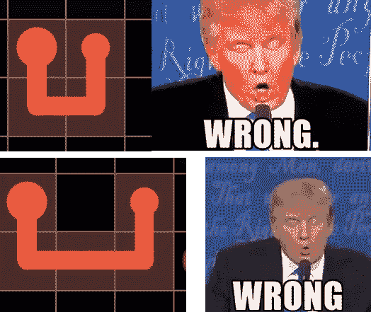

# 深度学习 vs 益智游戏

> 原文：<https://towardsdatascience.com/deep-learning-vs-puzzle-games-e996feb76162?source=collection_archive---------28----------------------->

## 深度学习是否比古老的强力技术更适合解决流量自由？

我们都经历过。你无聊地玩着手机，有一些时间可以消磨，所以你决定——违背你更好的判断——访问 app store 的游戏部分，看看有什么趋势。你看到一个看起来很有趣的益智应用，但这并不重要，因为你只会玩半个小时，然后删除它并忘记它，*对吗？*

两个月后，我完成了 2000 多级的[免流量](https://www.bigduckgames.com/)，坚持在每一级都获得“完美”评级。这款游戏是自 2012 年发布以来 iOS 和 Android 上最受欢迎的手机游戏之一，它的前提非常简单:在 2D 网格上连接不同颜色的“阀门”，没有两条线相交:

自由流动——你可以从一张截图中很好地理解这个游戏

截图中的关卡看似简单，但确实越来越难。随着关卡的进展，我发现自己想出了一些策略来帮助我更快地解决这些高级关卡(例如，尽可能坚持最外面的未填充边界，避免创建未填充方块的“入口”，等等)。)浏览网络论坛，看到其他玩家都有自己的技术，有些和我的相似，有些不同。这就引出了一个问题——一台计算机，不是通过蛮力，而是通过“经验”,也能学习这些技术吗？

一个人类(你真正的)正在解决一个自由流动的难题

# 从基础开始:A*

如今的深度学习问题大多归结为决定使用哪种算法。我从搜索开始。即使它本身不是深度学习，它也让我们很好地了解了问题的内在复杂性，并让我们有机会尝试一些更高级的算法*可以*自己解决的启发式算法。

空间复杂度太大，无法一次解决整个棋盘，所以我从逐颜色递归解决开始(如果给定的路径被“阻塞”，则回溯到上一个颜色)。作为启发，我使用了可靠的曼哈顿距离。我在 4 种尺寸的电路板上测试了我的算法:小型(2x4)、小型(5x5)、中型(8x8)和大型(14x14)。我确保了中型和大型棋盘的颜色比普通棋盘少*种*种，因为这实际上使谜题变得更加困难，对人类和计算机都是如此(更多可能的路径/选项/状态)。

这在小型电路板上运行良好，但需要相当多的时间。因此，我在下一个状态函数中添加了一些规则，希望强化学习算法能够自己找出这些规则:防止颜色相同的非连续相邻方块或空“入口”:

在我用了 7 年的电脑上的结果更令人鼓舞，但仍需要改进:

我很惭愧地说，我可能花了更多的时间在我的 Tkinter 绘图功能上，而不是实际的人工智能

# 如果你认为你是第一个这样做的人，你可能错了

在进入强化学习之前，我正在进一步优化我的 A*搜索，这时我发现了 Matt Zucker 的这篇[优秀博客文章，他已经为 Flow Free 构建了一个 A*求解器(很高兴看到我不是唯一一个痴迷于此的人)，并且更加仔细地考虑了要从他的 A*搜索中删除的州。更重要的是，他发现**一个只有 6 条规则的简单 SAT 算法胜过了他非常先进的 A*搜索**，并且用 SAT 得到了非常好的求解时间(甚至对于 14x14 的电路板也是亚秒)。](https://mzucker.github.io/2016/08/28/flow-solver.html)

到目前为止，我们似乎都得出了同样令人沮丧的结论:对于这种类型的(非对抗性的、封闭的)益智游戏，简单的暴力技术将胜过基本的人工智能算法。

然而，停留在那里是没有用的。毕竟，启动这一探索的问题仍然存在:作为人类玩家，我们在玩了几个级别后，发现了更有效地击败流自由谜题的特定技术。为什么机器不能学习同样的技术？

# 线索强化学习

我非常兴奋能在 Flow Free 上尝试 Q-learning，因为这才是“人工智能”中的“我”真正开始发挥作用的地方。A*搜索的工作绝不是浪费时间，因为我们可以用它作为 Q 学习代理的状态-动作空间。我们认为状态空间是棋盘上哪些方格被哪种颜色占据，以及哪条路径(颜色)当前是“活动的”的组合。一个动作就是填充该路径的下一个方块。

学习代理在一开始犯了一些基本错误后，很快学会了如何解决小问题(1.5s 内迭代 100 次)——目前看起来不错。然而，在中型板上，在 10，000 次迭代之后仍然没有骰子，这花费了 10 分钟:

不完全是你听到“人工智能”时想到的

为了改善这一点，我开始摆弄那些帮助不大的标准 Q-learning 参数(学习率α、折现率γ、探索/开采率ε)，于是我把注意力转向了奖励函数。除了玩实际的奖励之外，奖励函数本质上还有一个参数可以切换(或者有变得过于规定性的风险，这将违背整个机器学习练习):代理是否会因为解决了一条路径而不是整个谜题而获得奖励。不幸的是，这并没有带来多大的不同。

最后，很明显，该算法在较大的电路板上很难运行，仅仅是因为选项空间太大。与 A*搜索相比，Q-learning 确实在这种情况下有所帮助，因为它做出了更聪明的选择，但是仍然有太多的情况，即使在 10，000 次迭代之后，确切的 Q-learning 代理还没有看到。因此，下一个自然的步骤是:

# 近似 Q 学习

近似 Q 学习的应用非常吸引人，尤其是在游戏中。这个想法不是让代理在给定的状态下决定最佳行动，而是给它一些直观的特征，它可以在每一步快速计算，与确切的状态(棋盘的配置)无关，并让它决定哪些是最重要的。这可能是像 Pacman 这样的游戏中的游戏规则改变者(例如，根据到最近的小球和最近的幽灵的距离来决定你的下一步行动，而不是针对每个可能的状态的行动)，或者当然是自由流动，其中可能的状态的数量对于精确的 Q 学习来说太多了，以至于没有效果。

权衡的结果是，现在由开发人员来选择“正确的”特性。我将列表缩小到我知道在许多情况下很重要的特征(例如，关闭每条路径的剩余曼哈顿总距离)，以及一些我怀疑很重要(但没有办法证明)的特征，我会让算法找出这些特征。其中包括:

*   关闭每条路径的剩余曼哈顿总距离
*   “圈数”
*   “盒子”的数量
*   箱中阀门的数量
*   没有阀门的盒子的数量(人们可以从逻辑上证明这种情况永远不会发生——我想看看算法是否能解决这个问题)
*   一条路径是否“靠墙”(即，一条路径是否能粘住另一条相邻的路径)

不幸的是，有了这些特性，Q-learning agent 甚至不能解决小棋盘，即使在改变 Q-learning 参数之后。然而，看到它的运行是一个有趣的练习。例如，该算法给“没有阀门的盒子”附加了一个很大的负权重，这意味着**它能够了解到，有一个没有阀门的盒子会导致谜题无法解决**。

近似 Q 学习检测更好的游戏策略

也许有了更大的谜题样本，它可以更好地学习实际解决它们，但我很兴奋地看到它实际上选择了什么是重要的。这是人工智能中一个迷人的现象，尤其是在游戏人工智能中非常普遍:**即使一个算法不能赢得比赛，它也可以找到帮助人类更好地比赛的技术。**

# 走向监督:卷积神经网络

起初，我对自由流动的监督方法的想法有偏见。首先，它需要一个大样本的解决流量免费游戏，很难在公共互联网上找到。第二，似乎最接近无流匹配的监督方法——神经网络——是一个臭名昭著的黑箱，它将排除练习中最有趣的部分:看到算法学习解决难题的技术。

然而，我在《走向数据科学》杂志上看到了希瓦·维尔马的一篇文章[，他在文章中对数独做了一些非常类似的事情:本质上将数独棋盘视为图像，并使用*卷积*神经网络(CNN)来解决它。作者在数独上取得了很好的结果，这让我重新审视了我最初的保留意见，并尝试了这种无流量的方法。](/solving-sudoku-with-convolution-neural-network-keras-655ba4be3b11)

当然，第一个障碍是获取输入数据；以可解析文本格式解决的自由流谜题比数独谜题更难找到。我一开始发现的最好的方法是查看 Android 应用程序的代码，它有一千多个以文本格式存储的谜题:

CNN 的最初结果令人失望:测试样本中只有 0%的谜题被解决，尽管 **CNN 正在学习它应该制作路径**，而不仅仅是孤立地填充颜色。

## 我们需要更多的数据

调整层、时代、内核大小和其他类似的常见问题没有多大帮助。看起来我们又回到了数据科学家最常见的问题上:**如果没有足够的数据，世界上最好的算法就什么也不是**。我找到的最好的其他数据来源是 www.flowfreesolutions.com，有数以千计的全新谜题的免费解答，但都是图片格式的。

尽管我多次尝试通过各种渠道与他们联系(甚至提供了经济激励)，我还是无法让他们给我发送他们解决方案的可解析文本版本。嗯，这不是一篇没有意义的人工智能文章——当一个人拥有现代图像处理时，谁还需要底层的解决方案矩阵？提示一个子项目来构建一个[无流解决方案图像处理器](https://github.com/kgaspard/flow-free-ai/blob/master/imageParser.py):

sci kit-图像 FTW

## 利用对称性来增加我们可用的数据

这又产生了几千个数据点，但这仍然不多。但我随后意识到，就 CNN 而言，*颜色的确切值并不重要，重要的是颜色不同的事实*。因此，我们可以改变周围的颜色，仍然有另一个*非冗余*数据点。即使 5x5 电路板有多达 6 种不同的颜色，这给我们的 CNN 多达 6 种！=要处理的数据点增加了 720 倍(当然，更大的电路板和更多颜色的组合可供选择):

数学家将从群论中认识对称群 S_n

有朋友指出，这其实是游戏 AI 中常用的增加数据点的方法。有了 720 倍的数据点，我们终于取得了一些进展——在我 7 岁的 GPU 上运行 20 个时期的模型，大约 200，000 个数据点，测试数据的准确率为 12%。请注意，我们在这里使用了一个严格的成功标准:即使电路板差了一个单元，我们也认为这是一次失败。

然而，这里的失败比成功有趣得多。在几乎所有的失败中，**CNN 正确地解决了大部分问题，足以让人类轻松完成。**从这个意义上说，CNN 能够解决文章的原始前提:直观地学习人类的技术:

CNN 的误差分布

# 结论

*   简单的方法通常更适合解决基于网格的、非对抗性的益智游戏。事实上，随着方法逐渐变得更先进，性能变得更差。
*   然而，尽管更先进的 ML 方法不会很快解决这个难题，但它们确实找到了有趣的见解，并帮助人类找到更好的解决方案——卷积神经网络在这方面做得最好。此外，它们的性能比更传统的解决方案更具扩展性。
*   更好的数据胜过更好的算法。

# 更进一步:读者和编辑建议

我请一些更有经验的人工智能/人工智能专家(非常感谢[马特·祖克](https://mzucker.github.io/swarthmore/)、[优素福·基鲁兹](https://www.researchgate.net/profile/Youssef_Keyrouz)和[马克·萨鲁菲姆](https://medium.com/@marksaroufim))来评论这篇文章，他们建议尝试以下想法来改进 CNN 算法。这可能是第 2 部分文章的主题，或者您可以在 https://github.com/kgaspard/flow-free-ai 的**上随意尝试一下(以及本文中详述的方法):**

*   **改变 CNN 的层数(消融似乎没有帮助)**
*   **除了使用对称来增加我们的数据点，还使用旋转/反射**
*   **使用 CNN 预测作为强化学习代理的特征**