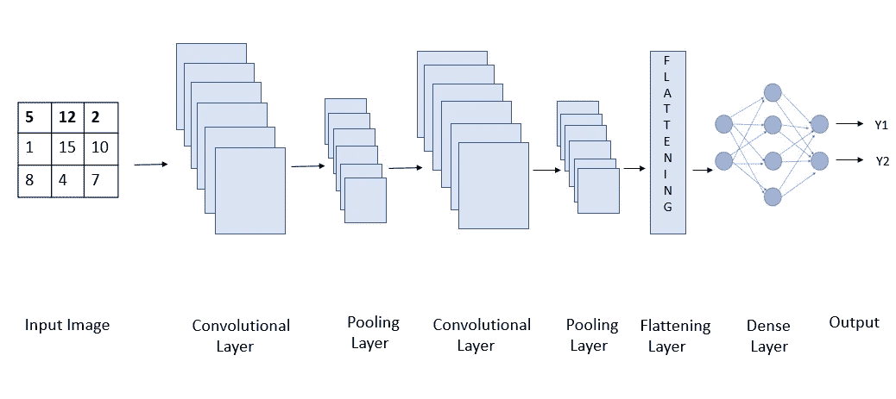
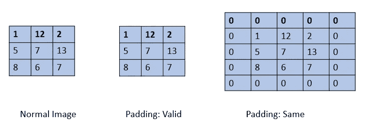
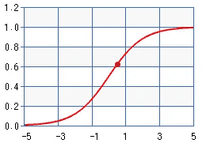
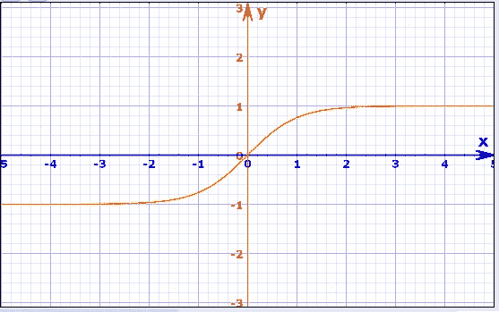
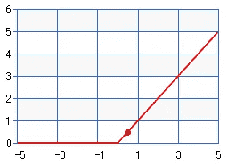
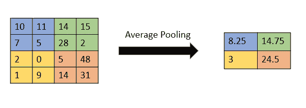
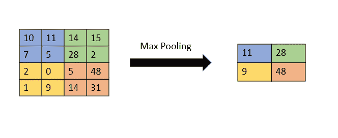
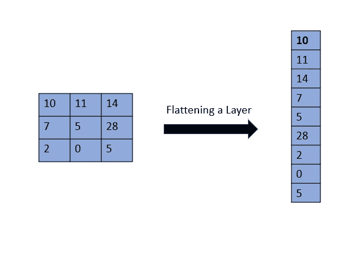

# 使用 CIFAR-10 进行深度学习

> 原文：<https://towardsdatascience.com/deep-learning-with-cifar-10-image-classification-64ab92110d79?source=collection_archive---------9----------------------->

## 基于 CNN 的图像分类

神经网络是可编程的模式，有助于解决复杂的问题，并带来最佳的可实现的输出。我们都知道深度学习比机器学习领先一步，它有助于训练神经网络来获得未回答问题的解决方案或改进解决方案！

在本文中，我们将使用 CIFAR-10 数据集实现一个深度学习模型。数据集通常用于深度学习，用于测试图像分类的模型。它有 60，000 幅彩色图像，包括 10 个不同的类别。图像大小为 32×32，数据集包含 50，000 幅训练图像和 10，000 幅测试图像。人们可以在这里找到 CIFAR-10 数据集[。](https://www.cs.toronto.edu/~kriz/cifar.html)

**导入数据**

深度学习模型需要具有高计算能力的机器。一般建议使用类似 Kaggle 或 Google Collaboratory 的在线 GPU。我已经在谷歌合作实验室实施了该项目。对于这个项目，我们将使用 TensorFlow 和 matplotlib 库。由于数据集是全局使用的，因此可以直接从 TensorFlow 库的 keras 模块导入数据集。

```
import tensorflow as tf
import matplotlib.pyplot as plt
from tensorflow.keras.datasets import cifar10 
```

**数据预处理**

任何机器学习、深度学习或数据科学项目的第一步都是对数据进行预处理。我们将定义类的名称，数据集分布在这些类上。大小为 32x32 的彩色图像有 10 种不同的类别。一旦我们设置了类名。我们需要标准化图像，以便我们的模型可以更快地训练。彩色图像的像素范围是 0–255。我们将图像的每个像素除以 255，因此像素范围将在 0-1 之间。实际上，我们将把它除以 255.0，因为它是一个浮点运算。对于该模型，我们将使用卷积神经网络(CNN)。

```
# setting class names
class_names=[‘airplane’,’automobile’,’bird’,’cat’,’deer’,’dog’,’frog’,’horse’,’ship’,’truck’]x_train=x_train/255.0
x_train.shape
x_test=x_test/255.0
x_test.shape
```

在 shape 的输出中，我们看到 4 个值，例如(50000，32，32，3)。这 4 个值如下:第一个值，即(50，000/10，000)表示图像的数量。第二个和第三个值显示图像大小，即图像高度和宽度。这里的图像大小为 32x32。第四个值显示“3”，它显示 RGB 格式，因为我们使用的图像是彩色图像。

**建立 CNN 模型**

CNN 模型分三个阶段工作。在第一阶段，卷积层提取图像/数据的特征。在第二阶段，池层减少了图像的维度，因此小的变化不会对模型产生大的变化。简单地说，它防止过度拟合。在第三阶段，展平层将我们的模型转换为一维，并将其提供给完全连接的致密层。这个密集层然后执行图像预测。一个好的模型有多层卷积层和池层。



CNN 架构(图片由作者提供，灵感来自[https://debugger cafe . com/convolutionary-neural-network-architectures-and-variants/](https://debuggercafe.com/convolutional-neural-network-architectures-and-variants/)

在创建神经网络模型时，一般使用两种 API:*顺序 API* 和*功能 API* 。*顺序 API* 允许我们逐层创建模型，并将其添加到顺序类中。顺序 API 的缺点是我们不能用它来创建一个模型，在这个模型中我们想要使用多个输入源并在不同的位置得到输出。为了克服这个缺点，我们使用函数式 API。通过使用*功能 API* 我们可以创建多个输入和输出模型。但是，在大多数情况下，使用的是顺序 API 。我们将为我们的 CNN 模型使用*顺序 API* 。

```
cifar10_model=tf.keras.models.Sequential()
# First Layer
cifar10_model.add(tf.keras.layers.Conv2D(filters=32,kernel_size=3, padding=”same”, activation=”relu”, input_shape=[32,32,3]))
```

我们使用卷积神经网络，因此我们将使用卷积层。最常用和我们正在使用的层是 *Conv2D。Conv2D* 表示卷积发生在 2 轴上。它将卷积扩展到三个层次，红色、绿色和蓝色。另一类卷积层是 *Conv1D。Conv1D* 一般用于“文本”， *Conv2D* 一般用于“图像”。我想大多数读者都知道什么是卷积以及如何做，但是这个视频将帮助你清楚卷积在 CNN 是如何工作的。

**Conv2D 层的参数**

第一个参数是 ***【滤镜】*** 。号码。滤波器的值表示 CNN 模型和卷积层将从中学习的滤波器的数量。从每个这样的过滤器，卷积层学习一些关于图像，像色调，边界，形状/特征。参数的值应该是 2 的幂。

第二个参数是“*”。内核指的是一个过滤器，它将在图像中移动，并使用点积提取零件的特征。内核大小是指过滤器的尺寸(高 x 宽)。内核大小的值通常是奇数，例如 3，5，7..等等。这里我们使用的内核大小为 3，这意味着过滤器大小为 3 x 3。*

*下一个参数是“***”***。有两种类型的填充，同样&有效。在有效填充中，图像边界上没有零填充。因此当卷积发生时，会有数据丢失，因为一些特征不能被卷积。在相同的填充中，在图像的所有边界上都填充了一层零，因此没有数据丢失。此外，卷积后图像输出的维数与图像输入的维数相同。上述是这种衬垫命名的原因。因为在初始层中我们不能丢失数据，所以我们使用了相同的填充。*

**

*图像和填充(作者提供的图像)*

*使用深度学习模型的原因是为了解决复杂的功能。为了得到更好的输出，我们需要以过于复杂的方式来拟合模型，因此我们需要使用能够解决模型的非线性复杂性的函数。这是通过使用激活层来完成的。在任何深度学习模型中，最少需要一个具有 ***激活功能*** 的层。激活函数的工作是给模型添加非线性。如果我们不添加这一层，模型将是一个简单的线性回归模型，不会达到预期的结果，因为它无法拟合非线性部分。*

*有 4 个著名的激活功能:*

1.  *)Sigmoid 函数:取值范围在 0 到 1 之间。该图是一个陡峭的图，所以即使是很小的变化也能带来很大的不同。它主要用于二元分类，因为当值高于或低于 0.5 时可以很容易地进行划分。*

**

*Sigmoid 函数的图形(图片由作者提供，创建于[https://www . maths isfun . com/data/function-grapher . PHP # functions](https://www.mathsisfun.com/data/function-grapher.php#functions))*

*2.)双曲正切函数:是正切双曲函数的缩写。它是 Sigmoid 函数的衍生函数。这些激活函数背后的数学原理超出了本文的范围，所以我不会跳到这里。该值的范围在-1 到 1 之间。*

**

*双曲正切函数图(图片由作者提供，创建于[https://keisan.casio.com/exec/system/1223039747?lang=en&charset = utf-8&var _ x = TanH % 28x % 29&ketasu = 14](https://keisan.casio.com/exec/system/1223039747?lang=en&charset=utf-8&var_x=tanh%28x%29&ketasu=14)*

*3.)ReLu 函数:是整流线性单元的缩写。是深度学习最著名的激活。这是著名的，因为它更容易计算，因为数学函数比其他激活函数更容易和简单。*

**

*ReLu 函数的图形(图片由作者提供，创建于[https://www . maths isfun . com/data/function-grapher . PHP # functions](https://www.mathsisfun.com/data/function-grapher.php#functions))*

*4.)SoftMax 函数:SoftMax 函数是 Sigmoid 函数的更多阐明形式。它用于多类分类。该函数计算函数中特定类的概率。因此，该函数的输出值范围在 0 到 1 之间。Sigmoid 函数和 SoftMax 函数的主要区别在于，Sigmoid 函数可用于二分类，而 SoftMax 函数也可用于多分类。*

***汇集层***

```
*#MaxPoolingLayer
cifar10_model.add(tf.keras.layers.MaxPool2D(pool_size=2,strides=2, padding=’valid’))*
```

*池层用于减小图像的大小，同时保留角色中的重要参数。这样有助于减少模型中的计算量。在执行卷积时，卷积层保留了关于特征的确切位置的信息。因此不太重要的特征也被完美地定位。因此，我们会遇到一个问题，即使是像素或特征的微小变化也会导致模型输出的巨大变化。通过最大池化，我们缩小了所有特性的范围，只考虑最重要的特性。因此，上述问题得以解决。池化有两种方式:平均池化或最大池化。通常使用最大池。*

**

*平均池(图片由作者提供，灵感来自[https://people . mines Paris . PSL . eu/fabien . moutarde/ES _ machine learning/TP _ conv nets/conv net-notebook . html](https://people.minesparis.psl.eu/fabien.moutarde/ES_MachineLearning/TP_convNets/convnet-notebook.html))*

*在平均池中，取池大小的平均值。在最大池中，取池大小的最大值。这个概念将从上面和下面的图像中被清除。*

**

*Max Pooling(图片由作者提供，灵感来自[https://people . mines Paris . PSL . eu/fabien . moutarde/ES _ machine learning/TP _ conv nets/conv net-notebook . html](https://people.minesparis.psl.eu/fabien.moutarde/ES_MachineLearning/TP_convNets/convnet-notebook.html))*

*池大小是指将取其最大值的过滤器的大小。这里的池大小 2 表示将使用 2x2 的池，在该 2x2 池中，平均值/最大值将成为输出。池将穿过图像。它将根据步幅值移动。*

*步幅意味着泳池的大小能跳多远。如果步幅为 1，2x2 池将从一列逐渐向右移动到另一列。我使用了 stride 2，这意味着池大小将一次移动两列。我前面用来解释最大池化和平均池化的图像的池大小为 2，步幅= 2。*

*在池中，我们使用填充“有效”，因为我们准备丢失一些信息。因为池的功能是减少图像的空间维度并减少模型中的计算。*

***最后一层***

```
*# Flattening Layer
cifar10_model.add(tf.keras.layers.Flatten())*
```

*在卷积层和汇集层的堆叠之后添加了展平层。展平层将 3d 图像矢量转换为 1d。因为在前面提到的层的堆叠之后，添加了最终的完全连接的致密层。现在，密集层要求数据以一维方式传递，因此扁平化层是最重要的。*

**

*平整层的工作(图片由作者提供)*

*展平一层后，还有一层致密层。致密层是一个完全连接的层，将先前功能的所有输出提供给所有神经元。密集层具有权重 W、偏差 B 和传递给每个元素的激活。*用一种清晰的方式说，它把所有的点连接起来。*这一层使用之前提取的所有特征，并完成训练模型的工作。提到的单位显示了模型将要使用的神经元的数量。*

```
*# Droput Layer
cifar10_model.add(Dropout(0.2))
# Adding the first fully connected layer
cifar10_model.add(tf.keras.layers.Dense(units= 128,activation='relu’))*
```

*现在，为了防止过度拟合，增加了一个脱落层。在数据训练期间，一些神经元被随机禁用。传递给神经元的值意味着在一次迭代中想要丢弃的神经元的比例。因此，在训练之后，神经元不会受到其他神经元的权重的很大影响。因此该模型可以更好地推广。*

**

*辍学层的工作(图片由作者提供，灵感来自[https://people . mines Paris . PSL . eu/fabien . moutarde/ES _ machine learning/TP _ conv nets/conv net-notebook . html](https://people.minesparis.psl.eu/fabien.moutarde/ES_MachineLearning/TP_convNets/convnet-notebook.html)*

***输出层***

*在输出中，图层根据数据集中的类数量使用单位数量。这里我们用 10，因为有 10 个单位。在输出中，我们使用 SOFTMAX 激活，因为它给出了每个类的概率。*

*在编制模型时，我们需要考虑损失函数。通常使用两种损失函数，稀疏分类交叉熵(scce)和分类交叉熵(cce)。稀疏分类交叉熵(scce)在类别互斥、类别完全不同时使用。当一个标签或部分可以有多个类别时，使用分类交叉熵。在我们的场景中，类是完全不同的，所以我们使用稀疏分类交叉熵。*

*我们将使用普遍使用的 Adam 优化器。Adam 是“自适应学习率法”的缩写。这个优化器使用梯度的初始值来适应学习速率。现在使用 Adam 代替 ML 中使用的随机梯度下降，因为它可以在每次迭代后更新权重。*

*玩了一会儿 epochs 后的最终输出是:*

*使用这个模型，我能够得到 78%的准确率。因此，在本文中，我们将使用 Google Collaboratory 完成深度学习项目。我们了解卷积神经网络的卷积层和池层中使用的参数。在 CNN 中提取特征后，我们需要一个密集层和一个 dropout 来实现识别图像的这一特征。最后，我们看到了一些损失函数和亚当优化。*

*您可以在我的 git 资源库中找到完整的代码:[https://github.com/aaryaab/CIFAR-10-Image-Classification](https://github.com/aaryaab/CIFAR-10-Image-Classification)。*

*请随时联系我，电话:【https://www.linkedin.com/in/aarya-brahmane-4b6986128/ *

*参考资料:你可以在[找到并制作一些有趣的图表](https://www.mathsisfun.com/data/function-grapher.php#functions)*

*图形图像是我在 Power point 上制作的。*

*快乐深度学习！*

*和平！！*