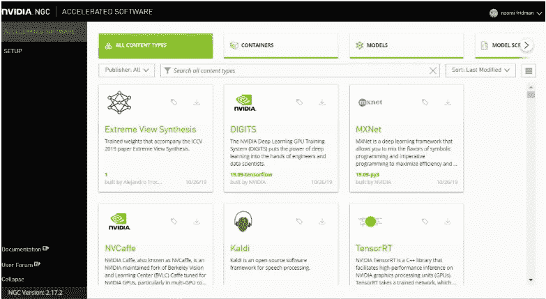

# 利用 NGC 的 docker 容器进行深度学习——英伟达 GPU 云

> 原文：<https://towardsdatascience.com/deep-learning-with-docker-container-from-ngc-nvidia-gpu-cloud-58d6d302e4b2?source=collection_archive---------15----------------------->

## 有一个基本的复制粘贴操作指南


docker 容器:)图片来自 [pixabay](https://pixabay.com/photos/container-port-loading-stacked-3118783/)

不再为深度学习环境的安装而烦恼。不再与 Cuda 版本和 GCC 编译器争斗。欢迎来到码头工人时代。你所需要的只是一个带有最新 Cuda 驱动程序的 Unix 系统。你只需要从 NGC 云下载一个 docker，它包含了你需要的环境和所有的 Cuda 代码。

其实写完这个帖子，发现自己用的越来越多了。由于我的主要工作是对医疗(高度安全)数据进行深度学习，所以我大量使用 dockers。当你必须在没有互联网的服务器上工作时(是的，没有 [StackOverflow](https://stackoverflow.com/) 这很痛苦)，docker 就是你的救星:)。您在正常环境中准备您的工作环境，然后您/系统管理员将其迁移到服务器。我现在正在探索的一个有趣的优势是用 git 库、手册等来丰富您的环境。我将在这里更新我发现的方法。

这里我们将使用 Python 3 和 TensorFlow 1.9，但也有带有 Pytorch、Caffe、trained model 等的 dockers。



[英伟达云](https://ngc.nvidia.com)图片来自英伟达云网站

# 获得自己的 Nvidia Docker

转到[https://ngc.nvidia.com/catalog/all](https://ngc.nvidia.com/catalog/all)。选择“容器”标签，查看所有可用的容器。我选择了 TensorFlow 容器:


[Nvidia cloud 上的 TensorFlow 容器](https://ngc.nvidia.com)

可以直接从云端使用，用:`nvcr.io/nvidia/tensorflow:` `19.12-tf2-py3`一个 TensorFlow2 docker。或者在您创建帐户并登录后下载它。

要下载 TensorFlow2 docker，请使用 pull 命令:

```
docker pull nvcr.io/nvidia/tensorflow:20.10-tf2-py3
```

下载 docker 需要一些时间。

# 启动 docker 容器

列出所有可用的本地 docker 图像

```
$ sudo docker images
```


```
**docker run --rm -it --runtime=nvidia --net=host -v <local dir>:<destination dir> <Image id>**
```

例如，对于本地码头，使用:

```
**docker run --rm -it --runtime=nvidia --net=host -v /my_server_dir/:/naomi** 989143febb16
```

或者使用 Nvidia cloud 的 docker:

```
docker run --gpus all -it --rm -v local_dir:container_dir nvcr.io/nvidia/tensorflow:19.12-tf2-py3
```

其中:

*   `-it`表示以交互方式运行
*   `--rm`完成后会删除容器
*   `-v`是挂载目录
*   `local_dir`是您希望从容器内部访问的来自主机系统的目录或文件(绝对路径)。`container_dir`是您在容器中时的目标目录。举个例子，

比如下面路径中的`local_dir`是`/home/jsmith/data/mnist` ，目标目录是:`/data/mnist`。

```
-v /home/jsmith/data/mnist:/data/mnist
```

例子取自:[https://ngc.nvidia.com/catalog/containers/nvidia:tensorflow](https://ngc.nvidia.com/catalog/containers/nvidia:tensorflow)

# 停止码头集装箱

```
# list running dockers:
$ docker ps# Find the docker container id, then run:docker kill <container id>
```


# 附加到正在运行的 docker 容器

当您想在 docker 中从外部运行一个命令时，您可以使用 exec，它允许您告诉正在运行的 docker 运行一个特定的命令。例如，当您失去管理 docker 的命令行窗口时，您可以使用 exec 在 docker 中运行命令行环境。这样，您可以附加到正在运行的 docker 容器。例如，使用下面的命令在 docker 容器中创建一个 shell。

```
**docker exec -it <container id> /bin/bash**
```


# 将包和数据添加到 Docker 容器中

当您在 docker 容器“内部”时，您是在 linux cmd 空间中。比如可以用 pip 安装 python 包，也可以上传数据。这个选项对于在没有互联网的服务器上处理安全数据的人来说非常有用，就像我在医疗行业一样。这样你就可以准备好你需要的一切，然后提交并传输到你的封闭服务器上。

如果你使用 Nvidia docker 容器，它没有 jupyter。您可以通过以下方式安装它:

```
**pip install jupyter**
```

# 在 docker 容器上运行 Jupyter 笔记本

如果你在一个图形用户界面环境中，像 RDP，你可以很容易地运行 jupyter 笔记本，只需做如下。如果您在服务器上只有 cmd，就像在 mobaxterm 中一样，那么就需要更多的步骤，这些步骤是在前面几节中指定的。

用以下命令启动笔记本:

```
**jupyter notebook --ip 0.0.0.0 --allow-root**
```


在您的浏览器中，键入: [http:// <服务器 ip >](http://192.168.15.20/) :8888/？令牌= <令牌>。在我们的案例中:

```
[http://100.200.15.20](http://192.168.15.20/):8888/?token=2a0630188ca7bc5b99d2c5b7923e2a2ebe391bc15a4bc3f1
```

复制 cmd 中给出的令牌。

如果端口 8888 被占用，或者有其他原因需要绑定端口，ise:

```
**jupyter-notebook --ip 0.0.0.0 --allow-root --port 5080**
```

然后使用地址:

```
[http://100.200.15.20](http://192.168.15.20/):**5080**/?token=2a0630188ca7bc5b99d2c5b7923e2a2ebe391bc15a4bc3f1
```

或者

```
[http://](http://192.168.15.20/)**0.0.0.0**:**5080**/?token=2a0630188ca7bc5b99d2c5b7923e2a2ebe391bc15a4bc3f1
```

使用笔记本安装软件包和其他后端人员非常方便。就用！命令行的开头，并在单独的单元格中运行每个命令行。例如:

```
! pip install keras
```

要在 docker 映像中保存您的安装，不要忘记提交 docker。

# 提交码头工人

提交一个 docker，将为您的所有安装创建一个新的 docker。

```
docker commit <docker container id> <new docker name>:<docker tag>
```

例如，使用以下命令提交 docker:

```
docker commit   9571cb71d812 naomi/brats:version2
```

将创建一个 docker 映像，运行“docker images”时将如下所示:


# Docker —基本摘要

一篇没有复制粘贴的文章有什么价值呢:)

```
**# run
docker run --rm -it --runtime=nvidia --net=host -v <local dir>:<destination dir> <docker Image id>****# list available dockers
docker images****# list running docker
docker ps****# attach to a running docker
docker exec -it <container id> /bin/bash****# run notebook
jupyter notebook --ip 0.0.0.0 --allow-root****# commit a docker
docker commit <docker container id> <new docker name>**
```

更多关于使用 dockers 和每个标志的含义的解释可以在这里找到:[https://ngc.nvidia.com/catalog/containers/nvidia:tensorflow](https://ngc.nvidia.com/catalog/containers/nvidia:tensorflow)

下面是一些不太常见但却是必需的场景。

# 从 Mobaxterm 运行 Jupyter 笔记本

这个想法是在 cmd 上运行 jupyter 命令，并在本地机器上打开笔记本。这需要 ssh 隧道，如下所述:

**Windows 端**首先，生成 ssh 密钥:[https://phoenixnap.com/kb/generate-ssh-key-windows-10](https://phoenixnap.com/kb/generate-ssh-key-windows-10)，这个过程会在你的本地电脑上创建一个文件。

**Mobaxterm 端**打开隧道菜单来定义你的隧道。


Mobaxterm ssh 隧道

假设你的远程服务器是 52.522.52.522，你的用户名是`naomi`，你选择了 1200 作为端口(你可以选择任意一个 antaken 号)，填写下面，保存。


保存并添加您之前创建的 ssh 密钥，在密钥图标中:


为隧道和 ssh 会话添加 ssh 密钥

**窗口端**在 Powershell 中以管理员身份运行以下命令

```
**ssh -NL 1200:localhost:1200 naomi@**52.522.52.522
```

**Mobaxterm side** 在 Mobaxterm cmd 窗口中运行以下命令:

```
jupyter notebook — no-browser — port 1200
```

将您从输出中获得的地址复制到本地 windows 机器上的 chrome 或类似设备中，您就可以在笔记本中工作了:

```
[http://127.0.0.1:1200/?token=36401f7dada8b4cb5eb2d15b70ac3e4963633e7dd5b922d1](http://127.0.0.1:1250/?token=36401f7dada8b4cb5eb2d15b70ac3e4963633e7dd5b922d1)
```

# 重新连接到正在运行的 Jupyter 笔记本

深度学习训练通常需要很长时间。因此，在大多数情况下，当在远程服务器上工作时，连接被关闭，笔记本的令牌丢失。要查找正在运行的笔记本的令牌，请执行以下操作:

```
# use -mtime -30 to list only notebooks that started in the last 30 days.find `jupyter --runtime-dir` -mtime -30 | grep nbserver | xargs cat
```

您将看到如下内容:

```
...
<body><p>
    This page should redirect you to Jupyter Notebook. If it doesn't,
    <a href="[http://0.0.0.0:8888/tree?token=7caaccce4fb4e670d9053b67c773e93c4a6ceb128fde2f56](http://0.0.0.0:8888/tree?token=7caaccce4fb4e670d9053b67c773e93c4a6ceb128fde2f56)">click here to go to Jupyter</a>.
</p>
...
```

只需将地址(将 0.0.0.0 更改为您的服务器 IP 或 localhost)复制到您的浏览器，即可重新打开正在运行的笔记本。

# 用户问题

在 docker 容器中，你是你的王国的国王，你是根用户，我猜这是安装所需要的。即使您没有 root 密码，您编写的文件也会在磁盘上获得 root 所有权。删除您在容器中创建的文件只能通过 root 密码或 docker 来完成。我还没想明白。如有真知灼见，不胜感激。

# 安装 Docker 引擎

如果您需要安装新的 docker 引擎，请遵循此处的说明。为了方便起见，我将添加推荐方法的简短摘要。

## 使用存储库安装

对于主机:焦点 Ubuntu 20.04 LTS，版本:20.04。x86_64 / amd64。

```
# Set up the repository
$ sudo apt-get update
$ sudo apt-get install \
    apt-transport-https \
    ca-certificates \
    curl \
    gnupg-agent \
    software-properties-common# Add Docker’s official GPG key:
$ curl -fsSL https://download.docker.com/linux/ubuntu/gpg | sudo apt-key add -# set up the **stable** repository
$ sudo add-apt-repository \
   "deb [arch=amd64] https://download.docker.com/linux/ubuntu \
   $(lsb_release -cs) \
   stable"
```

## 安装 Docker 引擎

```
$ sudo apt-get update
$ sudo apt-get install docker-ce docker-ce-cli containerd.io
```

启动 docker 守护进程

```
sudo dockerd
```