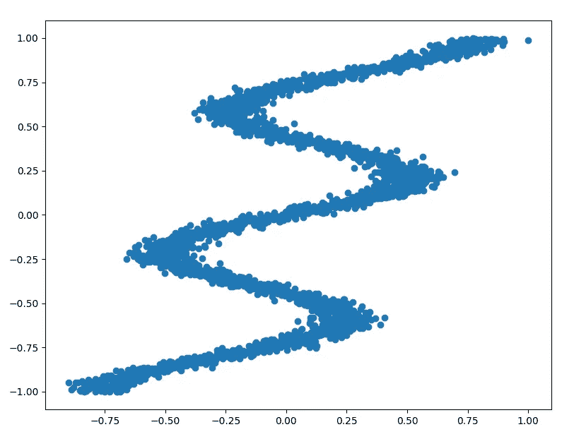
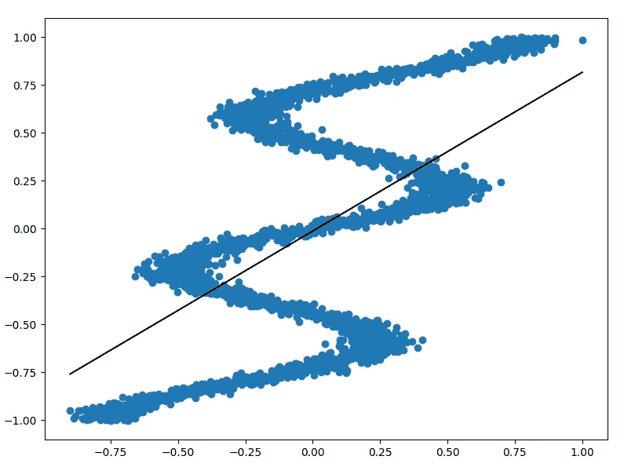
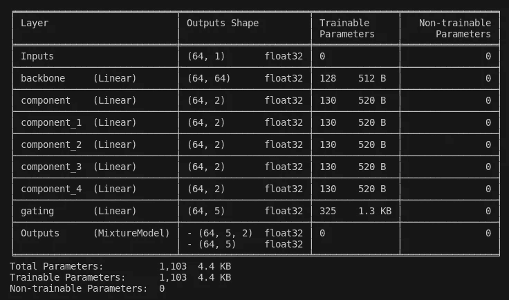
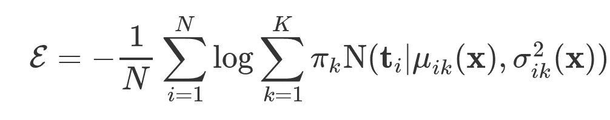
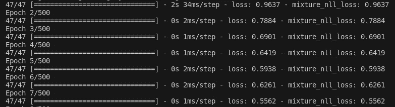
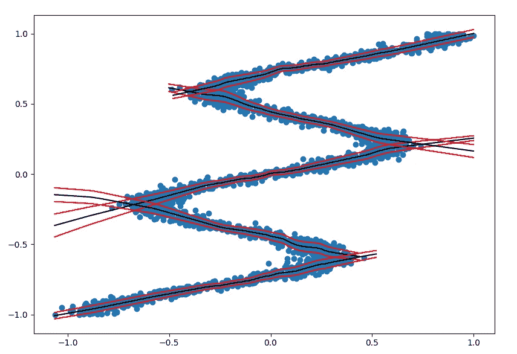
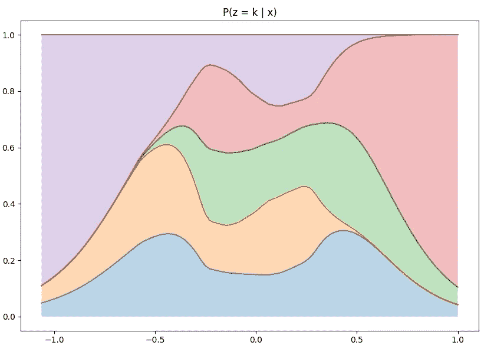

# 用 Jax 和 Elegy 进行深度学习

> 原文：<https://towardsdatascience.com/deep-learning-with-jax-and-elegy-c0765e3ec31a?source=collection_archive---------16----------------------->

照片由[张秀坤镰刀](https://unsplash.com/@drscythe?utm_source=unsplash&utm_medium=referral&utm_content=creditCopyText)在 [Unsplash](https://unsplash.com/s/photos/robot?utm_source=unsplash&utm_medium=referral&utm_content=creditCopyText) 上拍摄

## 超越张量流、Pytorch 和 Keras

在这篇文章中，我们将探索如何利用 [Jax](https://github.com/google/jax) 和 [Elegy](https://github.com/poets-ai/elegy) 来创建深度学习模型。在这个过程中，我们将看到 Jax 如何与 TensorFlow 和 Pytorch 相比较，以及 Elegy 如何与 Keras 相比较。

# Jax 是什么？

毫无疑问，TensorFlow (2015)和 Pytorch (2016)在 ML 社区中产生了巨大的影响，他们之间的“军备竞赛”使他们收敛到一组类似的功能(查看 ML 框架 2019 年的状态，可以很好地总结他们的斗争)。Jax (2018)是最新加入的一员，它很好地体现了这种融合。但是 Jax 没有直接成为一个深度学习框架，而是创建了一个超级完美的线性代数库，具有自动微分和 XLA 支持，一些人将其称为类固醇上的 Numpy。

这里有一些让 Jax 变得令人敬畏的东西。

## Numpy API

> Jax 实现了 Numpy API，并使它成为操作 Jax 数组的主要方式。

这实际上是一件大事，因为 Numpy 是 Python 中数值计算的通用语言，每个数据科学家都已经有了无数小时的 Numpy 经验，而不管其具体的实践领域。这让和 Jax 一起工作变得非常愉快。不仅如此，Jax 的`ndarray`基类继承了 Numpy 的`ndarray`类型，这意味着第三方库可以接受这些结构。您甚至可以开始使用 Jax“仅仅”加速您现有的 Numpy 代码，只需很少的改动。

## 统一的 API

> Jax 为 eager 和 JIT 执行提供了一个干净统一的 API。

现在 TensorFlow 和 Pytorch 都有 eager 和 compiled 执行模式，但是，它们都添加了在框架生命周期后期缺失的模式，这留下了伤疤。例如，在 TensorFlow 中，急切模式是以这样一种方式添加的，它与图形模式不是 100%兼容，这导致了糟糕的开发人员体验。在 Pytorch 的案例中，它最初被迫使用不太直观的张量格式(如其 vision API 上的`NCWH`),只是因为它们在 eager 模式下更具性能，并且出于兼容性原因保留了它们。另一方面，Jax 天生就有这两种模式，并受这两种模式的影响，它主要侧重于使用 eager for debugging 和 JIT 来实际执行繁重的计算，但是您可以在方便的时候混合使用这两种模式。

## XLA

> Jax 基于**下一代** ML 编译器技术。

Jax 专门使用 [XLA](https://www.tensorflow.org/xla) ，而不是求助于设备相关的 C++和 CUDA 代码的混合。虽然 TensorFlow 是 XLA 存在的原因，但它的使用并没有在其代码库中完全普及，仍然有设备相关的代码。另一方面，Pytorch 有令人沮丧的大量依赖于设备的代码，以至于某些操作只在特定设备上受支持( [pytorch/xla](https://github.com/pytorch/xla) 是个东西，但它只关注 TPU 支持)。

## 特种作战

> Jax 带来了一组独特的强大的函数转换。

Jax 有一些新颖的、易于使用的转换，使用户能够执行在其他框架中很难甚至不可能执行的复杂操作。例如，`grad`使计算 *n 阶*阶梯度变得极其容易，`vmap`使用户能够编写每个样本的操作，并自动将它们应用到整个批次，而`pmap`使用户能够轻松地在器件之间分配计算。你可以在 Jax 的官方文档[中找到更多的转换。](https://jax.readthedocs.io/en/latest/)

**兼容性**

> Jax 是 Pythonic 的。

这曾经是 Pytorch 的发明，但是 Jax 通过将它的架构建立在函数组合和基本 python 类型的基础上，将它带到了另一个层次，也就是说，Jax 可以区分列表、元组和字典等类型！这不仅仅是一个巧妙的技巧，许多基于 Jax 的框架都依赖于这个特性。Jax 还实现了像`__array__`和`__array_module__`这样的协议，最大化了它与 Python 数据科学生态系统的兼容性。

# 挽歌深度学习

虽然 Jax 从一开始就具备了创建神经网络的所有要素，但它并没有一个用于此目的的成熟框架。然而，在过去的几个月中，出现了一些面向研究的框架，如 **Flax** 、 **Trax** 和 **Haiku** ，这些库专注于定义一个层接口，同时试图提出策略来执行与 Jax 的功能纯度限制兼容的状态管理。

虽然这些努力是朝着正确方向迈出的一大步，但如果你正在寻找像 Keras 这样更实用的东西，它们会让你感到有点格格不入，因为你会发现自己在编写自己的训练循环、损失函数和指标。

进入挽歌。

## 什么是挽歌？

[Elegy](https://github.com/poets-ai/elegy) 是一个基于 Jax，受 Keras 和俳句启发的深度学习框架。挽歌有以下目标:

*   **易于使用**:Keras 模型 API 超级简单易用，所以 Elegy 移植了它，并试图尽可能地遵循它。Keras 用户在使用 Elegy 时要有宾至如归的感觉。
*   **灵活性**:虽然 Keras 很简单，但对于某些用例来说也非常严格，Elegy 使用*依赖注入*在定义模型、损失和指标时给你最大的灵活性。
*   **简洁**:与 Keras 或 Pytorch 相比，Elegy 基于钩子的[模块系统](https://poets-ai.github.io/elegy/guides/module-system/)使得编写模型代码更加容易(不那么冗长),因为它允许您直接在`call` (forward)方法中声明子模块、参数和状态。

要查看 Jax 和 Elegy 的运行情况，让我们看一个简单但重要的例子。

# 研究案例:混合密度网络

我们将为这个 1D 回归问题创建一个模型:

如你所见，这是一个*逆问题*，这意味着对于 **X** 中的一些值，在 **Y** 中有不止一个可能的解。这个问题很有趣，因为开箱即用的分类器不能很好地处理这种类型的数据。如果我们将这些数据进行简单的线性回归，将会产生这个模型:

这显然不是一个好的解决方案，因为它的大多数预测都在数据分布之外。对此建模的一个好方法是使用混合密度网络，这是一种混合模型。我们不会在这里深入讨论这个理论的细节，但是你可以参考[混合密度网络的便车指南](/a-hitchhikers-guide-to-mixture-density-networks-76b435826cca)了解更多信息。

## 进口

我们将从导入我们将使用的一些库开始，包括 Numpy、Jax 和 Elegy。

## 定义架构

接下来，我们将定义模型的架构。在《挽歌》中，基本的抽象被称为“T0”，这个命名惯例是从俳句“T23”中借用来的。像 Keras 中的`Layer`一样，`Module`必须定义代表网络前向计算的`call`方法。在`call`方法中，你可以使用 Jax 函数和其他模块来定义架构，你可以在`elegy.nn`中找到像`Linear`或`Conv2D`这样的通用模块。

对于我们的混合密度网络，我们将定义一个简单的*主干*结构(`x`)，然后将其分成多个*组件* ( `y`)，其中每个组件将尝试对一部分数据的均值和方差进行建模。从主干我们还将创建一个*门控*头(`probs`)，它将分配概率权重给由`x`调节的每个组件。

这段代码中发生了很多事情，您现在不需要理解所有内容，但是请注意以下事项:

1.  我们正在使用`k`组件创建一个混合密度网络，其中`k`是一个超参数。我们将该值设置为`5`。
2.  我们正在对`elegy.nn.Linear`进行各种各样的内联调用，事实上，我们甚至在列表理解中直接这样做。相比之下，Keras 或 Pytorch 通常会先在`__init__`上定义子模块，然后在`call` / `forward`中使用它们，从而分割代码。这些内联调用被称为[模块挂钩](https://poets-ai.github.io/elegy/guides/module-system/#module-hooks-functional-style)，它们使得读写模型代码更加容易。
3.  我们使用来自`jax.nn` [模块](https://jax.readthedocs.io/en/latest/jax.nn.html)的函数，像`relu`和`softmax`，这个模块包含了很多对神经网络有用的函数。
4.  我们使用了来自 [Jax 的 Numpy API](https://jax.readthedocs.io/en/latest/jax.nn.html) 的`stack`函数，我们将其作为`jnp`导入。

如果我们为这个模型生成一个 Keras 风格的摘要(我们将在后面看到如何做),我们将得到下面的描述:

这里我们使用的是`64`的批量大小。请注意，我们有 2 个输出:

*   我们称之为`y`的第一个包含了我们的`5`分量的均值和方差，这就是为什么它具有形状`[64, 5, 2]`。
*   第二个我们称之为`probs`的是我们每个`5`组件的概率权重，这就是为什么它有形状`[64, 5]`。

## 创建损失函数

接下来我们将定义我们的损失函数。对于这种问题，如果我们假设每个组件都由正态分布建模，那么损失应该是给定数据的模型的负对数似然性。损耗由以下公式给出:

这里𝜋 *k* 代表每个成分`k`的概率权重，我们称之为`probs`，函数 *N* (…)代表每个成分的正态分布的概率密度函数，这将由`y`参数化。我们将通过创建一个从`elegy.Loss`继承的类来实现这个损失，并使用常规的 Jax 操作来计算这个公式。

在 Keras 中，定义复杂的损失函数和指标是一个公认的[痛点，幸好 Elegy 给了我们更多的灵活性，我们实际上可以基于多个输出创建一个单一损失，而无需匹配数量的标签🥳.默认情况下，`y_pred`只是模型返回的内容，在这种情况下是一个元组，所以我们在第三行将其销毁为`y`和`probs`，而`y_true`只是用户传递的标签，在这种情况下，它只是一个带有 **Y** 值的数组，所以我们不必做任何事情。](https://twitter.com/fchollet/status/1296292123768025090)

代码或多或少以一对一的方式实现了上面的公式。注意，我们使用`jax.scipy.stats.norm.pdf`来计算给定模型输出参数的数据的概率，这很酷，因为大多数 Numpy 用户都熟悉 Scipy，可以利用他们对这个库的了解。`safe_log`只是`log`的一个简单的自定义函数，数值稳定。

## 训练模型

Elegy 附带了一个[模型](https://poets-ai.github.io/elegy/api/model/Model/)接口，它实现了 Keras 上的大多数方法，如`fit`、`evaluate`、`predict`、`summary`等，只做了一些小的改动。这使得挽歌中的训练模型超级容易！`Model`的构造函数接受一个`Module`作为它的第一个参数，并且大多数参数被`keras.Model.compile`接受，我们将使用它来传递我们的`MixtureModel`和`MixtureNLL`损失的一些实例，加上来自 [optax](https://github.com/deepmind/optax) 库的`adam`优化器。

有了这个模型实例，我们可以使用`summary`来打印带有我们之前看到的架构描述的表格，它与 Keras 版本略有不同，因为它要求您传递一个样本输入作为其第一个参数，它还接受一个可选的`depth`参数，该参数允许您控制您希望摘要有多详细。

最后，我们使用`fit`方法训练模型。虽然在这种情况下，给出的例子在 Keras 中也是有效的，但是 Elegy 的`fit`方法对输入数据做了轻微的修改。特别是，Elegy 对您使用的数据管道框架保持不可知，因为它只支持`ndarrays`或包含`ndarrays`(元组、列表、字典)的结构以及`ndarrays`的生成器/迭代器或这些结构。你可以通过利用[dataset . as _ numpy _ iterator](https://www.tensorflow.org/api_docs/python/tf/data/Dataset?hl=fr#as_numpy_iterator)方法或 Pytorch 的`DataLoader`来避免`to_tensor`转换，从而轻松使用`tf.data`。

在培训过程中，您将看到通常的 Keras 进度条，显示损失和指标的值😊。总的来说，您会发现，与其他更面向研究的 Jax 库相比，Elegy 中的培训要简单得多，因为它提供了常见损失、指标和 Keras 中可用的大多数回调的实现，这些实现支持创建检查点、提前停止、TensorBoard 等。

查看 Elegy 的[文档](https://poets-ai.github.io/elegy/)了解更多信息。

## 结果

一旦训练完毕，我们就可以通过绘制覆盖在数据上的预测来检查每个组件学习到的分布。

这里黑线是成分的预测平均值，红线代表数据的估计标准偏差。我们将每个分量的图限制在概率高于某个阈值的区域，以了解其沿数据的分布。但是，我们也可以独立地将 **X** 中每个点的每个分量的概率权重可视化:

正如所料，有一个分量在 **X** < -0.75 的点(靠近左下方的分量)占优势，另一个分量在 **X** > 0.75 的点(靠近右上方的分量)占优势。其余的点将其概率分布在不同的成分中，但根据不同点的数据密度略有不同。

## 代码

如果你想要更详细的代码视图或者自己运行它，你可以在[cgarciae/simple-mixture-models 查看。](https://github.com/cgarciae/simple-mixture-models)

# 概述

*   Jax 是一个干净的线性代数库，内置自动微分功能，在 XLA 的基础上实现，吸取了前人的所有经验。
*   Jax 非常 Pythonic 化，它的 Numpy API 非常棒，并且它与数据科学生态系统的其余部分非常兼容。
*   Elegy 为创建深度学习模型提供了类似 Keras 的体验，而且它比 Flax、Trax 和 Haiku 等替代品更容易使用。
*   Elegy 引入了一些机制，使得定义模型代码变得更容易/不那么冗长，并且与 Keras 相比，在损失和度量的定义方面提供了更多的灵活性。

我们希望你喜欢这篇文章。如果你喜欢它请分享它，如果你喜欢[挽歌](https://github.com/poets-ai/elegy)在 Github 上给它一颗星。欢迎反馈。

我要感谢[大卫·卡多佐](https://twitter.com/_davidcardozo)和[卡洛斯·阿尔瓦雷斯](https://twitter.com/charlielito42)的反馈和支持。