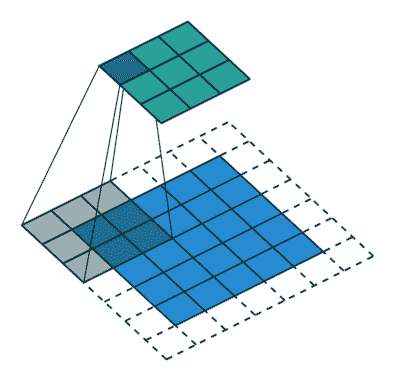

# 与 Julia 深度学习，Flux.jl story

> 原文：<https://towardsdatascience.com/deep-learning-with-julia-flux-jl-story-7544c99728ca?source=collection_archive---------17----------------------->

## 步入淡水


照片由[富山武广](https://unsplash.com/@tommy_c137?utm_source=medium&utm_medium=referral)在 [Unsplash](https://unsplash.com?utm_source=medium&utm_medium=referral) 上拍摄

# 介绍

数据科学领域出现了一个新的挑战者:Julia。它速度快，易于输入，有很好的文档和社区。

但它缺乏例子和教程来学习，所以在这篇文章中，我们将建立一个经典的:MNIST 分类器使用卷积神经网络。

## 是给谁的？

对于那些对深度学习略知一二，但对尝试一门新语言充满好奇的人来说，我将把重点放在对初学者更友好的风格上。我将尝试解释 Julia 语法与 Python 的不同之处。

## 我们将使用什么？

Flux.jl .是 Julia 主要的深度学习库之一。你可以在这里查看一些例子，尽管它们对初学者来说有些吓人。


来自 flux 主页的官方 logo:[https://fluxml.ai/](https://fluxml.ai/)

## 我为什么要在乎？

虽然 PyTorch 或 TensorFlow 已经为 Python 的深度学习提供了一个很好的生态系统，但它们大多是用 C++甚至 Cuda 编写的，以获得出色的 GPU 性能。


PyTorch GitHub 页面的语言统计

因此，如果你想写一些自定义代码来做一点试验，这可能会变得相当复杂*(尽管在其中编写生产代码可能仍然是一个更好的主意)*。


来自 TensorFlow GitHub 页面的语言统计

另一方面，朱莉娅从一开始就为你提供了速度。所以如果你想写一些自定义的损失函数，你可以在 Julia 中完成。将它与很少的努力结合起来，放在 GPU 上并清除源代码，即使对初学者来说，你也有相当吸引人的东西。


Flux GitHub 页面的语言统计

# 包和数据集

导入包非常简单。为了更简单的数据准备，我们将导入**通量** *(当然)***统计**和 **MLDatasets** 。

```
using Flux
using Flux: Data.DataLoader
using Flux: onehotbatch, onecold, crossentropy
using Flux: @epochs
using Statistics
using MLDatasets# Load the data
x_train, y_train = MLDatasets.MNIST.traindata()
x_valid, y_valid = MLDatasets.MNIST.testdata()# Add the channel layer
x_train = Flux.unsqueeze(x_train, 3)
x_valid = Flux.unsqueeze(x_valid, 3)# Encode labels
y_train = onehotbatch(y_train, 0:9)
y_valid = onehotbatch(y_valid, 0:9)# Create the full dataset
train_data = DataLoader(x_train, y_train, batchsize=128)
```

*(亲提示:默认情况下 Julia 会打印该函数的输出。您可以抑制它，但键入“；”结束)*

Flux 将期望我们的图像数据按照 WHCN 顺序*(宽度，高度，#通道，批量)*，所以我们必须添加一个通道层。幸运的是，已经有了一个名为`unsqueeze`的函数。

稍后我们将使用交叉熵损失，因此我们还需要使用`onehotbatch`对标签进行编码。

# 模型

## 层

我们的模型将有 8 层。其中 4 个将是 Relu 的卷积，然后我们将意味着池化，展平它，最后用 softmax 填充到一个线性层中。

我们可以使用`Chain`函数将所有东西“链接”在一起

```
model = Chain(
    # 28x28 => 14x14
    Conv((5, 5), 1=>8, pad=2, stride=2, relu),
    # 14x14 => 7x7
    Conv((3, 3), 8=>16, pad=1, stride=2, relu),
    # 7x7 => 4x4
    Conv((3, 3), 16=>32, pad=1, stride=2, relu),
    # 4x4 => 2x2
    Conv((3, 3), 32=>32, pad=1, stride=2, relu),

    # Average pooling on each width x height feature map
    GlobalMeanPool(),
    flatten,

    Dense(32, 10),
    softmax)
```

每个卷积层获取一个图像，并从中创建通道层。因此，下一个卷积层将采取一个更小的图像，其中有更多的通道。我们还在第一层应用填充，并在所有层上应用步长 2。

如果你需要复习一下下面的 gif 和这篇文章。对于内核来说，填充基本上使我们的图像更大，而 stride 定义了它需要多大的步长。



Vincent Dumoulin，Francesco vision—[深度学习卷积算法指南](https://arxiv.org/abs/1603.07285)

然后是平均池层。它从卷积层获取特征图，并从每个通道获取平均值。


由作者提供

但是在我们将数据进一步输入到线性层之前，我们必须去掉称为*单线态*的 1x1 维度。这就是扁平化层的目的。

如果你想知道每一层的尺寸是如何变化的，我会在文章末尾提供一个 jupyter 笔记本的链接。

现在是我们可以将数据输入模型并获得预测的时候了。它们还没有任何用处，但这是检查我们是否做对了所有事情的好方法。要解码预测，使用`onecold`函数。

```
# Getting predictions
ŷ = model(x_train)
# Decoding predictions
ŷ = onecold(ŷ)
println("Prediction of first image: $(ŷ[1])")
```

## 损失函数、优化器和指标

现在是时候选择如何更新模型参数以及如何检查其性能了。

```
accuracy(ŷ, y) = mean(onecold(ŷ) .== onecold(y))
loss(x, y) = Flux.crossentropy(model(x), y)# learning rate
lr = 0.1
opt = Descent(lr)ps = Flux.params(model)
```

我们有标准的精度度量和通量的交叉熵损失。对于优化器，我们将选择学习率为 0.1 的简单梯度下降。当然还有更好的选择，比如`Momentum`或者`ADAM`，但是对于一个简单的向导来说已经足够了。

例如，Flux 的分化库 *Zygote* 的工作方式与 PyTorch 中使用的有些不同。它本身是值得研究的，但是现在我们只需要知道我们必须从我们的模型中获取参数。

为此，我们简单地调用`params`函数，将我们的模型作为输入。

# 培养

现在我们在等待的事情是:训练模型。

```
number_epochs = 10
@epochs number_epochs Flux.train!(loss, ps, train_data, opt)accuracy(model(x_train), y_train)
```

就是这样。这就是训练。我们用损失、参数、数据和优化器调用`train!`函数。我们使用`@epochs`宏，指定我们希望它执行的次数*(默认情况下它只执行一次)*。

## 现在来看看朱莉娅的更多方面。

“！”在函数名中，通常意味着函数会产生副作用或者就地执行*(如果在 Python 中使用 numpy)*。

“@”位于宏之前。这是通向所谓元编程的大门。他们改变了函数的代码，所以你可以将它与 Pyton *中的 decorators 进行比较(尽管严格来说它们不是同一个东西)*。

## 更深入

现在让我们自己编写训练循环。最好的一点是，如果我们比较执行这两种方法所花的时间，会发现它们实际上是相似的。

从文档中:

> `Flux.train!`函数可以非常方便，特别是对于简单的问题。回调的使用也非常灵活。但是对于一些问题来说，编写自己的定制训练循环要干净得多。

所以，我们就这么做吧。

```
for batch in train_data

    gradient = Flux.gradient(ps) do
      # Remember that inside the loss() is the model
      # `...` syntax is for unpacking data
      training_loss = loss(batch...)
      return training_loss
    end

    Flux.update!(opt, ps, gradient)
end
```

我们循环训练数据集*(来自数据加载器)*。然后，我们使用`do`关键字将损失计算映射到梯度函数。然后我们用优化器、参数和保存的梯度调用`update!`，就完成了。

## 更深

哦，你不喜欢`update!`功能？没问题。让我们编写自己的循环。

```
for x in ps
    x .-= lr .* gradient[x] # Update parameters
end
```

每个符号前的`.`告诉 Julia 按元素进行操作。

如果你仔细查看 Flux 的源代码，你会发现，仅仅在两个函数中。不相信我？自己看[这里](https://github.com/FluxML/Flux.jl/blob/7a32a703f0f2842dda73d4454aff5990ade365d5/src/optimise/train.jl#L6-L10)和[这里](https://github.com/FluxML/Flux.jl/blob/7a32a703f0f2842dda73d4454aff5990ade365d5/src/optimise/optimisers.jl)。

这就是朱莉娅最吸引人的地方。它会很快，并且已经为 GPU 做好了准备。厉害！

## 甚至更深

想要更多吗？让我们创建一些回调。它们本质上是在训练时将被调用的函数。

```
loss_vector = Vector{Float64}()
callback() = push!(loss_vector, loss(x_train, y_train))Flux.train!(loss, ps, train_data, opt, cb=callback)
```

你可以把`push!`当作 numpy 的一个`append`函数。

现在，我们有了一个列表，列出了每批数据之后的损失*(请记住，这是针对更大数据集的大量计算)*。

# 包扎

现在你知道如何在朱莉娅使用通量。您甚至知道如何为您的模型编写高效的定制函数。花了多长时间？不多，不是吗？

毫无疑问，Julia 和 Flux 的时代还很早，但是如果你喜欢这种语言和这些包的编写方式，我认为值得尝试一下。

毕竟，如果我们有一些与他人交流的经验，我们都可以用自己喜欢的语言写出更好的代码。

你可以在这里看到一个 jupyter 笔记本，里面有所有的代码。

来和我一起在[推特](https://twitter.com/Jarartur)上闲逛吧，感谢你的阅读！