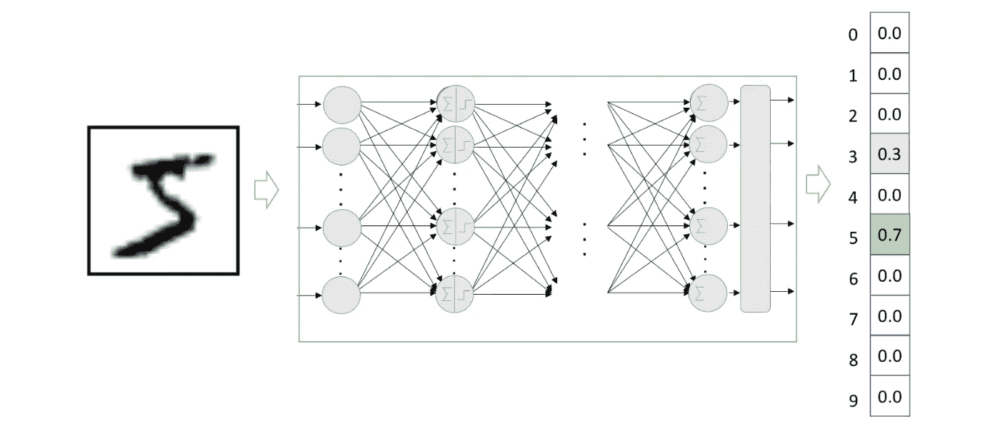
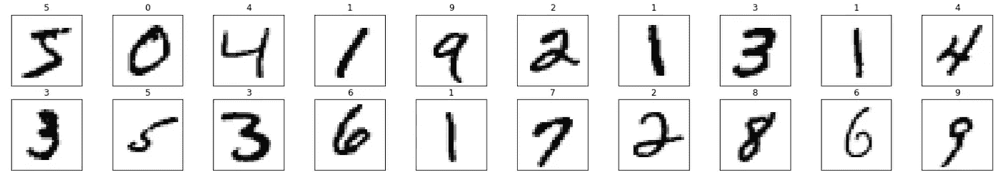
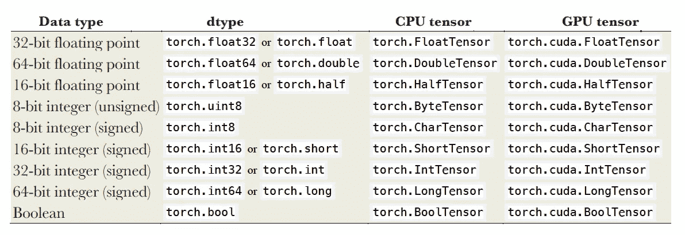
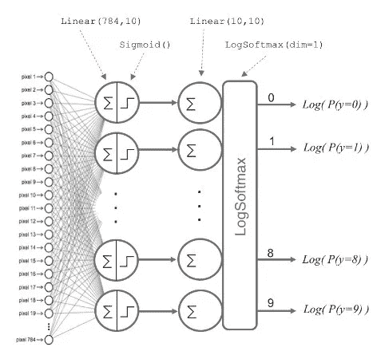

# 使用 PyTorch 进行深度学习

> 原文：<https://towardsdatascience.com/deep-learning-with-pytorch-a93b09bdae96?source=collection_archive---------24----------------------->

## [深度强化学习讲解— 04](https://towardsdatascience.com/tagged/deep-r-l-explained)

## 初学 PyTorch


我们将在本系列的许多文章中使用 PyTorch，所以读者需要确保她/他熟悉它。这篇文章将向读者介绍 PyTorch 的基本特性，它使我们能够使用 Python 语言实现深度学习模型。这篇文章并没有假装是 PyTorch 的完整手册，它只是介绍了 PyTorch 的基本知识，以开始在 PyTorch 中编码神经网络，我们将在整个系列中引入我们需要的新功能。好好享受吧！

> [本出版物的西班牙语版本](https://medium.com/aprendizaje-por-refuerzo/8-pytorch-básico-a60ce5fc8b74)

[](https://medium.com/aprendizaje-por-refuerzo/8-pytorch-b%C3%A1sico-a60ce5fc8b74) [## 8.PyTorch básico

### 请访问第 8 页的自由介绍

medium.com](https://medium.com/aprendizaje-por-refuerzo/8-pytorch-b%C3%A1sico-a60ce5fc8b74) 

## 深度学习框架

深度学习框架领域的明确领导者现在是谷歌开发的 TensorFlow 和脸书开发的 PyTorch，它们正在从使用量、份额和势头上脱离市场的其余部分。

三年前，第一个版本的 [PyTorch](https://pytorch.org/) 问世，毫无疑问，它正在获得巨大的发展势头。PyTorch 最初由脸书孵化，作为快速实验和原型制作的理想灵活框架，迅速赢得了声誉，在深度学习社区中赢得了成千上万的粉丝。例如，我的研究团队中的博士生更喜欢使用 PyTorch，因为它允许他们编写看起来像本机的 Python 代码，并且仍然可以获得良好框架的所有好处，如自动微分和内置优化。这就是我决定在这个系列中使用 PyTorch 的原因。

> 虽然 PyTorch 由于脸书(和 AWS)而在市场上获得了动力，但 [TensorFlow](https://www.tensorflow.org/) 仍然在各个方面保持领先，并且是目前行业中使用最多的。你可以阅读这篇简短的文章“ [TensorFlow vs PyTorch:战斗仍在继续](/tensorflow-vs-pytorch-the-battle-continues-9dcd34bb47d4)”来了解关于这两种环境的更多细节。

# 环境设置

我建议使用 Google 提供的[](https://colab.research.google.com/)**(Colab)*来执行本文描述的代码。它基本上由一个 Jupyter 笔记本环境组成，不需要配置，完全在云中运行，允许使用不同的深度学习库，如 [PyTorch 和 TensorFlow](/tensorflow-or-pytorch-146f5397278a) 。Colab 的一个重要特点是它完全免费提供 GPU(和 TPU)。关于该服务的详细信息可以在[常见问题页面](https://research.google.com/colaboratory/faq.html)上找到。***

***默认情况下，Colab 笔记本运行在 CPU 上。你可以切换你的笔记本电脑运行与 GPU(或 TPU)。为了访问一个 GPU，您需要选择“运行时”选项卡，然后选择“更改运行时类型”，如下图所示:***

****

**当弹出窗口出现时，选择 GPU。确保“硬件加速器”设置为 GPU(默认为 CPU)。然后，确保您已连接到运行时(在菜单功能区中“已连接”旁边有一个绿色复选标记):**

****

**现在你可以运行这篇文章中的代码了。我建议将这篇文章的代码复制粘贴到一个 Colab 笔记本上，以便在你阅读这篇文章的同时看到执行过程。准备好了吗？**

> **这篇文章的[完整代码可以在 GitHub](https://github.com/jorditorresBCN/Deep-Reinforcement-Learning-Explained/blob/master/DRL_04_Deep_Learning_with_PyTorch.ipynb) 上找到，并且[可以使用这个链接](https://colab.research.google.com/github/jorditorresBCN/Deep-Reinforcement-Learning-Explained/blob/master/DRL_04_Deep_Learning_with_PyTorch.ipynb)作为一个 Colab google 笔记本运行。**

# **使用 PyTorch 的手写数字示例**

**在这篇文章中，我们将编写一个神经网络模型，对在[上一篇文章](/deep-learning-basics-1d26923cc24a)中出现的手写数字进行分类。请记住，我们创建了一个数学模型，给定一幅图像，该模型识别它所代表的数字，返回一个具有 10 个位置的向量，指示 10 个可能数字中每一个的可能性。**

****

**来源: [torres.ai](https://torres.ai)**

**为了引导解释，我们将遵循为神经网络编程所要采取的步骤列表:**

1.  **导入所需的库**
2.  **加载和预处理数据**
3.  **定义模型**
4.  **定义优化器和损失函数**
5.  **训练模型**
6.  **评估模型**

**让我们去吧！**

# **1.导入所需的库**

**我们总是需要导入 PyTorch 的核心 Python 库`torch`。对于我们的例子，我们还将导入`torchvision`包，以及常用的库`numpy`和`matplotlib`。**

```
**import torch 
import torchvision**
```

**为了代码的清晰，我们可以在这里定义一些训练所需的超参数:**

```
 **import numpy as np 
import matplotlib.pyplot as plt EPOCH = 10 
BATCH_SIZE= 64**
```

# **2.加载和预处理数据**

## **加载数据**

**下一步是加载将用于训练我们的神经网络的数据。我们将使用前一篇文章中已经介绍过的 MNIST 数据集，可以从*[*MNIST 数据库*页面](http://yann.lecun.com/exdb/mnist)下载使用`torchvision.dataset.` PyTorch 数据集是根据请求返回单个数据点的对象。然后，它被传递到处理数据点批处理和并行性的数据加载器。这是我们示例的代码:***

```
**xy_trainPT = torchvision.datasets.MNIST(root='./data', 
             train=True, download=True,transform=
             torchvision.transforms.Compose(
             [torchvision.transforms.ToTensor()]))xy_trainPT_loader = torch.utils.data.DataLoader
                    (xy_trainPT, batch_size=BATCH_SIZE)**
```

**因为数据通常太大，无法一次将数据放入 CPU 或 GPU 内存中，所以将数据分成大小相等的批次。每一批都包括数据样本和目标标签，并且两者都必须是张量(我们将在下面介绍)。`BATCH_SIZE`参数表示我们将在每次更新模型参数时使用的数据数量。**

**该数据集包含 60，000 个手工制作的数字图像来训练模型，对于首次进入模式识别技术来说是理想的，无需花费大量时间预处理和格式化数据，这在数据分析中是非常重要和昂贵的步骤，并且在处理图像时具有特殊的复杂性。**

**我们可以验证前面的代码已经用库`matplotlib.pyplot`加载了预期的数据:**

```
**fig = plt.figure(figsize=(25, 4)) 
for idx in np.arange(20):
   image, label = xy_trainPT [idx]
   ax = fig.add_subplot(2, 20/2, idx+1, xticks=[], yticks=[])
   ax.imshow(torch.squeeze(image, dim = 0).numpy(), 
             cmap=plt.cm.binary)
   ax.set_title(str(label))**
```

****

## **预处理数据**

**记得在上一篇文章中，我们解释过，为了便于将数据输入到我们的神经网络中，我们将输入(图像)从二维(2D)转换为一维(1D)的向量。也就是说，28×28 个数字的矩阵可以由 784 个数字(逐行连接)的向量(数组)来表示。**

**当我们使用这种类型的变换(例如，应用于第一幅图像)将数据摄取到神经网络时，我们将应用这种变换:**

```
**image, _ = xy_trainPT[0] 
print(image.size())
image_flatten = image.view(image.shape[0], -1)
print (image_flatten.size())torch.Size([1, 28, 28]) 
torch.Size([1, 784])**
```

## **张量**

**张量是一个多维数组，是 PyTorch 的基本构造块，相当于 NumPy，它存储一组数字:**

```
**a = torch.randn(2, 3)
print(a)tensor([[ 1.1049, 0.2676, -0.4528],
        [ 0.0105, -0.5095, 0.7777]])**
```

**我们可以知道它的尺寸和大小:**

```
**print(a.size())
print(a.dim())torch.Size([2, 3])
2**
```

**除了维度，张量的特征还在于其元素的类型。为此，我们有一个`dtype`参数，它故意与同名的标准 NumPy 参数类型相似:**

```
**matrix=torch.zeros([2, 4], dtype=torch.int32)
print(matrix)tensor([[0, 0, 0, 0],
        [0, 0, 0, 0]], dtype=torch.int32) print(matrix.dtype)torch.int32**
```

**Torch 定义了九种类型的 CPU 张量和九种类型的 GPU 张量:**

****

**如你所见，GPU 张量有特定的类型。PyTorch 透明支持 CUDA GPUs，这意味着所有操作都有两个版本——CPU 和 GPU——自动选择。这个决定是基于你正在操作的张量的类型做出的。**

**在 PyTorch 中创建张量有不同的方法:调用所需类型的构造函数，将 NumPy 数组(或 Python 列表)转换为张量或要求 PyTorch 创建具有特定数据的张量。例如，我们可以使用`torch.zeros()`函数创建一个填充零值的张量:**

```
**b = torch.zeros(2, 3)
print(b)tensor([[0., 0., 0.],
        [0., 0., 0.]]) c = torch.ones(2, 3)
print(c)tensor([[1., 1., 1.],
        [1., 1., 1.]])**
```

**张量的元素可以使用其索引(从 0 开始)来访问:**

```
**c[0,0]=222 
print(c)tensor([[222.,   1.,   1.],         
        [  1.,   1.,   1.]])** 
```

**此外，就像 Python 中常见的数据结构一样，我们可以在“`:` ”字符的帮助下，在索引中使用范围标记来选择和操作张量的各个部分。索引从 0 开始，我们可以对索引使用负值，其中`-1`是最后一个元素，依此类推。让我们来看下面的一段代码作为例子:**

```
**x = torch.Tensor([[1,2,3,4], [5,6,7,8], [9,10,11,12]]) 
print (x) tensor([[ 1., 2., 3., 4.],
        [ 5., 6., 7., 8.],
        [ 9., 10., 11., 12.]]) print (“x column 1: “, x[:, 1])
print (“x row 0: “, x[0, :])
print (“x rows 0,1 & cols 1,2: \n”, x[0:2, 1:3])x column 1: tensor([ 2., 6., 10.])
x row 0: tensor([1., 2., 3., 4.])
x rows 0,1 & cols 1,2:
tensor([[2., 3.],
        [6., 7.]])**
```

**PyTorch 张量可以非常有效地转换为 NumPy 矩阵，反之亦然。通过这样做，我们可以利用 Python 生态系统中围绕 NumPy 数组类型发展起来的大量功能。让我们用一个简单的代码来看看它是如何工作的:**

```
**x = np.array([[1,2], [3,4], [5,6]])
print (x) [[1 2]
 [3 4]
 [5 6]]**
```

**这个数组`x`可以很容易地转换成张量，如下所示:**

```
**y=torch.from_numpy(x)
print(y)tensor([[1, 2],
       [3, 4],
       [5, 6]])**
```

**我们可以看到第二个印记表明它是一个张量。相反，如果我们想把一个张量转换成一个 NumPy 数组，我们可以这样做:**

```
**z = y.numpy()
print (z)[[1\. 2.]
 [3\. 4.]
 [5\. 6.]]**
```

**我们将使用`reshape()`函数，它返回一个与输入具有相同数据和元素数量的张量，但是具有指定的形状。如果可能，返回的张量将是输入的视图。否则，它将是一个副本(在内存中):**

```
**one_d = torch.arange(0,16)
print (one_d)two_d= one_d.reshape(4,4)
print (two_d)print(two_d.size())tensor([ 0, 1, 2, 3, 4, 5, 6, 7, 8, 9, 10, 11, 12, 13, 14, 15])tensor([[ 0, 1, 2, 3],
        [ 4, 5, 6, 7],
        [ 8, 9, 10, 11],
        [12, 13, 14, 15]])torch.Size([4, 4])**
```

# **3.定义模型**

**在`torch.nn`包中，您可以找到许多预定义的类，它们提供了编程神经网络所需的基本功能块。要定义[上一篇文章](/deep-learning-basics-1d26923cc24a)中呈现的模型，可以使用该包中的`Sequential`类来完成:**

```
**modelPT= torch.nn.Sequential(            
         torch.nn.Linear(784,10),
         torch.nn.Sigmoid(), 
         torch.nn.Linear(10,10), 
         torch.nn.LogSoftmax(dim=1) 
         )**
```

**该代码定义了由两个密集层(线性层)组成的神经网络，每个密集层 10 个神经元，一个具有 Sigmoid 激活函数，另一个具有 Softmax 激活函数。随着本系列的推进，我们将引入其他激活函数[作为 ReLU，我们将在本系列的下一篇文章中使用。](/learning-process-of-a-deep-neural-network-5a9768d7a651)**

**我想强调的是，前面的代码对前一篇文章中介绍的神经网络进行了一个小的转换:此外，它对最后一层的每个输出应用了对数运算。具体来说， [LogSoftmax 函数](https://pytorch.org/docs/stable/nn.html#logsoftmax)可视为:**

****

**其中 Softmax 按照[上一篇](/deep-learning-basics-1d26923cc24a)中的定义计算。与 Softmax 相比，LogSoftmax 有许多实际和理论上的优势，这些优势促使我们在构建神经网络时使用它，我们将在后面的部分中对此进行讨论。**

**总之，我们定义的网络可以直观地表示出来，如下图所示:**

****

**来源: [torres.ai](https://torres.ai)**

**神经网络的第一层接收 784 个特征的张量，这些特征表示传递给第一层中 10 个神经元中的每一个的像素。一旦这 10 个神经元处理了这些信息，它们中的每一个都将信息传递给下一层的所有神经元，即第一层的所有 10 个神经元都与第二层的所有 10 个神经元相连。**

**第二层是具有 10 个神经元的 softmax 激活函数的层，这意味着它将返回 10 个概率值的张量，代表 10 个可能的数字。一般来说，分类网络的输出层将具有与类一样多的神经元，除了在二进制分类中，其仅需要一个神经元。让我们记住，我们使用的是 LogSoftmax 层，而不是 Softmax 层，因此返回的每个值将是当前数字的图像属于每个类的概率的对数。**

**我们可以用这个简单的例子来分析构成神经网络的参数。例如，在第一层中，对于 10 个神经元中的每一个，权重需要 784 个参数，因此需要 10 × 784 个参数来存储 10 个神经元的权重。此外，对应于每个神经元的 10 个偏置需要 10 个附加参数。因此，对于第一层，需要 7850 个参数。**

**在第二层中，作为 softmax 函数，需要将其所有 10 个神经元与前一层的 10 个神经元连接，因此，权重需要 10 × 10 个参数；除了对应于每个节点的 10 个偏置。这给了我们第二层总共 110 个必需的参数。**

**总之，对于我们极其简单的神经网络，我们看到需要 7960 个参数，第一层需要 7850 个参数，第二层需要 110 个参数。**

> **通过对所有神经网络模块的基类`nn.Module`进行子类化，我们可以创建自己的构建块，这些构建块可以堆叠在一起并在以后重用，这是通常所做的。但是考虑到这篇文章的初始性质，我们可以用这种基本的方式来定义我们的神经网络。读者可以查阅官方文件，了解关于这个话题的更多细节。**

# **4.定义优化器和损失函数**

**正如我们在上一篇文章中所展示的，这些模型是通过迭代求解一个无约束优化问题来训练的。在每次迭代中，随机的一批训练数据被输入到模型中以计算损失函数值。然后，计算损失函数相对于网络权重的梯度(反向传播),并在梯度的负方向上更新权重。这些网络被训练，直到它们收敛到损失函数最小值。**

## **损失函数**

**PyTorch 中大约有 20 种不同的损失函数，驻留在`nn`包中，并作为`nn.Module`子类实现。我们将在本系列中使用的一些常见标准损失函数有:**

*   **`nn.MSELoss`:自变量之间的均方误差，是回归问题的标准损失。**
*   **`nn.NLLLoss`:它计算“最大似然”标准，一般用于多类分类问题(如我们的 MNIST 例子)。**
*   **`nn.CrossEntropyLoss`:计算与`nn.NLLLoss`相同，但是它期望每个类的原始分数，并在内部应用 LogSoftmax(而 nn。NLLLoss 期望将对数概率作为输入)。**

**由于我们正在处理一个多类分类问题，我们选择交叉熵作为我们的损失函数。在这个例子中，我们使用负对数似然神经网络。NLLLoss()与 softmax nn 结合使用。LogSoftmax()函数，我们已经介绍过了。正如我们所说的，我们不应用 Softmax 来增加训练过程的数值稳定性，提出了一种替代方法来首先计算 Softmax，它使用指数运算，然后计算交叉熵损失，它使用概率的对数。如果读者对这方面的更多细节感兴趣，我推荐看一看[这篇文章](https://ljvmiranda921.github.io/notebook/2017/08/13/softmax-and-the-negative-log-likelihood/)。**

> **使用 LogSoftmax 定义神经网络的缺点是，每次我们需要从神经网络输出中获取概率时，我们都需要记住应用 Softmax。**

**一般来说，读者会看到 PyTorch 代码中分配给`criterion`的损失函数:**

```
**criterion = torch.nn.NLLLoss()**
```

**因此，计算误差的方法如下:**

```
**loss = criterion(logps, labels)**
```

**我们在自变量中指出神经网络的输出和正确的标签。**

## **【计算机】优化程序**

**请记住，优化器采用模型参数的梯度并更改这些参数，以减少损失值。我们使用 PyTorch 提供的模块`torch.optim`来优化模型，执行梯度下降，并通过反向传播来更新权重。这个软件包允许我们在几个算法(AdaGrad，RMSProp，Adam 等)中进行选择。)是梯度下降算法的不同变体，梯度下降算法是一种能够找到各种问题的最优解的通用优化算法。此刻，在这个例子中，我们将使用基本的*随机梯度下降* (SGD):**

```
**optimizer = torch.optim.SGD(modelPT.parameters(), lr=0.01)**
```

**参数是优化器必须调整的*参数*和指示这些调整应该如何进行的*学习率*。请记住，优化器会以正确的方向迭代调整模型的参数(权重和偏差)(在其值上加一个“小”或减一个“小”，其中这个“小”是由*学习率*定义的)，从而减少误差。一般来说，重复该过程，直到误差降到可接受的水平以下。**

> **导数用于计算正确的方向，特别是误差相对于参数的梯度。PyTorch 中的自动签名包正是通过自动微分来自动计算神经网络中的反向传递，从而提供了这种功能。**

# **5.训练模型**

**一旦我们的模型被定义，学习方法被配置，它就可以被训练了。因此，我们只需定义将迭代所有数据的训练循环，以便优化器迭代地调整权重。让我们用这几行代码来讨论一个训练循环的通用蓝图:**

```
**1: for e in range(EPOCHS):
      running_loss = 0
2:    for images, labels in xy_trainPT_loader:
3:        images = images.view(images.shape[0], -1)
4:        output = modelPT(images)
5:        loss = criterion(output, labels)
6:        loss.backward()
7:        optimizer.step()
8:        optimizer.zero_grad()
          running_loss += loss.item()
      print(“Epoch {} — Training loss: {}”.format(e, 
             running_loss/len(xy_trainPT_loader)))**
```

****第 1 行**:通常，训练循环会反复迭代我们的数据。记住，对一组完整的例子的一次迭代被称为一个*时期。*`EPOCHS`变量表示在整个例子集上的迭代次数。**

****第 2 行:**我们已经介绍过，数据通常太大，无法一次放入 CPU 或 GPU 内存，因此它被分成大小相等的批次。每个*批次*都包含数据样本和目标标签，两者都必须是张量。**

****第 3 行:**为了便于将数据输入我们的神经网络，我们必须将输入(图像)从二维(2D)转换为一维(1D)向量。**

****第 4 行:**我们将每批图像张量传递到模型中，该模型将返回一个对该批图像进行预测的张量，即前向传递。**

****第 5 行:**得到预测后，我们将它们和它们的实际标签一起传递到交叉熵损失函数(`criterion`)中，并计算损失。通常，损失函数接受两个参数:网络输出(预测)和期望输出(真实数据，也称为数据样本的标注)。**

**一些 PyTorch 的损失函数将类标签作为它们的目标(例如 [NLLloss](http://pytorch.org/docs/nn.html#torch.nn.NLLLoss) )，所以如果我们使用它们(如在我们的例子中)，我们不需要像我们在上一篇文章中介绍的那样将目标转换成一个热点向量(为了便于解释)。**

****第 6 行:**我们使用损失值进行反向传递，以计算损失相对于模型参数的梯度。在`loss.backward()`调用结束后，我们累积了梯度。**

****第 7 行:**现在是优化器使用方法`step()`修改模型参数的时候了，该方法从参数中提取所有梯度并应用它们。**

****第 8 行:**训练循环的最后一部分，也是最重要的一部分，是我们对参数梯度归零的责任。在我们的网络上调用`zero_grad()`清除所有优化变量的梯度。**

**为了检查训练过程是如何发展的，我们在这个训练循环中添加了几行代码。首先，通过将每批迭代的所有损失相加，我们得到整个时期的训练损失:**

```
**running_loss += loss.item()**
```

**第二步，用迭代次数对其求平均，并打印出来:**

```
**print(“Epoch {} — Training loss: {}”.format(e, 
             running_loss/len(xy_trainPT_loader)))**
```

**查看该输出，我们可以看到训练循环如何调整网络的权重，以便在每次迭代中，损失函数产生更小的损失。**

```
**Epoch 0 — Training loss: 2.1822925415882932 
Epoch 1 — Training loss: 1.8671700155048736
Epoch 2 — Training loss: 1.5379922698809902
Epoch 3 — Training loss: 1.287035460029838. . .Epoch 15 — Training loss: 0.5162741374264139
Epoch 16 — Training loss: 0.49991638108547815
Epoch 17 — Training loss: 0.48541215611800453
Epoch 18 — Training loss: 0.4724724407929347
Epoch 19 — Training loss: 0.4608637086554631**
```

> **在 PyTorch 中，没有像 Keras 或 Scikit-learn 中的`fit()`那样的“预制”数据模型调优函数，所以训练循环必须由程序员指定。**

# **6.评估和使用模型**

**现在，我们已经完成了模型的训练，我们可能想要通过在测试数据集上应用它来测试我们的模型的一般化程度。**

**在 PyTorch 中，再次要求程序员指定评估循环:**

```
**xy_testPT = torchvision.datasets.MNIST(root='./data', 
            train=False, download=True, 
            transform=torchvision.transforms.
            Compose([torchvision.transforms.ToTensor()]))xy_test_loaderPT = torch.utils.data.DataLoader(xy_testPT)correct_count, all_count = 0, 0
for images,labels in xy_test_loaderPT:
  for i in range(len(labels)):
    img = images[i].view(1, 784)
    logps = modelPT(img)
    ps = torch.exp(logps)
    probab = list(ps.detach().numpy()[0])
    pred_label = probab.index(max(probab))
    true_label = labels.numpy()[i]
    if(true_label == pred_label):
        correct_count += 1
    all_count += 1print("\nAccuracy of the model =", (correct_count/all_count)) Accuracy of the model = 0.8657**
```

**读者可以看到这个循环中的指令与前一个训练循环中的指令相似。但在这种情况下，不是保留损失计算，而是计算准确性，即模型从未见过的数据的命中率。**

**仅此而已！你已经设计了一个完整的神经网络。恭喜你。**

**下一篇见[！](/pytorch-performance-analysis-with-tensorboard-7c61f91071aa)**

# **深度强化学习讲解系列**

****由** [**UPC 巴塞罗那理工**](https://www.upc.edu/en) **和** [**巴塞罗那超级计算中心**](https://www.bsc.es/)**

**一个轻松的介绍性[系列](https://torres.ai/deep-reinforcement-learning-explained-series/)以一种实用的方式逐渐向读者介绍这项令人兴奋的技术，它是人工智能领域最新突破性进展的真正推动者。**

**[](https://torres.ai/deep-reinforcement-learning-explained-series/) [## 深度强化学习解释-乔迪托雷斯。人工智能

### 本系列的内容](https://torres.ai/deep-reinforcement-learning-explained-series/) 

# 关于这个系列

我在五月份开始写这个系列，那是在巴塞罗那的封锁期。老实说，由于封锁，在业余时间写这些帖子帮助了我 [**#StayAtHome**](https://twitter.com/hashtag/StayAtHome?src=hashtag_click) 。感谢您当年阅读这份刊物；它证明了我所做的努力。

**免责声明** —这些帖子是在巴塞罗纳被封锁期间写的，目的是分散个人注意力和传播科学知识，以防对某人有所帮助，但不是为了成为 DRL 地区的学术参考文献。如果读者需要更严谨的文档，本系列的最后一篇文章提供了大量的学术资源和书籍供读者参考。作者意识到这一系列的帖子可能包含一些错误，如果目的是一个学术文件，则需要对英文文本进行修订以改进它。但是，尽管作者想提高内容的数量和质量，他的职业承诺并没有留给他这样做的自由时间。然而，作者同意提炼所有那些读者可以尽快报告的错误。**