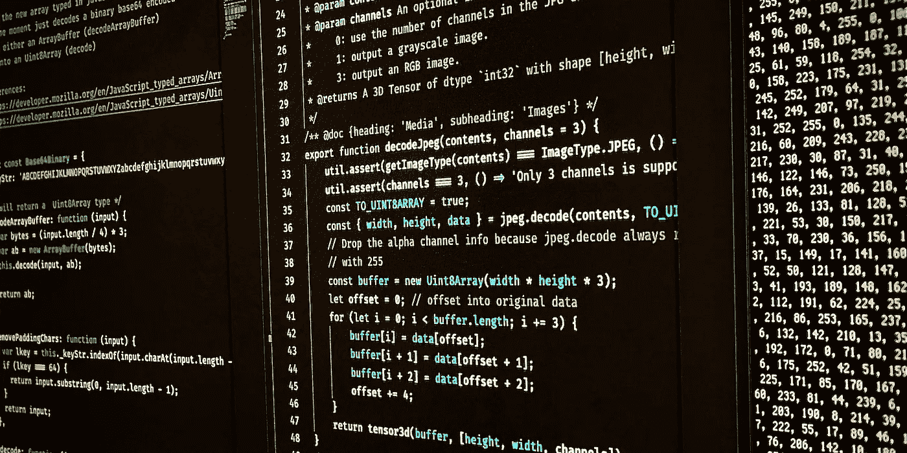
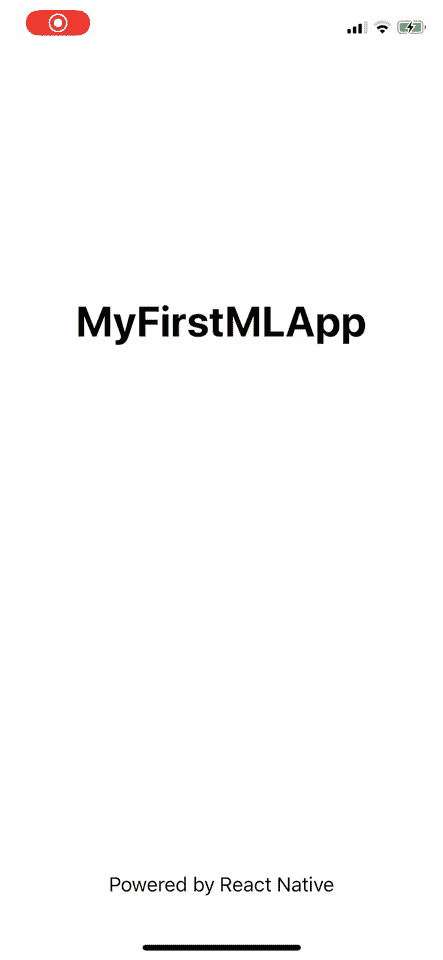
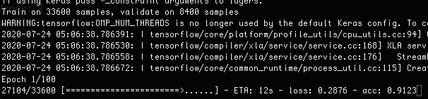
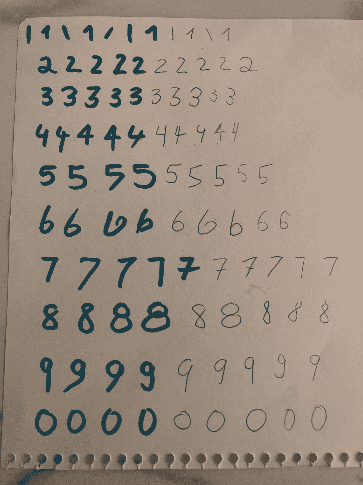
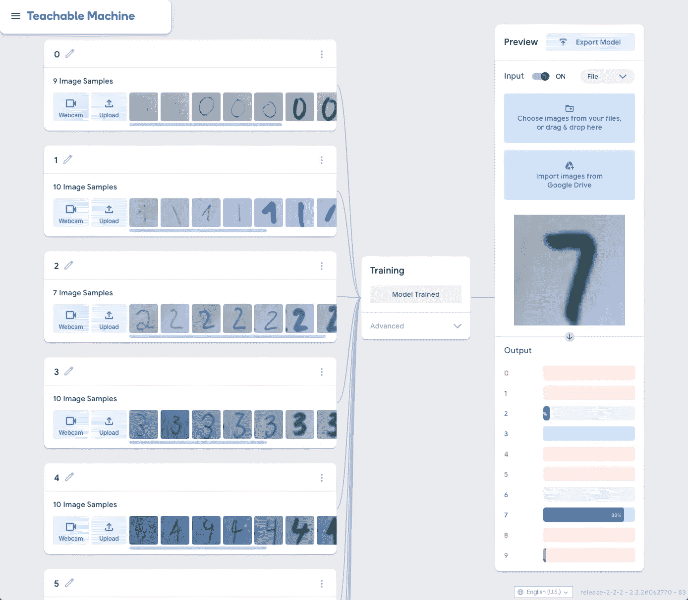
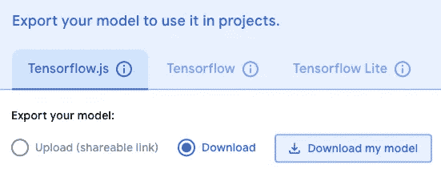
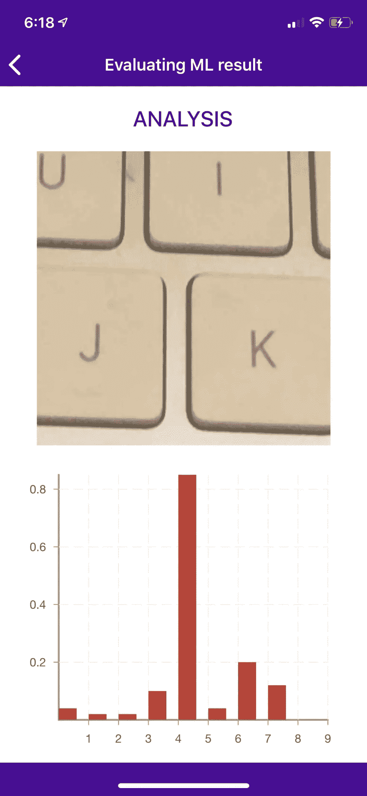

# React Native 深度学习(仅限 iOS)

> 原文：<https://towardsdatascience.com/deep-learning-with-react-native-ios-only-8089fed59773?source=collection_archive---------19----------------------->



(图片由作者提供)

*文章原载于* [*dev.to*](https://dev.to/dittmarconsulting/deep-learning-with-react-native-ios-only-2470)

## 介绍

在本教程中，我将涵盖如何构建移动应用程序和训练深度学习模型的所有步骤，以便您可以通过使用手机的摄像头预测 0 到 9 之间的手写数字。


预测手写数字的应用程序(作者图片)

但是在我们开始构建移动应用之前，我们需要想出一个高层次的策略。让我们回顾一下思考过程:

*   我们是构建一个纯 React-Native ( **RN** )还是一个 **Expo** 应用？
*   我们想用哪个相机库？
*   我们需要裁剪图像吗？我们需要使用什么样的库？
*   我们如何训练一个深度学习模型？
*   我们如何对照照片使用那个模型？
*   我们如何显示结果？

> 注意:本教程需要一些先决条件和对 RN 和 Javascript 的全面理解。如果你是一个绝对的初学者，我建议在继续学习本教程之前，先在 Youtube、Udemy 或 Egghead 上学习一门好的课程。

## 我们开始吧

我将把这个教程分成三个部分

[**第一章**:创建 RN 应用](#1a09)
[**第二章**:训练深度学习模型](#c7cf)
[**第三章**:实现模型，预测并展示结果](#01f8)

## 第 1 章:创建 RN 应用程序

还记得我们思考过程的第一点是创建一个裸应用还是 Expo 样板应用吗？

经过一些研究，我决定在本地加载训练好的模型。这是最简单的方法，不需要从云服务器获取模型，但是你也可以这样做。

在本教程中，我们将使用`[@tensorflow/tfjs-react-native](http://twitter.com/tensorflow/tfjs-react-native)`中不幸与 Expo 不兼容的`bundleResourceIO`。

> 此外，因为我们想使用相机，我们必须使用物理手机，而不是模拟器。为此，你必须有一个苹果开发者帐户来签署你的应用程序，否则你将无法运行该应用程序。

让我们使用以下命令创建应用程序:

```
$ react-native init MyFirstMLApp
```

安装过程完成后，请确保您的所有豆荚也已安装！

```
$ cd MyFirstMLApp
$ npx pod-install
```

让我们在你的物理 iPhone 上第一次运行这个应用程序。打开 Xcode，找到`MyFirstMLApp.xcworkspace`并打开。使用 lightning 线缆将 iPhone 连接到 Mac，然后选择您的手机。首次构建和运行应用程序时，请按播放按钮。你应该会在你的 iPhone 上看到**欢迎反应**屏幕。

🏆**牛逼！**

让我们为这个应用程序添加一些包:

```
yarn add [@react](http://twitter.com/react)-native-community/async-storage [@react](http://twitter.com/react)-native-community/cameraroll [@tensorflow/tfjs](http://twitter.com/tensorflow/tfjs) [@tensorflow/tfjs-react-native](http://twitter.com/tensorflow/tfjs-react-native) expo-camera expo-gl expo-gl-cpp expo-image-manipulator react-native-fs react-native-svg react-native-unimodules victory-native
```

最后，安装导航库。

```
yarn add react-native-navigation && npx rnn-link
```

后一个命令会将导航包添加到 iOS 和 Android 中。但是我们还没有完成。

因为我们使用 RN 的裸框架，[单模块](https://docs.expo.io/bare/installing-unimodules/)需要手动安装。

请点击链接，并按照 iOS 部分所述修改`Podfile`。那次跑步之后

```
$ npx pod-install
```

并构建 Xcode 项目，看看是否所有东西都已正确安装。

然后继续将[单模块](https://docs.expo.io/bare/installing-unimodules/)的代码添加到`AppDelegate.m`中，并再次构建项目。

因为我们想用相机拍照，我们还需要给`Info.plist`添加几个私钥

```
<?xml version=”1.0" encoding=”UTF-8"?>
<!DOCTYPE plist PUBLIC “-//Apple//DTD PLIST 1.0//EN” “[http://www.apple.com/DTDs/PropertyList-1.0.dtd](http://www.apple.com/DTDs/PropertyList-1.0.dtd)">
<plist version=”1.0">
  <dict>

    <! — Required for iOS 10 and higher -->
    <key>NSCameraUsageDescription</key>
    <string>We need to use the camera for taking pictures of the digits</string><! — Required for iOS 11 and higher: include this only if you are planning to use the camera roll -->
    <key>NSPhotoLibraryAddUsageDescription</key>
    <string>We need to access the photo library to upload the images</string><! — Include for only if you are planning to use the camera roll -->
    <key>NSPhotoLibraryUsageDescription</key>
    <string>We need to access the photo library to upload the images</string><! — Include this only if you are planning to use the microphone for video recording -->
    <key>NSMicrophoneUsageDescription</key>
    <string>We need to access the microphone</string>

    <key>CFBundleDevelopmentRegion</key>
    <string>en</string>
```

如果 Xcode 构建良好，您可以继续从 Xcode 运行应用程序，或者只使用终端。

如果你决定从现在开始从命令行运行这个应用程序，像我一样，请将`— device`添加到你的`package.json`文件的`ios`脚本中并运行

```
yarn ios
```

一旦应用程序在你的 iPhone 上启动，不要惊讶你再也看不到欢迎页面了。那是因为我们用了`react-native-navigation`。但是你应该看到加载屏幕 **MyFirstMLApp**

现在是时候创建我们的 2 个屏幕，并将这些屏幕的导航添加到我们的项目中。

请在我们项目的根目录下创建`src/screens/CameraView`和`src/screens/EvaluationView`目录。

在`src/screens/CameraView`中创建一个`index.js`文件并添加以下代码:

```
import React, { useState, useRef, useEffect } from "react";
import {
  SafeAreaView,
  TouchableOpacity,
  View,
  Text,
  StatusBar,
} from "react-native";
import { Navigation } from "react-native-navigation";
import { Camera } from "expo-camera";const MASK_DIMENSION = 100;export const CameraView = (props) => {
  const [hasPermission, setHasPermission] = useState(null);
  const [showShutterButton, setShowShutterButton] = useState(false);
  const cameraRef = useRef();useEffect(() => {
    (async () => {
      const { status } = await Camera.requestPermissionsAsync();
      setHasPermission(status === "granted");
    })();
  }, []);const handlePictureProcessing = async () => {
    goToEvaluationView();
  };const goToEvaluationView = () => {
    Navigation.push(props.componentId, {
      component: {
        name: "evaluationView",
        options: {
          topBar: {
            title: {
              text: "Evaluating ML result",
              color: "white",
            },
            background: {
              color: "#4d089a",
            },
            backButton: {
              color: "white",
              showTitle: false,
            },
          },
        },
        passProps: {},
      },
    });
  };if (hasPermission === null) {
    return <View />;
  }if (hasPermission === false) {
    return <Text> No access to camera </Text>;
  }return (
    <React.Fragment>
      <StatusBar barStyle="light-content" />
      <SafeAreaView style={styles.safeArea}>
        <Camera
          ref={cameraRef}
          type={Camera.Constants.Type.back}
          whiteBalance={Camera.Constants.WhiteBalance.auto}
          onCameraReady={() => setShowShutterButton(true)}>
          <View style={styles.cameraView}>
            <View style={styles.mask} />
            {showShutterButton && (
              <TouchableOpacity
                style={styles.shutterButton}
                onPress={handlePictureProcessing}>
                <Text style={styles.shutterButtonText}>
                  Take a picture
                </Text>
              </TouchableOpacity>
            )}
          </View>
        </Camera>
      </SafeAreaView>
    </React.Fragment>
  );
};const styles = {
  safeArea: {
    backgroundColor: "#4d089a",
  },
  cameraView: {
    height: "100%",
    justifyContent: "center",
    alignItems: "center",
    backgroundColor: "transparent",
  },
  mask: {
    height: MASK_DIMENSION,
    width: MASK_DIMENSION,
    borderWidth: 3,
    borderColor: "white",
    borderStyle: "dotted",
    borderRadius: 15,
  },
  shutterButton: {
    position: "absolute",
    bottom: 0,
    width: 150,
    height: 40,
    justifyContent: "center",
    alignItems: "center",
    borderWidth: 1,
    borderColor: "white",
    borderRadius: 15,
    marginBottom: 20,
  },
  shutterButtonText: {
    fontSize: 18,
    color: "white",
  },
};CameraView.options = {
  statusBar: {
    backgroundColor: null,
  },
  topBar: {
    title: {
      text: "Take a picture",
      color: "white",
    },
    background: {
      color: "#4d089a",
    },
  },
  tapBar: {
    background: {
      color: "#4d089a",
    },
  },
};
```

在`src/screens/EvaluationView`中创建一个`index.js`文件并添加以下代码:

```
import React from "react";
import { SafeAreaView, View, Text, StatusBar } from "react-native";export const EvaluationView = (props) => {
  return (
    <React.Fragment>
       <StatusBar barStyle="light-content" />
      <SafeAreaView style={styles.safeArea}>
        <View style={styles.container}>
           <Text style={styles.headerText}>ANALYSIS</Text>
        </View>
      </SafeAreaView>
    </React.Fragment>
  );
};const styles = {
  safeArea: {
    backgroundColor: "#4d089a",
  },
  container: {
    height: "100%",
    alignItems: "center",
    backgroundColor: "white",
  },
  headerText: {
    fontSize: 20,
    fontWeight: "500",
    color: "#4d089a",
    margin: 20,
  },
};
```

然后用下面的代码覆盖根目录中的`index.js`文件:

```
import { Navigation } from "react-native-navigation";
import { CameraView } from "./src/screens/CameraView";
import { EvaluationView } from "./src/screens/EvaluationView";Navigation.registerComponent("cameraView", () => CameraView);
Navigation.registerComponent("evaluationView", () => EvaluationView);Navigation.setDefaultOptions({
  statusBar: {
    style: "light",
    backgroundColor: "#4d089a",
  },
  topBar: {
    title: {
      color: "white",
    },
    background: {
      color: "#4d089a",
    },
    backButton: {
      color: "white",
      showTitle: false,
    },
  },
});Navigation.events().registerAppLaunchedListener(() => {
  Navigation.setRoot({
    root: {
      stack: {
        children: [
          {
            component: {
              name: "cameraView",
            },
          },
        ],
      },
    },
  });
});
```

最后，您可以删除`App.js`文件，因为不再需要它了。

重启你的 metro bundler，你应该会看到这个应用程序是这样运行的…



带有工作导航的应用程序的屏幕录制(图片由作者提供)

🏆**恭喜恭喜！**

您已经创建了基本应用程序，该应用程序还不能拍照，但可以从一个屏幕导航到另一个屏幕。

## 第二章:训练深度学习模型

最初，我使用的是[这个来自 **Kaggle**](https://www.kaggle.com/c/digit-recognizer/data) 的预训练模型，但是让这个应用程序工作起来的努力是巨大的。

我不得不创建了一个 **AWS EC2 深度学习 AMI(Amazon Linux 2)30.1 版本实例**并使用 SSH 访问，因为我的 Macbook 不支持 CUDA。(训练模型需要 GPU 支持)
然后我必须从 Kaggle 复制[**Jupyter**](https://jupyter.org/)**笔记本，运行笔记本在 AWS 实例上训练模型(它运行了 3 个小时)并将模型移回我的项目。
此外，我不得不安装 **OpenGL** 来修改图像，并编写了一个非常复杂的脚本来将 base64 字符串整形为张量，以匹配模型`[1, 28, 28, 1]`的预期输入。**

****

**模型开始在 AWS 上训练(图片由作者提供)**

**所有这些让我重新思考如何写这篇教程。毕竟，本教程应该是为那些只想玩机器学习模型而没有事先学习 **Python** 、 **Jupyter** 、 **Tensorflow** 和 **Keras** 的人准备的。此外，教程的长度将是现在的 5 倍。**

> **注:如果你想学习如何使用**tensor flow**&**Keras**我用 [**deeplizard**](https://www.youtube.com/channel/UC4UJ26WkceqONNF5S26OiVw) 找到了一个很好的关于深度学习的 Youtube 频道，内容非常丰富，也很符合我们在本教程中想要做的事情。
> 还有，[**Udemy**](https://www.udemy.com/course/complete-machine-learning-and-data-science-zero-to-mastery/learn/lecture/16488468)**上的这门课也不错，可惜不是免费的。*😕*****

****反正为了这个教程，我决定用 [**谷歌的可教机器**](https://teachablemachine.withgoogle.com/train/image) 来训练图像。****

****这个想法是用我们刚刚建立的应用程序拍摄 **28 x 28 像素**的图像，将图像上传到可教机器，并将训练好的模型下载回我们的项目。****

> ****以防你问我为什么用 28 x 28 像素的图片？这是我首先使用的模型的原始输入大小。所以我坚持了下来。****

****这也意味着我们必须裁剪并保存拍摄的图像到相机库中。为了做到这一点，我们需要稍微修改一下我们的代码。****

****请在`CameraView`文件夹中创建一个`helper.js`文件，并粘贴以下代码:****

```
**import { Dimensions } from "react-native";
import * as ImageManipulator from "expo-image-manipulator";
import CameraRoll from "[@react](http://twitter.com/react)-native-community/cameraroll";const { height: DEVICE_HEIGHT, width: DEVICE_WIDTH } = Dimensions.get("window");// got the dimension from the trained data of the *Teachable Machine*; pixel resolution conversion (8x)
export const BITMAP_DIMENSION = 224;export const cropPicture = async (imageData, maskDimension) => {
  try {
    const { uri, width, height } = imageData;
    const cropWidth = maskDimension * (width / DEVICE_WIDTH);
    const cropHeight = maskDimension * (height / DEVICE_HEIGHT);
    const actions = [
      {
        crop: {
          originX: width / 2 - cropWidth / 2,
          originY: height / 2 - cropHeight / 2,
          width: cropWidth,
          height: cropHeight,
        },
      },
      {
        resize: {
          width: BITMAP_DIMENSION,
          height: BITMAP_DIMENSION,
        },
      },
    ];
    const saveOptions = {
      compress: 1,
      format: ImageManipulator.SaveFormat.JPEG,
      base64: false,
    };
    return await ImageManipulator.manipulateAsync(uri, actions, saveOptions);
  } catch (error) {
    console.log("Could not crop & resize photo", error);
  }
};export const saveToCameraRoll = async (uri) => {
  try {
    return await CameraRoll.save(uri, "photo");
  } catch (error) {
    console.log("Could not save the image", error);
  }
};**
```

****在`src/screens/CameraView/index.js`中添加导入该文件****

```
**import { cropPicture, saveToCameraRoll } from ‘./helpers’;**
```

****添加`takePicture`功能，并修改`handlePictureProcessing`功能****

```
**const handlePictureProcessing = async () => {
  const imageData = await takePicture();
  const croppedData = await cropPicture(imageData, MASK_DIMENSION);
  await saveToCameraRoll(croppedData.uri);
  // we don't want to go to the evaluation view now
  //goToEvaluationView();
};const takePicture = async () => {
  const options = {
    quality: 0.1,
    fixOrientation: true,
  };
  try {
    return await cameraRef.current.takePictureAsync(options);
  } catch (error) {
    console.log("Could not take photo", error);
  }
};**
```

****如你所见，我们注释掉了行`//goToEvaluationView();`，这样我们就不会转到另一个屏幕。这意味着您可以连续拍摄任意多张照片。现在，所有照片都将保存在您的照片库中。****

****我们的下一个任务是在一张纸上写出尽可能多的 0 到 9 之间的数字变化。我们使用的数字、颜色和笔的形状越多，预测就越准确。****

****我很懒，最后每个数字大概有 10 个变化，但是对于一些数字，比如 4 和 8，预测有点偏差。****

********

****书写数字形状的变化(图片由作者提供)****

****所以由你决定让**可教机器**训练多少个数字。****

****当你完成拍摄图像后，把它们全部空投回你的 Mac，从那里把它们上传到 [**可教机器**](https://teachablemachine.withgoogle.com/train/image) 并开始训练它们。****

********

****训练好的模型截图(图片由作者提供)****

****完成后，你可以用你的应用程序拍摄更多的照片并上传，以测试训练好的模型。****

****如果你对结果满意，点击`Export Model`->-`Tensorflow.js` ->-`Download`->-`Download my model`，会下载一个 **ZIP** 文件。****

********

****下载模型 poup(图片由作者提供)****

****解压 zip 文件，在`src`目录(`src/model`)下创建一个`model`文件夹，并将`model.json`和`weights.bin`复制到该文件夹中。****

****我们还需要告诉 metro 处理新的文件格式:`*.bin`。所以请这样修改`metro.config.js`:****

```
**const { getDefaultConfig } = require("metro-config");module.exports = (async () => {
  const {
    resolver: { assetExts },
  } = await getDefaultConfig();
  return {
    transformer: {
      getTransformOptions: async () => ({
        transform: {
          experimentalImportSupport: false,
          inlineRequires: false,
        },
      }),
    },
    resolver: {
      assetExts: [...assetExts, "bin"],
    },
  };
})();**
```

******太好了！现在我们的模型已经在项目中了，让我们开始使用模型来预测数字。******

## ****第三章:实现模型，预测并展示结果****

****首先，我们不想再保存照片到我们的照片库中。(除非你愿意)。****

****于是注释掉了那行`//await saveToCameraRoll(croppedData.uri);`。
我们还需要裁剪图像的`base64 string`，最后，我们想通过`props`将那个`base64 string`传递给`EvaluationView`。****

****让我们像这样再次修改我们的 CameraView `src/screens/CameraView/index.js`文件:****

```
**const handlePictureProcessing = async () => {
  const imageData = await takePicture();
  const croppedData = await cropPicture(imageData, MASK_DIMENSION);
  // await saveToCameraRoll(croppedData.uri);
  goToEvaluationView(croppedData);
};const goToEvaluationView = (croppedData) => {
  Navigation.push(props.componentId, {
    component: {
      name: "evaluationView",
      options: {
        topBar: {
          title: {
            text: "Evaluating ML result",
            color: "white",
          },
          background: {
            color: "#4d089a",
          },
          backButton: {
            color: "white",
            showTitle: false,
          },
        },
      },
      passProps: {
        base64: croppedData.base64 || null,
      },
    },
  });
};**
```

****🏆太棒了！****

****让我们在`EvaluationView`中显示图像。从`react-native`导入**图像**并将**图像**组件添加到`View`容器中****

```
**<View style={styles.container}>
  <Text style={styles.headerText}>ANALYSIS</Text>
  <Image
    style={styles.imageContainer}
    source={{ uri: `data:image/gif;base64,${props.base64}` }}
    resizeMethod="scale"
  />
</View>;**
```

****并在`headerText`样式下添加`imageContainer`的样式。****

```
**imageContainer: {
 height: 300,
 width: 300,
},**
```

****最后一步是转到`src/screens/CameraView/helpers.js`文件，将`saveOptions`更改为`base64: true`。****

****🏆瞧！****

****你应该在*分析*文本下方的`EvaluationView`中看到拍摄的图像。****

****现在我们要显示预测结果。我们需要将**胜利图表**和一些`react-native`包一起添加到`EvaluationView`中****

```
**import React from "react";
import {
  Dimensions,
  ActivityIndicator,
  SafeAreaView,
  View,
  Image,
  Text,
  StatusBar,
} from "react-native";
import {
  VictoryChart,
  VictoryAxis,
  VictoryBar,
  VictoryTheme,
} from "victory-native";const { width: DEVICE_WIDTH } = Dimensions.get("window");**
```

****为了获得设备的【the VictoryChart 需要的),我们使用了`Dimensions`库。****

****然后添加**胜利图**容器。因为我们只想在得到预测结果后显示图表，所以我们添加了一个基于`graphData.`长度的条件****

****由于我们还没有工作模型，我们必须添加一些假的图表数据来查看图表的**水平条**。****

```
**import React from "react";
import {
  Dimensions,
  ActivityIndicator,
  SafeAreaView,
  View,
  Image,
  Text,
  StatusBar,
} from "react-native";
import {
  VictoryChart,
  VictoryAxis,
  VictoryBar,
  VictoryTheme,
} from "victory-native";const { width: DEVICE_WIDTH } = Dimensions.get("window");export const EvaluationView = (props) => {
  const graphData = [
    { number: 0, prediction: 0.04 },
    { number: 1, prediction: 0.02 },
    { number: 2, prediction: 0.02 },
    { number: 3, prediction: 0.1 },
    { number: 4, prediction: 0.85 },
    { number: 5, prediction: 0.04 },
    { number: 6, prediction: 0.2 },
    { number: 7, prediction: 0.12 },
    { number: 8, prediction: 0.0 },
    { number: 9, prediction: 0.0 },
  ];return (
    <React.Fragment>
      <StatusBar barStyle="light-content" />
      <SafeAreaView style={styles.safeArea}>
        <View style={styles.container}>
          <Text style={styles.headerText}>ANALYSIS</Text>
          <Image
            style={styles.imageContainer}
            source={{ 
              uri: `data:image/gif;base64,${props.base64}` 
            }}
            resizeMethod="scale"/>
          <View style={styles.resultContainer}>
            {graphData.length ? (
              <VictoryChart
                width={DEVICE_WIDTH - 20}
                padding={{ 
                  top: 30, bottom: 70, left: 50, right: 30 
                }}
                theme={VictoryTheme.material}>
                <VictoryAxis
                  tickValues={[1, 2, 3, 4, 5, 6, 7, 8, 9]}
                  tickFormat={[1, 2, 3, 4, 5, 6, 7, 8, 9]}/>
                 <VictoryAxis 
                   dependentAxis 
                   tickFormat={(tick) => tick} />
                <VictoryBar
                  style={{ data: { fill: "#c43a31" } }}
                  barRatio={0.8}
                  alignment="start"
                  data={graphData}
                  x="number"
                  y="prediction"/>
              </VictoryChart>
            ) : (
              <ActivityIndicator size="large" color="#4d089a" />
            )}
          </View>
        </View>
      </SafeAreaView>
    </React.Fragment>
  );
};**
```

****你应该有一个这样的屏幕:****

********

****聊天显示虚假数据(图片由作者提供)****

****🏆**你是冠军！******

****我们正在慢慢进入教程的最后一部分，在这里我们将加载模型，并将拍摄的照片与模型进行比较。****

****请在`src`目录下创建一个`util.js`并粘贴以下代码。****

```
**/* eslint-disable no-bitwise */
/*
Copyright (c) 2011, Daniel Guerrero
All rights reserved.
Redistribution and use in source and binary forms, with or without
modification, are permitted provided that the following conditions are met:
    * Redistributions of source code must retain the above copyright
      notice, this list of conditions and the following disclaimer.
    * Redistributions in binary form must reproduce the above copyright
      notice, this list of conditions and the following disclaimer in the
      documentation and/or other materials provided with the distribution.
THIS SOFTWARE IS PROVIDED BY THE COPYRIGHT HOLDERS AND CONTRIBUTORS "AS IS" AND
ANY EXPRESS OR IMPLIED WARRANTIES, INCLUDING, BUT NOT LIMITED TO, THE IMPLIED
WARRANTIES OF MERCHANTABILITY AND FITNESS FOR A PARTICULAR PURPOSE ARE
DISCLAIMED. IN NO EVENT SHALL DANIEL GUERRERO BE LIABLE FOR ANY
DIRECT, INDIRECT, INCIDENTAL, SPECIAL, EXEMPLARY, OR CONSEQUENTIAL DAMAGES
(INCLUDING, BUT NOT LIMITED TO, PROCUREMENT OF SUBSTITUTE GOODS OR SERVICES;
LOSS OF USE, DATA, OR PROFITS; OR BUSINESS INTERRUPTION) HOWEVER CAUSED AND
ON ANY THEORY OF LIABILITY, WHETHER IN CONTRACT, STRICT LIABILITY, OR TORT
(INCLUDING NEGLIGENCE OR OTHERWISE) ARISING IN ANY WAY OUT OF THE USE OF THIS
SOFTWARE, EVEN IF ADVISED OF THE POSSIBILITY OF SUCH DAMAGE.
 *//**
 * Uses the new array typed in javascript to binary base64 encode/decode
 * at the moment just decodes a binary base64 encoded
 * into either an ArrayBuffer (decodeArrayBuffer)
 * or into an Uint8Array (decode)
 *
 * References:
 * [https://developer.mozilla.org/en/JavaScript_typed_arrays/ArrayBuffer](https://developer.mozilla.org/en/JavaScript_typed_arrays/ArrayBuffer)
 * [https://developer.mozilla.org/en/JavaScript_typed_arrays/Uint8Array](https://developer.mozilla.org/en/JavaScript_typed_arrays/Uint8Array)
 */export const Base64Binary = {
  _keyStr: "ABCDEFGHIJKLMNOPQRSTUVWXYZabcdefghijklmnopqrstuvwxyz0123456789+/=",/* will return a  Uint8Array type */
  decodeArrayBuffer: function (input) {
    var bytes = (input.length / 4) * 3;
    var ab = new ArrayBuffer(bytes);
    this.decode(input, ab);return ab;
  },removePaddingChars: function (input) {
    var lkey = this._keyStr.indexOf(input.charAt(input.length - 1));
    if (lkey === 64) {
      return input.substring(0, input.length - 1);
    }
    return input;
  },decode: function (input, arrayBuffer) {
    //get last chars to see if are valid
    input = this.removePaddingChars(input);
    input = this.removePaddingChars(input);var bytes = parseInt((input.length / 4) * 3, 10);var uarray;
    var chr1, chr2, chr3;
    var enc1, enc2, enc3, enc4;
    var i = 0;
    var j = 0;if (arrayBuffer) {
      uarray = new Uint8Array(arrayBuffer);
    } else {
      uarray = new Uint8Array(bytes);
    }input = input.replace(/[^A-Za-z0-9\+\/\=]/g, "");for (i = 0; i < bytes; i += 3) {
      //get the 3 octects in 4 ascii chars
      enc1 = this._keyStr.indexOf(input.charAt(j++));
      enc2 = this._keyStr.indexOf(input.charAt(j++));
      enc3 = this._keyStr.indexOf(input.charAt(j++));
      enc4 = this._keyStr.indexOf(input.charAt(j++));chr1 = (enc1 << 2) | (enc2 >> 4);
      chr2 = ((enc2 & 15) << 4) | (enc3 >> 2);
      chr3 = ((enc3 & 3) << 6) | enc4;uarray[i] = chr1;
      if (enc3 !== 64) {
        uarray[i + 1] = chr2;
      }
      if (enc4 !== 64) {
        uarray[i + 2] = chr3;
      }
    }return uarray;
  },
};**
```

> ****出于对开发者的尊重请不要删除版权免责声明*😃*****

****现在创建另一个`helpers.js`文件，但这次是在`EvaluationView`目录`src/screens/EvaluationView/helpers.js`中，并复制这段代码****

```
**import * as tf from "[@tensorflow/tfjs](http://twitter.com/tensorflow/tfjs)";
import "[@tensorflow/tfjs-react-native](http://twitter.com/tensorflow/tfjs-react-native)";
import { bundleResourceIO, decodeJpeg } from "[@tensorflow/tfjs-react-native](http://twitter.com/tensorflow/tfjs-react-native)";
import { Base64Binary } from "../../util";
import { BITMAP_DIMENSION } from "../CameraView/helpers";const modelJson = require("../../model/model.json");
const modelWeights = require("../../model/weights.bin");// 0: channel from JPEG-encoded image
// 1: gray scale
// 3: RGB image
const TENSORFLOW_CHANNEL = 3;export const getModel = async () => {
  try {
    // wait until tensorflow is ready
    await tf.ready();
    // load the trained model
    return await tf.loadLayersModel(bundleResourceIO(modelJson, modelWeights));
  } catch (error) {
    console.log("Could not load model", error);
  }
};export const convertBase64ToTensor = async (props) => {
  try {
    const uIntArray = Base64Binary.decode(props.base64);
    // decode a JPEG-encoded image to a 3D Tensor of dtype
    const decodedImage = decodeJpeg(uIntArray, 3);
    // reshape Tensor into a 4D array
    return decodedImage.reshape([
      1,
      BITMAP_DIMENSION,
      BITMAP_DIMENSION,
      TENSORFLOW_CHANNEL,
    ]);
  } catch (error) {
    console.log("Could not convert base64 string to tesor", error);
  }
};export const startPrediction = async (model, tensor) => {
  try {
    // predict against the model
    const output = await model.predict(tensor);
    // return typed array
    return output.dataSync();
  } catch (error) {
    console.log("Error predicting from tesor image", error);
  }
};export const populateData = (typedArray) => {
  const predictions = Array.from(typedArray);
  return predictions.map((item, index) => {
    return {
      number: index,
      prediction: item,
    };
  });
};**
```

****这些是我们加载模型、将 base64 字符串转换为张量、预测数字和填充胜利图表数据的函数。****

****最后但同样重要的是，我们在`src/screens/EvaluationView/index.js`的`useEffect()`钩子中调用这些函数。****

****这是该视图的完整代码:****

```
**import React, { useState, useEffect } from "react";
import {
  Dimensions,
  ActivityIndicator,
  SafeAreaView,
  View,
  Image,
  Text,
  StatusBar,
} from "react-native";
import {
  VictoryChart,
  VictoryAxis,
  VictoryBar,
  VictoryTheme,
} from "victory-native";
import {
  getModel,
  convertBase64ToTensor,
  startPrediction,
  populateData,
} from "./helpers";const { width: DEVICE_WIDTH } = Dimensions.get("window");export const EvaluationView = (props) => {
  const [graphData, setGraphData] = useState([]);useEffect(() => {
    const predictDigits = async () => {
      const model = await getModel();
      const tensor = await convertBase64ToTensor(props);
      const typedArray = await startPrediction(model, tensor);
      setGraphData(populateData(typedArray));
    };
    predictDigits();
  }, [props]);return (
    <React.Fragment>
      <StatusBar barStyle="light-content" />
      <SafeAreaView style={styles.safeArea}>
        <View style={styles.container}>
          <Text style={styles.headerText}>ANALYSIS</Text>
          <Image
            style={styles.imageContainer}
            source={{ uri: `data:image/gif;base64,${props.base64}` }}
            resizeMethod="scale"
          />
          <View style={styles.resultContainer}>
            {graphData.length ? (
              <VictoryChart
                width={DEVICE_WIDTH - 20}
                padding={{ top: 30, bottom: 70, left: 50, right: 30 }}
                theme={VictoryTheme.material}
              >
                <VictoryAxis
                  tickValues={[1, 2, 3, 4, 5, 6, 7, 8, 9]}
                  tickFormat={[1, 2, 3, 4, 5, 6, 7, 8, 9]}
                />
                 <VictoryAxis dependentAxis tickFormat={(tick) => tick} />
                <VictoryBar
                  style={{ data: { fill: "#c43a31" } }}
                  barRatio={0.8}
                  alignment="start"
                  data={graphData}
                  x="number"
                  y="prediction"
                />
              </VictoryChart>
            ) : (
              <ActivityIndicator size="large" color="#4d089a" />
            )}
          </View>
        </View>
      </SafeAreaView>
    </React.Fragment>
  );
};const styles = {
  safeArea: {
    backgroundColor: "#4d089a",
  },
  container: {
    height: "100%",
    alignItems: "center",
    backgroundColor: "white",
  },
  headerText: {
    fontSize: 20,
    fontWeight: "500",
    color: "#4d089a",
    margin: 20,
  },
  imageContainer: {
    height: 300,
    width: 300,
  },
  resultContainer: {
    flex: 1,
    justifyContent: "center",
    alignItems: "center",
  },
};**
```

******正如我之前提到的，模型会像你训练的模型一样好。******

> ****在现实世界中，数据工程师会使用数万种不同的手写数字来训练模型。然后将使用另一个集合来调整模型，并使用一个全新的集合来检查模型性能。****
> 
> ****在我结束本教程之前，顺便提一下；如果你是一个经验丰富的 React 原生开发者，你现在应该已经意识到，通过一些手动导入，特别是`*react-native-unimodules*`、`*expo-camera*`和权限设置，这个项目也可以在 Android 上开箱即用。*🤓*****

****我希望你已经学到了一些新东西。****

****如果我可以做一些不同的事情，或者如果你喜欢这个教程，请留下评论。毕竟我们都是来学习的，对吧？👨🏼‍🎓****