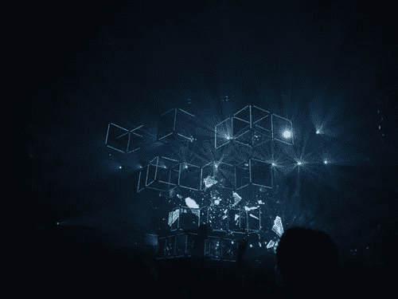
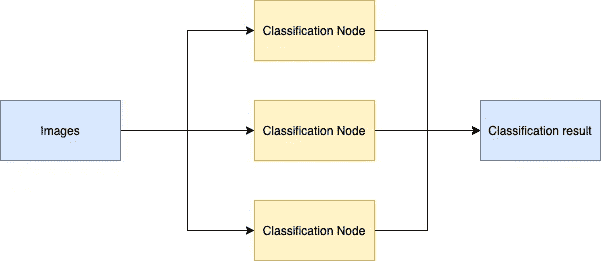

# 10 分钟用深度 Java 库中的 Spark 进行深度学习

> 原文：<https://towardsdatascience.com/deep-learning-with-spark-in-deep-java-library-in-10-minutes-923a73704094?source=collection_archive---------37----------------------->



# 介绍

Apache Spark 是一种广泛用于数据处理的技术，被机器学习用户大量使用。Spark 可用于产品分类、需求预测和个性化推荐。虽然 Spark 支持多种编程语言，但首选的 Spark SDK 是为 Scala 实现的，大多数深度学习框架都没有很好的支持。大多数机器学习框架喜欢 Python 及其 SDK，给 Spark 开发人员留下了次优选择:将他们的代码移植到 Python 或实现定制的 Scala 包装器。这些选项会影响开发人员的速度，并通过脆弱的代码威胁生产环境。

在这篇博客中，我们展示了用户如何使用 [Deep Java 库](https://djl.ai/) (DJL)直接从 Scala 执行深度学习工作负载。DJL 是一个框架无关的库，开发它是为了在用 Java 开发的 Spark jobs 中直接提供深度学习。在下面的教程中，我们将使用 MXNet 完成一个图像分类场景，尽管 PyTorch 和 TensorFlow 也受支持。完整代码见 [DJL 星火图像分类示例](https://github.com/aws-samples/djl-demo/tree/master/spark/image-classification)。

# 示例:使用 DJL 和火花进行图像分类

在本教程中，我们使用 [resnet50](https://arxiv.org/abs/1512.03385) ，一个预先训练好的模型来运行推理。对于本教程，我们将使用一个具有三个工作节点的集群进行分类。工作流程如下图所示:



*具有 3 个工作节点的 Spark 上的示例图像分类工作流*

我们的示例将在流程中创建几个执行者，并为他们每个人分配任务。每个执行器包含一个或多个在不同线程中执行任务的核心。这为每个工作节点提供了平衡的大数据处理工作负载。

# 第一步。创建 Spark 项目

我们使用流行的开源工具 [sbt](https://www.scala-sbt.org) 在 Scala 中构建这个 Spark 项目。您可以在这里找到更多关于如何开始使用 sbt [的资源。我们使用以下代码块在 sbt 中定义我们的项目:](https://www.scala-sbt.org/1.x/docs/sbt-by-example.html)

```
name := "sparkExample"version := "0.1"scalaVersion := "2.11.12"
scalacOptions += "-target:jvm-1.8"resolvers += Resolver.mavenLocallibraryDependencies += "org.apache.spark" %% "spark-core" % "2.3.0"libraryDependencies += "ai.djl" % "api" % "0.5.0"
libraryDependencies += "ai.djl" % "repository" % "0.5.0"
// Using MXNet Engine
libraryDependencies += "ai.djl.mxnet" % "mxnet-model-zoo" % "0.5.0"
libraryDependencies += "ai.djl.mxnet" % "mxnet-native-auto" % "1.6.0"
```

本教程使用 MXNet 作为其底层引擎。切换到另一个框架很简单，如下例所示:

```
// Using PyTorch Engine
libraryDependencies += "ai.djl.pytorch" % "pytorch-model-zoo" % "0.5.0"
libraryDependencies += "ai.djl.pytorch" % "pytorch-native-auto" % "1.5.0"
```

# 步骤 2:配置 Spark

在本教程中，我们在本地机器上运行这个例子。Spark 应用程序将使用以下配置:

```
// Spark configuration
val conf = new SparkConf()
  .setAppName("Simple Image Classification")
  .setMaster("local[*]")
  .setExecutorEnv("MXNET_ENGINE_TYPE", "NaiveEngine")
val sc = new SparkContext(conf)
```

MXNet 中的多线程推理需要`NaiveEngine`参数。如果使用 PyTorch 或 TensorFlow，可以删除以下行:

```
.setExecutorEnv("MXNET_ENGINE_TYPE", "NaiveEngine")
```

# 步骤 3:识别输入数据

在本教程中，输入数据表示为包含要分类的图像的文件夹。Spark 将加载这些二进制文件，并将它们划分到不同的分区。每个分区由一个执行器执行。以下语句将把文件夹中的所有图像均匀地分布在每个分区上。

```
val partitions = sc.binaryFiles("images/*")
```

# 步骤 4:定义 Spark 工作

接下来，我们使用上一步中创建的分区为这个作业创建执行图。在 Spark 中，每个执行器以多线程的方式执行任务。因此，在执行推理之前，我们需要将每个模型加载到执行器中。我们使用以下代码进行设置:

```
// Start assign work for each worker node
val result = partitions.mapPartitions( partition => {
   // before classification
    val criteria = Criteria.builder
        .optApplication(Application.CV.IMAGE_CLASSIFICATION)
        .setTypes(classOf[BufferedImage], classOf[Classifications])
        .optFilter("dataset", "imagenet")
        .optFilter("layers", "50")
        .optProgress(new ProgressBar)
        .build
   val model = ModelZoo.loadModel(criteria)
    val predictor = model.newPredictor()
   // classification
   partition.map(streamData => {
        val img = ImageIO.read(streamData._2.open())
        predictor.predict(img).toString
    })
})
```

需要为每个分区指定[模型动物园](https://javadoc.djl.ai/mxnet-model-zoo/0.4.0/index.html)的标准，以定位相应的模型并创建预测器。在分类过程中，我们从 [RDD](https://spark.apache.org/docs/latest/rdd-programming-guide.html) 加载图像，并为它们创建推论。

这个模型用 [ImageNet 数据集](http://www.image-net.org)训练，存储在 DJL 模型动物园。

# 步骤 5:定义输出位置

在我们完成映射过程之后，主节点将收集、聚合结果并将其保存在文件系统中。

```
result.collect().foreach(*print*)
result.saveAsTextFile("output")
```

运行这段代码会产生前面列出的输出类。输出文件将保存到不同分区的`output`文件夹中。本教程完整代码请见 [Scala 示例](https://github.com/aws-samples/djl-demo/blob/master/spark/image-classification/src/main/scala/com/examples/Example.scala)。

控制台的预期输出:

```
[
    class: "n02085936 Maltese dog, Maltese terrier, Maltese", probability: 0.81445
    class: "n02096437 Dandie Dinmont, Dandie Dinmont terrier", probability: 0.08678
    class: "n02098286 West Highland white terrier", probability: 0.03561
    class: "n02113624 toy poodle", probability: 0.01261
    class: "n02113712 miniature poodle", probability: 0.01200
][
    class: "n02123045 tabby, tabby cat", probability: 0.52391
    class: "n02123394 Persian cat", probability: 0.24143
    class: "n02123159 tiger cat", probability: 0.05892
    class: "n02124075 Egyptian cat", probability: 0.04563
    class: "n03942813 ping-pong ball", probability: 0.01164
][
    class: "n03770679 minivan", probability: 0.95839
    class: "n02814533 beach wagon, station wagon, wagon, estate car, beach waggon, station waggon, waggon", probability: 0.01674
    class: "n03769881 minibus", probability: 0.00610
    class: "n03594945 jeep, landrover", probability: 0.00448
    class: "n03977966 police van, police wagon, paddy wagon, patrol wagon, wagon, black Maria", probability: 0.00278
]
```

# 在您的生产系统中

在这种方法中，我们使用 RDD 来执行我们的图像作业，用于演示目的。随着数据帧使用和节省高速缓存的趋势，生产用户应该考虑为这些图像创建一个模式，并以数据帧格式存储它们。从 Spark 3.0 开始，Spark 提供了一个[二进制文件阅读器选项](https://docs.databricks.com/data/data-sources/binary-file.html)，使得图像转换为数据帧更加方便。

# 个案研究

亚马逊零售系统(ARS)使用 DJL 通过 Spark 路由的大量数据流进行了数百万次预测。这些预测使用成千上万的客户属性来确定客户在多个类别中采取行动的倾向，然后向客户呈现相关的广告和横幅。

ARS 使用数十万个特征，拥有数亿个客户——超过十万亿个数据点。他们需要一个能够有效扩展的解决方案。为了解决这个关键问题，他们最初为自己的工作创建了一个 Scala 包装器，但是这个包装器有内存问题，执行起来很慢。在采用 DJL 之后，他们的解决方案与 Spark 完美配合，总的推理时间从几天降到了几个小时。

敬请关注我们的下一篇博文，我们将深入探讨并介绍更多 ARS 面临的挑战，以及他们如何通过与 DJL 建立管道来解决这个问题。

# 了解更多关于 DJL 的信息


完成本教程后，你可能想知道 DJL 是什么。深度 Java 库(DJL)是一个开源库，用于在 Java 中构建和部署深度学习。该项目于 2019 年 12 月推出，由亚马逊各地的工程团队使用。这一努力受到了其他 DL 框架的启发，但是是从底层开始开发的，以更好地适应 Java 开发实践。DJL 是框架不可知的，支持 Apache MXNet、PyTorch、TensorFlow 2.x(实验)和 fastText(实验)。

要了解更多，请查看我们的[网站](https://djl.ai/)、 [Github 资源库](https://github.com/awslabs/djl)和 [Slack channel。](https://join.slack.com/t/deepjavalibrary/shared_invite/zt-ar91gjkz-qbXhr1l~LFGEIEeGBibT7w)