# 使用 TensorFlow 进行深度学习

> 原文：<https://towardsdatascience.com/deep-learning-with-tensorflow-5d3a7a8c55cd?source=collection_archive---------65----------------------->

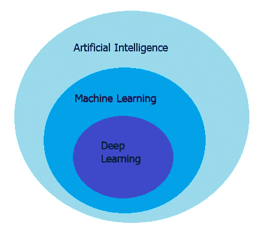

**深度学习**

深度学习是机器学习的子集，机器学习是人工智能的子集。人工智能是一种使机器能够模仿人类行为的技术。深度学习是一种机器学习，受人脑结构的启发。这种结构被称为人工神经网络。

**深度学习 vs 机器学习**

机器学习使用算法来解析数据，从数据中学习，并根据所学内容做出决策。深度学习将算法结构化为多层，以创建一个“人工神经网络”，它可以自己学习并做出智能决策。虽然两者都属于人工智能的大范畴，但深度学习是最像人类的人工智能的动力。

**什么是神经网络？**

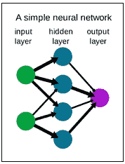

神经网络是人脑的简化。它是由神经元层构成的。这些神经元是网络的核心处理单元。一个神经网络由三种类型的层组成:输入层、输出层和隐藏层。首先，我们有接收输入的输入层和预测最终输出的输出层。在中间，我们有隐藏层，它执行我们的网络所需的大部分计算。此外，值得一提的是，神经网络被设计用来识别数据中的模式。

**问题**

让我们尝试解决上一篇帖子的问题—[https://towards data science . com/big-data-analyses-with-machine-learning-and-py spark-135119 ef6b 31](/big-data-analyses-with-machine-learning-and-pyspark-135119ef6b31)。在这个特殊的案例中，我们需要在一个金融机构中进行多种统计计算。一个例子是根据独立变量的数量来确定客户是否有存款。这次我们将尝试使用 TensorFlow 来训练模型。

**数据预处理**

数据预处理是机器学习中至关重要的一步，对模型的准确性至关重要。这种技术允许我们将原始数据转换成干净可用的数据集。使用这一步，我们将通过重新缩放、标准化、二进制化等使数据更有意义。我们正在使用的数据集是经过预处理的(关于这一点的更多信息，请参见上一篇文章[https://towardsdatascience . com/data-preprocessing-for-machine-learning-in-python-2d 465 f 83 f 18 c](/data-preprocessing-for-machine-learning-in-python-2d465f83f18c))。

在这种情况下，我们应该对数据集做的唯一事情就是将它分成训练集、验证集和测试集。

*   **训练数据集**:用于拟合模型的数据样本。
*   **验证数据集**:数据样本，用于在调整模型超参数时，对训练数据集上的模型拟合提供无偏评估。
*   **测试数据集**:用于提供最终模型在训练数据集上的无偏评估的数据样本。

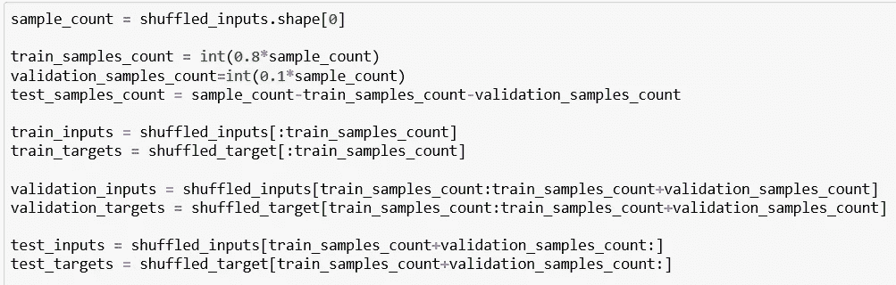

此外，我们将把数据保存在。npz 文件格式。NPZ 是 numpy 开发的一种文件格式，使用 gzip 压缩提供数组数据的存储。

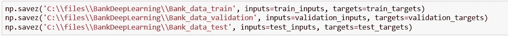

**张量流**

深度学习的主要软件工具是 TensorFlow。它是一个开源的人工智能库，使用数据流图来建立模型。张量流主要用于:分类、感知、理解、发现、预测、创造。TensorFlow 的五个主要用例是:

*   语音/声音识别
*   基于文本的应用
*   图像识别
*   时间序列
*   视频检波

**导入库**

我们需要导入将要使用的库。在我们的例子中，我们需要:

*   **Numpy**—Python 编程语言的库，增加了对大型多维数组和矩阵的支持，以及对这些数组进行操作的大量高级数学函数
*   **TensorFlow** —一个免费的开源软件库，用于数据流和跨一系列任务的差异化编程。

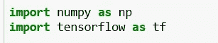

**加载数据**

首先，我们需要从之前保存的文件中加载数据。这可以通过使用 numpy 的 load 方法来完成。

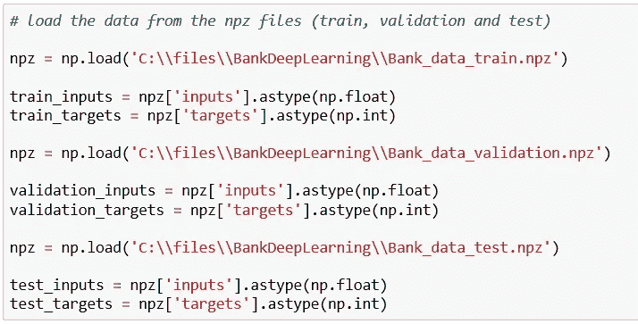

**定义模型**

我们需要定义输出大小—在我们的例子中，我们期望两个输出(1 —是和 0 —否)，所以大小将是 2。

接下来，我们需要定义隐藏层的大小。隐藏层的大小应介于输入层和输出层的大小之间。在这种情况下，隐藏层大小将为 30。

唯一剩下的事情就是定义模型。本例中的模型是使用 keras 定义的。顺序模型是层的线性堆叠。当我们定义模型时，我们需要为隐藏层和输出层选择激活函数。

**激活功能**

激活函数是神经网络的组成部分之一。如果我们有一个没有激活函数的神经网络，每个神经元将只使用权重和偏差对输入执行线性变换。这样定义的话，神经网络的功能将会减弱，它将无法从数据中学习复杂的模式。因此，激活函数用于将非线性变换添加到输入中。在下图中，我们可以看到可以使用的常用激活功能。

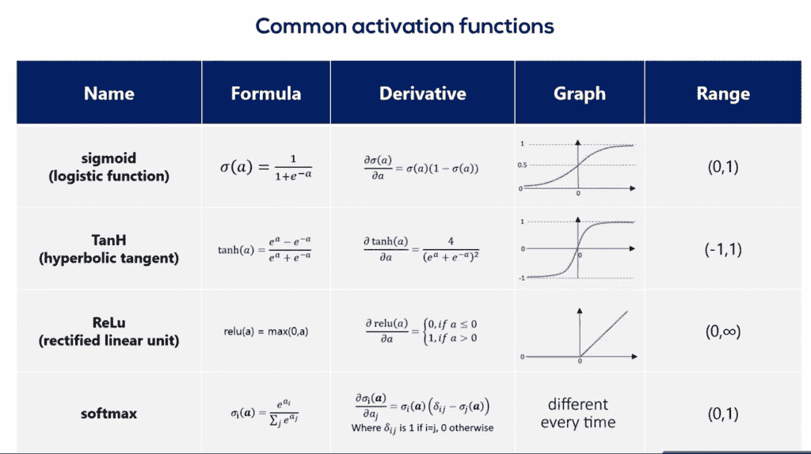

在这种情况下，我们对隐藏层使用 ReLU(校正线性单位),对输出层使用 Softmax。

*   ReLU 是神经网络中最常用的激活函数，尤其是在 CNN 中。如果您不确定在您的网络中使用什么激活功能，ReLU 通常是一个不错的首选。
*   Softmax 是指数型的，会扩大差异—将一个结果推至接近 1，而将另一个结果推至接近 0。它将分数即逻辑转换成概率。

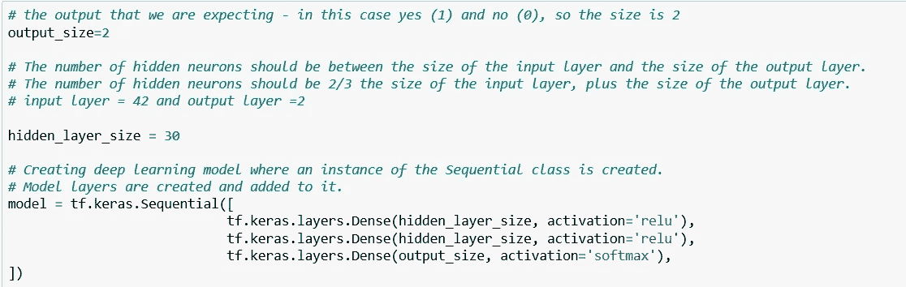

**编译模型**

在这一步中，我们将为培训配置模型。Compile 定义了损失函数、优化器和指标。我们需要一个编译好的模型来训练(因为训练使用了损失函数和优化器)。

*   **优化器**:优化算法或策略负责减少损失，并尽可能提供最准确的结果。在这个例子中，我们使用了一种叫做 Adam 的优化算法。 **Adam** 是一种优化算法，可用于替代经典的随机梯度下降过程，根据训练数据迭代更新网络权重。
*   **Loss** :这是一种评估特定算法对给定数据建模程度的方法。如果预测与实际结果相差太多，损失函数就会产生一个非常大的数字。分类交叉熵和稀疏分类交叉熵具有相同的损失函数，唯一的区别是，当输入是一次热编码时，我们使用分类交叉熵，当输入是整数时，我们使用稀疏分类交叉熵。
*   **指标**:指标是用来判断模型性能的函数。

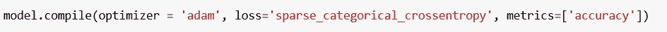

**拟合模型**

当我们拟合模型时，我们实际上是在为固定数量的历元(数据集上的迭代)训练模型。我们需要定义批量大小、最大时期和提前停止。

*   **批量** —一次正反向通过的训练样本数。
*   **最大时期** —训练模型的时期数。一个历元是对所提供的整个 x 和 y 数据的迭代。
*   **提前停止** —当监控的数量停止提高时，停止训练。耐心是一个数字，它定义了产生无改善的监控量的时期数，在此之后训练将停止。

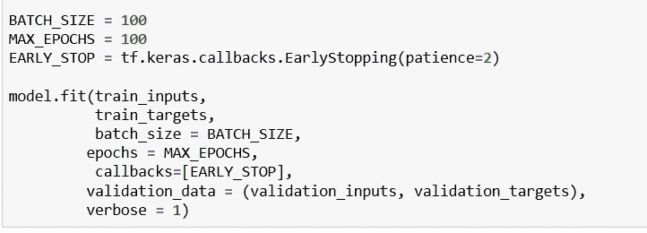

**结果**

在下图中，我们可以看到训练的结果。如果我们将准确性(~86%)与之前博客帖子中的准确性(~82%)进行比较，我们可以看到，在这种情况下，它更大。

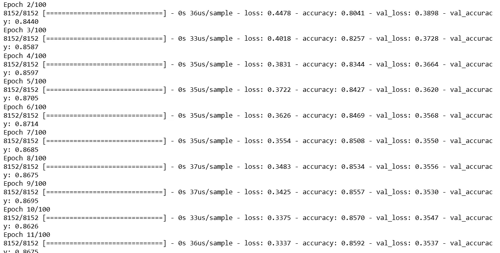

**评估模型**

返回测试模式下模型的损耗值和度量值。在这个函数中，输入数据将是我们的测试集。该函数将返回标量测试损失(如果模型只有一个输出，没有指标)或标量列表(如果模型有多个输出和/或指标)。

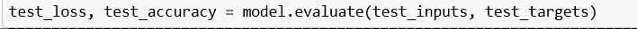

**结论**

这就是深度学习的基本思想。有许多类型的深度学习、不同种类的神经网络、各种架构和训练算法。神经网络背后的想法已经存在了很长时间，但今天它有了很大的进展。深度学习的未来特别光明！未来深度学习的可能性是无限的，从无人驾驶汽车到探索宇宙的机器人。

如果你对这个话题感兴趣，请随时联系我。

领英简介:【https://www.linkedin.com/in/ceftimoska/ 

博客原文可从以下链接获得:【https://interworks.com.mk/deep-learning-with-tensorflow/ 

另外，你可以在下面的链接中找到另一篇类似的博文:[https://interworks.com.mk/focusareas/data-management/](https://interworks.com.mk/focusareas/data-management/)