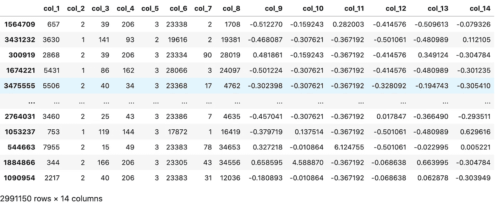

# 基于 FastAI 的不平衡表格数据加权交叉熵损失深度学习

> 原文：<https://towardsdatascience.com/deep-learning-with-weighted-cross-entropy-loss-on-imbalanced-tabular-data-using-fastai-fe1c009e184c?source=collection_archive---------12----------------------->

## 轻松构建深度学习模型同时避免陷阱的指南


照片由 [Unsplash](https://unsplash.com?utm_source=medium&utm_medium=referral) 上的 [Aditya Das](https://unsplash.com/@aditya_pi2xl?utm_source=medium&utm_medium=referral) 拍摄

FastAI 是一个非常方便和强大的机器学习库，将深度学习(DL)带给大众。我写这篇文章的动机是为了解决与训练二进制分类任务的模型相关的一些问题。我的目标是向您介绍使用 FastAI 为一个 ***表格*** ， ***不平衡*** 数据集构建一个简单有效的 DL 模型所需的步骤，同时避免我曾经犯过的错误。本文中的讨论是根据下面列出的部分组织的。

1.  资料组
2.  示例代码
3.  代码分解
4.  FastAI 与 PySpark ML & Scikit-Learn 的比较
5.  结论

# 1.资料组

数据集来自 ad 转换的上下文，其中 ***二进制*** ***目标变量*** 1 和 0 对应转换成功和失败。这个专有数据集(不，我没有权利)有一些特别有趣的属性，因为它的维度、类别不平衡以及特征和目标变量之间相当弱的关系。

首先，数据的维度:这个表格数据集包含相当大量的记录和 ***分类特征*** ，它们具有非常高的*。*

****注*** :在 FastAI 中，分类特征使用 ***嵌入*** 来表示，这样可以提高高基数特征的分类性能。*

*二、二进制 ***类标签*** 高度*不平衡由于成功的广告转换比较少见。在本文中，我们通过算法级方法(加权交叉熵损失函数)来适应这种约束，而不是数据级方法(重采样)。**

**三、 ***关系**特征*** 与 ***目标变量*** 之间的 是相当弱的 。例如，在显著的模型调整后，逻辑回归模型的 ROC 曲线下的验证面积为 0.74。**

## **数据集属性摘要**

*   **维度:17 个特征，1 个目标变量，3738937 行**
*   **二元目标类**
*   **阶层失衡比例为 1:87**
*   **6 个数字特征**
*   **8 个分类特征**
*   **分类要素的组合基数为 44，000**

# **2.示例代码**

**这段代码是在 ***Google Cloud — AI 平台*** 上的 ***Jupyter Lab*** 笔记本上运行的，规格如下。**

*   **4 个 N1 标准 vCPUs，15 GB 内存**
*   **1 个英伟达特斯拉 P4 GPU**
*   **环境:PyTorch 1.4**
*   **操作系统:Debian 9**

**模型培训管道将在下一节中解释，如下所示。**

**用于表格数据二进制分类的 FastAI 流水线**

# **3.代码分解**

## **导入包**

**通过命令终端安装`fastai`和`fastbook`。有关设置的更多详细信息，请查看此[链接](https://course.fast.ai/start_gcp)。**

```
**conda install -c fastai -c pytorch fastai
git clone https://github.com/fastai/fastbook.git
pip install -Uqq fastbook**
```

**将 FastAI 库和熊猫导入笔记本。**

```
**import pandas as pd 
from fastai.tabular.all import ***
```

## **按要素类型加载数据和分组列名**

**由于隐私原因，列名必须匿名。**

```
**df = pd.read_csv('data/training.csv')# Categorical Features
CAT_NAMES = ['col_1', 'col_2', 'col_3', 'col_4', 
             'col_5', 'col_6', 'col_7', 'col_8'] # Continuous Features
CONT_NAMES = ['col_9', 'col_10', 'col_11', 
              'col_12', 'col_13', 'col_14'] # Target Variable
TARGET = 'target'**
```

## **强制转换目标变量数据类型**

**将二进制目标变量的数据类型改为*类别*。**

```
**df[TARGET] = df[TARGET].astype('category')**
```

****陷阱#1** :如果目标变量数据类型保留为数值，FastAI/PyTorch 会将其视为数值，并产生*运行时错误*。**

## **实例化数据加载器**

**接下来，列出数据预处理程序、训练/验证集拆分并创建表格数据加载器。**

```
**# Data Processors
procs = [Categorify, FillMissing, Normalize] # Training/Validation Dataset 80:20 Split 
splits = RandomSplitter(valid_pct=0.2)(range_of(df)) dls = TabularDataLoaders.from_df(df,                                         
                                 y_names=TARGET,                                  
                                 cat_names=CAT_NAMES,                                 
                                 cont_names=CONT_NAMES,                                 
                                 procs=procs,                                 
                                 splits=splits)**
```

**使用`dls.xs`查看转换后的训练数据。**

****

****构造损失函数权重****

**类别不平衡被用于创建交叉熵损失函数的权重，从而确保多数类别被相应地向下加权。此处使用的砝码公式与 *scikit-learn* 和 *PySPark ML* 中的公式相同。**

```
**class_count_df = df.groupby(TARGET).count() 
n_0, n_1 = class_count_df.iloc[0, 0], class_count_df.iloc[1, 0] 
w_0 = (n_0 + n_1) / (2.0 * n_0)
w_1 = (n_0 + n_1) / (2.0 * n_1) 
class_weights=torch.FloatTensor([w_0, w_1]).cuda()**
```

****陷阱#2** : 确保将类权重转换为浮点张量，并通过`.cuda()`启用 cuda 操作。否则，你会得到一个*类型的错误*。**

```
**TypeError: cannot assign 'list' object to buffer 'weight' (torch Tensor or None required)**
```

****实例化 ROC 指标下的区域****

```
**roc_auc = RocAucBinary()**
```

****陷阱#3** :对于二进制类标签，使用`RocAucBinary()`而不是`RocAuc()`，以避免*值错误*。**

```
**ValueError: y should be a 1d array, got an array of shape (2000, 2) instead.**
```

****实例化损失函数****

```
**loss_func = CrossEntropyLossFlat(weight=class_weights)**
```

****陷阱#5:** 使用 FastAI 交叉熵损失函数，与`torch.nn.CrossEntropyLoss()`的 PyTorch 等价函数相反，以避免错误。此处列出了 FastAI 损失函数[。使用 PyTorch 交叉熵损失给了我以下运行时错误。](https://docs.fast.ai/losses)**

```
**RuntimeError: Expected object of scalar type Long but got scalar type Char for argument #2 'target' in call to _thnn_nll_loss_forward**
```

****实例化学习者****

**使用 FastAI 中的`tabular_learner`轻松实例化一个架构。**

```
**learn = tabular_learner(dls, 
                        layers=[500, 250],    
                        loss_func=loss_func, 
                        metrics=roc_auc)**
```

**仔细检查`learn`是否使用了正确的损失函数:**

```
**learn.loss_func 
Out [1]: FlattenedLoss of CrossEntropyLoss()**
```

## **模型训练和验证分数**

**在所需的历元数上训练模型。**

```
**learn.fit_one_cycle(3)**
```

**训练和验证集的性能度量和损失函数值如下所示。**

****

**ROC 曲线下面积在短短 3 个时期内达到 0.75！**

**太好了！通过最小的调整，FastAI 模型比使用 PySpark 和 Scikit-Learn 精心构建的模型性能更好。**

# **4.FastAI 与 PySpark ML & Scikit-Learn 逻辑回归模型的比较**

**在这一节中，我们比较了这三个 ML 库的模型性能和计算时间。**

****注:**虽然神经网络在没有大量超参数调整的情况下表现良好，但 PySpark ML 和 Scikit-Learn 则不然。因此，我添加了这些时间，因为它们与训练下降模型相关。**

****模型训练时间****

1.  **FastAI — 6 分钟**
2.  **PySpark ML — 0.7 秒+ 38 分钟用于超参数调整**
3.  **Scikit-Learn — 36 秒+ 8 分钟用于超参数调整(基于数据的子样本)**

****ROC 曲线下面积****

1.  **FastAI — 0.75**
2.  **PySpark ML — 0.74**
3.  **Scikit-Learn — 0.73**

**更多详情，请查看我的 Github [回购](https://github.com/FyzHsn/ml-classification-exploration/tree/develop)。**

# **5.结论**

**在本文中，我们看到了 FastAI 在快速构建 DL 模型方面的强大功能。在使用 FastAI 之前，我会推迟使用神经网络，直到我已经尝试了逻辑回归、随机森林等等。因为神经网络难以调整且计算昂贵。然而，随着通过谷歌人工智能平台笔记本和分层 FastAI 方法对 GPU 的可访问性增加，现在它肯定会是我在大型复杂数据集上进行分类任务时首先使用的工具之一。**