# 深度学习的数学

> 原文：<https://towardsdatascience.com/deep-learnings-mathematics-f52b3c4d2576?source=collection_archive---------8----------------------->

罗马法师在 [Unsplash](https://unsplash.com/s/photos/mathematics?utm_source=unsplash&utm_medium=referral&utm_content=creditCopyText) 上拍摄的照片

## 探索深度学习成功背后的数学和方程式

深度学习是基于人工神经网络的机器学习科学的一个分支。它有几个衍生物，如多层感知器-MLP，卷积神经网络-CNN-和递归神经网络-RNN-可应用于许多领域，包括计算机视觉，自然语言处理，机器翻译…

深度学习的兴起有三个主要原因:

*   **本能特征工程**:虽然大多数机器学习算法需要人类的专业知识来进行特征工程和提取，但深度学习会自动处理变量及其权重的选择
*   巨大的数据集:持续不断的数据收集产生了大型数据库，这使得更深层次的神经网络成为可能
*   **硬件发展**:用于图形处理单元的新 GPU 允许更快的代数计算，这是 DL 的核心基础

在这篇博客中，我们将主要关注多层感知器-MLP-我们将详细介绍深度学习成功背后的数学背景，并探索用于提高其性能的优化算法。

摘要如下:

1.  定义
2.  学习算法
3.  参数初始化
4.  正向-反向传播
5.  激活功能
6.  最优化算法

注意:因为 Medium 不支持 LaTeX，所以数学表达式是作为图像插入的。因此，为了更好的阅读体验，我建议你关闭黑暗模式。

# 1-定义

## 神经元

> 它是一组连接实体的数学运算

让我们考虑这样一个问题，我们根据房子的大小来估计房子的价格，它可以被图解如下:

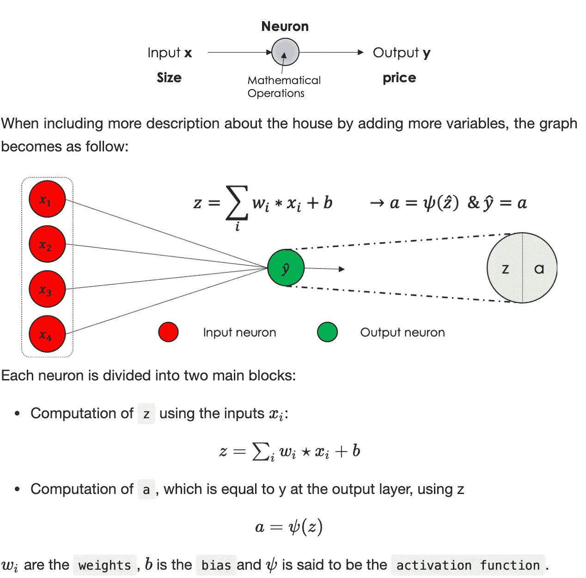

> 一般来说，神经网络更好地被称为 MLP，意为“多层感知器”，是一种直接形式的神经网络，被组织成若干层，其中信息仅从输入层流向输出层。
> 
> 每一层都由一定数量的神经元组成，我们区分:
> 
> -输入层
> 
> -隐藏层
> 
> -输出层

下图表示一个神经网络，其输入端有 5 个神经元，第一个隐藏层有 3 个，第二个隐藏层有 3 个，输出端有 2 个。

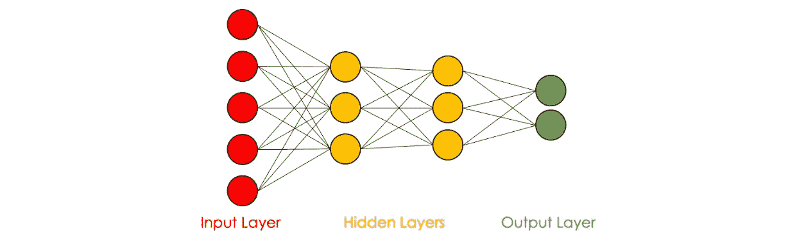

隐含层中的一些变量可以根据输入特征来解释:在房屋定价的情况下，在假设第一个隐含层的第一个神经元更关注变量*x1*et*x2*的情况下，可以解释为例如房屋的家庭规模的量化。

## 作为监督任务的 DL

在大多数 DL 问题中，我们倾向于使用一组变量 X 来预测输出 y，在这种情况下，我们假设对于数据库的每一行 *X_i* 我们都有相应的预测 *y_i* ，因此有标记的数据。

**应用**:房地产、语音识别、图像分类……

使用的数据可以是:

*   结构化:明确定义了特性的数据库
*   非结构化:音频、图像、文本……

## 通用逼近定理

现实生活中的深度学习是给定函数 *f* 的近似。由于以下定理，这种近似是可能的和精确的:

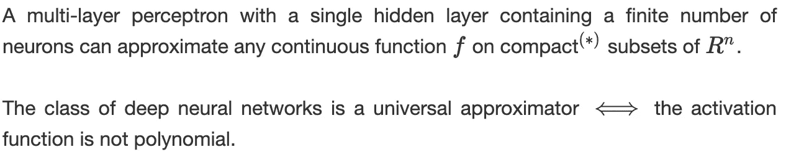

(*)在有限维中，如果一个集合是闭且有界的，则称它是紧的。更多详情，请访问此[链接](https://en.wikipedia.org/wiki/Compact_space)。
这种算法的主要优点是深度学习允许解决任何可以用数学表达的问题

## 数据预处理

一般来说，在任何机器学习项目中，我们将数据分为 3 组:

> **-训练集**:用于训练算法和构造批次
> 
> **- Dev set** :用于微调算法，评估偏差和方差
> 
> **-测试集**:用于概括最终算法的误差/精度

下表根据数据集 *m* 的大小总结了三个数据集的重新划分:

标准的深度学习算法需要一个大的数据集，其中样本数量大约为行。现在数据已经准备好了，我们将在下一节看到训练算法。通常，在分割数据之前，我们还会对输入进行归一化处理，这一步将在本文后面详细介绍。

# 2.学习算法

神经网络中的学习是计算与整个网络中各种回归相关的参数权重的步骤。换句话说，我们的目标是从输入开始，找到给出真实值的最佳预测/近似的最佳参数。
为此，我们定义了一个目标函数，称为`loss function`，记为`J`，它量化了整个训练集的实际值和预测值之间的距离。我们通过以下两个主要步骤来最小化 J:

> `**- Forward Propagation**`:我们通过网络完整地或成批地传播数据，并且我们计算该批上的损失函数，该损失函数只不过是在不同行的预测输出处提交的误差的总和。
> 
> `**- Backpropagation**`:包括计算关于不同参数的成本函数的梯度，然后应用下降算法来更新它们。

我们多次重复同样的过程，称为`epoch number`。定义架构后，学习算法编写如下:

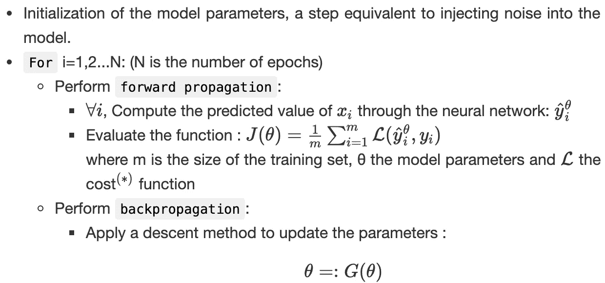

(∫)成本函数 *L* 计算单个点上实际值和预测值之间的距离。

# 3.参数初始化

定义神经网络结构后的第一步是参数初始化。这相当于将初始噪声注入模型的权重。

*   **零初始化:**我们可以考虑用 0 来初始化参数，即:W=0，b=0

使用正向传播方程，我们注意到所有隐藏单元将是对称的，这不利于学习阶段。

*   **随机初始化:**这是一种常用的替代方法，包括在参数中注入随机噪声。如果噪声太大，一些激活函数可能会饱和，这可能会影响梯度的计算。

两种最著名的初始化方法是:

*   `Xavier`的:它包括用从服从正态分布的中心变量中随机抽样的值填充参数；

*   `Glorot`的:相同的方法有不同的方差:

# 4.正向和反向传播

在深入研究深度学习背后的代数之前，我们将首先设置注释，该注释将用于解释正向和反向传播的方程。

## **神经网络的表示法**

神经网络是一系列的`regressions`后跟一个`activation function`。它们都定义了我们所说的正向传播。并且是每层的**学习参数**。反向传播也是一系列从输出到输入的代数运算。

## 正向传播

*   **通过网络代数**

让我们考虑具有如下`L layers`的神经网络:

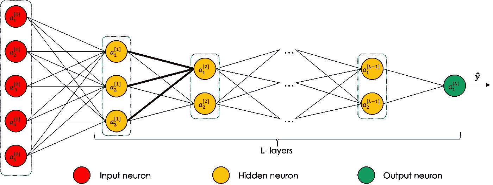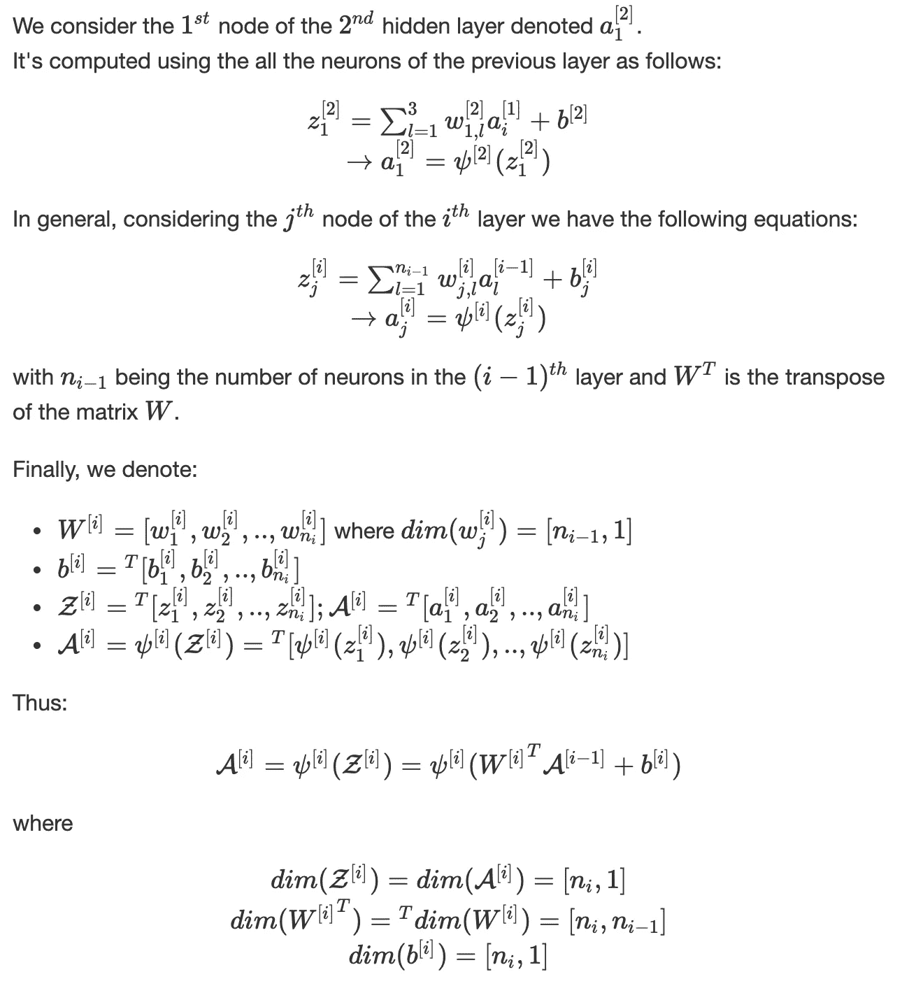

## 通过训练集的代数

让我们考虑通过神经网络预测单行数据帧的输出。

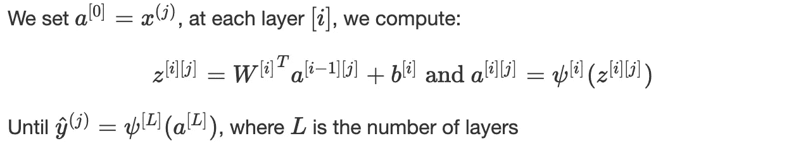

当处理一个 *m* 行的数据集时，对每一行分别重复这些操作是非常昂贵的。
我们在每一层都有[ *我* ]:

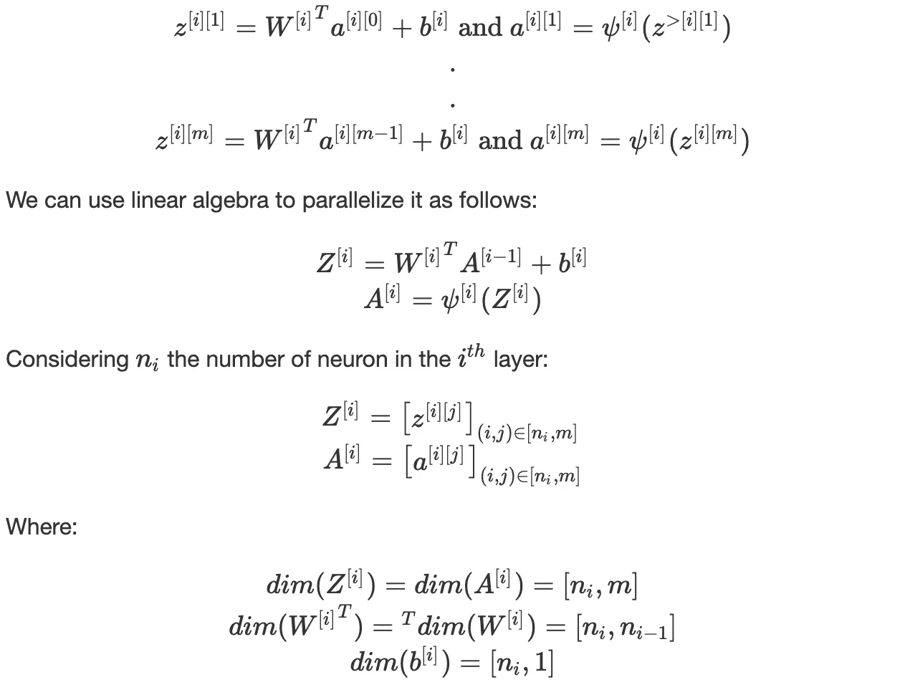

参数 *b_i* 使用广播通过列重复自身。下图对此进行了总结:

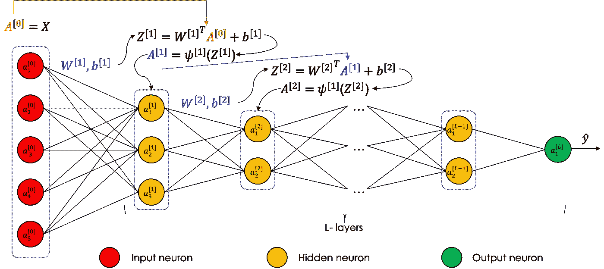

## 反向传播

反向传播是学习的第二步，它包括将预测(正向)阶段犯下的错误注入网络，并更新其参数以在下一次迭代中表现更好。
因此，函数 *J* 的优化，通常通过下降法。

**计算图形**

大多数下降方法需要计算表示为∇ *J* ( *θ* )的损失函数的梯度。

在神经网络中，使用将函数 *J* 分解成几个中间变量的计算图进行运算。

我们来考虑下面这个函数: *f* ( *x* ， *y* ，*z*)=(*x*+*y*)。 *z*

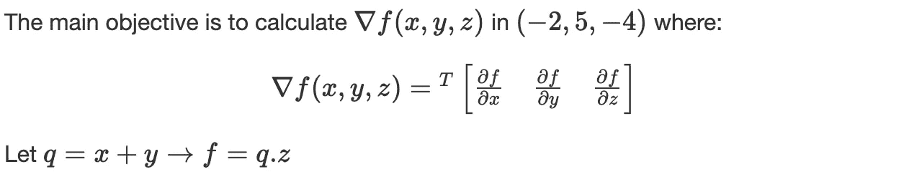

我们使用两个通道进行计算:

*   **正向传播**:计算从输入到输出的 *f* 的值:*f*(2，5，4)=-12
*   **反向传播**:递归应用链规则计算从输出到输入的梯度:

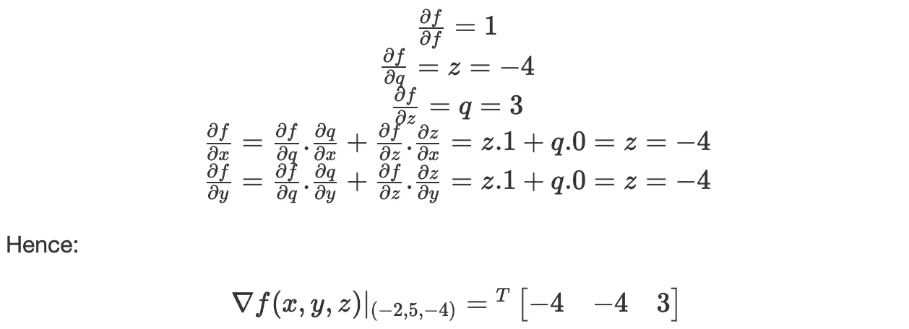

导数可以在下面的*计算图*中恢复:

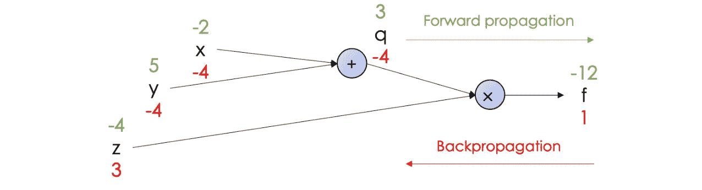

## 方程式

数学上，我们计算成本函数 *J* ，w.r.t 架构参数 *W* 和 *b* 的梯度。

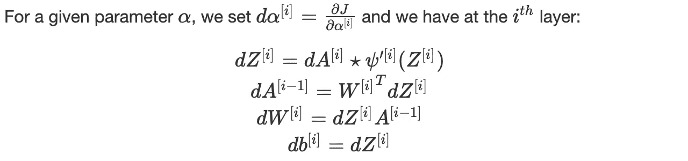

其中(⋆)是逐元素乘法。
我们递归地将这些等式应用于 *i* = *L* ，*L*1，…，1

## 梯度检查

当执行反向传播时，增加了额外的检查以确保代数计算是正确的。

算法:

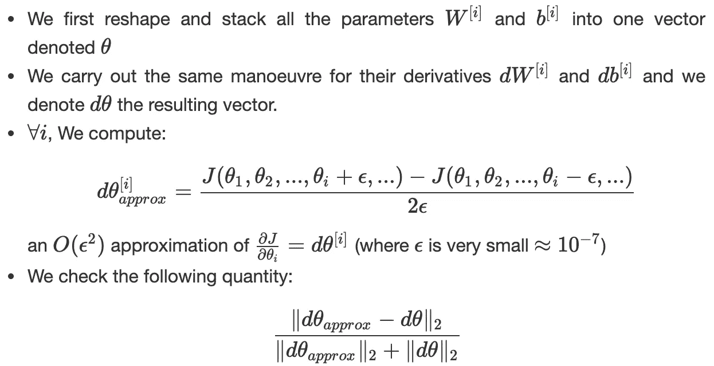

它应该接近 *ϵ* 的值，当量值比 *ϵ.高一千*倍*时，怀疑有错误*

我们可以在下面的方框中总结前向和后向传播:

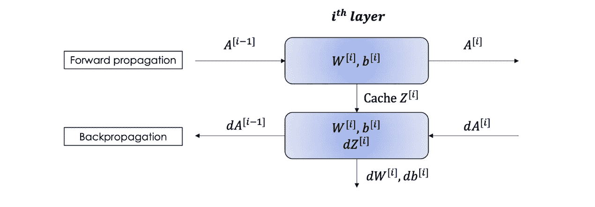

## 参数与超参数

*-参数*，表示为 *θ* ，是我们通过迭代学习的元素，我们对其应用反向传播和更新: *W* 和 *b.*

*-超参数*是我们在算法中定义的所有其他变量，可以*调整*以改进神经网络:

*   学习率 *α*
*   迭代次数
*   激活功能的选择
*   层数 *L*
*   每层中的单元数量

# 5.激活功能

激活函数是一种选择在神经网络中传播的数据的传递函数。潜在的解释是，只有当网络中的神经元被充分激发时，才允许它传播学习数据(如果它处于学习阶段)。

以下是最常见的函数列表:

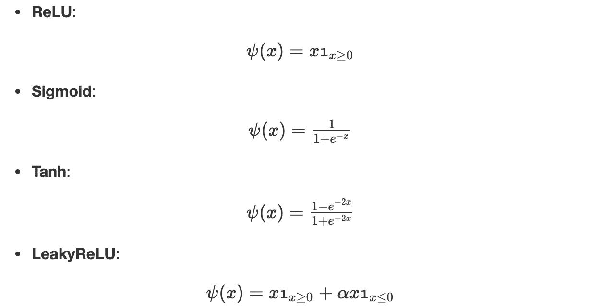

**备注**:如果激活函数都是线性的，那么神经网络就相当于一个简单的线性回归

# 6.最优化算法

## **风险**

让我们考虑一个用 *f* 表示的神经网络。优化的真正目标被定义为所有语料库的预期损失:

其中 *X* 是来自一个连续的可观测空间的一个元素，对应于一个目标 *Y* 和 *p* ( *X* ， *Y* )是观测到该对的边际概率( *X* ， *Y* )。

**经验风险**

由于我们不能拥有所有的语料库，因此我们忽略了分布，我们将风险的估计限制在能很好地代表整个语料库的某个数据集上，并考虑所有情况都是等概率的。
在这种情况下:我们将 m 设为代表性语料库的大小，我们得到:∫=∑和 *p* ( *X* ， *Y* )=1/m。因此，我们迭代优化损失函数，定义如下:

另外我们可以断言:

存在许多技术和算法，主要基于梯度下降来执行优化。在下面的章节中，我们将介绍最著名的几个。值得注意的是，这些算法可能会陷入局部极小值，没有什么能保证达到全局最优。

## 标准化输入

在优化损失函数之前，我们需要对输入进行归一化，以加快学习速度。在这种情况下， *J* ( *θ* )变得更紧密和更对称，这有助于梯度下降更快地找到最小值，从而减少迭代次数。
**标准数据**是常用的方法，包括减去变量的平均值并除以它们的标准差。考虑到这一点，下图说明了对右侧标准数据等高线上的输入进行归一化的效果:

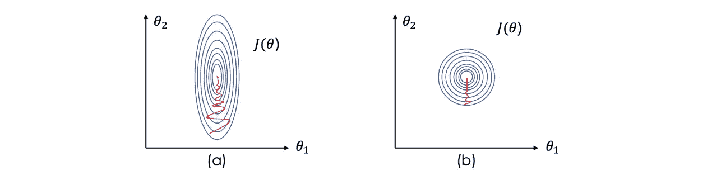

假设 X 是我们数据库中的一个变量，我们设置:

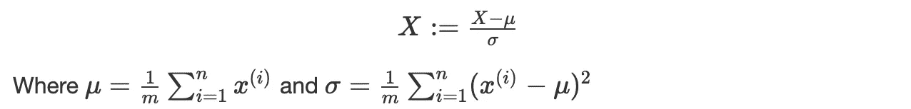

## 梯度下降

通常，我们倾向于构造一个`convex`和`differentiable`函数 *J* ，其中任何局部极小值都是全局极小值。从数学上讲，寻找凸函数的全局最小值等价于求解方程∇ *J* ( *θ* )=0，我们把它的解记为 *θ* ⋆。
大多数使用的算法是这样的:

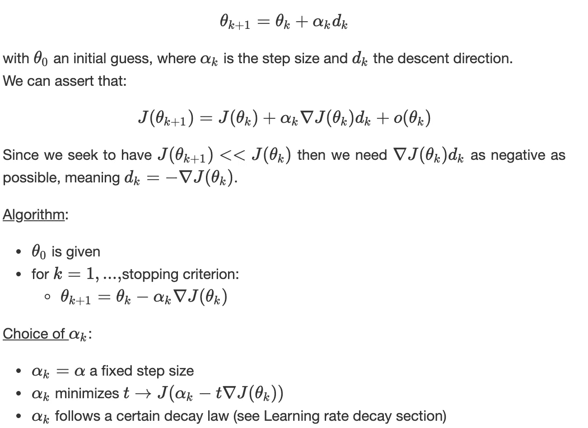

**小批量梯度下降**

这项技术包括将训练集分成几批:

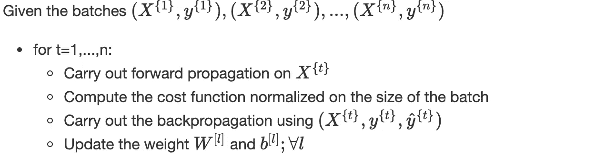

小批量的选择:

*   少量行 2000 行
*   典型大小:2 的幂，有利于记忆
*   小批量应该适合 CPU/GPU 内存

备注:在批处理中只有一条数据线的情况下，该算法称为随机梯度下降

## 动量梯度下降

包括动量概念的梯度下降的变体，算法如下:

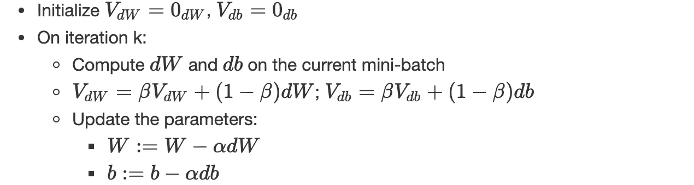

( *α* ， *β* )为超参数。
由于 *dθ* 是在小批量上计算的，因此产生的梯度∇ *J* 噪声很大，动量中包含的指数加权平均值可以更好地估计导数。

## RMSprop

均方根 prop 非常类似于带动量的梯度下降，唯一的区别是它包括二阶动量而不是一阶动量，加上参数更新的微小变化:

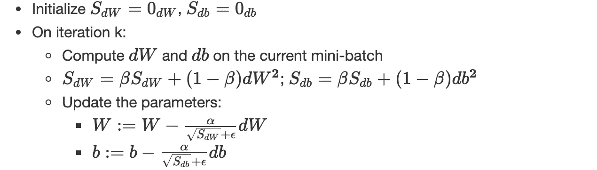

( *α* ， *β* )是超参数，而 *ϵ* 确保数值稳定性(≈108)

## 圣经》和《古兰经》传统中）亚当（人类第一人的名字

Adam 是一种自适应学习率优化算法，专门用于训练深度神经网络。Adam 可以看作是 RMSprop 和带动量的梯度下降的组合。
它使用平方梯度将学习率设置为 RMSprop，并通过使用梯度的移动平均值而不是梯度本身来利用动量，因为梯度随动量下降。
主要思想是通过加速向正确方向下降来避免优化过程中的振荡。
Adam 优化器的算法如下:

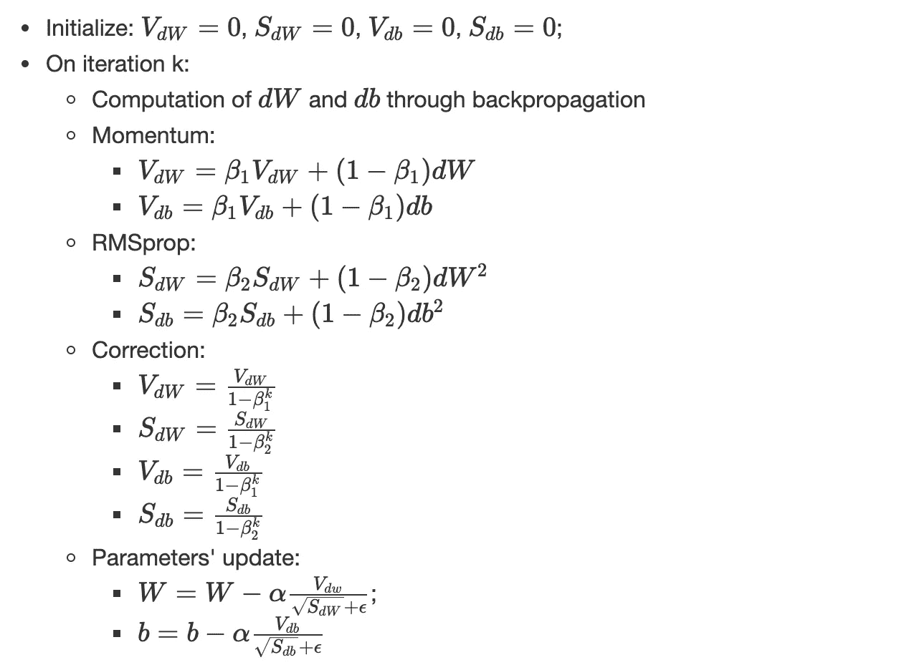

## 学习率衰减

学习率衰减的主要目的是随着时间/迭代缓慢降低学习率。它在这样一个事实中找到了合理性，即我们在学习开始时可以迈出大步，但当接近全局最小值时，我们会放慢速度，从而降低学习速度。
学习率存在许多衰减规律，下面是一些最常见的:

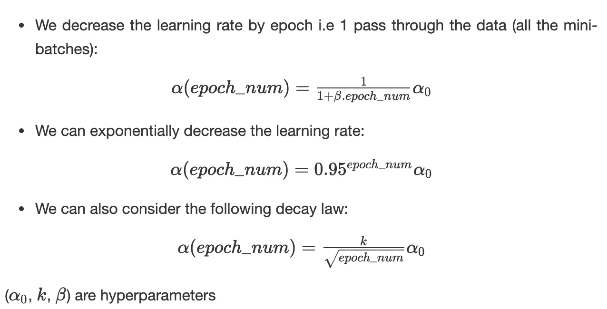

## 正规化

**方差/偏差**

训练神经网络时，它可能会遇到以下问题:

*   **偏高**:或者欠拟合，网络在数据中找不到路径，这种情况下 *J_train* 非常高与 *J_dev* 相同。从数学上讲，进行交叉验证时；在所有考虑的褶皱上， *J* 的平均值较高。
*   **高方差**或过拟合，模型完全符合训练数据，但无法对未见过的数据进行概括，在这种情况下， *J_train* 非常低，而 *J_dev* 相对较高。从数学上讲，进行交叉验证时；在所有考虑的褶皱上 *J* 的方差很高。

让我们考虑一下飞镖游戏，击中红色目标是最好的情况。拥有**低偏差**(第一行)意味着**平均而言**我们接近目标。在**低方差的情况下，**击中全部集中在目标周围(击中分布的方差低)。当方差较高时，在低偏差的假设下，命中分散开，但仍在红色圆圈周围。
反之亦然，我们可以用低/高方差来定义高偏差。

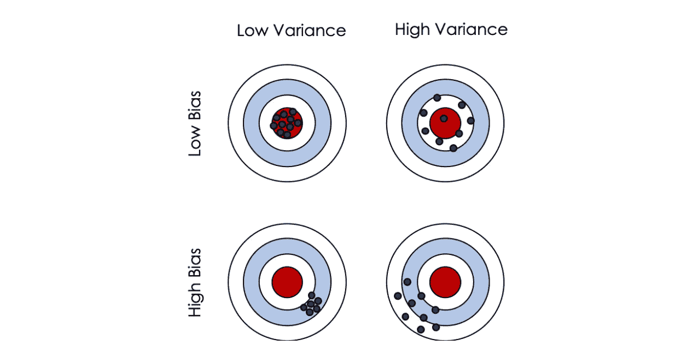

从数学上讲，设 *f* 为真回归函数:y =*f*(*x*)+*ϵ*其中: *ϵ~N(0,σ )*
我们用 MSE 拟合一个假设*h*(*x*)=*wx*+*b*并认为 x_0 是一个新的数据点，【t

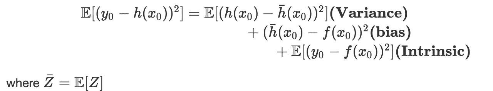

通过使用 *AIC* 标准或交叉验证，必须在方差和偏差之间找到一个平衡点，以找到模型的最佳复杂性。
以下是解决偏差/差异问题的简单方案:

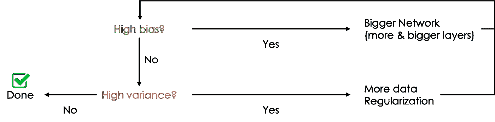

**L1 — L2 正规化**

正则化是一种防止过度拟合的优化技术。
它包括在目标函数中添加一项，以最小化如下:

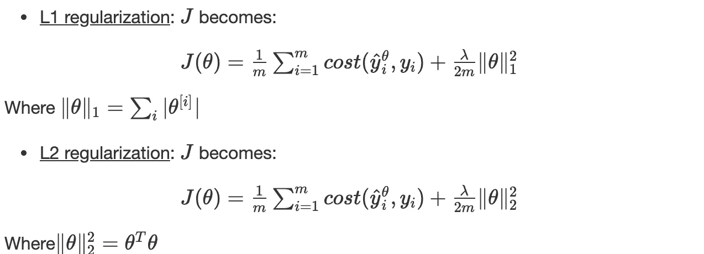

*λ* 是正则化的超参数。

**反向传播和正则化**
反向传播期间参数的更新取决于梯度∇ *J* ，其中增加了新的正则化项。在 L2 正规化，它变成如下:

考虑到 *λ* > > 1，最小化成本函数导致参数的弱值，因为项(*λ/2m)*∨*θ*∨)简化了网络并使其更加一致，因此较少暴露于过拟合。

**退学正规化**

粗略地说，主要思想是采样一个均匀的随机变量，`for each layer for each node`，并且有 *p* 的机会保留该节点，并且有 1*p*的机会移除该节点，这减小了网络。辍学的主要直觉是基于这样的想法，网络不应该依赖于一个特定的特征，而是应该分散权重！
从数学上讲，当 dropout 关闭时，考虑到第*I*层的第*j*节点，我们有以下等式:

当 dropout 打开时，方程式如下:

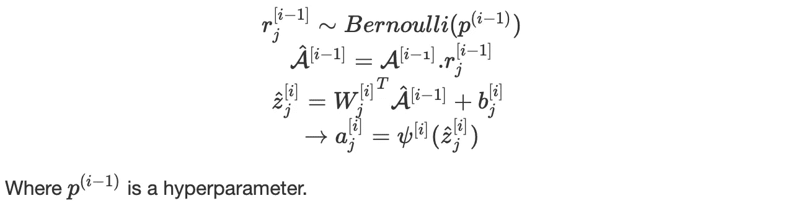

## 提前停止

该技术非常简单，包括当 *J_train* 和 *J_dev* 开始分离时，停止该区域周围的迭代:

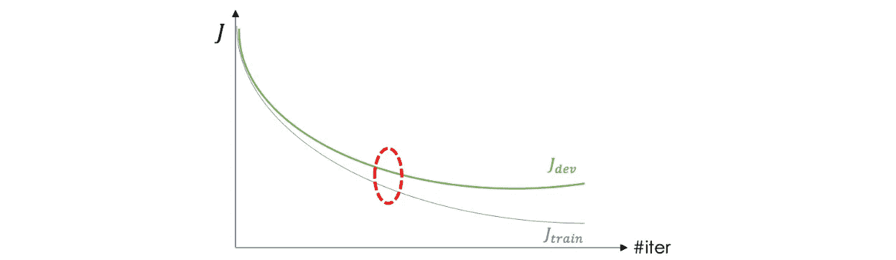

**梯度问题**

梯度的计算有两个主要问题:梯度消失和梯度爆炸。
为了说明这两种情况，让我们考虑一个神经网络，其中所有激活函数 *ψ* [ *i* ]都是线性的，并且:

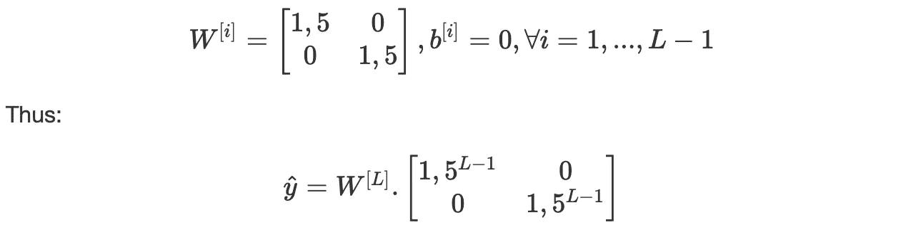

我们注意到，1,5^((T7)将作为深度 l 的函数按指数规律爆炸。如果我们使用 0.5 而不是 1.5，那么 0,5^(l-1(T7)也将按指数规律消失。
渐变也会出现同样的问题。

# 结论

作为一名数据科学家，了解神经网络背景下的数学转变非常重要。这允许更好的理解和更快的调试。

不要犹豫，检查我以前的文章处理:

*   [卷积神经网络的数学](https://medium.com/p/convolutional-neural-networks-mathematics-1beb3e6447c0)
*   [物体检测&人脸识别算法](https://medium.com/p/object-detection-face-recognition-algorithms-146fec385205)
*   [递归神经网络](/recurrent-neural-networks-b7719b362c65)

机器学习快乐！

# 参考

*   [深度学习专业化](https://fr.coursera.org/specializations/deep-learning)，Coursera，吴恩达
*   [优化课程](http://www.iecl.univ-lorraine.fr/~Antoine.Henrot/)，Mines Nancy，Antoine Henrot
*   [机器学习](http://deeploria.gforge.inria.fr/cours/cours1.html#/machine-learning-introduction)，洛里亚，克里斯托夫·塞里萨拉

*原载于 2020 年 1 月 31 日*[*https://www.ismailmebsout.com*](https://www.ismailmebsout.com/deep-learning/)*。*