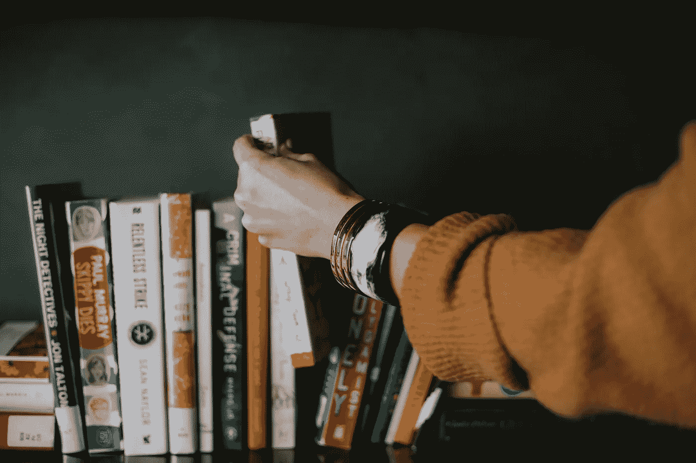

# 深度学习的快速进步让我们感到不知所措

> 原文：<https://towardsdatascience.com/deep-learnings-rapid-progress-leads-us-to-feel-overwhelmed-1cbe3dabdce5?source=collection_archive---------66----------------------->

## 我们不应该急于快速学习任何东西。

照片由 [Iwona Castiello d'Antonio](https://unsplash.com/@aquadrata?utm_source=unsplash&utm_medium=referral&utm_content=creditCopyText) 在 [Unsplash](https://unsplash.com/s/photos/traffic-jam?utm_source=unsplash&utm_medium=referral&utm_content=creditCopyText) 上拍摄

深度学习正达到其最佳进展年份。它也成为了最近一年任何利益相关者的流行语。因此，有很多资源存在，比如课程、论文、社区等等。

令人惊讶的是，大多数资源都是免费提供的，并且在互联网上公开。因此，深度学习对世界各地的社区都是可用的，不管他们的背景是什么，他们代表哪里。

由于这些因素使深度学习这次如此出名，一些影响将影响到我们。其中之一就是影响我们的心理健康。面对如此庞大的资源，我们变得不知所措。

感到不知所措是一种因为某些因素而变得沮丧的感觉。如果我们不认真对待它，它会让我们失去做很多事情的动力。

2018 年图灵奖获得者之一、著名深度学习研究者 Yoshua Bengio 最近在博客上发表了一篇文章，内容是重新思考机器学习领域的出版物会是什么样子。它类似于一个叫做慢科学的宣言。我已经引用过了，说的是这样的，

> 我们确实需要时间思考。我们确实需要时间来消化。我们确实需要时间来误解对方，尤其是在促进人文科学和自然科学之间的对话时。我们不能不断地告诉你我们的科学意味着什么；对什么有好处；因为我们还不知道。科学需要时间。
> 
> *——当我们思考时，请忍耐。*

根据上面的引用，它表明，作为一名科学家，我们应该放慢自己的速度来完成事情。他真正想要的是这个领域应该有更多的对话。因此，它可能会产生突破，也可能是新的灵感。

这个概念本身不仅仅是为了科学家，也是为了我们，作为一个学习者，让我们放慢脚步，从这个领域获得更多。

**现在，让我问你这些问题，**

*   **你现在对海量的深度学习资源有什么感觉？**
*   **你最近看了多少新的深度学习研究论文？**
*   **关于深度学习，你已经了解了哪些东西？**

很可能你会回答你学到了很多，而且在学习深度学习的时候你也觉得还好。你确定吗？也许你会回答是或不是。但是如果你已经打开了这么多的资源，却不觉得你从中学到了任何东西，你应该休息一下。

我们可能想学那么多东西，想成就很多事情，但是不要急于求成。我们必须让自己慢下来，否则我们会变得没有动力。

# 避免不知所措的小贴士

现在的问题是，我们如何在不被淹没的情况下学习深度学习？

以下是我关于如何在不被淹没的情况下学习的建议。

## 找到你的学习方式

人们可以学到所有的东西。但是要学习它，可能你会用一种不同的学习方式。学习方式有很多种。他们是，

*   视觉型学习者
    这种类型的学习者通过使用任何图形或可视化来理解事物。这种类型的例子是那些喜欢用思维导图做笔记的人。
*   **听觉型学习者** 这种类型通过听课和讨论来理解概念进行学习。
*   **读写学习者**
    这种类型基本上是通过看书和记笔记来学习。
*   **动觉型学习者** 这种类型基本是边做边学。例如，通过对某些神经网络执行代码来了解神经网络如何工作。

那么，根据这些类型，哪一种适合你呢？不一定非要选一个。你可以把这些结合起来，使你的学习更有效。我属于动觉型和阅读型学习者，因为我更喜欢从阅读书籍中学习，然后付诸实践。

> 你了解你自己。所以，你要选择适合自己的。

## 只坚持一门课程，直到它结束

在你知道你的学习方式后，下一步是决定使用哪种资源。学习深度学习的资源有很多，比如斯坦福大学、麻省理工学院、Deep Mind 等等。你可以使用任何一种，但是你必须遵守一条规则，

> 使用。一个。资源。只有！

每门课程都有自己的独特之处，但大多数情况下，它给你的是相同的概念。因此，你应该坚持下去，你必须学习，直到你完成课程。

如果你觉得你不理解这门课程，你可以搜索其他资源作为你的额外参考，不要把它作为你的主要资源。只需将第一个用于您的主要资源。

## 花 1-2 天时间学习或做其他事情

学习有时候会让你觉得无聊。为了确保你总是有动力，你应该做一些对你来说重要的事情或者你喜欢的事情。或者可能你是一个公司的雇员，所以你不能选择什么时候学习新的东西。

克里斯汀·休姆在 [Unsplash](https://unsplash.com/s/photos/reading?utm_source=unsplash&utm_medium=referral&utm_content=creditCopyText) 上拍摄的照片

可以应用 OpenAI 的学习日来解决这个。学习日是学习你不擅长的新事物的日子。比如你是一个数据分析师，你对强化学习很感兴趣。因此，你可以分配一整天来学习。大概你可以安排在工作日或者周末。

这样做，你就不会感到无聊，你还可以增加另一个领域的技能。

# 最终想法

公开可用的资源使任何人都可以进行深度学习。但是大量的信息让我们不知所措。因此，你应该学得慢一点，只专注于一种资源。通过这样做，你会变得不那么不知所措，它会让你保持动力，直到你完成任务。

## 参考

[1] Bengio Y. [是时候重新思考机器学习中的发布过程了](https://yoshuabengio.org/2020/02/26/time-to-rethink-the-publication-process-in-machine-learning/) (2020)。
【2】teach . com .[学习风格](https://teach.com/what/teachers-know/learning-styles/#:~:text=All%20Students%20Are%20Created%20Equally,processes%2C%20comprehends%20and%20retains%20information.)。
【3】[《慢科学宣言》](http://slow-science.org/)。
【4】open ai。[学习日](https://openai.com/blog/learning-day) (2019)。

## 感谢您阅读我的文章，您也可以在下面查看我以前的文章:

 [## 数据科学和竞争性编程

### 他们在解决问题，但方法不同。

towardsdatascience.com](/data-science-and-competitive-programming-2887300207c0)  [## Python 中的客户细分

### 基于 K-均值聚类算法的图像分割。

towardsdatascience.com](/customer-segmentation-in-python-9c15acf6f945)  [## R 中 ARIMA 模型的时间序列预测

### 从勘探到预测 1970 年至 2015 年的二氧化碳排放数据。

towardsdatascience.com](/time-series-forecasting-with-arima-model-in-r-77f4e2ae7abb)