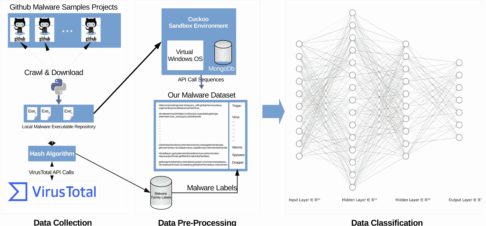
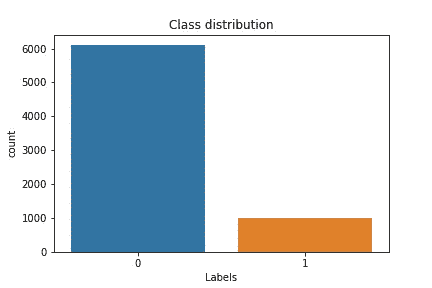
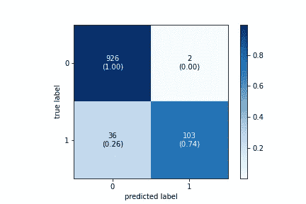
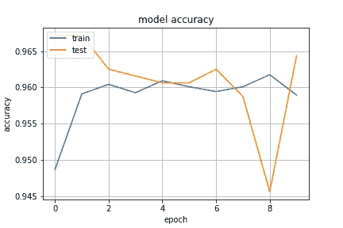
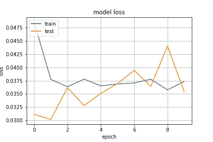

# 基于深度学习和 LSTM 的恶意软件分类

> 原文：<https://towardsdatascience.com/deep-lstm-based-malware-analysis-6b36ac247f34?source=collection_archive---------29----------------------->

## 使用 Windows Exe API 调用进行恶意软件分析的基于深度学习的顺序模型

恶意软件开发在架构和功能方面呈现出多样性。恶意软件能力的这一进步构成了严重的威胁，并为恶意软件检测开辟了新的研究领域。这项研究的重点是变形恶意软件，它是恶意软件家族中最高级的成员。使用传统的基于签名的方法的反病毒应用程序很难检测变形恶意软件，这使得很难相应地对这种类型的恶意软件进行分类。最近关于恶意软件检测和分类的研究文献讨论了与恶意软件行为相关的这个问题。

**引用作品**
如果你觉得这个实现有用，请引用它:

```
@article{10.7717/peerj-cs.285,
title = {Deep learning based Sequential model for malware analysis using Windows exe API Calls},
author = {Catak, Ferhat Ozgur and Yazı, Ahmet Faruk and Elezaj, Ogerta and Ahmed, Javed},
year = 2020,
month = jul,
keywords = {Malware analysis, Sequential models, Network security, Long-short-term memory, Malware dataset},
volume = 6,
pages = {e285},
journal = {PeerJ Computer Science},
issn = {2376-5992},
url = {https://doi.org/10.7717/peerj-cs.285},
doi = {10.7717/peerj-cs.285}
}
```

你可以从我的[我的 GitHub 库](https://github.com/ocatak/lstm_malware_detection)访问数据集。

## 介绍

恶意软件，通常被称为恶意软件，是任何故意设计来破坏计算机系统和危害用户安全的软件。如果某个应用程序或代码暗中违背计算机用户的利益并执行恶意活动，则该应用程序或代码被视为恶意软件。恶意软件针对各种平台，如服务器、个人电脑、手机和相机，以获得未经授权的访问，窃取个人数据，并破坏系统的正常功能。

处理恶意软件保护问题的一种方法是通过识别恶意软件并评估其行为。通常，这个问题是通过分析恶意软件行为来解决的。该领域紧密遵循恶意软件家族的模型，该模型也反映了恶意行为的模式。很少有研究证明了根据恶意软件家族进行分类的方法。

任何软件对操作系统 API 的调用都显示了这个程序的总体方向。该程序是否是恶意软件可以通过深入检查这些操作来了解。如果是恶意软件，那么它的恶意软件家族是什么。恶意软件制造的操作系统 API 调用是一种数据属性，并且这些 API 调用生成的顺序对于检测恶意软件家族也是至关重要的。执行特定的 API 调用是代表一种行为的特定顺序。深度学习方法之一 LSTM(长短期记忆)通常用于处理这种时序数据。

## 系统结构

这项研究有两个主要目标:首先，我们创建了一个相关的数据集，然后，使用这个数据集，我们进行了一项比较研究，使用各种机器学习来根据恶意软件的类型自动检测和分类。

## 数据集创建

这项工作最重要的贡献之一是新的 Windows PE 恶意软件 API 序列数据集，其中包含恶意软件分析信息。在这个数据集中有 7107 个来自不同类别的恶意软件。如上所述，Cuckoo 沙箱应用程序用于获取恶意软件的 Windows API 调用序列，而 VirusTotal 服务用于检测恶意软件的类别。

下图说明了用于收集数据并使用 LSTM 算法对数据进行分类的系统架构。



我们的系统包括三个主要部分，数据收集，数据预处理和分析，以及数据分类。

创建数据集时遵循了以下步骤。

Cuckoo 沙盒应用程序安装在运行 Ubuntu Linux 发行版的计算机上。分析机器作为虚拟服务器运行，以运行和分析恶意软件。此服务器上安装了 Windows 操作系统。

## 让我们编码吧

我们导入常用的标准库来构建一个 LSTM 模型来检测恶意软件。

```
import pandas as pd
import matplotlib.pyplot as plt
import seaborn as sns
from sklearn.preprocessing import LabelEncoder
from sklearn.model_selection import train_test_split
from sklearn.metrics import confusion_matrix
from keras.preprocessing.text import Tokenizer
from keras.layers import LSTM, Dense, Dropout, Embedding
from keras.preprocessing import sequence
from keras.utils import np_utils
from keras.models import Sequential
from keras.layers import SpatialDropout1D
from mlxtend.plotting import plot_confusion_matrix
```

在这项工作中，我们将使用标准的恶意软件数据集来显示结果。您可以从 [My GitHub Repository](https://github.com/ocatak/lstm_malware_detection) 访问数据集。我们需要合并调用和标签数据集。

```
malware_calls_df = pd.read_csv("calls.zip", compression="zip",
                               sep="\t", names=["API_Calls"])

malware_labels_df = pd.read_csv("types.zip", compression="zip",
                                sep="\t", names=["API_Labels"])

malware_calls_df["API_Labels"] = malware_labels_df.API_Labels
malware_calls_df["API_Calls"] = malware_calls_df.API_Calls.apply(lambda x: " ".join(x.split(",")))

malware_calls_df["API_Labels"] = malware_calls_df.API_Labels.apply(lambda x: 1 if x == "Virus" else 0)
```

让我们分析一下阶级分布

```
sns.countplot(malware_calls_df.API_Labels)
plt.xlabel('Labels')
plt.title('Class distribution')
plt.savefig("class_distribution.png")
plt.show()
```



现在我们可以创建我们的序列矩阵。为了构建 LSTM 模型，您需要创建一个基于符号化的序列矩阵作为输入数据集

```
max_words = 800
max_len = 100

X = malware_calls_df.API_Calls
Y = malware_calls_df.API_Labels.astype('category').cat.codes

tok = Tokenizer(num_words=max_words)
tok.fit_on_texts(X)
print('Found %s unique tokens.' % len(tok.word_index))
X = tok.texts_to_sequences(X.values)
X = sequence.pad_sequences(X, maxlen=max_len)
print('Shape of data tensor:', X.shape)

X_train, X_test, Y_train, Y_test = train_test_split(X, Y,
                                                    test_size=0.15)

le = LabelEncoder()
Y_train_enc = le.fit_transform(Y_train)
Y_train_enc = np_utils.to_categorical(Y_train_enc)

Y_test_enc = le.transform(Y_test)
Y_test_enc = np_utils.to_categorical(Y_test_enc)Found 278 unique tokens.
Shape of data tensor: (7107, 100)
```

作为练习，这里给出了基于 LSTM 的分类模型:

```
def malware_model(act_func="softsign"):
    model = Sequential()
    model.add(Embedding(max_words, 300, input_length=max_len))
    model.add(SpatialDropout1D(0.1))
    model.add(LSTM(32, dropout=0.1, recurrent_dropout=0.1,
                   return_sequences=True, activation=act_func))
    model.add(LSTM(32, dropout=0.1, activation=act_func, return_sequences=True))
    model.add(LSTM(32, dropout=0.1, activation=act_func))
    model.add(Dense(128, activation=act_func))
    model.add(Dropout(0.1))
    model.add(Dense(256, activation=act_func))
    model.add(Dropout(0.1))
    model.add(Dense(128, activation=act_func))
    model.add(Dropout(0.1))
    model.add(Dense(1, name='out_layer', activation="linear"))
    return model
```

下一步是训练模型。我训练并保存了我的模型。由于数据集的原因，训练阶段需要花费大量时间。为了减少执行时间，您可以从 GitHub 存储库中加载我以前训练过的模型。

```
model = malware_model()
print(model.summary())
model.compile(loss='mse', optimizer="rmsprop",
              metrics=['accuracy'])

filepath = "lstm-malware-model.hdf5"
model.load_weights(filepath)

history = model.fit(X_train, Y_train, batch_size=1000, epochs=10,
                    validation_data=(X_test, Y_test), verbose=1)Model: "sequential"
_________________________________________________________________
Layer (type)                 Output Shape              Param #   
=================================================================
embedding (Embedding)        (None, 100, 300)          240000    
_________________________________________________________________
spatial_dropout1d (SpatialDr (None, 100, 300)          0         
_________________________________________________________________
lstm (LSTM)                  (None, 100, 32)           42624     
_________________________________________________________________
lstm_1 (LSTM)                (None, 100, 32)           8320      
_________________________________________________________________
lstm_2 (LSTM)                (None, 32)                8320      
_________________________________________________________________
dense (Dense)                (None, 128)               4224      
_________________________________________________________________
dropout (Dropout)            (None, 128)               0         
_________________________________________________________________
dense_1 (Dense)              (None, 256)               33024     
_________________________________________________________________
dropout_1 (Dropout)          (None, 256)               0         
_________________________________________________________________
dense_2 (Dense)              (None, 128)               32896     
_________________________________________________________________
dropout_2 (Dropout)          (None, 128)               0         
_________________________________________________________________
out_layer (Dense)            (None, 1)                 129       
=================================================================
Total params: 369,537
Trainable params: 369,537
Non-trainable params: 0
_________________________________________________________________
None
Epoch 1/10
7/7 [==============================] - 22s 3s/step - loss: 0.0486 - accuracy: 0.9487 - val_loss: 0.0311 - val_accuracy: 0.9672
Epoch 2/10
7/7 [==============================] - 21s 3s/step - loss: 0.0378 - accuracy: 0.9591 - val_loss: 0.0302 - val_accuracy: 0.9672
Epoch 3/10
7/7 [==============================] - 21s 3s/step - loss: 0.0364 - accuracy: 0.9604 - val_loss: 0.0362 - val_accuracy: 0.9625
Epoch 4/10
7/7 [==============================] - 20s 3s/step - loss: 0.0378 - accuracy: 0.9593 - val_loss: 0.0328 - val_accuracy: 0.9616
Epoch 5/10
7/7 [==============================] - 22s 3s/step - loss: 0.0365 - accuracy: 0.9609 - val_loss: 0.0351 - val_accuracy: 0.9606
Epoch 6/10
7/7 [==============================] - 21s 3s/step - loss: 0.0369 - accuracy: 0.9601 - val_loss: 0.0369 - val_accuracy: 0.9606
Epoch 7/10
7/7 [==============================] - 22s 3s/step - loss: 0.0371 - accuracy: 0.9594 - val_loss: 0.0395 - val_accuracy: 0.9625
Epoch 8/10
7/7 [==============================] - 22s 3s/step - loss: 0.0378 - accuracy: 0.9601 - val_loss: 0.0365 - val_accuracy: 0.9588
Epoch 9/10
7/7 [==============================] - 22s 3s/step - loss: 0.0358 - accuracy: 0.9618 - val_loss: 0.0440 - val_accuracy: 0.9456
Epoch 10/10
7/7 [==============================] - 21s 3s/step - loss: 0.0373 - accuracy: 0.9589 - val_loss: 0.0354 - val_accuracy: 0.9644
```

## 模型评估

现在，我们已经完成了 LSTM 模型的培训阶段。我们可以使用混淆矩阵来评估模型的分类性能。根据混淆矩阵，该模型的分类性能相当好。

```
y_test_pred = model.predict_classes(X_test)
cm = confusion_matrix(Y_test, y_test_pred)

plot_confusion_matrix(conf_mat=cm,
                      show_absolute=True,
                      show_normed=True,
                      colorbar=True)
plt.savefig("confusion_matrix.png")
plt.show()
```



让我们继续我们模型的训练历史。

```
plt.plot(history.history['accuracy'])
plt.plot(history.history['val_accuracy'])
plt.title('model accuracy')
plt.ylabel('accuracy')
plt.xlabel('epoch')
plt.legend(['train', 'test'], loc='upper left')
plt.grid()
plt.savefig("accuracy.png")
plt.show()

plt.plot(history.history['loss'])
plt.plot(history.history['val_loss'])
plt.title('model loss')
plt.ylabel('loss')
plt.xlabel('epoch')
plt.legend(['train', 'test'], loc='upper left')
plt.grid()
plt.savefig("loss.png")
plt.show()
```



## 结论

这项研究的目的是使用我以前的恶意软件数据集创建一个基于 LSTM 的恶意软件检测模型。虽然我们的数据集包含属于一些分布不平衡的恶意软件家族的实例，但我们已经表明这个问题不会影响分类性能。