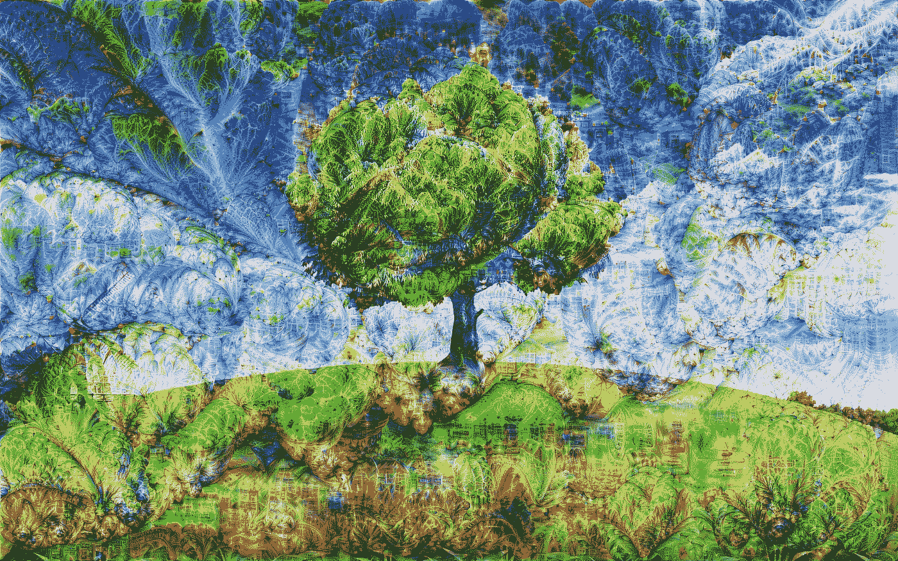

# 深度清醒梦

> 原文：<https://towardsdatascience.com/deep-lucid-dreaming-94fecd3cd46d?source=collection_archive---------38----------------------->

## 人工艺术合成——连同[朱利安·厄本](https://medium.com/u/a6bfad427497?source=post_page-----94fecd3cd46d--------------------------------)



对于迷幻艺术的爱好者来说，[深度梦境](https://ai.googleblog.com/2015/06/inceptionism-going-deeper-into-neural.html)的技术无疑是迷人的。当应用于图像时，它给人一种 Instagram 滤镜目前正在参加 Woodstock 的印象。从一开始，这种方法就产生了大量令人惊叹的艺术作品。虽然对一些人来说这可能已经是一顶旧帽子，但考虑到无害输入的无限可能性，我们还远远没有达到这个桶的底部。

嗯，从技术上讲，它们可能不是无穷无尽的。以在 ImageNet 数据集上训练的图像分类体系结构为例，可用于做梦的内容由 1000 个对象类组成，尽管如此，这仍然令人印象深刻。原则上，对于所有这些类别，特征可以在做梦过程中出现，这些特征反映了网络已经了解到的关于这些物体的内部表征。并非所有这些对人类都有意义，但我们都见过用这种方法生成的令人毛骨悚然的逼真的眼睛和狗脸。作为一个深度梦想实践者，你可以选择在哪一层应用梯度提升进化来最大化激活。通常，在早期图层中，你会看到边缘和基本形状等低级特征。越深入，会产生更多高级功能和可识别的对象。

不幸的是，除了选择层之外，使用这种方法，我们无法控制网络将在输入中识别和放大什么。然而，如果我们移动到最后一层，我们实际上可以精确地指定我们希望看到的内容，在最后一层，激活直接对应于对象类，我们可以选择我们希望最大化的对象类。如果你愿意，这种方法是一种艺术的对抗性攻击。

在本帖中，我们将利用这个想法，使用预先训练好的 VGG-19 架构来更深入地探索一些 ImageNet 类。为了促进单类做梦，我们使用一些输入图像执行通过整个网络的完全正向传递。然后，输出是包含对应于每个类别的概率的向量。为了只挑选和优化一个或几个类，我们生成一个目标向量，其中我们希望看到的标签为 1，否则为零。如果你想变得更有趣，你也可以使用不同的权重来混合类，与其他对象相比，更强调某些对象。所有 ImageNet 类的完整列表可以在[这里](https://gist.github.com/yrevar/942d3a0ac09ec9e5eb3a)找到。使用目标向量，我们可以根据网络输出的标准交叉熵计算损失，并对输入执行梯度下降步骤。我们只需要小心这里的标志，因为做梦通常是用坡度*上升*完成的。

举个明确的例子，假设我们想让 VGG-19 梦到鸵鸟(对应的类标签是 9):

```
criterion **=** torch**.**nn**.**BCEWithLogitsLoss()
label = 9 
output = model(input_image) target = torch.zeros(output.size())               
target[0, label] = 100           
loss = -criterion(output, target)
```

注意，对于目标类，我们使用 100 而不是 1。这放大了梯度，我们发现它比调整学习率给出更好的结果。在反向传递之后，我们简单地将输入图像中每个像素的梯度加到它自身上。冲洗，重复，我们得到了一些真正迷人而具体的梦！让我们来看看一些最有趣的结果。我们在所有示例中使用的输入是下图，它取自[这里](http://wallpapersexpert.com/tree-wallpapers/3348201.html):


在这篇文章的封面图片中，我们使用卷心菜类生成了一个梦。让网络梦见鸵鸟，就像上面的例子一样，会导致这样的结果:


即使在修正了我们自己的确认偏差后，我们仍然相信他们可以很容易地从他们的头和脖子的形状被认出来。由于鸟类似乎工作得很好，我们也尝试了鹈鹕类:


其他有趣课程的例子有扁虫、交通灯和睡袋:


过去观察到深度做梦很难控制，这可能阻止了一些艺术家对媒体合成领域产生更大的兴趣。正如我们在这篇文章中所看到的，对生成的结构进行一些控制当然是可能的，并会产生令人着迷的结果。因此，我们恰当地将这种努力命名为“深度清醒梦”。此外，从更技术性的角度来看，这种对抗性攻击也揭示了网络的内部表现。这允许我们直接调查它是否已经学习了关于相应类[的不相关或错误的特征，这可能是数据集](https://arxiv.org/abs/1602.04938)的产物。

我们很兴奋地看到这种艺术和科学的宏伟融合将在未来带来什么奇迹，并祝愿我们的深度梦想家们旅途愉快。