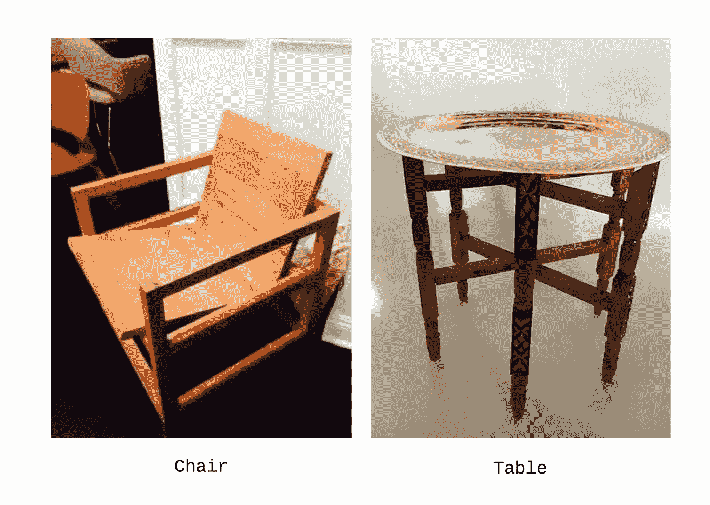
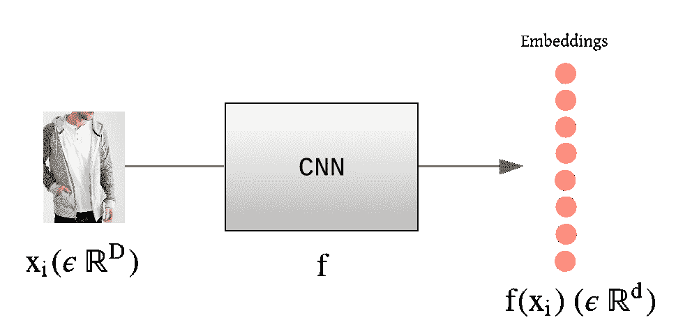
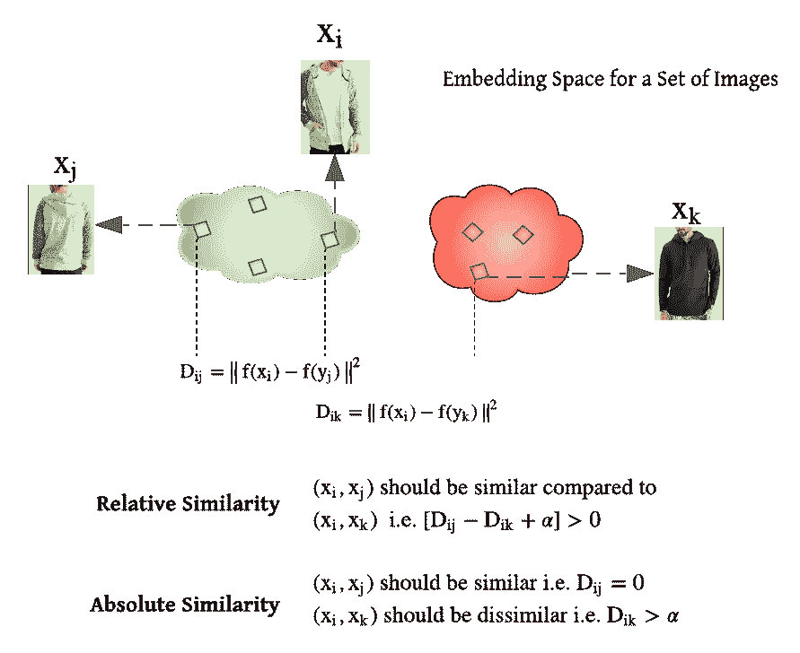
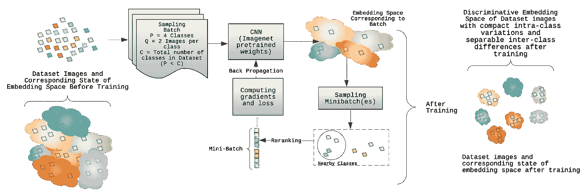
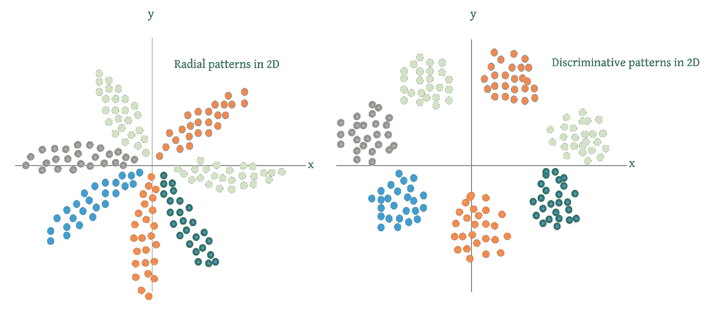
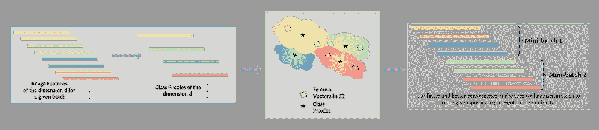
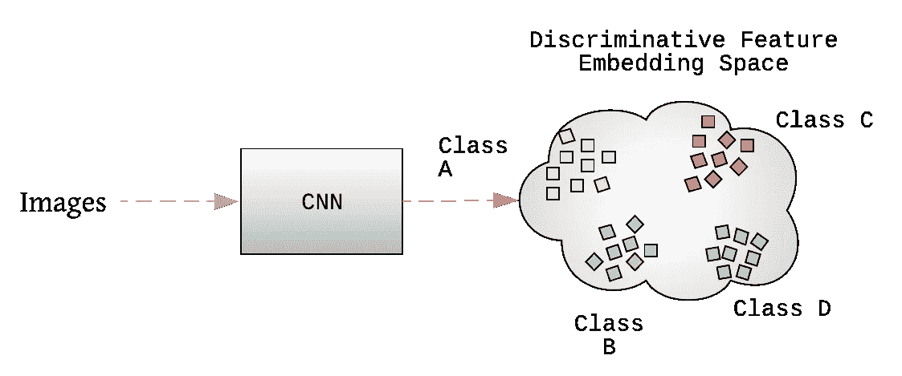

# 使用深度度量学习来学习区分

> 原文：<https://towardsdatascience.com/deep-metric-learning-76fa0a5a415f?source=collection_archive---------11----------------------->

最近，计算机视觉算法为使用卷积神经网络(CNN)开发非常高效的视觉搜索工作流做出了巨大贡献。由于近来数据量已经增加，对象识别模型能够识别对象并按比例概括图像特征。然而，在一个具有挑战性的分类设置中，类别的数量是巨大的，有几个约束需要解决，以设计有效的视觉搜索工作流。

*   对象类别数量的增加也增加了 CNN 倒数第二层的权重数量。这使得很难在设备上部署它们，因为它们最终也会增加*型号的大小*。
*   当每类只有*个图像时，很难实现更好的收敛，从而很难在各种光照差异、对象比例、背景、遮挡等情况下实现良好的性能。*
*   在工程空间中，通常需要设计适应产品生态系统的视觉搜索工作流，该产品生态系统包含不稳定的产品，或者根据季节趋势或地理位置而变化。这种情况使得以*循环*(特定时间间隔后的训练)或*在线*(实时数据训练)的方式训练/微调模型变得棘手。

# 深度度量学习

图 1 给定椅子和桌子的两幅图像，度量学习的思想是使用适当的距离度量来量化图像的相似性。当我们的目标是区分对象而不是识别它们时，这在很大程度上提高了模型的可扩展性，因为我们不再依赖于给定图像所属的类别。

为了缓解这些问题，深度学习和度量学习共同形成了深度度量学习(DML)的概念，也称为距离度量学习。它提出训练基于 CNN 的非线性特征提取模块(或编码器)，该模块将语义相似的提取的图像特征嵌入(也称为嵌入)到附近的位置，同时使用适当的距离度量(例如欧几里德或余弦距离)将不相似的图像特征推开。与判别分类算法(如 K-最近邻、支持向量机和朴素贝叶斯)一起，我们可以使用提取的图像特征执行对象识别任务，而不受类别数量的限制。注意，这种经过训练的 CNN 模块的辨别能力描述了具有紧凑的类内变化和可分离的类间差异的特征。这些特征也足够一般化，甚至可以用来区分新的看不见的类。在下一节中，我们将使用基于*对*的训练范例来形式化训练和评估用于 DML 的 CNN 的过程。

## 形式主义

图 2 是使用 CNN 提取的示例图像 xᵢ和特征嵌入向量 f(xᵢ。

设 X = {(xᵢ，yᵢ)} *，*I∈*【1，2，… n】为 n 幅图像的数据集，其中(xᵢ，yᵢ)建议 iᵗʰ图像及其对应的类别标签。数据集中存在的类的总数为 c，即 yᵢ ∈ [1，2，… C]。让我们考虑 f(xᵢ)一个特征向量(或者一个嵌入)对应一个图像 xᵢ ∈ Rᴰ，其中 f: Rᴰ→Rᵈ是一个参数为θ的可微深度网络。这里， *D* 和 *d* 分别指原始图像尺寸和特征尺寸。形式上，我们将两个图像特征之间的欧几里德距离定义为 Dᵢⱼ = ||f(xᵢ) — f(xⱼ)||，这是分别对应于图像 xᵢ和 xⱼ的深层特征 f(xᵢ)和 f(xⱼ)之间的距离。注意，尽管我们在这里关注欧几里德距离，但是在文献中有几个其他度量经常用于优化嵌入空间。我们将在以后的文章中讨论这个问题。*

**

*图三。**相对相似性约束** : R = {(xᵢ、xⱼ、xₖ): xᵢ比 xₖ}.更像 xⱼdᵢⱼdᵢₖ+α>0 量化了一对锚正图像和锚负图像之间的相似性。三重损失、N 对损失、提升结构、代理 NCA 损失是使用相对相似性约束的一些损失函数。**绝对相似性约束** : S = {(xᵢ，xⱼ) : xᵢ和 xⱼ相似}，D = {(xᵢ，xₖ) : xᵢ和 xₖ不相似}。Dᵢⱼ和 Dᵢₖ量化了分别共享相似和不相似类别标签的一对正图像和一对负图像的相似性和不相似性的度量。对比丢失和排序列表丢失使用该约束来学习距离度量。*

*为了学习距离度量函数 *f* ，大多数 DML 算法使用相对相似性或绝对相似性约束，使用如图 2 和图 3 所示的一对或三对碱基方法。图像的三元组可以定义为(f(xᵢ)、f(xⱼ)、f(xₖ)，其中 f(xᵢ)、f(xⱼ)和 f(xₖ)分别对应于主播 xᵢ、正面 xⱼ和负面图像 x⃈的特征向量。xᵢ和 xⱼ有着相似的阶级标签，而 xₖ有着不同于锚和正面形象的阶级标签。一对图像特征对应一个图像 pair(xᵢ,xⱼ)，定义为(f(xᵢ),f(xⱼ)).如果两幅图像共享相似的标签，则称为正对，否则称为负对。
训练端到端 DML 模型的整个过程可以总结为如图 4 所示。最初，为了得到聚类不均匀性的概念，对一批图像进行采样。每批包含对象类 P，每个类有 Q 个图像。我们使用下面讨论的取样策略，用这个批次形成一个或多个小批次。这些小批量用于计算损失并通过反向传播进行训练。让我们总结一下使用 DML 损失函数训练深度学习模型的训练过程。稍后，我们将讨论这个框架的几个重要的训练组件，采样和损失函数。*

**

*图 4。DML 的培训程序*

## *培训程序*

*1.批量抽样:批量 B，类别数 P，每个类别的图像数 q。输入:嵌入函数 f(即预先训练的 CNN 的 Imagenet 数据集)、学习速率 B、批量 B 和图像类别数量 P、一批中的图像总数 B = PQ
3。特征提取:给定参数状态θₜ，使用 CNN 前馈所有批次图像，获得图像嵌入 f( *xᵢ* )。
4。抽样:从批量中进行小批量计算。根据批次的大小，可以形成对应于步骤 1 中采样的图像的一个或多个小批次的特征向量。
5。损失计算和训练:对于每个小批量计算梯度和反向传播，以更新从θₜ到θₜ₊₁.的参数状态*

## *度量学习损失函数*

*当我们使用卷积神经网络来识别目标时，Softmax 交叉熵(CE)损失函数是最常见的选择。然而，当插入这个损失函数来学习 DML 模型时，有一些必须考虑的事项。*

*   *Softmax 交叉熵(CE)损失被视为 *max* 算子的软版本。如果使用恒定缩放因子 *s、*来缩放，则 Logit 向量或类别概率不会影响给定图像的类别分配。结果，分离良好的特征拥有更大的量级，并且它促进了类的可分离性。总之，如下图所示，它使特征分布呈“放射状”,并且使用鉴别特征学习算法(例如 KNN 分类器)对特征进行分类，关键是要有一个不仅可分离而且可鉴别的嵌入空间。度量学习损失函数被设计成学习有区别的特征空间。*

**

*图 5 从为给定数据集训练的 CNN 的倒数第二层提取的特征模式，并投影到 2D 特征空间。左图:使用 Softmax 损失的 2D 特征分布。右图:使用 DML 损失函数的区别特征分布。*

*   *CE loss 不直接利用小批量图像中样本的结构关系，因为每个图像(随机选择)单独负责计算损失数。通过引入解决图像之间语义差异的惩罚，具有区分一对或三组图像的训练范例有效地检查了图像之间的关系。*

*认识到这些方面，研究团体已经提出了各种损失函数来使用 DML 学习区分特征空间。提升结构损失函数就是其中之一。*

* [## 利用损失函数深入挖掘度量学习

### 关于度量学习损失函数的介绍性注释。

towardsdatascience.com](/metric-learning-loss-functions-5b67b3da99a5) 

提升结构损失充分利用了小批量，改进了小批量随机梯度下降训练。一方面，三重损失或对比损失分别使用三重或一对图像来计算损失项，提升结构损失提出通过提升小批量(O(m))中可用的所有图像对来采用成对距离度量(O(m))。此外，与仅关于锚图像定义负样本的三重损失或对比损失相反，提升结构损失训练给定对、锚和正中的图像，以从小批量图像中找到它们的负样本。关于 DML 中使用的损失函数的更多信息，请参考上面的博文。提升结构损失的公式如下。

这里， *(i，j)* 表示对应于共享相似标签图像(xᵢ,xⱼ)的正图像对。Dᵢⱼ是一对图像之间的距离。Dᵢₖ和 Dⱼₗ是迷你批次中从锚和正面到其余负面图像的距离。α是指距离余量。 ***P*** 和 ***N*** 分别是小批量可用的所有正负线对。

## 抽样

诚然，直接作用于特征对之间的距离直观地引导我们向学习图像的有意义嵌入的目标前进。因此，标准交叉熵损失主要被 DML 社区忽略了。
在 DML 训练机制中，我们分别使用一对或三对图像来使用绝对或相对相似性，在将图像馈送到 CNN 时，有意义地对图像批次进行采样是必要的。对于数据集，其中用于前馈图像的小批量比数据集中的类的总数大得多，随机馈送图像将保证大多数图像样本在小批量中将具有具有相似类标签的其他图像。但是，当我们考虑具有大量图像类的数据集时，例如，斯坦福在线产品数据集，其中图像类的数量接近 22000，随机采样的小批量图像不一定包含共享相似标签的图像对。在这种情况下，尽管每个批次都遇到了类间变化(因为存在具有不同类标签的图像)，但是它未能解决类内变化(因为没有必要具有两个具有相似类标签的图像)，最终未能实现更好的收敛。

图六。负类挖掘抽样

虽然使用 DML 的训练需要对图像对或三元组进行采样，但是这种采样分别粗略地增加了 O(m)或 O(m)数量级的数据集大小。此外，如果图像对或图像对是随机采样的，随着训练的进行，大多数图像对或图像对以较小的方式起作用，因为不是所有的图像都违反了余量α(例如，在三个一组丢失的情况下)。很难计算有意义的损失，这不可避免地导致收敛缓慢。
为了克服这些问题，有各种各样的采样策略，我们可以用来更快更好地收敛训练参数。

硬负数据挖掘策略在基于距离的度量学习算法中很常见。它包括计算硬的负面或正面特征实例，以形成给定锚例的正面或负面对。然而，当给定的批处理中涉及大量的类时，这个过程在计算上是具有挑战性的。在这样的场景中，可以方便地执行负的“*类*挖掘，而不是负的“*实例*挖掘。遵循下面的过程来为基于对的损失函数执行负“类”挖掘。

1.  为了具有给定参数状态θₜ的嵌入空间的有意义的表示，对包含几百个类(即上述训练过程中的 p)的大批量图像进行采样。对于每个基于对的损失函数，对于给定批次中的每个给定类别，必须有至少两个示例图像。例如，在斯坦福在线产品数据集的情况下，必须随机采样至少 2 个图像(Q=2)。
2.  对于给定 CNN 的给定参数状态θₜ，提取步骤 1 中采样的每个图像的特征向量。使用这些图像特征获得类别表示向量或类别代理(平均嵌入向量)。
3.  对于从步骤 1 中采样的 P 个类别中随机选择的每个类别，我们对最近的类别进行采样，并对相应的图像重新排序，如上图 5 所示。这一步骤也可以使用基于边缘的类选择来执行，如果只有一个具有距离边缘的类被选择作为给定锚类的最近类。
4.  根据计算能力，我们可以形成一个或多个小批量的特征向量，如图 5 所示，以计算损失和梯度。

## 评估和推理

图 DML 的推理过程。图像被馈送到网络以从瓶颈层获得特征向量。因为它们是用 DML 损失函数训练的，所以它们将创建区别特征嵌入空间，如图中 2D 所示。

与传统的对象识别模型(其中图像被馈送以生成对象类别概率)相反，DML 图像被馈送以提取图像特征。评估这些图像特征的聚类质量和检索性能。F1 和归一化互信息(NMI)分数是标准的评估度量，我们用来估计聚类质量度量。对于检索，k 处的召回率是我们在处理 DML 训练时使用的基准评估度量。为了本文的完整性，我们在这里总结了这些评估指标。

*   *在 K* 回忆:对于每个查询图像(来自测试数据集)，我们使用来自相同测试集的适当距离度量(欧几里德或余弦)检索 K 个最近邻。如果在检索到的 K 个最近邻居中存在来自相同类别的图像，则查询图像得到分数 1。K 值召回表示测试数据集中所有法师的召回次数。
*   *F1* : F1 度量值定义为在 K 处测量的精度和召回率的调和平均值，即 F1 = 2PR/(P+R)。
*   *归一化互信息* ( *NMI* ):对于一组输入聚类赋值ω和地面真实聚类ℂ，NMI 得分是互信息与聚类平均熵和标签熵的比值。即 NMI = I(ω；ℂ)/2(h(ω)+h(ℂ)).这里，ω={ω₁，ω₂ … ωₙ}，这是聚类的输入集，ℂ = {c₁，c₂，… cₙ}是基础真值类。具有聚类分配 *i* 的示例被给定为ωᵢ，而具有基础真实类标签 j 的示例被定义为 cᵢ.
*   K 处的准确性:这个度量标准服务于我们的目标，即以无监督的方式使用这个训练过的模型作为对象识别模型。对于图像，使用适当的度量获得 K 个最近邻。查询图像被分配给在 K 个最近邻居中出现次数最多的类别。K 处的准确度对测试数据集中的每个查询图像的准确度进行平均。

## 结论

我们描述了一种深度度量学习范式来解决对象识别问题。这种模型训练提供了如下几个优点。

*   它们不会增加*模型的大小*，因为我们总是可以使用相同的维度嵌入层来训练模型。
*   由于我们正在*学习区分和不识别*物体，我们可以利用这样一个范例，该范例可以使用各种采样策略以每类更少的图像来执行*训练，并且甚至可以推断对*不可见的*类的识别。*
*   以*循环*或*在线*的方式对一组较新的产品类别进行微调将会传播渐变。

这些属性使我们能够为给定的产品生态系统设计灵活且可扩展的可视化搜索工作流。此外，我们还描述了采样对于使用 DML 损失函数训练 CNN 的重要性。请跟进 [*这篇*](/metric-learning-loss-functions-5b67b3da99a5) 文章的附加损耗功能。随着近来这一领域的发展，我们也可以有效地练习一些其他的训练程序来达到同样的目的。我们将在以后的文章中讨论其中的一些。* 

# *参考*

1.  *王，x，华，y，柯迪洛夫，e，胡，g，卡尼尔，r .，&罗伯逊，N. M. (2019)。深度度量学习的排序列表丢失。在*IEEE 计算机视觉和模式识别会议论文集*(第 5207–5216 页)中。*
2.  *movshowitz-Attias，y .，Toshev，a .，Leung，T. K .，Ioffe，s .，& Singh，S. (2017)。没有大惊小怪的距离度量学习使用代理。IEEE 计算机视觉国际会议论文集(第 360–368 页)。*
3.  *Ranjan，r .，Castillo，C. D .，& Chellappa，R. (2017 年)。用于鉴别性人脸验证的 L2 约束软最大损失。 *arXiv 预印本 arXiv:1703.09507* 。*
4.  *2017 年 10 月，王，项，程，陈建杰，尤妮尔。人脸验证的 L2 超球面嵌入。第 25 届 ACM 多媒体国际会议论文集(第 1041–1049 页)。*
5.  *Wu c . y .，Manmatha，r .，Smola，A. J .，& Krahenbuhl，P. (2017 年)。深度嵌入学习中的采样问题。在*IEEE 计算机视觉国际会议论文集*(第 2840-2848 页)。*
6.  *温，张，李，张，乔，(2016 年 10 月)。一种用于深度人脸识别的鉴别特征学习方法。在*欧洲计算机视觉会议*(第 499–515 页)。斯普林格，查姆。*
7.  *刘，张，罗，邱，王，唐，(2016)。Deepfashion:通过丰富的注释支持强大的服装识别和检索。在*IEEE 计算机视觉和模式识别会议论文集*(第 1096-1104 页)。*
8.  *Oh Song，h .，Xiang，y .，Jegelka，s .，& Savarese，S. (2016 年)。基于提升结构特征嵌入的深度度量学习。在*IEEE 计算机视觉和模式识别会议论文集*(第 4004–4012 页)。*
9.  *Sohn，K. (2016 年)。具有多类 n 对损失目标的改进深度度量学习。在*神经信息处理系统的进展*(第 1857-1865 页)。*
10.  *Schroff，d . Kalenichenko 和 j . Phil bin(2015 年)。Facenet:人脸识别和聚类的统一嵌入。IEEE 计算机视觉和模式识别会议论文集*(第 815–823 页)。**
11.  *Bellet，a .，Habrard，a .，和 Sebban，M. (2013 年)。特征向量和结构化数据的度量学习综述。 *arXiv:1306.6709* 。*
12.  *哈德塞尔，r .，乔普拉，s .，&勒村，Y. (2006 年 6 月)。通过学习不变映射进行降维。在 *2006 年 IEEE 计算机学会计算机视觉和模式识别会议(CVPR’06)*(第 2 卷，第 1735-1742 页)。IEEE。芝加哥*