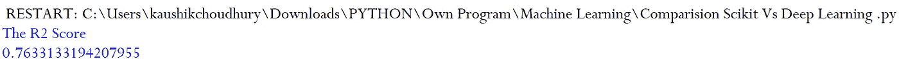
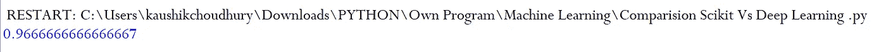
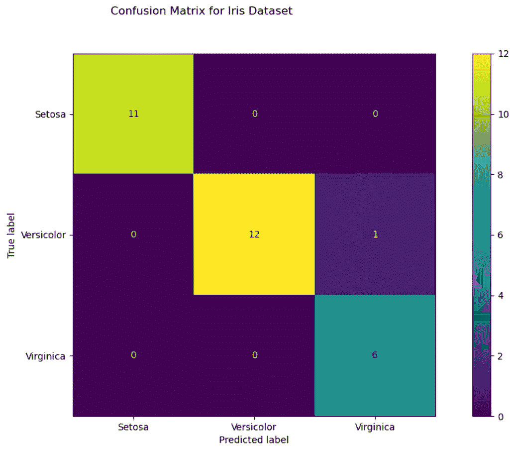

# 具有 Scikit-learn 的深度神经多层感知器(MLP)

> 原文：<https://towardsdatascience.com/deep-neural-multilayer-perceptron-mlp-with-scikit-learn-2698e77155e?source=collection_archive---------3----------------------->

## MLP 是一种人工神经网络。最简单的 MLP 至少由三层节点组成:输入层、隐藏层和输出层。


Robina Weermeijer 在 [Unsplash](https://unsplash.com?utm_source=medium&utm_medium=referral) 上的照片

在深度学习的世界里，TensorFlow、Keras、微软认知工具包(CNTK)、PyTorch 都很受欢迎。我们大多数人可能没有意识到，非常流行的机器学习库 **Scikit-learn** 也能够进行基本的深度学习建模。在这篇文章中，我将讨论 Scikit-learn 中深度学习建模的可行性和局限性。此外，我将通过两个例子讨论实际实现。

*sci kit-learn 中多层感知器(MLP)的显著点*

*   输出层没有激活功能。
*   对于回归场景，平方误差是损失函数，交叉熵是分类的损失函数
*   它可以处理单个以及多个目标值回归。
*   与其他流行的软件包不同，像 Keras Scikit 中 MLP 的实现不支持 GPU。
*   我们不能像不同的激活函数、权重初始化器等一样微调参数。对于每一层。

***回归示例***

**步骤 1:** 在 **Scikit-Learn** 包中，MLPRegressor 在 neural_network 模块中实现。我们将导入其他模块，如“train_test_split”来将数据集拆分为训练集和训练集以测试模型，“fetch_california_housing”来获取数据，以及“StandardScaler”来缩放数据，因为不同的特征(独立变量)具有较宽的值域范围。缩放用于训练模型的数据是非常重要的。

您可以在文章[功能缩放-不同 Scikit 的效果-了解缩放器:深入探讨](/feature-scaling-effect-of-different-scikit-learn-scalers-deep-dive-8dec775d4946)中了解更多关于不同缩放器的信息

```
"""Import the required modules"""**from sklearn.neural_network import MLPRegressor
from sklearn.model_selection import train_test_split
from sklearn.datasets import fetch_california_housing
from sklearn.preprocessing import StandardScaler
from sklearn.metrics import r2_score
import pandas as pd**
```

**步骤 2:** 我们将把数据集分成训练数据集和测试数据集。我们保留了 20%的数据集用于检查训练模型的准确性。独立的训练和测试数据集被进一步缩放，以确保输入数据是标准的正态分布，以零为中心，并且具有相同数量级的方差。

```
**cal_housing = fetch_california_housing()
X = pd.DataFrame(cal_housing.data,columns=cal_housing.feature_names)
y = cal_housing.target****X_train, X_test, y_train, y_test = train_test_split(X, y,random_state=1, test_size=0.2)**
```

第三步:我们就像上面的回归例子一样缩放数据，原因相同。

```
**sc_X = StandardScaler()
X_trainscaled=sc_X.fit_transform(X_train)
X_testscaled=sc_X.transform(X_test)**
```

**步骤 4:** 在下面的代码中，建模了三个隐藏层，每层有 64 个神经元。考虑到输入和输出层，我们在模型中共有 5 层。如果没有提到任何优化器，那么“Adam”就是默认的优化器，它可以管理非常大的数据集。

```
**reg = MLPRegressor(hidden_layer_sizes=(64,64,64),activation="relu" ,random_state=1, max_iter=2000).fit(X_trainscaled, y_train)**
```

除了“RELU”激活之外，MLPRegressor 还支持“sigmoid”和“双曲线 tan”功能。

步骤 5:在下面的代码中，训练好的模型用于预测保留的测试数据集的目标值，该模型以前没有见过。

```
**y_pred=reg.predict(X_testscaled)
print("The Score with ", (r2_score(y_pred, y_test))**
```



***分类举例***

我们已经看到了一个回归的例子。接下来，我们将看一个分类示例。在 Scikit-learn 中,“MLPClassifier”可用于多层感知器(MLP)分类场景。

像往常一样，首先我们将导入我们将在示例中使用的模块。我们将使用 Iris 数据库和 MLPClassifierfrom 作为分类示例。

```
**from sklearn.datasets import load_iris
from sklearn.neural_network import MLPClassifierfrom sklearn.model_selection import train_test_splitfrom sklearn.preprocessing import StandardScaler
import pandas as pd
from sklearn.metrics import plot_confusion_matrix
import matplotlib.pyplot as plt**
```

**步骤 2:** 在单独的数据帧“X”和“y”中，存储独立和从属特征的值。

```
**iris_data = load_iris()
X = pd.DataFrame(iris_data.data, columns=iris_data.feature_names)
y = iris_data.target**
```

**步骤 3:** 类似于上面的回归示例，我们将把数据集分成训练数据集和测试数据集。我们保留了 20%的数据集用于检查训练模型的准确性。独立的训练和测试数据集被进一步缩放，以确保输入数据是标准的正态分布，以零为中心，并且具有相同数量级的方差。

```
**X_train, X_test, y_train, y_test = train_test_split(X,y,random_state=1, test_size=0.2)
sc_X = StandardScaler()
X_trainscaled=sc_X.fit_transform(X_train)
X_testscaled=sc_X.transform(X_test)**
```

**步骤 4:** 在下面的代码中，我们建立了四个隐藏层，每个层中有不同的神经元。考虑到输入和输出层，我们在模型中共有 6 层。如果没有提到任何优化器，那么“Adam”就是默认的优化器。

```
**clf = MLPClassifier(hidden_layer_sizes=(256,128,64,32),activation="relu",random_state=1).fit(X_trainscaled, y_train)
y_pred=clf.predict(X_testscaled)
print(clf.score(X_testscaled, y_test))**
```

分类器对测试数据显示出相当高的分数。重要的是要了解分类模型出错的领域，以充分了解模型的准确性。



你可以在“[准确性可视化:监督机器学习分类算法](/accuracy-visualisation-supervised-machine-learning-classification-algorithms-af13d18fcc6c)”中了解更多关于我们应该使用混淆矩阵来判断分类模型准确性的原因。

第五步:我们将绘制一个混淆矩阵来理解模型造成的错误分类。

```
**fig=plot_confusion_matrix(clf, X_testscaled, y_test,display_labels=["Setosa","Versicolor","Virginica"])
fig.figure_.suptitle("Confusion Matrix for Iris Dataset")
plt.show()**
```

似乎只有一种“云芝”被模型错误地识别为“海滨锦鸡儿”。



**结论**:我们可以在 Scikit-learn 中做简单的深度学习回归和分类模型。在我看来，它不适合任何现实生活中的大规模建模，因为没有 GPU 的支持，调整参数的选项也非常有限。

你可以在文章[深度学习中的准确性可视化](/accuracy-visualisation-in-deep-learning-part-1-b42d32b07913)中了解更多关于深度学习可视化技术的信息

对于开始机器学习之旅的人来说，你可以从文章[中的《为匆忙中的人学习机器](https://kaushikthoughts.medium.com/machine-learning-for-people-in-hurry-4a7540c0860d)》开始。