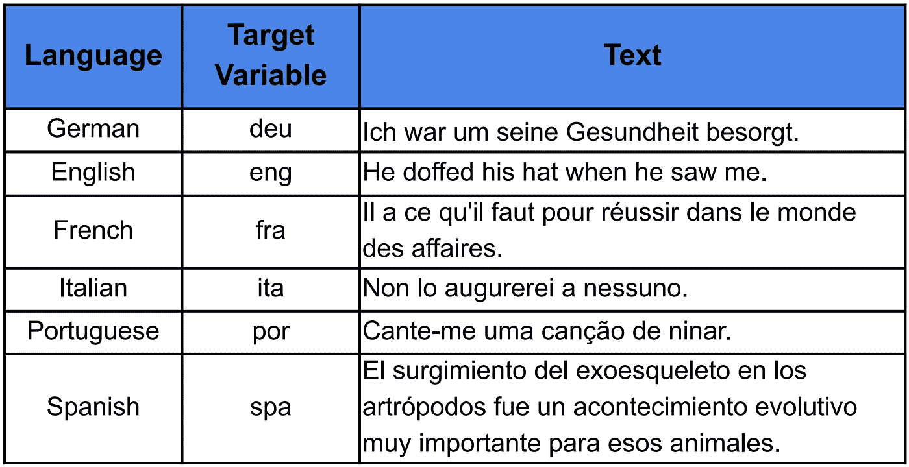
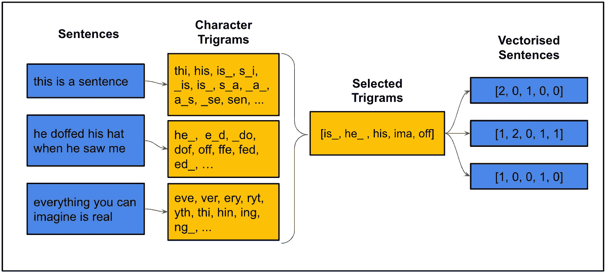

# 深度神经网络语言识别

> 原文：<https://towardsdatascience.com/deep-neural-network-language-identification-ae1c158f6a7d?source=collection_archive---------9----------------------->

## 使用 DNN 和字符 n 元语法对一段文本的语言进行分类(使用 Python 代码)

来源: [flaticon](https://www.flaticon.com/premium-icon/cyborg_901032)

语言识别可以是自然语言处理(NLP)问题中的重要步骤。它包括试图预测一段文本的自然语言。在采取其他行动(即翻译/情感分析)之前，了解文本的语言是很重要的。例如，如果你去[谷歌翻译](https://translate.google.com/)，你输入的框显示‘检测语言’。这是因为谷歌首先试图识别你的句子的语言，然后才能翻译。

来源:作者

有几种不同的语言识别方法，在本文中，我们将详细探讨其中一种。即使用神经网络和字符 n-grams 作为特征。最后，我们证明了这种方法可以达到 98%以上的准确率。一路上，我们将讨论关键的代码片段，你可以在 [GitHub](https://github.com/conorosully/medium-articles) 上找到完整的项目。首先，我们将讨论用于训练神经网络的数据集。

# 资料组

[数据集](https://downloads.tatoeba.org/exports/)由 Tatoeba 提供。完整的数据集由 328 种独特语言的 6872356 个句子组成。为了简化我们的问题，我们将考虑:

*   6 种拉丁语言:英语、德语、西班牙语、法语、葡萄牙语和意大利语。
*   长度在 20 到 200 个字符之间的句子。

我们可以在表 1 中看到每种语言的一个句子的例子。我们的目标是使用提供的文本创建一个可以预测目标变量的模型。

表 1:每种语言的文本片段示例

我们加载数据集，并在下面的代码中做一些初始处理。我们首先过滤数据集，以获得所需长度和语言的句子。我们从每种语言中随机选择 50，000 个句子，这样我们总共有 300，000 行。这些句子然后被分成训练集(70%)、验证集(20%)和测试集(10%)。

# 特征工程

在拟合模型之前，我们必须将数据集转换为神经网络能够理解的形式。换句话说，我们需要从我们的句子列表中提取特征来创建特征矩阵。我们使用由 n 个连续字符组成的字符 n 元语法来实现这一点。这是一个类似于[单词袋](https://machinelearningmastery.com/gentle-introduction-bag-words-model/)模型的方法，除了我们使用字符而不是单词。

对于我们的语言识别问题，我们将使用字符三元组/三元模型(即 3 个连续字符的集合)。在图 2 中，我们看到了一个如何使用三元模型向量化句子的例子。首先，我们从句子中得到所有的三元模型。为了减少特征空间，我们取这些三元模型的子集。我们使用这个子集对句子进行矢量化。第一个句子的向量是[2，0，1，0，0]，因为三元组“is_”在句子中出现了两次，“his”出现了一次。

图 1:使用三元模型向量化句子的例子

创建三元模型特征矩阵的过程是相似的，但是有点复杂。在下一节中，我们将深入研究用于创建矩阵的代码。在此之前，有必要对我们如何创建特征矩阵有一个总体的了解。采取的步骤是:

1.  使用训练集，我们从每种语言中选择 200 个最常见的三元模型
2.  从这些三元模型中创建一个独特的三元模型列表。这两种语言有一些共同的三元模型，所以我们最终得到了 663 个独特的三元模型
3.  通过计算每个三元模型在每个句子中出现的次数，创建一个特征矩阵

我们可以在表 2 中看到这样一个特征矩阵的例子。最上面一行给出了 663 个三元模型中的每一个。然后每一个编号的行给出我们数据集中的一个句子。矩阵中的数字给出了三元模型在句子中出现的次数。例如，“j'a”在第二句中出现一次。

表 2:训练特征矩阵

## 创建特征

在本节中，我们将查看用于创建表 2 中的训练特征矩阵和验证/测试特征矩阵的代码。我们大量使用 SciKit Learn 提供的[计数矢量器](https://scikit-learn.org/stable/modules/generated/sklearn.feature_extraction.text.CountVectorizer.html)包。这个包允许我们基于一些词汇列表(即单词/字符列表)对文本进行矢量化。在我们的例子中，词汇表是一组 663 个三元模型。

首先，我们必须创建这个词汇表。我们首先从每种语言中获取 200 个最常见的三元模型。这是使用下面代码中的 *get_trigrams* 函数完成的。这个函数获取一个句子列表，并从这些句子中返回 200 个最常见的三元模型列表。

在下面的代码中，我们遍历了 6 种语言中的每一种。对于每种语言，我们从训练集中获得相关的句子。然后，我们使用 *get_trigrams* 函数获得 200 个最常见的三元模型，并将它们添加到一个集合中。最后，由于这些语言共享一些共同的三元模型，我们有一组 663 个独特的三元模型。我们用这些来创建一个词汇表。

然后，CountVectorisor 包使用词汇表对我们训练集中的每个句子进行矢量化。结果就是我们之前看到的表 2 中的特征矩阵。

在我们可以训练我们的模型之前，最后一步是缩放我们的特征矩阵。这将有助于我们的神经网络收敛到最佳的参数权重。在下面的代码中，我们使用最小-最大缩放来缩放训练矩阵。

我们还需要获得验证和测试数据集的特征矩阵。在下面的代码中，我们像处理训练集一样对这两个集进行矢量化和缩放。值得注意的是，我们使用了词汇表以及从训练集中获得的最小值/最大值。这是为了避免任何数据泄漏。

## 探索三元模型

我们现在有了一种形式的数据集，可以用来训练我们的神经网络。在我们这样做之前，探索数据集并对这些特征在预测语言方面的表现建立一点直觉会很有用。图 2 给出了每种语言与其他语言共有的三元模型的数量。例如，英语和德语有 55 个最常见的三元组是相同的。

有了 127，我们看到西班牙语和葡萄牙语有最多的三元组。这是有道理的，因为在所有的语言中，这两种语言在词汇上是最相似的。这意味着，使用这些特征，我们的模型可能会发现很难区分西班牙语和葡萄牙语，反之亦然。类似地，葡萄牙语和德语有最少的三元组，我们可以期望我们的模型在区分这些语言方面更好。

图 2:三元模型特征相似性图

# 系统模型化

我们使用 [keras](https://keras.io/) 软件包来训练我们的 DNN。模型的输出层中使用了 softmax 激活函数。这意味着我们必须将我们的目标变量列表转换成一个一次性编码列表。这是使用下面的*编码*功能完成的。这个函数接受一个目标变量列表，并返回一个独热编码向量列表。例如，[eng，por，por，fra，…]将变成[[0，1，0，0，0，0]，[0，0，0，0，1，0]，[0，0，0，0，1，0]，…]。

在选择最终的模型结构之前，我做了一些超参数调整。我改变了隐藏层中的节点数、历元数和批量大小。在验证集上实现最高准确度的超参数组合被选择用于最终模型。

最终模型有 3 个隐藏层，分别有 500、500 和 250 个节点。输出层有 6 个节点，每种语言一个。隐藏层都有 ReLU 激活函数，并且如前所述，输出层有 softmax 激活函数。我们使用 4 个时期和 100 的批量大小来训练这个模型。使用我们的训练集和独热编码的目标变量列表，我们在下面的代码中训练这个 DDN。最终，我们达到了 99.70%的训练准确率。

# 模型评估

在模型训练过程中，模型可能会偏向训练集和验证集。因此，最好在未知的测试集上确定模型的准确性。在测试集上的最终准确率为 98.26%。这低于 99.70%的训练准确度，表明出现了对训练集的一些过度拟合。

通过查看图 3 中的混淆矩阵，我们可以更好地了解该模型在每种语言中的表现。红色对角线给出了每种语言的正确预测数。非对角线上的数字给出了一种语言被错误地预测为另一种语言的次数。例如，德语被错误地预测为英语 10 次。我们看到，该模型最常混淆葡萄牙语和西班牙语(124 次)，或者西班牙语和葡萄牙语(61 次)。这是我们在探索我们的特征时所看到的。

图 3:混乱热图

下面给出了用于创建这个混淆矩阵的代码。首先，我们使用上面训练的模型对测试集进行预测。使用这些预测的语言和实际的语言，我们创建了一个混淆矩阵，并使用 seaborn 热图将其可视化。

最终 98.26%的测试准确率还有提升空间。在特征选择方面，我们保持简单，只为每种语言选择了 200 个最常见的三元模型。一种更复杂的方法可以帮助我们区分更相似的语言。例如，我们可以选择在西班牙语中常见但在葡萄牙语中不常见的三元模型，反之亦然。我们也可以尝试不同的模型。希望这是你语言识别实验的一个好的起点。

## 图像来源

所有图片都是我自己的或从[www.flaticon.com](http://www.flaticon.com/)获得的。在后者的情况下，我拥有他们的[高级计划](https://support.flaticon.com/hc/en-us/articles/202798201-What-are-Flaticon-Premium-licenses-)中定义的“完全许可”。

## 参考

[1] A. Simões、J.J .阿尔梅达和 S.D .拜尔斯，语言识别:一种神经网络方法。(2014)[https://www . research gate . net/publication/290102620 _ Language _ identificati on _ A _ neural _ network _ approach](https://www.researchgate.net/publication/290102620_Language_identification_A_neural_network_approach)

[2] G.R. Botha 和 E. Barnard，影响基于文本的语言识别准确性的因素(2012)[https://www . science direct . com/science/article/ABS/pii/s 0885230812000058](https://www.sciencedirect.com/science/article/abs/pii/S0885230812000058)