# 有序逻辑回归的深层表示

> 原文：<https://towardsdatascience.com/deep-ordinal-logistic-regression-1afd0645e591?source=collection_archive---------19----------------------->

## 用 TensorFlow 2 预测秩次

## 介绍

如果目标变量是数字排序的，则可以使用排序算法。该模型将捕捉相邻类之间的共享变化。该模型也可用于半监督分类，其中代理目标被分配为比实际目标低的等级。

最简单的排名模型是回归模型。回归模型的输出将被舍入到最接近的整数，并且这些值也在目标的最大值和最小值之间被剪裁。多类模型线性模型是另一种选择，但应该注意的是，每个类都是单独处理的，而不是按等级排序的方式。XGBoost 还有一个[排名实现](https://github.com/dmlc/xgboost/tree/master/demo/rank)。我还没有尝试过，但它在 Expedia Kaggle 比赛中取得了成功。[有序逻辑回归](https://en.wikipedia.org/wiki/Ordered_logit)，或比例优势模型，是逻辑回归模型的扩展，可用于有序目标变量。它最初是由[彼得·麦卡勒在 20 世纪 80 年代创作的。在这篇文章中，我们将在 TensorFlow 中设计并实现一个深度有序逻辑回归模型。代码的链接发布在 TensorFlow 公式部分。](https://en.wikipedia.org/wiki/Peter_McCullagh)

## 数学直觉

比例优势模型，或有序逻辑回归，旨在预测有序目标变量。目标 y 和输入 X 之间的关系是线性的。线性核的输出被定义为 y*。

一组阈值将把线性核的输出分成 K 个排序等级。该模型将具有 K-1 个阈值，其中 K 是 y 的最大等级。注意，在该模型中，每个等级的类共享参数 w 和 b。

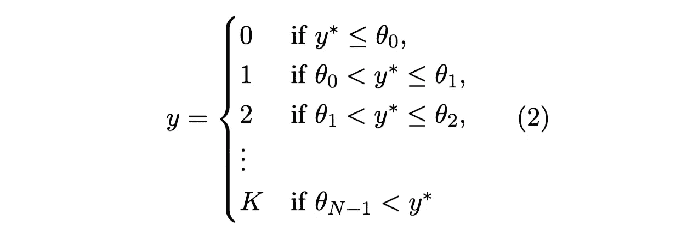

最后一个等级 K 是*总括*类，它捕获最后一个类以及没有被其他阈值分开的数据点。

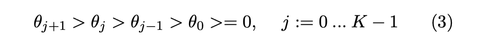

阈值被约束为单调递增且大于或等于零，如等式(3)所示。使用单调递增的阈值确保了数据点被分配给一个且仅一个等级类别。

下图说明了线性核和分级阈值之间的关系。注意，阈值是线性核的子空间。

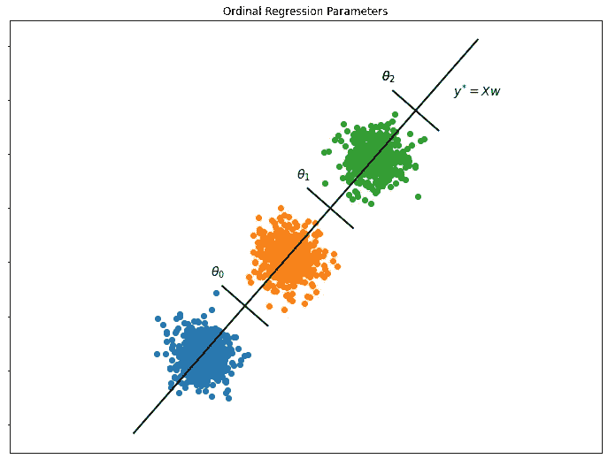

数据点到分级阈值的线性核的距离将被映射到数据点“属于”分级类别的概率。到分级阈值的距离是通过从 K-1 个阈值中的每一个减去线性核的输出来创建的。然后，sigmoid 函数将该输出映射到分级目标变量的累积分布函数，如等式(4)所示。

因为对阈值参数的单调增加的约束，j 处的累积概率将总是大于 j-1。数据点属于分级类别 j 的概率被定义为 j 和 j-1 处的累积分布函数之间的差。

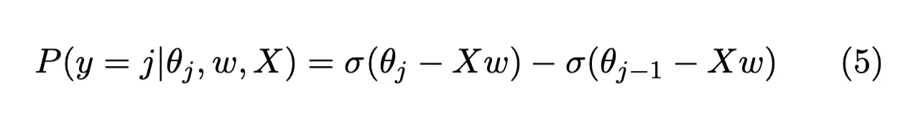

边缘情况，即秩 0 和秩 K，由 P(y <0) and 1-P(y < K-1), respectively. Notice that the relative probability of a data point belonging to rank 0 increases as the predicted output decreases or becomes negative. This is due to the monotonic constraint on the thresholds. The probability of a data point belonging to class K, or above, is simply one minus the maximum probability in the cumulative distribution function, in this case the CDF probability at ranked class K-1.

## Optimization

The ranked class probability distribution defined above, can be optimized with a [交叉熵损失函数](https://en.wikipedia.org/wiki/Cross_entropy)定义，如等式(6)所示。

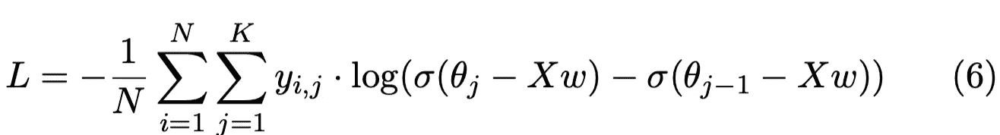

输出 y 是一个热编码矩阵，用于指示观察值属于哪个类。因为 y 是离散概率分布，所以等式(6)中所示的交叉熵损失函数可用于最大化估计参数的似然性。

我们可以检查对数概率的导数，并在损失函数中看到相邻阈值参数之间的关系。等式(7)和(8)显示了有用导数公式。

方程(9)和(10)中示出了在分级等级 j 处对数概率函数的导数。注意，如果一项不包括等级为 j 的θ，则它的导数在等式(6)中为零。

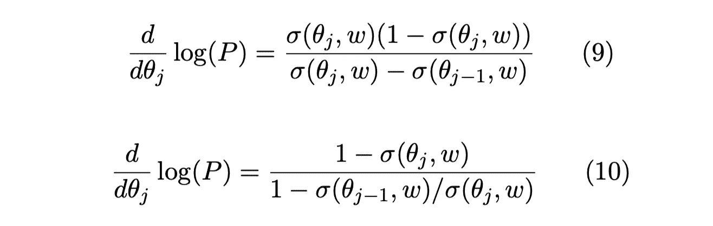

上述导数的简化形式如等式(12)所示。我删除了显示将(10)转换为(12)的步骤的等式(11)，因为它太长了:)

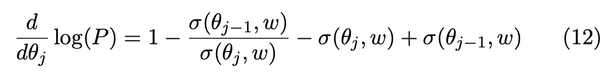

导数显示了 j 和 j-1 处的不同累积概率与 j 和 j-1 处的累积概率比之间的有趣关系。如果 j 处的概率为零，梯度将是不确定的。如果 j 和 j-1 的概率太接近，梯度也会消失。此外，梯度有可能将符号换成负阈值。

## 张量流公式

在 TensorFlow 中，有各种方法来制定有序逻辑回归。主要问题将是定义阈值，以便梯度与上一节中定义的梯度一致。[示例笔记本](https://github.com/freedomtowin/ml-projects/blob/master/Deep-Ordinal-Logistic-Regression/deep-ordinal-regression-v2.ipynb)可以在这里找到。

该模型的线性部分由输入数据和权重之间的点积定义。线性核的输出具有 shape (Nx1)，其中 N 是数据点的数量。我决定使用一个线性激活的密集层作为有序层的输入。您可能需要在序数层中添加一个非负偏差来处理潜在的负值。

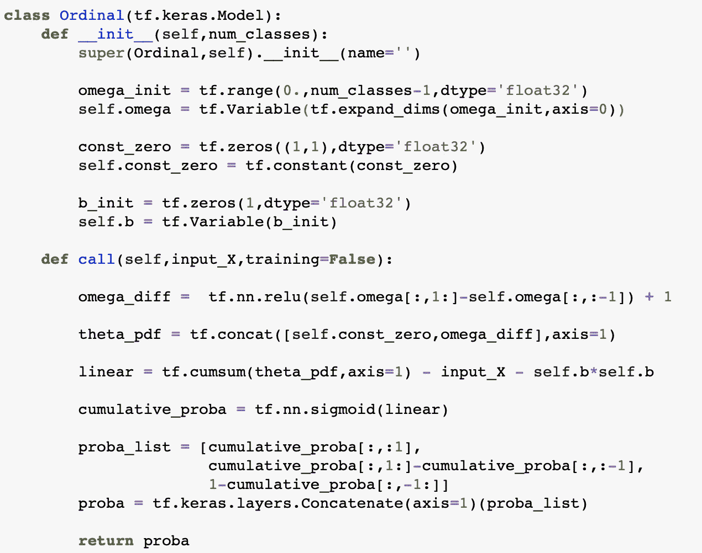

一个潜在的变量，欧米加，被创建来构建阈值参数。潜在变量被初始化为等间距单调递增序列。最后排序的类别 K 的阈值被丢弃，并且 CDF 概率从先前排序的类别 K-1 中推断。阈值参数θ将具有形状(1x(K-1))。等级为 0 的第一阈值将被静态地定义为恒定的零值。

最初，我试图用潜在变量平方的累积和来创建阈值参数。然而，模型似乎没有收敛。我认为这是梯度如何传播回阈值的问题。以下是它不起作用的一些可能原因:1)累积和的导数对所有等级≤j 的类传播相同的梯度。换句话说，它没有考虑 j 和 j-1 个阈值参数之间的关系 2)对于平方潜在变量，梯度可能在 0 附近不稳定，即，如果潜在变量在优化期间改变符号。

为了解决这个问题，我首先创建了 K-1 个阈值，然后取 j 和 j-1 个潜在变量之间的差，即累积函数的逆运算。这导致 K-2 个阈值参数。然而，差值仍然可能是负的，所以我添加了一个 ReLU 层来确保差值是正的。常数+1，用于确保梯度始终被定义，即大于零。最后，我将阈值连接在等级为 0 的类上，它被静态地定义为零。

CDF 是通过从阈值中减去线性核，然后应用 sigmoid 函数来创建的。然后，可以通过应用等式(6)将 CDF 转换成 PDF。最后，可以使用稀疏分类交叉熵损失来优化模型。

## 估价

从这个[源](https://www.gagolewski.com/resources/data/ordinal-regression/)中收集了三个有序数据集，即波士顿住房、股票和运动学数据集。根据平均交叉验证 MAE、精确度和[推土机距离](https://en.wikipedia.org/wiki/Earth_mover%27s_distance) (EMD)对模型进行评估。EMD 捕捉预测 CDF 和目标 CDF 之间的相似性。

选择分层的 5 重交叉验证策略来评估这两个模型的性能。我发现多个交叉验证结果之间存在一些差异。为了限制这种可变性，我运行了 3 次交叉验证策略，并保存了每个 k 倍验证集的预测值和实际值。

目标是评估和比较有序模型和回归模型的结果。为了简单起见，将使用相同数量的隐藏单元，即 32 个隐藏单元，和相同的优化策略来训练回归模型。回归模型的损失函数有两种选择，即平均绝对误差(MAE)和均方误差(MSE)。我决定使用 MAE，因为它似乎比 MSE 更适合排名。

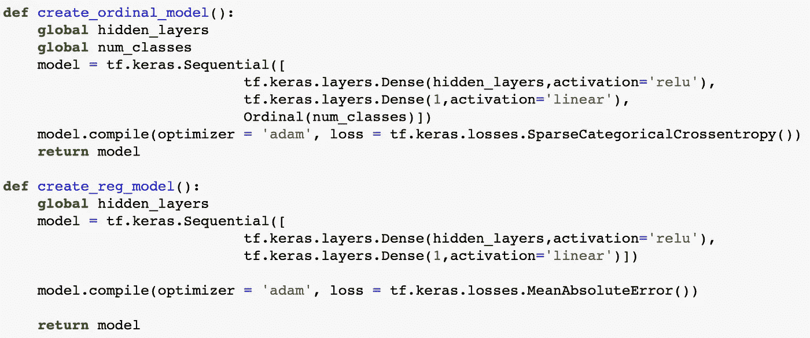

由于序数模型使用稀疏分类交叉熵损失，我认为这是一个好主意，分层的 k 倍对排名类变量。两个模型都采用了提前停车。

## 结果

下表显示了两个模型在每个数据集上的指标。出乎意料的是，对于所有三个数据集，序数模型产生的交叉验证 MAE 都比回归模型好。顺序模型在准确性和推土机的距离度量方面也表现得更好。

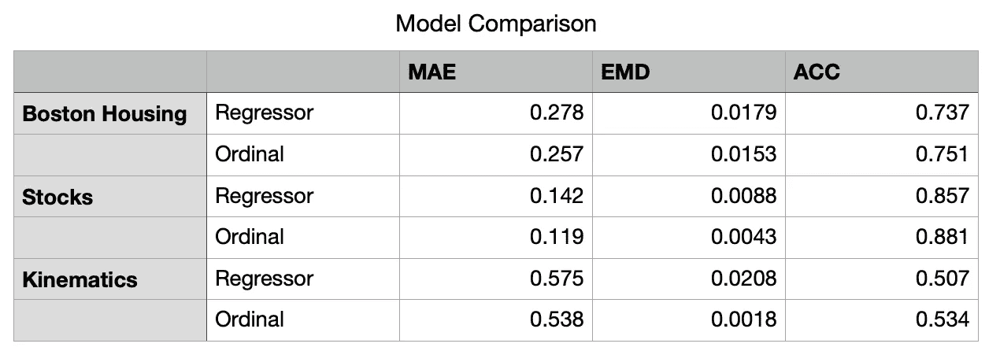

序数模型和回归模型在波士顿住房数据集上具有相似的性能。在运动学数据集上，序数模型比回归模型有最大的改进。

下图显示了回归(右)和有序(左)模型的预测输出与实际分布的分布。这些图显示了 1)波士顿住房数据集 2)股票数据集 3)和运动学数据集。

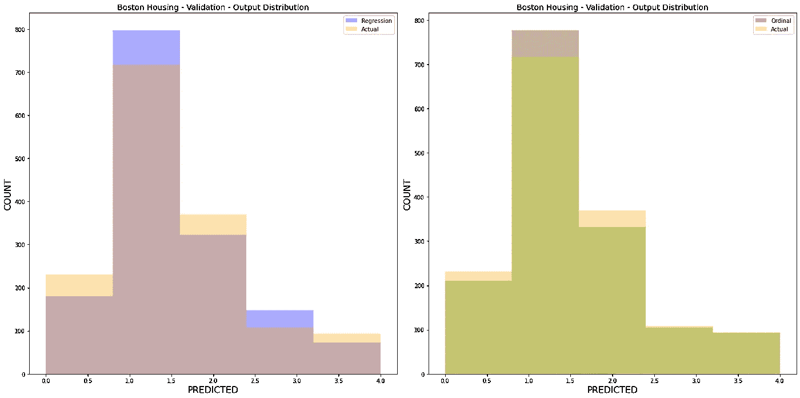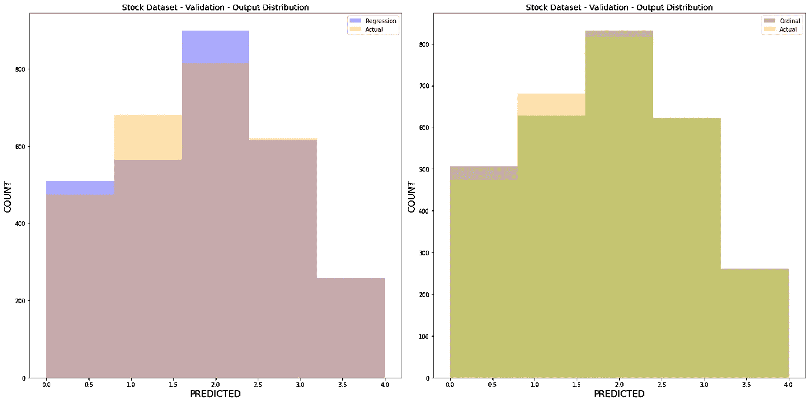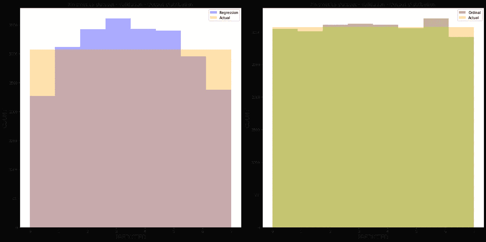

下图显示了每个 k 倍模型中阈值参数的变化。有趣的是，阈值的变化似乎与回归模型的改进成反比。

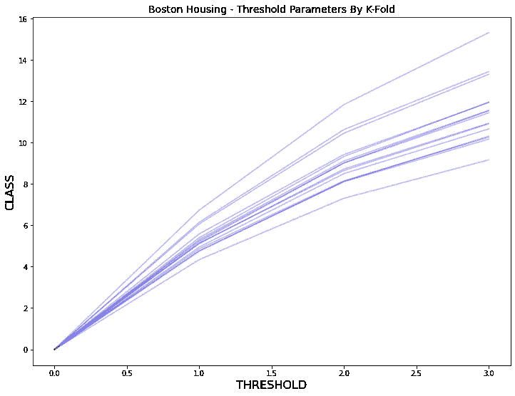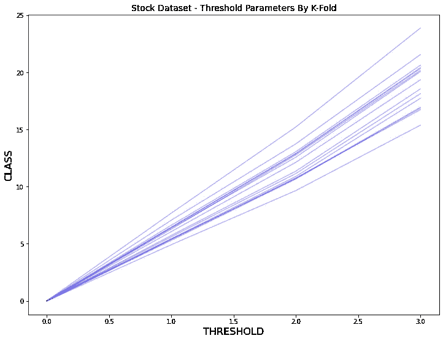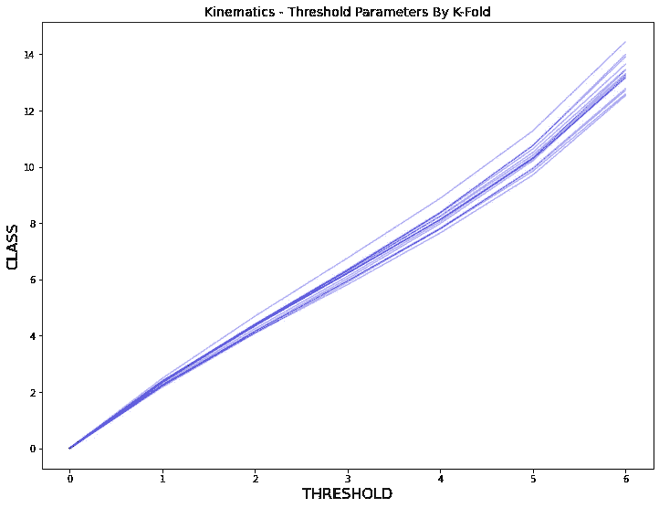

## 结论

在 TensorFlow 2.0 中设计并实现了有序逻辑回归模型的一个潜在实现。该设计使用了经典的比例优势定义和自定义阈值参数化。通过检查和分析阈值参数的梯度来构造阈值参数化。序数模型模型在平均交叉验证 MAE、准确性和 EMD 指标上与 MAE 回归模型产生了竞争结果。

## 资源

*   [有序逻辑回归—使用 Scipy Optimize 优化](https://github.com/fabianp/minirank/blob/master/minirank/logistic.py)
*   [PennState——比例优势累积 Logit 模型](https://online.stat.psu.edu/stat504/node/176/)
*   [预测持续天气模式的混合专家模型](https://arxiv.org/pdf/1903.10012.pdf)