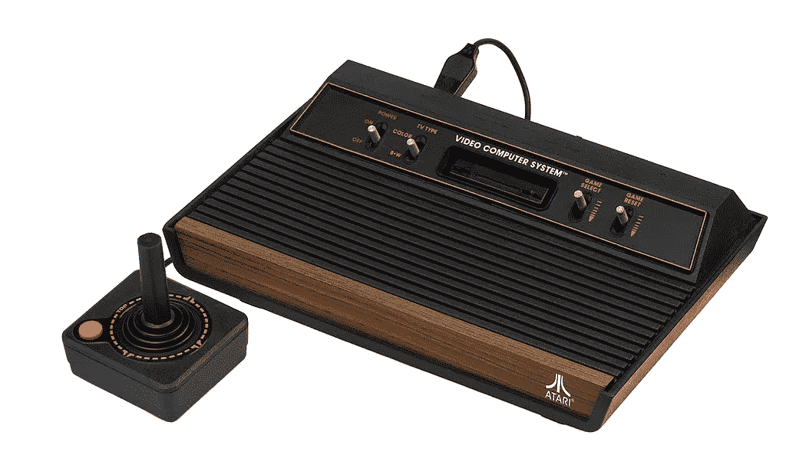
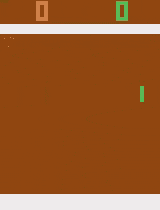
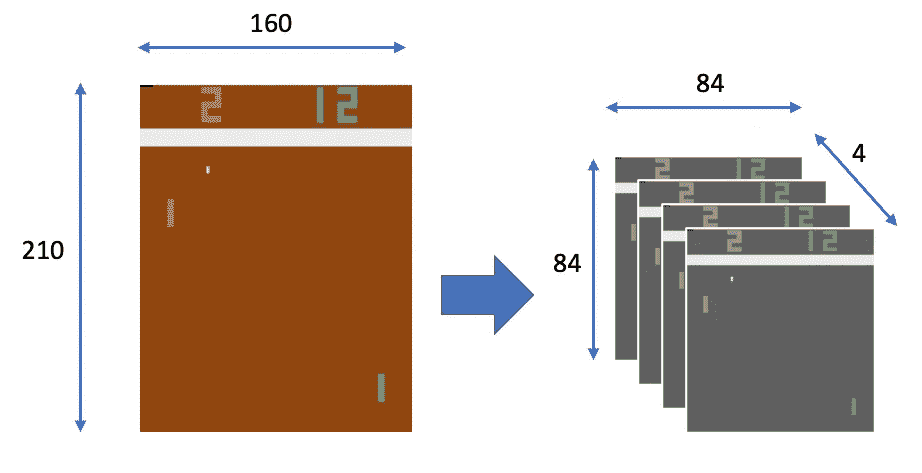
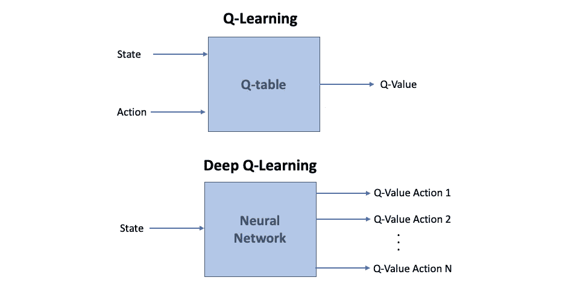

# 深度 Q 网(DQN)-I

> 原文：<https://towardsdatascience.com/deep-q-network-dqn-i-bce08bdf2af?source=collection_archive---------6----------------------->

## [深度强化学习讲解— 15](https://towardsdatascience.com/tagged/deep-r-l-explained)

## 开放式健身乒乓球和包装纸


在[之前的帖子](/mc-control-methods-50c018271553)中，我们已经展示了在一个小表格中表示动作值的解决方法。我们将这个表称为 **Q 表**。在 *"* [*深度强化学习解释*](https://torres.ai/deep-reinforcement-learning-explained-series/) *"* 系列的下三篇文章中，我们将向读者介绍使用神经网络来扩展我们可以通过强化学习解决的问题规模的想法，展示了**深度 Q 网络(DQN)，**，它将最佳动作值函数表示为神经网络，而不是表格。在本帖中，我们将对 DQN 做一个概述，并介绍 Pong 的 [OpenAI 健身房框架。在接下来的两篇文章中，我们将介绍该算法及其实现。](https://gym.openai.com/envs/Pong-v0/)

> [本出版物的西班牙语版本](https://medium.com/aprendizaje-por-refuerzo/9-m%C3%A9todos-value-based-deep-q-network-b52b5c3da0ba)

[](https://medium.com/aprendizaje-por-refuerzo/9-m%C3%A9todos-value-based-deep-q-network-b52b5c3da0ba) [## 9.基于价值的营销:深度 Q 网络

### 请访问第 9 页的自由介绍

medium.com](https://medium.com/aprendizaje-por-refuerzo/9-m%C3%A9todos-value-based-deep-q-network-b52b5c3da0ba) 

# 雅达利 2600 游戏

我们在之前的文章中提到的 Q-learning 方法通过遍历完整的状态集解决了这个问题。然而，我们常常意识到我们有太多的状态要跟踪。一个例子是 Atari 游戏，它可以有大量不同的屏幕，在这种情况下，问题不能用 Q 表来解决。

雅达利 2600 游戏机在 20 世纪 80 年代非常受欢迎，许多街机风格的游戏都可以为它提供。以今天的游戏标准来看，Atari 游戏机已经过时了，但它的游戏对计算机来说仍然具有挑战性，并且是 RL 研究中非常受欢迎的基准(使用模拟器)



雅达利 2600(来源:[维基百科](https://en.wikipedia.org/wiki/Atari_2600))

2015 年，DeepMind 利用所谓的**深度 Q 网络(DQN)** 或深度 Q 学习算法，学会了比人类更好地玩许多雅达利视频游戏。介绍它的研究论文，应用于 49 个不同的游戏，发表在 Nature(通过深度强化学习的人类水平控制，doi:10.1038/nature14236，Mnih，和其他)和[可以在这里找到](https://hallab.cs.dal.ca/images/0/00/Minh2015.pdf)。

Atari 2600 游戏环境可以通过 OpenAI 健身房框架中的[街机学习环境](https://arxiv.org/abs/1207.4708)进行重现。该框架有每个游戏的多个版本，但为了本文的目的，将使用 [Pong-v0](https://gym.openai.com/envs/Pong-v0/) 环境。

我们将研究这个算法，因为它真的允许我们学习在本系列的未来帖子中非常有用的提示和技巧。DeepMind 的《自然》论文包含了一个表格，其中列出了用于在所有 49 款用于评估的雅达利游戏上训练其模型的超参数的所有细节。然而，我们在这里的目标要小得多:我们只想解决乒乓游戏。

正如我们在以前的一些帖子中所做的那样，这篇帖子中的代码受到了 Maxim Lapan 的代码[的启发，他写了一本关于这个主题的优秀的实用书籍](https://github.com/PacktPublishing/Deep-Reinforcement-Learning-Hands-On-Second-Edition/tree/master/Chapter04)。

这篇文章[的全部代码可以在 GitHub](https://github.com/jorditorresBCN/Deep-Reinforcement-Learning-Explained/blob/master/DRL_15_16_17_DQN_Pong.ipynb) 上找到，而[可以通过这个链接](https://colab.research.google.com/github/jorditorresBCN/Deep-Reinforcement-Learning-Explained/blob/master/DRL_15_16_17_DQN_Pong.ipynb)作为一个 Colab google 笔记本运行。

> 从计算需求的角度来看，我们之前的 FrozenLake 或 CartPole 示例并不苛刻，因为观测值很小。然而，从现在来看，事实并非如此。这篇文章中分享的代码版本在 2 小时内收敛到 19.0 的平均分数(使用 NVIDIA K80)。所以在训练循环的执行过程中不要紧张。*；-)*

## 恶臭

**Pong** 是一款以乒乓球为主题的[街机电子游戏](https://en.wikipedia.org/wiki/Arcade_game#Arcade_video_games)，以简单的二维图形为特色，由 [Atari](https://en.wikipedia.org/wiki/Atari,_Inc) 制造，最初于 1972 年发布。在乒乓球比赛中，如果球从另一名球员身边经过，一名球员得分。当其中一名玩家达到 **21 分**时，一集结束。在 [OpenAI Gym 框架版 Pong](https://gym.openai.com/envs/Pong-v0/) 中，右边显示代理人，左边显示敌人:



在乒乓球运动中，两个拍子来回移动球。分数由屏幕顶部的数字记录。(来源: [torres.ai](https://torrs.ai) )

在 Pong 环境中，代理(玩家)可以采取三种动作:保持静止、垂直向上平移和垂直向下平移。然而，如果我们使用方法`action_space.n` ,我们可以认识到环境有 6 个动作:

```
import gym
import gym.spacesDEFAULT_ENV_NAME = “PongNoFrameskip-v4”
test_env = gym.make(DEFAULT_ENV_NAME)print(test_env.action_space.n)**6**
```

尽管 OpenAI Gym Pong 环境有六个动作:

```
print(test_env.unwrapped.get_action_meanings())**[‘NOOP’, ‘FIRE’, ‘RIGHT’, ‘LEFT’, ‘RIGHTFIRE’, ‘LEFTFIRE’]**
```

六个中的三个是多余的(FIRE 等于 NOOP，LEFT 等于 LEFTFIRE，RIGHT 等于 RIGHTFIRE)。

# DQN 概述

在这种新方法的代理的核心，我们发现了一个深度神经网络，而不是我们在以前的帖子中看到的 Q 表。应该注意的是，代理仅被给予原始像素数据，即人类玩家将在屏幕上看到的数据，而不能访问底层的游戏状态、球的位置、球拍等。

作为强化信号，它反馈每个时间步的游戏分数变化。一开始，当神经网络用随机值初始化时，它真的很糟糕，但随着时间的推移，它开始将游戏中的情况和序列与适当的动作关联起来，并学会实际玩好游戏(毫无疑问，读者将能够用本系列中将要展示的代码来验证)。

## 输入空间

Atari 游戏以 210 X60 像素的分辨率显示，每个像素有 128 种可能的颜色:

```
print(test_env.observation_space.shape)**(210, 160, 3)**
```

从技术上讲，这仍然是一个离散的状态空间，但处理起来非常大，我们可以优化它。为了降低这种复杂性，需要执行一些最小的处理:将帧转换为灰度，并将它们缩小到 84 乘 84 像素的正方形块。现在让我们仔细想想，如果有了这个固定的图像，我们是否可以决定游戏的动态。观察中肯定有歧义，对吗？例如，我们无法知道球的前进方向)。这显然违反了[马尔科夫属性](/drl-02-formalization-of-a-reinforcement-learning-problem-108b52ebfd9a)。

解决方案是维护过去的几个观察值，并将它们作为一种状态使用。在 Atari 游戏的情况下，论文的作者建议将 4 个后续帧堆叠在一起，并使用它们作为每个状态的观察值。由于这个原因，预处理将四个帧堆叠在一起，导致最终的状态空间大小为 84×84×4:



输入状态空间转换(来源: [torres.ai](https://torrs.ai)

## 输出

与迄今为止我们提出的一次仅产生一个 Q 值的传统强化学习设置不同，深度 Q 网络被设计成在单次正向传递中为环境中可用的每个可能动作产生 Q 值:



(来源: [torres.ai](https://torrs.ai) )

这种通过网络一次计算所有 Q 值的方法避免了必须为每个动作单独运行网络，并且有助于显著提高速度。现在，我们可以简单地使用这个向量，通过选择具有最大值的向量来采取行动。

## 神经网络体系结构

最初的 DQN 代理商在所有 49 款游戏中使用了相同的神经网络架构，将 84x84x4 的图像作为输入。

屏幕图像首先由三个卷积层处理。这允许系统利用空间关系，并且可以划分空间规则空间。此外，由于四个帧被堆叠并作为输入提供，这些卷积层也提取这些帧的一些时间属性。使用 PyTorch，我们可以将模型的卷积部分编码为:

```
nn.Conv2d(input_shape, 32, kernel_size=8, stride=4),
        nn.ReLU(),
        nn.Conv2d(32, 64, kernel_size=4, stride=2),
        nn.ReLU(),
        nn.Conv2d(64, 64, kernel_size=3, stride=1),
        nn.ReLU()
```

其中`input_shape`是环境的`observation_space.shape`。

卷积层之后是一个具有 ReLU 激活的全连接隐藏层和一个产生动作值向量的全连接线性输出层:

```
nn.Linear(conv_out_size, 512),
         nn.ReLU(),
         nn.Linear(512, n_actions)
```

其中`conv_out_size`是由给定形状的输入产生的卷积层输出中的值的数量。此值需要传递给第一个完全连接的图层构造器，并且可以进行硬编码，因为它是输入形状的函数(对于 84x84 输入，卷积图层的输出将为 3136)。然而，为了编码一个可以接受不同输入形状的通用模型(用于所有游戏)，我们将使用一个简单的函数，`_get_conv_out`，该函数接受输入形状并将卷积层应用于这种形状的伪张量:

```
def get_conv_out(self, shape):
         o = self.conv(torch.zeros(1, *shape))
         return int(np.prod(o.size()))conv_out_size = get_conv_out(input_shape)
```

另一个要解决的问题是需要将卷积输出馈送到完全连接的层。但是 PyTorch 没有一个“更平坦”的图层，我们需要将一批 3D 张量重新整形为一批 1D 向量。在我们的代码中，我们建议在`forward()`函数中解决这个问题，在这里我们可以使用张量的`view()`函数将我们的一批 3D 张量重新整形为一批 1D 向量。

`view()`函数用与输入相同的数据和元素数“整形”一个张量，但具有指定的形状。这个函数有趣的地方在于，让一个单独的维度成为一个`-1`，在这种情况下，它是从剩余的维度和输入中的元素数量中推断出来的(该方法将执行数学运算以填充该维度)。例如，如果我们有一个形状张量(2，3，4，6)，它是 144 个元素的 4D 张量，我们可以使用`view(2,72)`将其重塑为 2 行 72 列的 2D 张量。通过`view(2,-1)`，due [144/ (3*4*6) = 2]可以得到相同的结果。

在我们的代码中，实际上，张量在第一维度中有一个批量大小，我们展平了一个 4D 张量(第一维度是批量大小，第二维度是颜色通道，这是我们后续帧的堆栈；第三和第四是形象维度。)从卷积部分到 2D 张量，作为我们的全连接层的输入，以获得每批输入的 Q 值。

我们刚刚描述的 DQN 类的完整代码写在下面:

```
import torch
import torch.nn as nn
import numpy as npclass DQN(nn.Module):
    def __init__(self, input_shape, n_actions):
        super(DQN, self).__init__()self.conv = nn.Sequential(
        nn.Conv2d(input_shape[0], 32, kernel_size=8, stride=4),
        nn.ReLU(),
        nn.Conv2d(32, 64, kernel_size=4, stride=2),
        nn.ReLU(),
        nn.Conv2d(64, 64, kernel_size=3, stride=1),
        nn.ReLU()
    )conv_out_size = self._get_conv_out(input_shape)self.fc = nn.Sequential(
         nn.Linear(conv_out_size, 512),
         nn.ReLU(),
         nn.Linear(512, n_actions)
    )def _get_conv_out(self, shape):
         o = self.conv(torch.zeros(1, *shape))
         return int(np.prod(o.size()))def forward(self, x):
         conv_out = self.conv(x).view(x.size()[0], -1)
         return self.fc(conv_out)
```

我们可以使用`print`功能查看网络架构概要:

```
DQN(
  (conv): Sequential(
    (0): Conv2d(4, 32, kernel_size=(8, 8), stride=(4, 4))
    (1): ReLU()
    (2): Conv2d(32, 64, kernel_size=(4, 4), stride=(2, 2))
    (3): ReLU()
    (4): Conv2d(64, 64, kernel_size=(3, 3), stride=(1, 1))
    (5): ReLU()
  )
  (fc): Sequential(
    (0): Linear(in_features=3136, out_features=512, bias=True)
    (1): ReLU()
    (2): Linear(in_features=512, out_features=6, bias=True)
  )
)
```

# 开放式健身房包装纸

在 [DeepMind 的论文](https://hallab.cs.dal.ca/images/0/00/Minh2015.pdf)中，为了提高方法的速度和收敛性，将几种转换(如已经介绍的将帧转换为灰度，并将它们缩小到 84 乘 84 像素的正方形块)应用于 Atari 平台交互。在我们使用 OpenAI Gym simulator 的例子中，转换是作为 OpenAI Gym 包装器实现的。

完整的列表相当长，在不同的源代码中有相同包装器的几种实现。我使用的是基于 [OpenAI 基线库](https://github.com/openai/baselines/blob/master/baselines/common/atari_wrappers.py)的 [Lapan 的书](https://github.com/PacktPublishing/Deep-Reinforcement-Learning-Hands-On-Second-Edition/tree/master/Chapter04)的版本。让我们来介绍它们中每一个的代码。

例如，一些游戏如 Pong 需要用户按下 FIRE 按钮来开始游戏。以下代码对应于包装器`FireResetEnv`，该包装器在要求游戏启动的环境中按下 FIRE 按钮:

```
class FireResetEnv(gym.Wrapper):
   def __init__(self, env=None):
       super(FireResetEnv, self).__init__(env)
       assert env.unwrapped.get_action_meanings()[1] == ‘FIRE’
       assert len(env.unwrapped.get_action_meanings()) >= 3def step(self, action):
       return self.env.step(action)def reset(self):
       self.env.reset()
       obs, _, done, _ = self.env.step(1)
       if done:
          self.env.reset()
       obs, _, done, _ = self.env.step(2)
       if done:
          self.env.reset()
       return obs
```

除了按下 FIRE 之外，这个包装器还检查一些游戏中出现的几个角落情况。

我们需要的下一个包装器是`MaxAndSkipEnv`，它为 Pong 编写了几个重要的转换:

```
class MaxAndSkipEnv(gym.Wrapper):
    def __init__(self, env=None, skip=4):
        super(MaxAndSkipEnv, self).__init__(env)
        self._obs_buffer = collections.deque(maxlen=2)
        self._skip = skipdef step(self, action):
        total_reward = 0.0
        done = None
        for _ in range(self._skip):
           obs, reward, done, info = self.env.step(action)
           self._obs_buffer.append(obs)
           total_reward += reward
           if done:
               break
        max_frame = np.max(np.stack(self._obs_buffer), axis=0)
        return max_frame, total_reward, done, infodef reset(self):
       self._obs_buffer.clear()
       obs = self.env.reset()
       self._obs_buffer.append(obs)
       return obs
```

一方面，它允许我们通过将 max 应用到 N 个观察值(默认为 4 个)并将其作为该步骤的一个观察值返回，从而显著加快训练速度。这是因为在中间帧上，所选择的动作被简单地重复，并且我们可以每 N 步做出一个动作决定，因为用神经网络处理每一帧是一个相当费力的操作，但是后续帧之间的差异通常很小。

另一方面，它取最后两帧中每个像素的最大值，并将其用作观察值。一些 Atari 游戏有闪烁效果(当游戏在偶数和奇数帧上绘制屏幕的不同部分时，Atari 2600 开发者增加游戏精灵复杂性的正常做法)，这是由于平台的限制。对于人眼来说，这种快速变化是不可见的，但它们会混淆神经网络。

请记住，我们已经提到过，在将帧馈送到神经网络之前，每一帧都使用色度灰度转换从 210x160(三色帧(RGB 颜色通道))缩小到单色 84 x84 图像。不同的方法是可能的。其中之一是裁剪图像的不相关部分，然后按比例缩小，如下面的代码所示:

```
class ProcessFrame84(gym.ObservationWrapper):
     def __init__(self, env=None):
         super(ProcessFrame84, self).__init__(env)
         self.observation_space = gym.spaces.Box(low=0, high=255, 
                               shape=(84, 84, 1), dtype=np.uint8)def observation(self, obs):
         return ProcessFrame84.process(obs)@staticmethod
     def process(frame)
         if frame.size == 210 * 160 * 3:
             img = np.reshape(frame, [210, 160,  3])
                                     .astype(np.float32)
         elif frame.size == 250 * 160 * 3:
             img = np.reshape(frame, [250, 160, 3])              
                                     .astype(np.float32)
         else:
             assert False, “Unknown resolution.”       
             img = img[:, :, 0] * 0.299 + img[:, :, 1] * 0.587 + 
                                          img[:, :, 2] * 0.114
             resized_screen = cv2.resize(img, (84, 110),            
                              interpolation=cv2.INTER_AREA)
             x_t = resized_screen[18:102, :]
             x_t = np.reshape(x_t, [84, 84, 1])
             return x_t.astype(np.uint8)
```

正如我们已经讨论过的在一个游戏帧中缺乏游戏动态的快速解决方案，类`BufferWrapper`将几个(通常是四个)后续帧堆叠在一起:

```
class BufferWrapper(gym.ObservationWrapper):
    def __init__(self, env, n_steps, dtype=np.float32):
        super(BufferWrapper, self).__init__(env)
        self.dtype = dtype
        old_space = env.observation_space
        self.observation_space =
                 gym.spaces.Box(old_space.low.repeat(n_steps, 
                 axis=0),old_space.high.repeat(n_steps, axis=0),     
                 dtype=dtype)
    def reset(self):
        self.buffer = np.zeros_like(self.observation_space.low,
        dtype=self.dtype)
        return self.observation(self.env.reset())def observation(self, observation):
        self.buffer[:-1] = self.buffer[1:]
        self.buffer[-1] = observation
        return self.buffer
```

张量的输入形状有一个颜色通道作为最后一个维度，但 PyTorch 的卷积层假设颜色通道是第一维。这个简单的包装器将观察的形状从 HWC(高度、宽度、通道)改变为 PyTorch 要求的 CHW(通道、高度、宽度)格式:

```
class ImageToPyTorch(gym.ObservationWrapper):
    def __init__(self, env):
        super(ImageToPyTorch, self).__init__(env)
        old_shape = self.observation_space.shape
        self.observation_space = gym.spaces.Box(low=0.0, high=1.0,            
                                shape=(old_shape[-1], 
                                old_shape[0], old_shape[1]),
                                dtype=np.float32)def observation(self, observation):
      return np.moveaxis(observation, 2, 0)
```

从模拟器获得的屏幕被编码为具有从 0 到 255 的值的字节张量，这不是神经网络的最佳表示。因此，我们需要将图像转换成浮点数，并将值重新调整到范围[0.0…1.0]。这是由`ScaledFloatFrame`包装器完成的:

```
class ScaledFloatFrame(gym.ObservationWrapper):
     def observation(self, obs):
         return np.array(obs).astype(np.float32) / 255.0
```

最后，下面这个简单的函数`make_env`将会很有帮助，它根据名字创建了一个环境，并对它应用了所有需要的包装器:

```
def make_env(env_name):
    env = gym.make(env_name)
    env = MaxAndSkipEnv(env)
    env = FireResetEnv(env)
    env = ProcessFrame84(env)
    env = ImageToPyTorch(env) 
    env = BufferWrapper(env, 4)
    return ScaledFloatFrame(env)
```

# 下一步是什么？

这是致力于**深度 Q 网(DQN)**的三篇帖子中的第一篇，在这三篇帖子中，我们提供了 DQN 的概况以及对 Pong 的 [OpenAI 健身房框架的介绍。在接下来的两篇帖子(](https://gym.openai.com/envs/Pong-v0/)[帖 16](/deep-q-network-dqn-ii-b6bf911b6b2c) 、[帖 17](/deep-q-network-dqn-iii-c5a83b0338d2) )中，我们将展示该算法及其实现，其中我们将涵盖 dqn 提高其训练稳定性和收敛性的几个技巧。

# 深度强化学习讲解系列

**由** [**UPC 巴塞罗那理工**](https://www.upc.edu/en) **和** [**巴塞罗那超级计算中心**](https://www.bsc.es/)

一个轻松的介绍性[系列](https://torres.ai/deep-reinforcement-learning-explained-series/)以一种实用的方式逐渐向读者介绍这项令人兴奋的技术，它是人工智能领域最新突破性进展的真正推动者。

[](https://torres.ai/deep-reinforcement-learning-explained-series/) [## 深度强化学习解释-乔迪托雷斯。人工智能

### 本系列的内容](https://torres.ai/deep-reinforcement-learning-explained-series/) 

# 关于这个系列

我在五月份开始写这个系列，那是在巴塞罗那的封锁期。老实说，由于封锁，在业余时间写这些帖子帮助了我 [**#StayAtHome**](https://twitter.com/hashtag/StayAtHome?src=hashtag_click) 。感谢您当年阅读这份刊物；它证明了我所做的努力。

**免责声明** —这些帖子是在巴塞罗纳封锁期间写的，作为个人消遣和传播科学知识，以防它可能对某人有所帮助，但不是为了成为 DRL 地区的学术参考文献。如果读者需要更严谨的文档，本系列的最后一篇文章提供了大量的学术资源和书籍供读者参考。作者意识到这一系列的帖子可能包含一些错误，如果目的是一个学术文件，则需要对英文文本进行修订以改进它。但是，尽管作者想提高内容的数量和质量，他的职业承诺并没有留给他这样做的自由时间。然而，作者同意提炼所有那些读者可以尽快报告的错误。