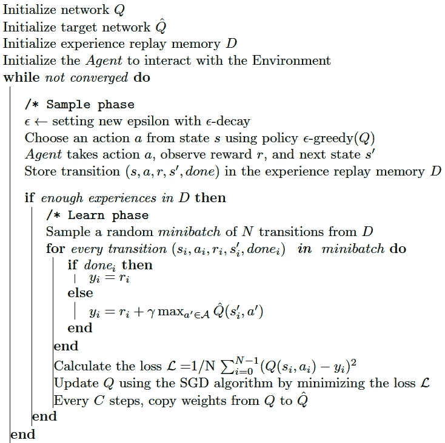
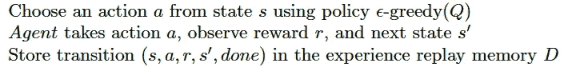
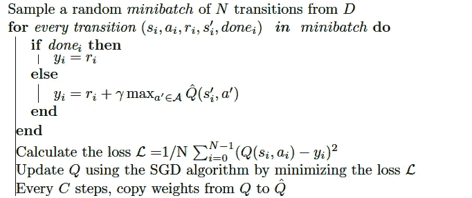
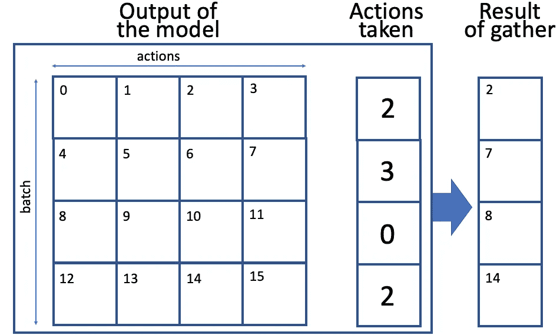

# 深度 Q-网络(DQN)-II

> 原文：<https://towardsdatascience.com/deep-q-network-dqn-ii-b6bf911b6b2c?source=collection_archive---------1----------------------->

## [深度强化学习讲解— 16](https://towardsdatascience.com/tagged/deep-r-l-explained)

## 体验重放和目标网络


这是**【深度 Q 网】(DQN)、*[*深度强化学习讲解*](https://torres.ai/deep-reinforcement-learning-explained-series/)*系列中的******的第二篇帖子，其中我们将分析当我们将深度学习应用于强化学习时出现的一些挑战。我们还将详细介绍使用在上一篇文章中[介绍的 DQN 网络解决 OpenAI Gym Pong 游戏的代码。](/deep-q-network-dqn-i-bce08bdf2af)**

> **[本出版物的西班牙语版本](https://medium.com/aprendizaje-por-refuerzo/9-m%C3%A9todos-value-based-deep-q-network-b52b5c3da0ba)**

**[](https://medium.com/aprendizaje-por-refuerzo/9-m%C3%A9todos-value-based-deep-q-network-b52b5c3da0ba) [## 9.基于价值的营销:深度 Q 网络

### 请访问第 9 页的自由介绍

medium.com](https://medium.com/aprendizaje-por-refuerzo/9-m%C3%A9todos-value-based-deep-q-network-b52b5c3da0ba) 

# 深度强化学习的挑战

不幸的是，当使用神经网络来表示动作值时，强化学习更加不稳定，尽管应用了上一节介绍的包装器。训练这样的网络需要大量的数据，但即使这样，也不能保证收敛到最优值函数。事实上，由于动作和状态之间的高度相关性，存在网络权重可能振荡或发散的情况。

为了解决这个问题，本节我们将介绍深度 Q 网络使用的两种技术:

*   体验回放
*   目标网络

研究人员还发现了更多的技巧和窍门来使 DQN 训练更加稳定和有效，我们将在本系列的后续文章中介绍其中的精华。

## 体验回放

我们试图用神经网络来逼近一个复杂的非线性函数 Q(s，a)。要做到这一点，我们必须使用贝尔曼方程计算目标，然后考虑我们手头有一个监督学习问题。然而，SGD 优化的一个基本要求是训练数据是独立和同分布的，并且当代理与环境交互时，经验元组的序列可以是高度相关的。以连续顺序从这些经验元组中的每一个学习的朴素 Q 学习算法冒着被这种相关性的影响所左右的风险。

我们可以使用我们过去的经验和样本训练数据的大缓冲区，而不是使用我们的最新经验，来防止行动值发生灾难性的波动或偏离。这个技术叫做**重放缓冲**或者**经验缓冲**。重放缓冲器包含经验元组的集合( *S* ， *A* ， *R* ，*S*’)。当我们与环境交互时，元组被逐渐添加到缓冲区中。最简单的实现是一个固定大小的缓冲区，将新数据添加到缓冲区的末尾，以便将最老的体验推出。

为了学习，从重放缓冲器中采样一小批元组的行为被称为**体验重放**。除了打破有害的相关性，经验回放允许我们多次从单个元组中学习更多，回忆罕见的事件，并在总体上更好地利用我们的经验。

总之，经验重放背后的基本思想是存储过去的经验，然后使用这些经验的随机子集来更新 Q 网络，而不是仅使用单个最近的经验。为了存储代理的经验，我们在 Python 的内置集合库中使用了一个名为`deque`的数据结构。它基本上是一个列表，你可以设置一个最大大小，这样，如果你试图添加到列表中，它已经满了，它会删除列表中的第一个项目，并在列表的末尾添加新的项目。体验本身就是*【观察、动作、奖励、完成标志、下一个状态】*的元组，保持从环境中获得的跃迁。

```
Experience = collections.namedtuple(‘Experience’, 
           field_names=[‘state’, ‘action’, ‘reward’, 
           ‘done’, ‘new_state’])class ExperienceReplay:
  def __init__(self, capacity):
      self.buffer = collections.deque(maxlen=capacity) def __len__(self):
      return len(self.buffer) def append(self, experience):
      self.buffer.append(experience)

  def sample(self, batch_size):
      indices = np.random.choice(len(self.buffer), batch_size,
                replace=False)
      states, actions, rewards, dones, next_states = 
             zip([self.buffer[idx] for idx in indices])
      return np.array(states), np.array(actions),         
             np.array(rewards,dtype=np.float32), 
             np.array(dones, dtype=np.uint8),    
             np.array(next_states)
```

每当代理在环境中执行一个步骤时，它就将转换推入缓冲区，只保留固定数量的步骤(在我们的例子中，10k 个转换)。对于训练，我们从重放缓冲区中随机抽取一批转换，这允许我们打破环境中后续步骤之间的相关性。

大多数体验重放缓冲区代码非常简单:它基本上利用了`deque`库的功能。在`sample()`方法中，我们创建一个随机索引列表，然后将采样条目重新打包到 NumPy 数组中，以便更方便地计算损失。

## 目标网络

记住在 Q-Learning 中，我们 ***用猜测*** 更新猜测，这可能会导致有害的相关性。贝尔曼方程通过 Q(s’，a’)为我们提供了 Q(s，a)的值。然而，状态 s 和 s’之间只有一步之遥。这使得它们非常相似，神经网络很难区分它们。

当我们执行神经网络参数的更新以使 Q(s，a)更接近期望的结果时，我们可以间接改变 Q(s '，a ')和附近其他状态产生的值。这会使我们的训练非常不稳定。

为了使训练更加稳定，有一个技巧，称为**目标网络**，通过它我们保留了一份我们神经网络的副本，并将其用于贝尔曼方程中的 Q(s '，a ')值。

也就是说，被称为目标网络的第二 Q 网络的预测 Q 值被用于反向传播并训练主 Q 网络。需要强调的是，目标网络的参数不是训练出来的，而是周期性地与主 Q 网络的参数同步。想法是使用目标网络的 Q 值来训练主 Q 网络将提高训练的稳定性。

稍后，当我们呈现训练循环的代码时，我们将更详细地输入如何对这个目标网络的初始化和使用进行编码。

# 深度 Q 学习算法

深度 Q 学习算法中有两个主要的交错阶段。一个是我们**通过执行动作对环境进行采样**，并将观察到的经验元组存储在重放存储器中。另一个是我们从这个内存中随机选择小批元组，然后**使用梯度下降(SGD)更新步骤从那批元组中学习**。

这两个阶段并不直接相互依赖，我们可以执行多个采样步骤，然后是一个学习步骤，甚至是不同随机批次的多个学习步骤。在实践中，您无法立即运行学习步骤。你需要等到你在 ***D*** 中有足够的经验元组。

算法的其余部分被设计成支持这些步骤。我们可以用这个基本 DQN 算法的伪代码来总结前面的解释，它将指导我们实现该算法:



一开始，我们需要创建主网络和目标网络，并初始化一个空的重放存储器 ***D*** 。请注意，内存是有限的，因此我们可能希望使用类似循环队列的东西来保留 ***d*** 最近的经验元组。我们还需要初始化代理，它是与环境交互的主要组件之一。

请注意，我们不会在每集之后清除记忆，这使我们能够回忆和建立跨集的经验批次。

# 编码训练循环

## 超参数和执行时间

在进入代码之前，请注意 DeepMind 的自然论文包含一个表格，其中列出了用于在所有 49 款用于评估的 Atari 游戏上训练其模型的超参数的所有细节。DeepMind 为所有游戏保留了相同的参数，但为每个游戏训练了单独的模型。该团队的目的是表明该方法足够健壮，可以使用一个单一的模型架构和超参数来解决许多具有不同复杂性、动作空间、奖励结构和其他细节的游戏。

然而，我们在这篇文章中的目标只是解决 Pong 游戏，与 Atari 测试集中的其他游戏相比，这是一个非常简单和直接的游戏，所以本文中的超参数不是最适合像这篇文章这样的说教性文章。出于这个原因，我们决定为 Pong 环境使用更个性化的参数值，根据 colab 分配给我们的执行的 GPU 类型(最多几个小时)，Pong 环境在合理的墙时间内收敛到平均分数 19.0。记住，我们可以通过命令`!nvidia-smi`知道分配给我们的运行时环境的 GPU 的类型。

让我们开始更详细地介绍代码。这篇文章[的全部代码可以在 GitHub](https://github.com/jorditorresBCN/Deep-Reinforcement-Learning-Explained/blob/master/DRL_15_16_17_DQN_Pong.ipynb) 上找到(而[可以使用这个链接](https://colab.research.google.com/github/jorditorresBCN/Deep-Reinforcement-Learning-Explained/blob/master/DRL_15_16_17_DQN_Pong.ipynb)作为 Colab google 笔记本运行)。我们跳过了包的导入细节，这很简单，我们集中在超参数的解释上:

```
DEFAULT_ENV_NAME = “PongNoFrameskip-v4” 
MEAN_REWARD_BOUND = 19.0 gamma = 0.99                    or
batch_size = 32                 
replay_size = 10000             
learning_rate = 1e-4            
sync_target_frames = 1000        
replay_start_size = 10000 eps_start=1.0
eps_decay=.999985
eps_min=0.02
```

这些`DEFAULT_ENV_NAME`确定了训练的环境，`MEAN_REWARD_BOUND`确定了停止训练的奖励界限。当我们的代理人在过去的 100 场比赛中平均赢得 19 场比赛(共 21 场)时，我们将认为这场比赛已经收敛。其余参数表示:

*   `gamma`是贴现因子
*   `batch_size`，迷你批次大小
*   `learning_rate`是学习率
*   `replay_size`重放缓冲区大小(存储在重放存储器中的最大体验次数)
*   `sync_target_frames`表示我们将模型重量从主 DQN 网络同步到目标 DQN 网络的频率(同步之间间隔多少帧)
*   `replay_start_size`开始训练前添加到重放缓冲区的帧数(体验数)。

最后，与ε衰变时间表相关的超参数与[之前的](/mc-control-methods-50c018271553)相同:

```
eps_start=1.0
eps_decay=.999985
eps_min=0.02
```

## 代理人

我们需要的一个主要组件是代理，它与环境交互，并将交互的结果保存到体验回放缓冲区中。我们将要设计的代理类已经将与环境交互的结果直接保存到体验重放缓冲区 ***，*** 中，执行前面伪代码部分中指示的*样本阶段*的这三个步骤:



首先，在代理的初始化期间，我们需要存储对环境和经验重放缓冲区 ***D*** 的引用，该缓冲区在创建代理的对象时被指示为参数`exp_buffer`:

```
class Agent: 
    def __init__(self, env, exp_buffer):
        self.env = env
        self.exp_buffer = exp_buffer
        self._reset()def _reset(self):
        self.state = env.reset()
        self.total_reward = 0.0
```

为了在环境中执行代理的步骤并将其结果存储在体验回放内存中，我们建议使用以下代码:

```
def play_step(self, net, epsilon=0.0, device=”cpu”): done_reward = None if np.random.random() < epsilon:
       action = env.action_space.sample()
    else:
       state_a = np.array([self.state], copy=False)
       state_v = torch.tensor(state_a).to(device)
       q_vals_v = net(state_v)
       _, act_v = torch.max(q_vals_v, dim=1)
       action = int(act_v.item())
```

方法`play_step`使用 *ϵ-greedy(Q)* 策略在每个时间步选择动作。换句话说，根据概率`epsilon`(作为参数传递)，我们采取随机行动；否则，我们使用过去的模型来获得所有可能动作的 Q 值，并选择最佳的。

在获得`action`之后，该方法执行环境中的步骤以获得下一个观察值:`next_state`、`reward`和`is_done`:

```
 new_state, reward, is_done, _ = self.env.step(action)
    self.total_reward += reward
```

最后，该方法将观察结果存储在体验重放缓冲器中，然后处理剧集结束的情况:

```
 exp = Experience(self.state,action,reward,is_done,new_state)
    self.exp_buffer.append(exp)
    self.state = new_state
    if is_done:
       done_reward = self.total_reward
       self._reset()
    return done_reward
```

该函数的结果是**如果我们已经到达这一步的最后一集的总累积奖励，或者是** `None` **如果不是**。

## 主循环

在初始化部分，我们创建了应用了所有必需的包装器的环境，我们将要训练的主 DQN 神经网络，以及具有相同架构的目标网络。我们还创建所需大小的体验重放缓冲区，并将其传递给代理。在训练循环之前，我们要做的最后一件事是创建一个优化器、一个完整剧集奖励的缓冲区、一个帧计数器和一个变量来跟踪达到的最佳平均奖励(因为每次平均奖励超过记录时，我们都会将模型保存在一个文件中):

```
env = make_env(DEFAULT_ENV_NAME)
net = DQN(env.observation_space.shape,
          env.action_space.n).to(device)
target_net = DQN(env.observation_space.shape,
          env.action_space.n).to(device)buffer = ExperienceReplay(replay_size)
agent = Agent(env, buffer)epsilon = eps_startoptimizer = optim.Adam(net.parameters(), lr=learning_rate)
total_rewards = []
frame_idx = 0best_mean_reward = None
```

在训练循环的开始，我们计算完成的迭代次数，并更新 epsilon，就像我们在[之前的文章](/mc-control-methods-50c018271553)中介绍的那样。接下来，代理在环境中执行单个步骤(使用当前神经网络和 epsilon 的值作为参数)。请记住，只有当这一步是本集的最后一步时，该函数才会返回 *non-None* 结果。在这种情况下，我们在控制台中报告进度(播放的剧集数、最近 100 集的平均奖励以及 epsilon 的当前值):

```
while True:
  frame_idx += 1
  epsilon = max(epsilon*eps_decay, eps_min)
  reward = agent.play_step(net, epsilon, device=device) if reward is not None:
     total_rewards.append(reward)
     mean_reward = np.mean(total_rewards[-100:])
     print(“%d: %d games, mean reward %.3f, (epsilon %.2f)” % 
          (frame_idx, len(total_rewards), mean_reward, epsilon))
```

之后，每次我们对过去 100 集的平均奖励达到最大值时，我们都会在控制台中报告这一情况，并将当前的模型参数保存在一个文件中。同样，如果这意味着奖励超过了指定的`MEAN_REWARD_BOUND`(在我们的例子中是 19.0)，那么我们就停止训练。第三个 if 帮助我们确保我们的经验重放缓冲区对于训练来说足够大:

```
if best_mean_reward is None or 
        best_mean_reward < mean_reward:
             torch.save(net.state_dict(), 
                       DEFAULT_ENV_NAME + “-best.dat”)
             best_mean_reward = mean_reward
             if best_mean_reward is not None:
             print(“Best mean reward updated %.3f” % 
                  (best_mean_reward))if mean_reward > MEAN_REWARD_BOUND:
             print(“Solved in %d frames!” % frame_idx)
             breakif len(buffer) < replay_start_size:
             continue
```

## 学习阶段

现在，我们将开始描述主循环中的代码部分，它指的是网络学习的阶段(前面伪代码的一部分):



我们为实现这一部分而编写的完整代码如下:

```
batch = buffer.sample(batch_size) 
states, actions, rewards, dones, next_states = batchstates_v = torch.tensor(states).to(device)
next_states_v = torch.tensor(next_states).to(device)
actions_v = torch.tensor(actions).to(device)
rewards_v = torch.tensor(rewards).to(device)
done_mask = torch.ByteTensor(dones).to(device)state_action_values = net(states_v).gather(1, 
                          actions_v.unsqueeze(-1)).squeeze(-1)
next_state_values = target_net(next_states_v).max(1)[0]
next_state_values[done_mask] = 0.0
next_state_values = next_state_values.detach()expected_state_action_values=next_state_values * gamma + rewards_vloss_t = nn.MSELoss()(state_action_values, 
                     expected_state_action_values)optimizer.zero_grad()
loss_t.backward()
optimizer.step()if frame_idx % sync_target_frames == 0:
   target_net.load_state_dict(net.state_dict())
```

我们将对其进行剖析，以便于描述，因为它可能是最难理解的部分。

要做的第一件事是从重放存储器中随机抽取少量事务:

```
batch = buffer.sample(batch_size) 
states, actions, rewards, dones, next_states = batch
```

接下来，代码用 PyTorch 张量中的批量数据包装各个 NumPy 数组，并将它们复制到 GPU(我们假设在参数中指定了 CUDA 设备):

```
states_v = torch.tensor(states).to(device)
next_states_v = torch.tensor(next_states).to(device)
actions_v = torch.tensor(actions).to(device)
rewards_v = torch.tensor(rewards).to(device)
done_mask = torch.ByteTensor(dones).to(device)
```

> 这个代码的灵感来自于马克西姆·拉潘的代码。它以一种形式编写，通过向量运算处理(并行)所有批量样本，最大限度地利用 GPU 的能力。但是一步一步解释，就能明白，没有问题。

然后，我们将观察结果传递给第一个模型，并使用`gather()`张量运算提取所采取行动的特定 Q 值。这个函数调用的第一个参数是一个维度索引，我们希望对其执行聚集。在这种情况下，它等于 1，因为它对应于操作维度:

```
state_action_values = net(states_v).gather(1, 
                          actions_v.unsqueeze(-1)).squeeze(-1)
```

第二个参数是要选择的元素的索引张量。这里解释代码有点复杂。我们试试吧！。 [Maxim Lapan](https://github.com/PacktPublishing/Deep-Reinforcement-Learning-Hands-On-Second-Edition/tree/master/Chapter04) 建议使用功能`unsqueeze()`和`squeeze()`。因为索引应该具有与我们正在处理的数据相同的维数(在我们的例子中是 2D ),所以它对`action_v`(也就是 1D)应用一个`unsqueeze()`,来计算聚集函数的索引参数。最后，为了删除我们创建的额外维度，我们将使用`squeeze()`函数。让我们在一个简单的示例案例中，用一批四个条目和四个动作来说明一个聚集做了什么:



请注意，应用于张量的 gather()的结果是一个可微分的运算，它将保持关于最终损失值的所有梯度。

既然我们已经计算了重放缓冲区中每个转换的状态-动作值，我们还需要计算重放缓冲区中每个转换的目标“y”。这两个向量都是我们将在损失函数中使用的向量。为此，请记住我们必须使用目标网络。

在下面的代码中，我们将目标网络应用于我们的下一个状态观察，并沿着相同的动作维度 1 计算最大 Q 值:

```
next_state_values = target_net(next_states_v).max(1)[0]
```

函数`max()`返回最大值和这些值的索引(因此它计算 max 和 argmax)。因为在这种情况下，我们只对值感兴趣，所以我们取结果的第一个条目。

请记住，如果批次中的过渡是从剧集的最后一步开始的，那么我们的动作值没有下一个状态的折扣奖励，因为没有下一个状态可以收集奖励:

```
next_state_values[done_mask] = 0.0
```

虽然我们不能深入细节，但重要的是要强调目标神经网络对下一个状态值的计算不应该影响梯度。为了实现这一点，我们使用 PyTorch 张量的`detach()`函数，该函数在不连接到父操作的情况下复制它，以防止梯度流入目标网络的图形:

```
next_state_values = next_state_values.detach()
```

现在，我们可以计算目标向量(“y”)的贝尔曼近似值，这是重放缓冲区中每个转换的预期状态-动作值的向量:

```
expected_state_action_values=next_state_values * gamma + rewards_v
```

我们拥有计算均方误差损失所需的所有信息:

```
loss_t = nn.MSELoss()(state_action_values, 
                     expected_state_action_values)
```

训练循环的下一部分使用 SGD 算法通过最小化损失来更新主神经网络:

```
optimizer.zero_grad()
loss_t.backward()
optimizer.step()
```

最后，代码的最后一行每隔`sync_target_frames`将参数从我们的主 DQN 网络同步到目标 DQN 网络:

```
if frame_idx % sync_target_frames == 0:
   target_net.load_state_dict(net.state_dict())
```

至此，主循环的代码！

# 下一步是什么？

这是三篇专门介绍**深度 Q 网络(DQN)**基础知识的文章中的第二篇，在这三篇文章中，我们详细介绍了该算法。[在下一篇文章](/deep-q-network-dqn-iii-c5a83b0338d2)中，我们将讨论该算法的性能，并展示我们如何使用它。** 

# **深度强化学习讲解系列**

****由** [**UPC 巴塞罗那理工**](https://www.upc.edu/en) **和** [**巴塞罗那超级计算中心**](https://www.bsc.es/)**

**一个轻松的介绍性[系列](https://torres.ai/deep-reinforcement-learning-explained-series/)以一种实用的方式逐渐向读者介绍这项令人兴奋的技术，它是人工智能领域最新突破性进展的真正推动者。**

**[](https://torres.ai/deep-reinforcement-learning-explained-series/) [## 深度强化学习解释-乔迪托雷斯。人工智能

### 本系列的内容](https://torres.ai/deep-reinforcement-learning-explained-series/) 

# 关于这个系列

我在五月份开始写这个系列，那是在巴塞罗那的封锁期。老实说，由于封锁，在业余时间写这些帖子帮助了我[**#呆在家里**](https://twitter.com/hashtag/StayAtHome?src=hashtag_click) 。感谢您当年阅读这份刊物；它证明了我所做的努力。

**免责声明** —这些帖子是在巴塞罗纳封锁期间写的，作为个人消遣和传播科学知识，以防它可能对某人有所帮助，但不是为了成为 DRL 地区的学术参考文献。如果读者需要更严谨的文档，本系列的最后一篇文章提供了大量的学术资源和书籍供读者参考。作者意识到这一系列的帖子可能包含一些错误，如果目的是一个学术文件，则需要对英文文本进行修订以改进它。但是，尽管作者想提高内容的数量和质量，他的职业承诺并没有留给他这样做的自由时间。然而，作者同意提炼所有那些读者可以尽快报告的错误。**