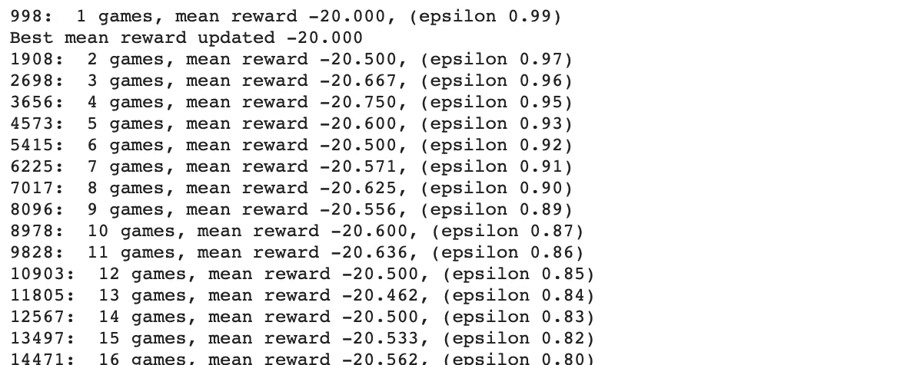
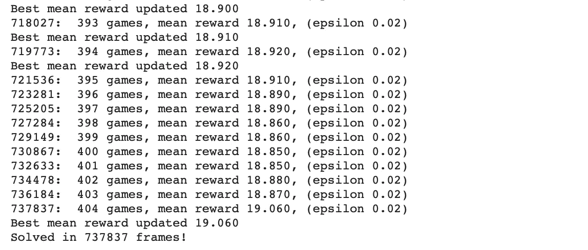
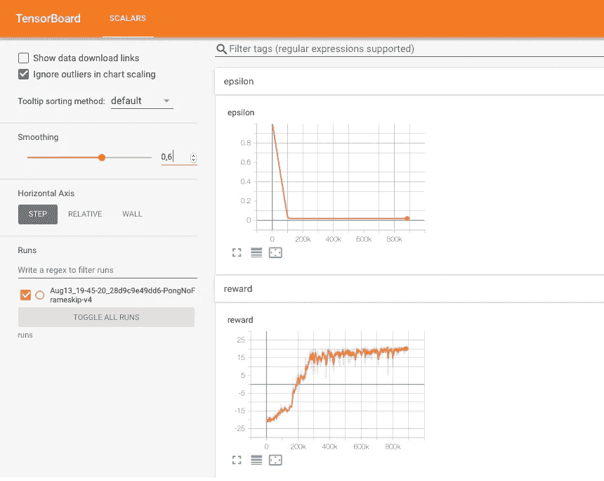
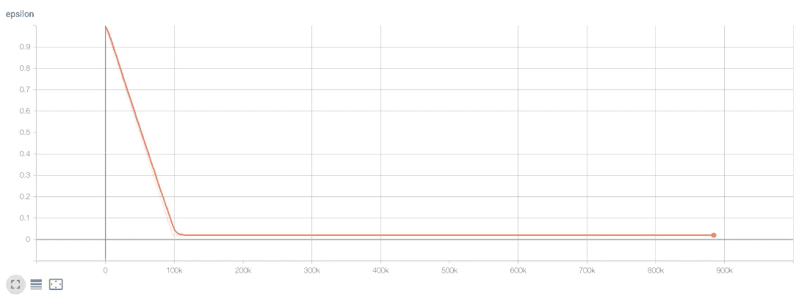
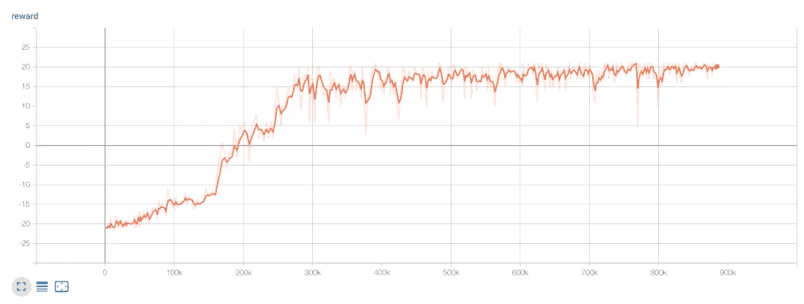
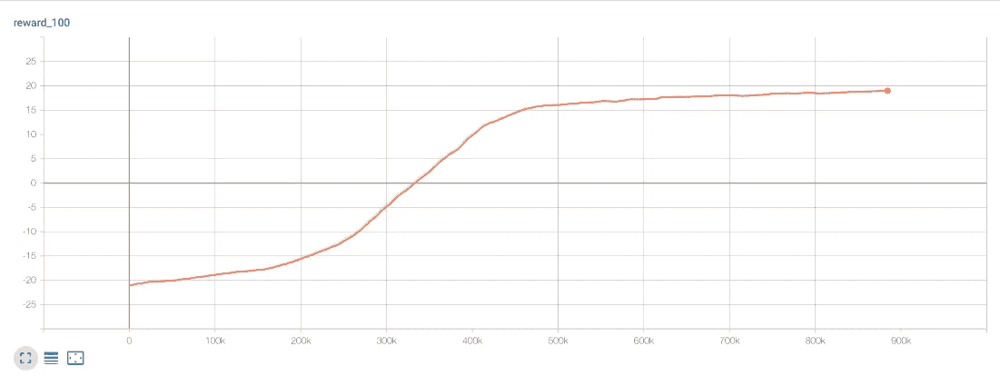
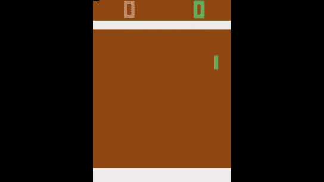

# 深度 Q-网络(DQN)-三

> 原文：<https://towardsdatascience.com/deep-q-network-dqn-iii-c5a83b0338d2?source=collection_archive---------30----------------------->

## [深度强化学习讲解— 17](https://towardsdatascience.com/tagged/deep-r-l-explained)

## DQN 的性能和用途

这是第三篇专门讨论**【深度 Q 网】(DQN)、*[*深度强化学习讲解*](https://torres.ai/deep-reinforcement-learning-explained-series/)*系列中的******的帖子，其中我们展示了如何使用 TensorBoard 来获得模型性能的图形化视图。我们还提供了一种方法来查看我们训练有素的代理如何能够玩乒乓。**

> **[本出版物的西班牙语版本](https://medium.com/aprendizaje-por-refuerzo/9-m%C3%A9todos-value-based-deep-q-network-b52b5c3da0ba)**

** [## 9.基于价值的营销:深度 Q 网络

### 请访问第 9 页的自由介绍

medium.com](https://medium.com/aprendizaje-por-refuerzo/9-m%C3%A9todos-value-based-deep-q-network-b52b5c3da0ba) 

> 这篇文章[的全部代码可以在 GitHub](https://github.com/jorditorresBCN/Deep-Reinforcement-Learning-Explained/blob/master/DRL_15_16_17_DQN_Pong.ipynb) 上找到(而[可以使用这个链接](https://colab.research.google.com/github/jorditorresBCN/Deep-Reinforcement-Learning-Explained/blob/master/DRL_15_16_17_DQN_Pong.ipynb)作为 Colab google 笔记本运行)。

# 运行训练循环

当我们运行本例中的[笔记本](https://colab.research.google.com/github/jorditorresBCN/Deep-Reinforcement-Learning-Explained/blob/master/DRL_15_16_17_DQN_Pong.ipynb)时，我们在控制台中获得以下输出:

. . .

> 由于训练过程中的随机性，您的实际动态将与此处显示的不同。

但是，尽管信息丰富，却很难从一百万行中得出结论。读者应该记得，在之前的帖子 5 ( [**PyTorch 使用 tensor board**](/pytorch-performance-analysis-with-tensorboard-7c61f91071aa)**)**中，我们介绍了工具[**tensor board**](/pytorch-performance-analysis-with-tensorboard-7c61f91071aa)**，该工具有助于跟踪不同参数的进度，并且可以为找到超参数的值提供出色的支持。**

**我们在这里不再重复解释应该插入什么代码，但是读者可以在 [GitHub](https://github.com/jorditorresBCN/Deep-Reinforcement-Learning-Explained/blob/master/DRL_15_16_17_DQN_Pong.ipynb) 中找到这个例子的详细代码，它为 DQN 获得了一个在交互 TensorFlow 窗口中绘制的轨迹，如下所示:**

****

**例如，使用此代码，我们可以获得跟踪以监控 epsilon、奖励和平均奖励的行为:**

************

**有了这个工具，我邀请用户找到更好的超参数。**

# **使用模型**

**最后，在 [GitHub](https://github.com/jorditorresBCN/Deep-Reinforcement-Learning-Explained/blob/master/DRL_15_16_17_DQN_Pong.ipynb) 中，读者可以找到允许我们看到我们训练有素的代理如何玩 Pong 的代码:**

****

**我们已经准备了代码，生成一个游戏的一集视频。视频存储在文件夹`video`中。**

**代码几乎是代理类的方法`play_step()`的精确拷贝，没有ε-贪婪动作选择。我们只是将我们的观察传递给代理，并选择具有最大值的动作。这里唯一的新东西是环境中的`render()`方法，这是 Gym 中显示当前观察的标准方式。**

**代码中的主循环，将动作传递给环境，统计总奖励，当剧集结束时停止循环。在这一集之后，它会显示总奖励和代理执行该动作的次数。**

**因为它需要有一个图形用户界面(GUI ),并且我们是在 colab 环境中执行我们的代码，而不是在我们的个人计算机中，所以我们需要运行一组命令(从这个[链接](/rendering-openai-gym-envs-on-binder-and-google-colab-536f99391cc7)中获得)。**

# **摘要**

**这是专门介绍**深度 Q 网络(DQN)**基础知识的三篇文章中的第三篇，在这三篇文章中，我们介绍了如何使用 TensorBoard 来帮助我们进行参数调整。我们还展示了如何可视化我们的代理的行为。**

**下期[见](/policy-based-methods-8ae60927a78d)！**** 

# ****深度强化学习讲解系列****

******由** [**UPC 巴塞罗那理工**](https://www.upc.edu/en) **和** [**巴塞罗那超级计算中心**](https://www.bsc.es/)****

****一个轻松的介绍性[系列](https://torres.ai/deep-reinforcement-learning-explained-series/)逐渐并以实用的方法向读者介绍这一令人兴奋的技术，这是人工智能领域最新突破性进展的真正推动者。****

**** [## 深度强化学习解释-乔迪托雷斯。人工智能

### 本系列的内容](https://torres.ai/deep-reinforcement-learning-explained-series/) 

# 关于这个系列

我是在五月份开始写这个系列的，那是在巴塞罗纳的**封锁期。**老实说，由于封锁，在业余时间写这些帖子帮助了我 [**#StayAtHome**](https://twitter.com/hashtag/StayAtHome?src=hashtag_click) 。感谢您当年阅读这份刊物；这证明了我所做的努力。

**免责声明** —这些帖子是在巴塞罗纳封锁期间写的，目的是分散个人注意力和传播科学知识，以防对某人有所帮助，但无意成为 DRL 地区的学术参考文献。如果读者需要更严谨的文档，本系列的最后一篇文章提供了大量的学术资源和书籍供读者参考。作者意识到这一系列的帖子可能包含一些错误，如果目的是一个学术文件，则需要对英文文本进行修订以改进它。但是，尽管作者想提高内容的数量和质量，他的职业承诺并没有留给他这样做的自由时间。然而，作者同意提炼所有那些读者可以尽快报告的错误。****