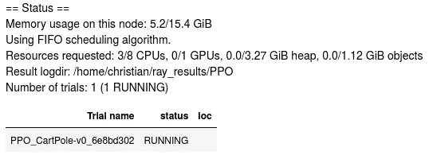
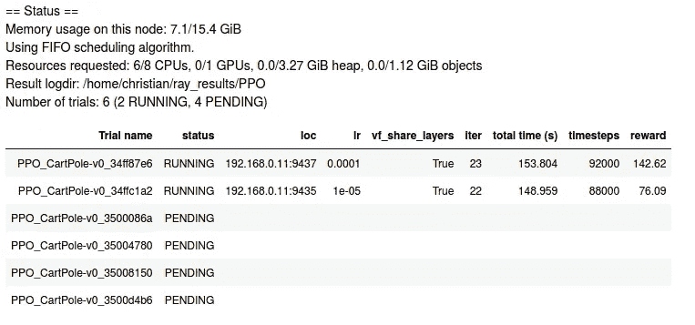
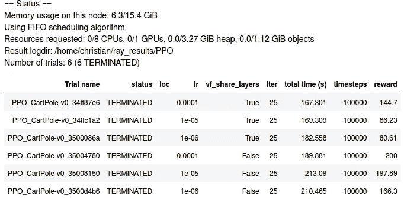
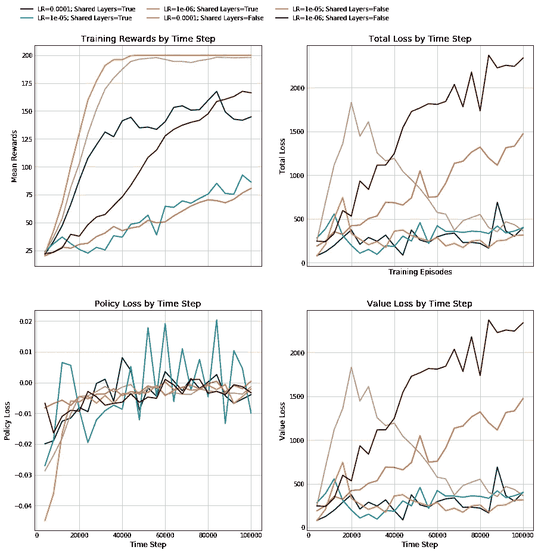

# 深度强化学习和超参数调整

> 原文：<https://towardsdatascience.com/deep-reinforcement-learning-and-hyperparameter-tuning-df9bf48e4bd2?source=collection_archive---------14----------------------->

## 用雷的曲子优化你的模型


深度强化学习最困难和最耗时的部分之一是超参数的优化。这些值(如折扣系数[latex]\gamma[/latex]或学习率)会对代理的性能产生重大影响。

代理需要接受培训，以了解超参数如何影响绩效——没有先验的*方法来知道给定参数的更高或更低的值是否会提高总报酬。除了跟踪实验、数据和与训练模型相关的一切之外，这转化为多次昂贵的训练运行以获得好的代理。*

[Ray](https://www.datahubbs.com/ray-and-rllib-fast-reinforcement-learning/) 提供了一种使用 Tune library 处理所有这些的方法，它可以自动处理您的各种模型，保存数据，调整您的超参数，并总结结果以便快速轻松地参考。

# TL；速度三角形定位法(dead reckoning)

我们通过一个简单的例子来说明如何使用 Tune 的网格搜索特性来优化我们的超参数。

# 安装 Tune

Tune 是 Ray 项目的一部分，但是需要单独安装，所以如果您还没有安装它，您需要运行下面的命令来让 Tune 工作。

```
pip install ray[tune]
```

从这里，我们可以导入我们的包来训练我们的模型。

```
import ray
from ray import tune
```

# 调整您的第一个模型

从基础开始，让我们用 Tune 训练一个 agent 来解决`CartPole-v0`。Tune 需要一些具有不同设置和标准的字典来训练。它必须具有的两个参数是`config`和`stop`。

`config`字典将为调优提供它需要运行的环境，以及您可能想要指定的任何特定于环境的配置。这也是你的大部分超参数将要驻留的地方，但是我们一会儿会讲到。

`stop`字典告诉 Tune 什么时候结束训练或者什么时候完全停止训练。它可以根据奖励标准、经过的时间、完成的步数等进行定制。当我第一次开始使用 Tune 时，我忽略了设置任何停止标准，最终让算法训练了几个小时才意识到这一点。所以，你可以不用这个来运行它，但是如果你不小心的话，你可能会得到一个不错的 AWS 账单！

尝试使用以下代码在`CartPole-v0`上运行 PPO 算法 10，000 个时间步长。

```
ray.init(ignore_reinit_error=True)
config = {
    'env': 'CartPole-v0'
}
stop = {
    'timesteps_total': 10000
}
results = tune.run(
    'PPO', # Specify the algorithm to train
    config=config,
    stop=stop
)
```

通过这些设置，您应该可以看到您的工作人员、内存以及`logdir`状态的打印输出，所有数据都存储在这里以供以后分析。



控制台将在每次迭代中打印这些值，除非`tune.run()`中的`verbose`参数被设置为 0(无声)。

当训练完成时，你会得到一个输出，显示状态已经终止，经过的时间，以及过去 100 集的平均奖励和其他数据。

# 使用网格搜索调整超参数

当我们利用它来调整我们的超参数时，Tune 的力量就真正发挥出来了。为此，我们将求助于`grid_search`函数，它允许用户为要测试的模型指定一组超参数。

为此，我们只需要在`tune.grid_search()`函数中包装一个值列表，并将其放入我们的配置字典中。让我们回到上面的`CartPole`例子。我们可能想看看学习速度是否有什么不同，双头网络是否有什么好处。我们可以使用`grid_search()`来实现这些的不同组合，如下所示:

```
config = {
    "env": 'CartPole-v0',
    "num_workers": 2,
    "vf_share_layers": tune.grid_search([True, False]),
    "lr": tune.grid_search([1e-4, 1e-5, 1e-6]),
    }
results = tune.run(
    'PPO', 
    stop={
        'timesteps_total': 100000
    },
    config=config)
```

现在我们看到一个展开的状态打印输出，其中包含我们想要运行的各种试验:



当 Ray 启动其中的每一个时，它将显示我们想要探索的超参数的组合，以及每个超参数的回报、迭代和运行时间。当它完成时，我们应该看到每个的状态为终止，以表明它正常工作(否则它将读取错误)。



# 分析调节结果

我们的`tune.run()`函数的输出是一个被我们标记为`results`的`analysis`对象。我们可以利用这一点来进一步了解我们实验的细节。可以通过`results.dataframe()`访问相关数据，这将返回一个 Pandas 数据帧，其中包含平均奖励、迭代次数、KL 散度、配置设置等等。数据框还包含保存您的实验的特定目录(`logdir`)，因此您可以了解您的特定运行的详细信息。

如果您查看`logdir`目录，您会发现许多包含您的训练运行中保存的数据的文件。出于我们的目的，主文件将是`progress.csv`——它包含来自每个迭代的训练数据，允许您深入细节。

例如，如果我们想要查看不同设置的训练和损耗曲线，我们可以循环遍历数据框中的`logdir`列，加载每个`progress.csv`文件并绘制结果。

```
# Plot training results
import matplotlib.pyplot as plt
import pandas as pdcolors = plt.rcParams['axes.prop_cycle'].by_key()['color']
df = results.dataframe()# Get column for total loss, policy loss, and value loss
tl_col = [i for i, j in enumerate(df.columns)
          if 'total_loss' in j][0]
pl_col = [i for i, j in enumerate(df.columns)
          if 'policy_loss' in j][0]
vl_col = [i for i, j in enumerate(df.columns)
          if 'vf_loss' in j][0]
labels = []
fig, ax = plt.subplots(2, 2, figsize=(15, 15), sharex=True)
for i, path in df['logdir'].iteritems():
    data = pd.read_csv(path + '/progress.csv')
    # Get labels for legend
    lr = data['experiment_tag'][0].split('=')[1].split(',')[0]
    layers = data['experiment_tag'][0].split('=')[-1]
    labels.append('LR={}; Shared Layers={}'.format(lr, layers))

    ax[0, 0].plot(data['timesteps_total'], 
            data['episode_reward_mean'], c=colors[i],
            label=labels[-1])

    ax[0, 1].plot(data['timesteps_total'], 
           data.iloc[:, tl_col], c=colors[i],
           label=labels[-1])

    ax[1, 0].plot(data['timesteps_total'], 
               data.iloc[:, pl_col], c=colors[i],
               label=labels[-1])

    ax[1, 1].plot(data['timesteps_total'], 
               data.iloc[:, vl_col], c=colors[i],
               label=labels[-1])ax[0, 0].set_ylabel('Mean Rewards')
ax[0, 0].set_title('Training Rewards by Time Step')
ax[0, 0].legend(labels=labels, loc='upper center',
        ncol=3, bbox_to_anchor=[0.75, 1.2]) ax[0, 1].set_title('Total Loss by Time Step')
ax[0, 1].set_ylabel('Total Loss')
ax[0, 1].set_xlabel('Training Episodes')ax[1, 0].set_title('Policy Loss by Time Step')
ax[1, 0].set_ylabel('Policy Loss')
ax[1, 0].set_xlabel('Time Step')ax[1, 1].set_title('Value Loss by Time Step')
ax[1, 1].set_ylabel('Value Loss')
ax[1, 1].set_xlabel('Time Step')plt.show()
```



# 超越网格搜索

Tune 中提供了更多的调优选项。如果你想看看你能调整什么，看看你的特定算法的[文档。此外，Tune 支持不同的超参数优化方法。网格搜索可能会很慢，所以只需改变几个选项，就可以使用贝叶斯优化、HyperOpt 等。最后，Tune 使得**基于人口的培训** (PBT)变得容易，允许多个代理跨不同的机器伸缩。所有这些都将在以后的帖子中介绍！](https://ray.readthedocs.io/en/latest/rllib-algorithms.html)