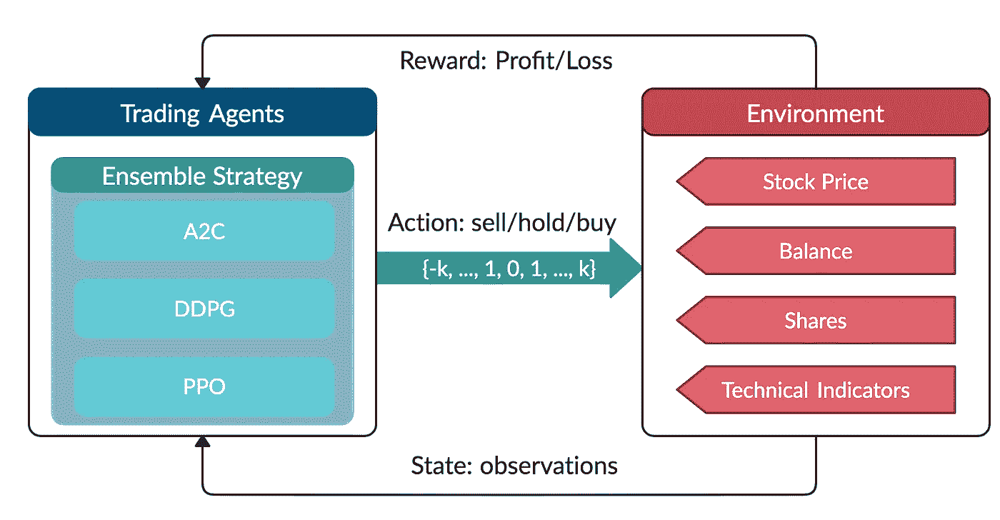
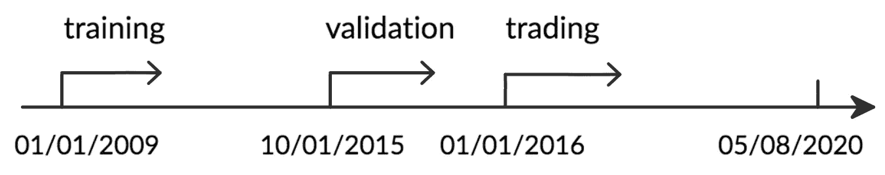
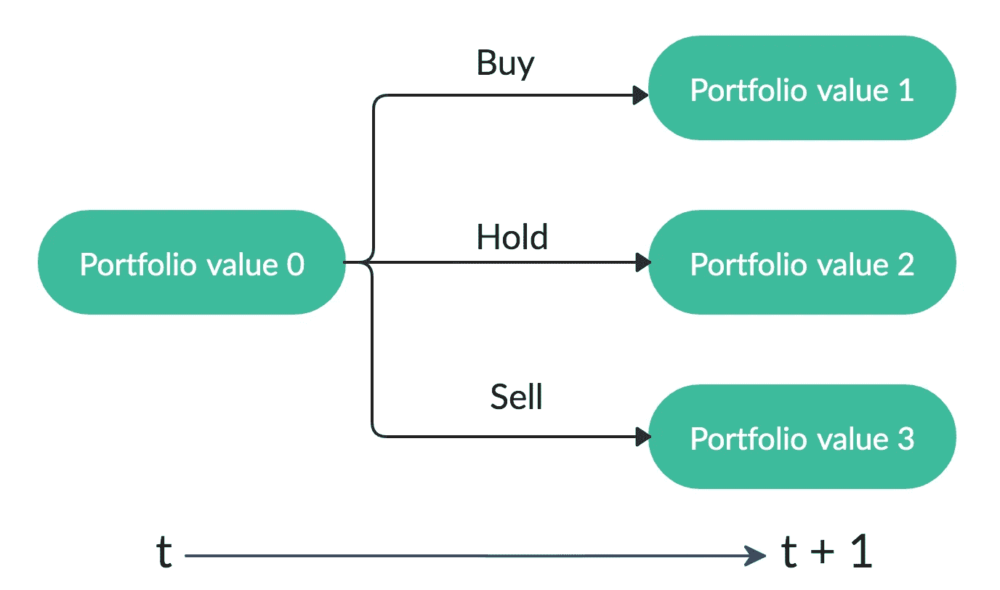
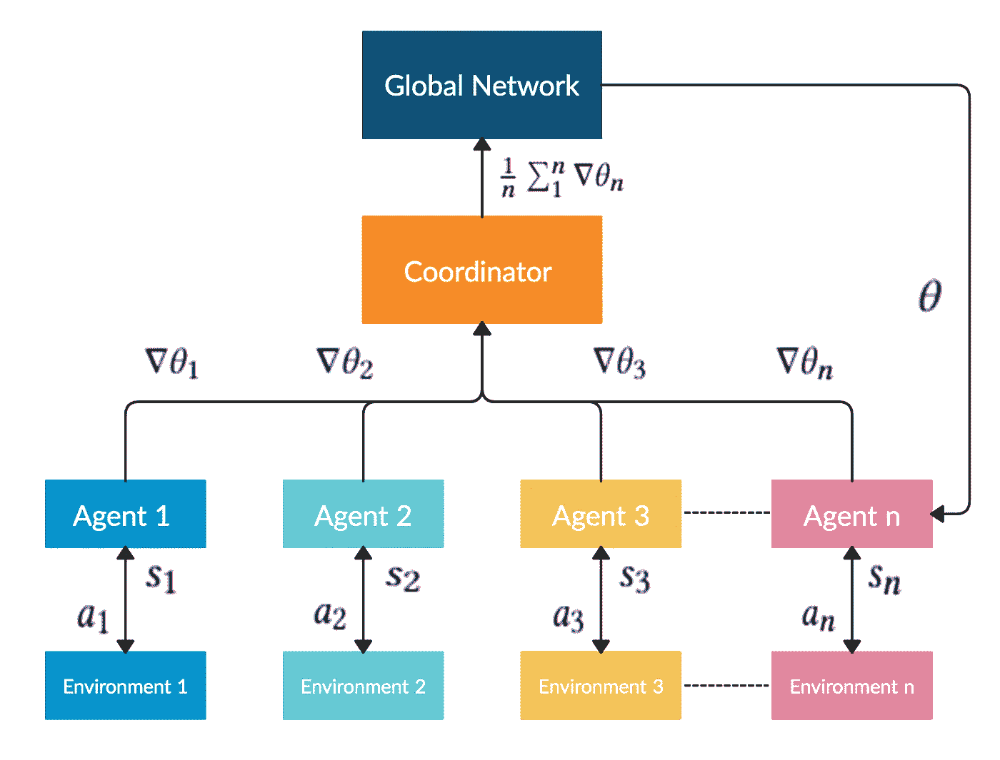
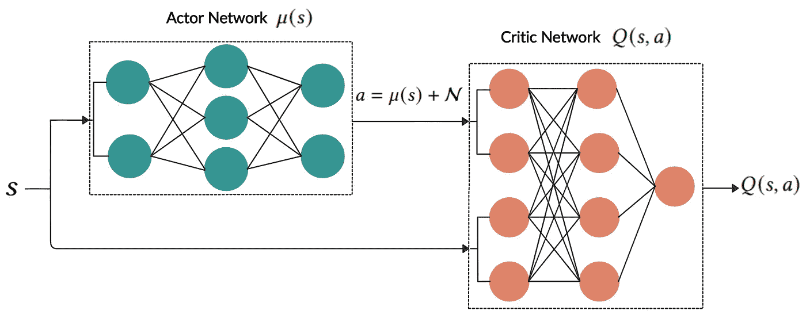
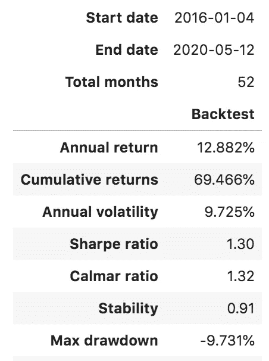
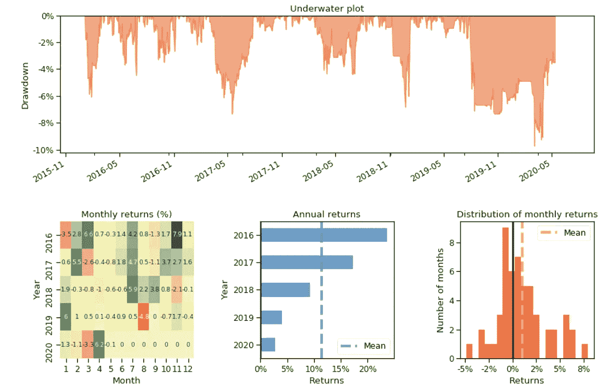
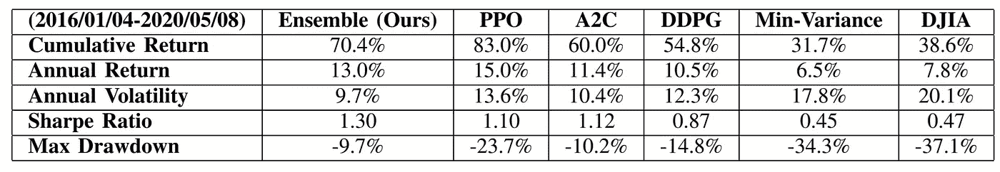
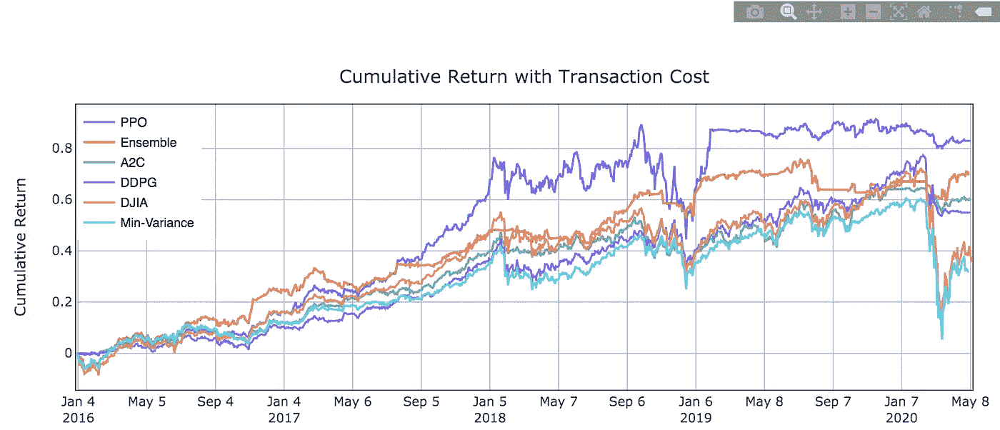

# 用于自动股票交易的深度强化学习

> 原文：<https://towardsdatascience.com/deep-reinforcement-learning-for-automated-stock-trading-f1dad0126a02?source=collection_archive---------0----------------------->

## 使用强化学习通过 Python 和 OpenAI Gym 交易多只股票|在 ICAIF 2020 上展示


图像由 [**克里斯**](https://unsplash.com/@chrisliverani) 上[下](https://unsplash.com/photos/dBI_My696Rk)

***来自《走向数据科学》编辑的注释:*** *虽然我们允许独立作者根据我们的* [*规则和指南*](/questions-96667b06af5) *发表文章，但我们并不认可每个作者的贡献。你不应该在没有寻求专业建议的情况下依赖一个作者的作品。详见我们的* [*读者术语*](/readers-terms-b5d780a700a4) *。*

这篇博客基于我们的论文: ***自动化股票交易的深度强化学习:一个集合策略*** ，发表于[**ICAIF 2020**](https://ai-finance.org/conference-program/):ACM 金融 AI 国际会议。

我们的代码可以在 [Github](https://github.com/AI4Finance-Foundation/FinRL-Trading/tree/master/old_repo_ensemble_strategy) 上找到。

[](https://github.com/AI4Finance-Foundation/FinRL-Trading/tree/master/old_repo_ensemble_strategy) [## 主 AI4Finance 的 FinRL-Trading/old _ repo _ ensemble _ strategy-Foundation/FinRL-Trading

### 该库提供 ICAIF 2020 论文的代码。该集合策略在 Jupiter 笔记本中重新实施，网址为…

github.com](https://github.com/AI4Finance-Foundation/FinRL-Trading/tree/master/old_repo_ensemble_strategy) 

使用 **FinRL** 的集成策略:

[](https://github.com/AI4Finance-Foundation/FinRL/blob/master/examples/FinRL_Ensemble_StockTrading_ICAIF_2020.ipynb) [## FinRL/FinRL _ Ensemble _ stock trading _ ICAIF _ 2020 . ipynb at master ai4 finance-Foundation/FinRL

### 此时您不能执行该操作。您已使用另一个标签页或窗口登录。您已在另一个选项卡中注销，或者…

github.com](https://github.com/AI4Finance-Foundation/FinRL/blob/master/examples/FinRL_Ensemble_StockTrading_ICAIF_2020.ipynb) 

我们的论文刊登在 SSRN。

 [## 自动股票交易的深度强化学习:一种集成策略

### 撰写日期:2020 年 9 月 11 日股票交易策略在投资中起着至关重要的作用。然而，它是…

papers.ssrn.com](https://papers.ssrn.com/sol3/papers.cfm?abstract_id=3690996) 

如果要引用我们的论文，参考格式如下:

> 杨红阳，，钟山和安瓦尔·瓦利德。2020.自动股票交易的深度强化学习:一个集成策略。ICAIF '20: ACM 金融人工智能国际会议，2020 年 10 月 15-16 日，纽约曼哈顿。美国纽约州纽约市 ACM。

一个最新的 DRL 自动交易库- **FinRL** 可以在这里找到:

[](https://github.com/AI4Finance-Foundation/FinRL) [## GitHub-ai4 finance-Foundation/FinRL:自动化交易的深度强化学习框架…

### 新闻:我们计划分享我们的纸上交易和现场交易的代码。请积极与我们分享您的兴趣…

github.com](https://github.com/AI4Finance-Foundation/FinRL) 

[量化金融 FinRL:单只股票交易教程](/finrl-for-quantitative-finance-tutorial-for-single-stock-trading-37d6d7c30aac)

[量化金融 FinRL:多只股票交易教程](/finrl-for-quantitative-finance-tutorial-for-multiple-stock-trading-7b00763b7530)

[量化金融 FinRL:投资组合配置教程](/finrl-for-quantitative-finance-tutorial-for-portfolio-allocation-9b417660c7cd)

**ElegantRL** 支持最先进的 DRL 算法，并在 Jupyter 笔记本中提供用户友好的教程。核心代码<1000 行，使用 PyTorch，OpenAI Gym，和 NumPy。

[](/elegantrl-a-lightweight-and-stable-deep-reinforcement-learning-library-95cef5f3460b) [## ElegantRL:一个轻量级且稳定的深度强化学习库

### 一天掌握深度强化学习。

towardsdatascience.com](/elegantrl-a-lightweight-and-stable-deep-reinforcement-learning-library-95cef5f3460b) 

# 概观

人们很难高估股票交易策略在投资中的重要作用。

盈利的自动股票交易策略对投资公司和对冲基金至关重要。它适用于优化资本配置和最大化投资绩效，如预期回报。回报最大化可以基于对潜在回报和风险的估计。然而，在一个复杂多变的股票市场中设计一个有利可图的策略是具有挑战性的。

每个玩家都想要一个获胜的策略。不用说，在如此复杂和动态的股票市场中，一个有利可图的策略是不容易设计的。

然而，我们将揭示一种深度强化学习方案，通过最大化投资回报来自动学习股票交易策略。


图片由 [**素妍**](https://unsplash.com/@by_syeoni) 上的 [Unsplash](https://unsplash.com/photos/H5bGh1SEzrI)

**我们的解决方案**:集成深度强化学习交易策略
**该策略**包括三种基于行动者-批评家的算法:近似政策优化(PPO)、优势行动者-批评家(A2C)和深度确定性政策梯度(DDPG)。
**它结合了**三种算法的最佳特性，从而稳健地适应不同的市场条件。

使用夏普比率评估具有不同强化学习算法的交易代理的性能，并与道琼斯工业平均指数和传统的最小方差投资组合分配策略进行比较。



AI4Finance-Foundation 版权所有

# 第一部分。为什么要用深度强化学习(DRL)来炒股？

现有的作品并不令人满意。深度强化学习方法有许多优点。

## **1.1 DRL 与现代投资组合理论(MPT)**

1.  MPT 在**样本外数据**表现不佳。
2.  MPT 对异常值非常敏感。
3.  MPT**仅基于股票收益**计算，如果我们要**考虑其他相关因素**，例如一些技术指标如**移动平均线收敛发散(MACD)** 和**相对强弱指数(RSI)** ，MPT 可能无法将这些信息很好地结合在一起。

## 1.2 **DRL 和监督机器学习预测模型**

1.  DRL 不需要**大的带标签的训练数据集**。这是一个显著的优势，因为如今数据量呈指数级增长，标记大型数据集变得非常耗时耗力。
2.  DRL 使用**奖励函数**来优化未来的奖励，与预测未来结果概率的 ML 回归/分类模型形成对比。

## 1.3 **利用 DRL 进行股票交易的理由**

1.  股票交易的目标是在规避风险的同时最大化收益。DRL 通过**最大化一段时间内未来行动的预期总回报**来解决这个优化问题。
2.  股票交易是一个**连续的过程**测试新的想法，从市场获得反馈，并试图随着时间的推移优化交易策略。我们可以将股票交易过程建模为**马尔可夫决策过程**，这是强化学习的基础。

## 1.4 **深度强化学习的优势**

1.  深度强化学习算法可以**在很多挑战性游戏中胜过人类玩家**。例如，2016 年 3 月， [DeepMind 的 AlphaGo](https://deepmind.com/blog/article/alphago-zero-starting-scratch) 程序，一种深度强化学习算法，在围棋比赛中击败了世界冠军 Lee Sedol。
2.  **回报最大化为交易目标**:通过将回报函数定义为投资组合价值的变化，深度强化学习随着时间的推移使投资组合价值最大化。
3.  股票市场提供**顺序反馈**。 **DRL** 可以在训练过程中**依次**提高模型性能。
4.  探索-开发技术平衡尝试不同的新事物和利用已发现的东西。这与其他学习算法不同。此外，不需要技术人员提供训练样本或标记样本。此外，在探索过程中，智能体被鼓励去探索未知的人类专家。
5.  **经验回放**:能够克服相关样本问题，因为从一批连续样本中学习可能会经历很大的差异，因此效率很低。体验重放通过从预先保存的重放存储器中随机采样小批量的过渡，有效地解决了这个问题。
6.  **多维数据**:通过使用连续的动作空间，DRL 可以处理多维数据。
7.  **计算能力** : Q-learning 是一种非常重要的 RL 算法，然而，它无法处理大空间。DRL 作为一种高效的函数逼近器，被神经网络赋予了强大的处理超大状态空间和动作空间的能力。


图像由 [**凯文**](https://unsplash.com/@ikukevk) 上的 [Unsplash](https://unsplash.com/photos/w7ZyuGYNpRQ)

# **第二部分:什么是强化学习？什么是深度强化学习？利用强化学习进行股票交易的相关著作有哪些？**

## 2.1 概念

**强化学习**是机器学习技术的三种方法之一，它通过从环境中顺序接收状态和奖励，并采取行动以达到更好的奖励，来训练智能体与环境进行交互。

**深度强化学习**用神经网络逼近 Q 值。使用神经网络作为函数逼近器将允许强化学习应用于大量数据。

**贝尔曼方程**是设计强化学习算法的指导原则。

**马尔可夫决策过程(MDP)** 用于环境建模。

## **2.2** [**相关作品**](https://econpapers.repec.org/paper/zbwiwqwdp/122018.htm)

**深度强化学习在金融市场中的最新应用**考虑离散或连续的状态和行动空间，并采用以下学习方法之一:**仅批评方法、仅行动者方法或行动者-批评方法。**

**1。仅批评者方法:**仅批评者学习方法是最常见的，它使用 Q 学习、深度 Q 学习(DQN)及其改进来解决离散动作空间问题，并在单个股票或资产上训练代理。**唯批评方法**的思想是使用一个 **Q 值函数**来学习最优行动选择策略，该策略在给定当前状态的情况下最大化预期未来回报。 **DQN 不是计算状态-动作值表，而是最小化**目标 Q 值之间的均方误差，并使用神经网络来执行函数逼近。唯批评方法的主要限制是，它只适用于离散和有限的状态和行为空间，这对于大量股票投资组合是不实际的，因为价格当然是连续的。

*   **Q-learning:** 是一种基于值的强化学习算法，用于使用 Q 函数寻找最佳行动选择策略。
*   **DQN:** 在深度 Q 学习中，我们使用神经网络来逼近 Q 值函数。状态作为输入给出，允许动作的 Q 值是预测的输出。

**2。只有行动者的方法:**这里的思想是代理直接学习最优策略本身。神经网络学习策略，而不是让神经网络学习 Q 值。策略是一种概率分布，本质上是一种针对给定状态的策略，即采取允许的行动的可能性。只有演员的方法可以处理连续的动作空间环境。

*   **策略梯度:**旨在通过直接学习最优策略本身，使期望总报酬最大化。

**3。行动者-批评家方法:行动者-批评家方法最近被应用于金融领域。想法是**同时更新代表政策的演员网络**和代表价值函数**的评论家网络**。批评家估计价值函数，而行动者用政策梯度更新批评家引导的政策概率分布。随着时间的推移，演员学会了采取更好的行动，而评论家也更善于评估这些行动。演员-评论家方法已经被证明能够学习和适应大型和复杂的环境，并被用于玩流行的视频游戏，如 Doom。因此，行动者-批评家方法非常适合大规模股票投资组合的交易。**

*   **A2C:** A2C 是典型的演员-评论家算法。A2C 使用相同代理的副本并行工作，用不同的数据样本更新梯度。每个代理独立工作，与同一个环境交互。
*   **PPO:** PPO 的引入是为了控制政策梯度更新，保证新政策不会与之前的政策相差太大。
*   **DDPG:** DDPG 结合了 Q 学习和政策梯度的框架，使用神经网络作为函数逼近器。

# **第三部分:如何使用 DRL 交易股票？**


图像由 [**马库斯**](https://unsplash.com/@markusspiske) 上的 [Unsplash](https://unsplash.com/photos/5gGcn2PRrtc)

## **3.1 数据**

我们跟踪并选择**道琼斯 30 股票(2016/01/01)** 并使用从 **01/01/2009 到 05/08/2020** 的历史日数据来训练代理人并测试其表现。数据集从通过 [**沃顿研究数据服务(WRDS)**](https://wrds-web.wharton.upenn.edu/wrds/ds/compd/secd/index.cfm?navId=83) 访问的 Compustat 数据库下载。

整个数据集在下图中被分割。2009 年 1 月 1 日至 2014 年 12 月 31 日的数据用于**培训**，2015 年 10 月 1 日至 2015 年 12 月 31 日的数据用于**验证**和参数调整。最后，我们在从 2016 年 1 月 1 日到 2020 年 5 月 8 日的**交易**数据上测试我们的代理的性能。为了更好地利用交易数据，我们在交易阶段继续培训我们的代理，因为这将帮助代理更好地适应市场动态。



AI4Finance-Foundation 版权所有

## 3.2 股票交易的 MDP 模型:

𝒔 = [𝒑，𝒉，𝑏]:]一个向量，包括股票价格𝒑 ∈ R+^D，股票份额𝒉 ∈ Z+^D，以及余额 R+，其中表示股票数量，Z+表示非负整数。

**动作**𝒂:𝐷股票的动作向量。每只股票的允许操作包括出售、购买或持有，分别导致𝒉股票的减少、增加和不变。

**奖励**𝑟(𝑠,𝑎,𝑠′):the 直接奖励在𝑠州采取行动的𝑎到达新的州𝑠′.

**政策**𝜋(𝑠):)𝑠州的交易策略，这是𝑠.州行动的概率分布

**Q 值** 𝑄𝜋 (𝑠，𝑎):)在政策𝜋之后，在𝑠采取行动𝑎的预期回报。

我们的股票交易过程的状态转换如下图所示。在每个状态下，对投资组合中的股票𝑑 (𝑑 = 1，…，𝐷)采取三种可能的行动之一。

*   **卖出**𝒌[𝑑]∈【1,𝒉[𝑑】]股票的结果是𝒉𝒕+1[𝑑]=𝒉𝒕[𝑑]—𝒌[𝑑],where𝒌[𝑑]∈z+and𝑑=1,…,𝐷.
*   **控股**，𝒉𝒕+1[𝑑]=𝒉𝒕[𝑑].
*   购买𝒌[𝑑股票的结果是𝒉𝒕+1[𝑑] = 𝒉𝒕 [𝑑] + 𝒌[𝑑].

如图 2 所示，在𝑡时间采取行动，并且在𝑡+1 更新股票价格，因此，投资组合价值可以分别从“投资组合价值 0”变为“投资组合价值 1”、“投资组合价值 2”或“投资组合价值 3”。请注意，投资组合的价值是𝒑𝑻 𝒉 + 𝑏.



AI4Finance-Foundation 版权所有

## **3.3 约束:**

*   **市场流动性**:订单能够以收盘价快速执行。我们假设股票市场不会受到我们的强化交易代理的影响。
*   **非负余额**:允许的动作不应该导致负余额。
*   **交易成本**:每笔交易都会产生交易成本。交易费用有很多种，如交易费、执行费和证交会费。不同的券商佣金不同。尽管费用有这些变化，我们假设我们的交易成本是每笔交易价值的 1/1000(买入或卖出)。
*   **市场崩盘风险规避**:有可能导致股市崩盘的突发事件，如战争、股市泡沫破裂、主权债务违约、金融危机等。为了在像 2008 年全球金融危机这样的最坏情况下控制风险，我们采用金融 [**动荡指数**](https://www.top1000funds.com/wp-content/uploads/2010/11/FAJskulls.pdf) 来衡量极端的资产价格变动。

## 3.4 回报最大化作为交易目标

我们将我们的回报函数定义为**当𝑎在状态𝑠采取行动并到达新的状态𝑠 + 1 时，投资组合价值的变化**。

目标是设计一个在动态环境中最大化投资组合价值𝑟(𝑠𝑡,𝑎𝑡,𝑠𝑡+1 变化的交易策略，我们采用深度强化学习方法来解决这个问题。


图片由[萨克](https://unsplash.com/@isaacmsmith)在 [Unsplash](https://unsplash.com/photos/6EnTPvPPL6I) 上拍摄

## **3.5 多只股票的环境:**

**状态空间:我们用一个 181 维向量(30 只股票* 6 + 1)组成的七部分信息来表示多只股票交易环境的状态空间**

1.  **余额**:当前时间步账户中剩余的可用金额
2.  **价格**:每只股票当前调整后的收盘价。
3.  **股份**:每只股票拥有的股份。
4.  **MACD** :使用收盘价计算移动平均趋同背离(MACD)。
5.  **RSI** :相对强弱指数(RSI)是用收盘价计算出来的。
6.  **CCI** :商品通道指数(CCI)是用最高价、最低价和收盘价计算出来的。
7.  **ADX** :使用最高价、最低价和收盘价计算平均方向指数(ADX)。

**动作空间**:

1.  对于单只股票，动作空间定义为 **{-k，…，-1，0，1，…，k}** ，其中 k 和-k 表示我们可以买卖的股票数量， **k ≤h_max** 而 **h_max** 是一个预定义的参数，设置为每次买入动作的最大股票数量。
2.  对于多只股票，因此整个行动空间的大小是 **(2k+1)^30** )。
3.  然后，动作空间被归一化为 **[-1，1]** ，因为 RL 算法 A2C 和 PPO 直接在高斯分布上定义策略，该高斯分布需要被归一化和对称。

```
**class StockEnvTrain**(gym.Env):**“””A stock trading environment for OpenAI gym”””
** metadata = {‘render.modes’: [‘human’]}def __init__(self, df, day = 0):
 self.day = day
 self.df = df # Action Space
 # action_space normalization and shape is STOCK_DIM
 **self.action_space = spaces.Box(low = -1, high = 1,shape = (STOCK_DIM,))** 
 # State Space
 # Shape = 181: [Current Balance]+[prices 1–30]+[owned shares 1–30] 
 # +[macd 1–30]+ [rsi 1–30] + [cci 1–30] + [adx 1–30]
 **self.observation_space = spaces.Box(low=0, high=np.inf, shape = (181,))** # load data from a pandas dataframe
 self.data = self.df.loc[self.day,:]
 self.terminal = False # initalize state
 **self.state = [INITIAL_ACCOUNT_BALANCE] + \
 self.data.adjcp.values.tolist() + \
 [0]*STOCK_DIM + \
 self.data.macd.values.tolist() + \
 self.data.rsi.values.tolist() + \
 self.data.cci.values.tolist() + \
 self.data.adx.values.tolist()** # initialize reward
 self.reward = 0
 self.cost = 0 # memorize all the total balance change
 self.asset_memory = [INITIAL_ACCOUNT_BALANCE]
 self.rewards_memory = []
 self.trades = 0
 #self.reset()
 self._seed()
```

## 3.6 基于深度强化学习的交易代理

## [A2C](https://arxiv.org/abs/1602.01783)



AI4Finance-Foundation 版权所有

**A2C** 是一个典型的**演员-评论家算法**，我们将其作为集成方法中的一个组件。A2C 出台梯度更新完善政策。A2C 利用一个**优势函数**来减少政策梯度的方差。**评论家网络不是仅估计价值函数，而是估计优势函数**。因此，对一个行动的评价不仅要看这个行动有多好，还要考虑它还能好到什么程度。从而降低了策略网络的高方差，使模型更加健壮。

A2C 使用同一代理的**个副本并行工作，用不同的数据样本更新梯度。每个代理独立工作，与同一个环境交互。在所有并行代理完成计算它们的梯度后，A2C 使用协调器将所有代理的平均梯度传递给全局网络。以便全球网络可以更新演员和评论家网络。全球网络的存在增加了培训数据的多样性。同步梯度更新更具成本效益，速度更快，在批量较大时效果更好。A2C 是股票交易的好榜样，因为它稳定。**

## [DDPG](https://arxiv.org/abs/1509.02971)



AI4Finance-Foundation 版权所有

**DDPG** 是一种基于演员-评论家的算法，我们将其作为整体策略的一部分，以最大化投资回报。DDPG **结合了 **Q 学习和策略梯度** t 的框架**，并使用神经网络作为函数逼近器。与通过 Q 值表间接学习并遭受维数灾难问题的 DQN 相反，DDPG 通过政策梯度直接从观察中学习。建议确定性地将状态映射到动作，以更好地适应连续动作空间环境。

## [PPO](https://arxiv.org/abs/1707.06347)

我们探索并使用多酚氧化酶作为系综方法的一个组成部分。引入 PPO 是为了控制策略梯度更新，并确保新策略不会与旧策略相差太大。PPO 试图通过在目标函数中引入限幅项来简化**信任区域策略优化(TRPO)** 的目标。

PPO 的目标函数取限幅和正常目标的**最小值。PPO 不鼓励超出限定区间的大的政策变动。因此，PPO 通过在每个训练步骤限制策略更新来提高策略网络训练的稳定性。我们选择 PPO 进行股票交易，因为它稳定、快速，并且更容易实现和调整。**

## **集成策略**

我们的目的是创建一个高度稳健的交易策略。所以我们使用**一种集合方法**根据[**夏普比率**](http://web.stanford.edu/~wfsharpe/art/sr/sr.htm) 在 **PPO** 、 **A2C** 和 **DDPG** 中自动选择表现最好的代理进行交易。总体过程描述如下:

**步骤一。我们利用**𝑛**t32】个月**的成长窗口来同时再培训我们的三名代理。在本文中，我们每隔**三个月**对我们的三名代理进行再培训。

**步骤二。**我们通过使用 **3 个月验证**滚动窗口来验证所有三个代理，然后进行培训以挑选具有**最高夏普比率**的最佳代理。在我们的验证阶段，我们还通过使用**湍流指数**来调整风险厌恶。

**第三步。**验证后，我们只**使用夏普比率最高的最佳模型**来预测和交易下一季度。

```
**from** stable_baselines **import** SAC
**from** stable_baselines **import** PPO2
**from** stable_baselines **import** A2C
**from** stable_baselines **import** DDPG
**from** stable_baselines **import** TD3
**from** stable_baselines.ddpg.policies **import** DDPGPolicy
**from** stable_baselines.common.policies **import** MlpPolicy
**from** stable_baselines.common.vec_env **import** DummyVecEnv**def** **train_A2C**(env_train, model_name, timesteps=10000):
 **“””A2C model”””** start = time.time()
 model = A2C(‘MlpPolicy’, env_train, verbose=0)
 model.learn(total_timesteps=timesteps)
 end = time.time() model.save(f”{config.TRAINED_MODEL_DIR}/{model_name}”)
 print(‘Training time (A2C): ‘, (end-start)/60,’ minutes’)
 return model**def** **train_DDPG**(env_train, model_name, timesteps=10000):
 **“””DDPG model”””** start = time.time()
 model = DDPG(‘MlpPolicy’, env_train)
 model.learn(total_timesteps=timesteps)
 end = time.time() model.save(f”{config.TRAINED_MODEL_DIR}/{model_name}”)
 print(‘Training time (DDPG): ‘, (end-start)/60,’ minutes’)
 return model**def** **train_PPO**(env_train, model_name, timesteps=50000):
 **“””PPO model”””** start = time.time()
 model = PPO2(‘MlpPolicy’, env_train)
 model.learn(total_timesteps=timesteps)
 end = time.time() model.save(f”{config.TRAINED_MODEL_DIR}/{model_name}”)
 print(‘Training time (PPO): ‘, (end-start)/60,’ minutes’)
 return model**def** **DRL_prediction**(model, test_data, test_env, test_obs):
 **“””make a prediction”””** start = time.time()
 **for** i in range(len(test_data.index.unique())):
   action, _states = model.predict(test_obs)
   test_obs, rewards, dones, info = test_env.step(action)
   # env_test.render()
 end = time.time()
```

## 3.7 绩效评估

我们使用 Quantopian 的[投资组合](https://github.com/quantopian/pyfolio)进行回溯测试。这些图表看起来非常好，并且只需要一行代码就可以实现。你只需要把一切都转换成日收益。

```
**import** pyfolio**with** **pyfolio**.plotting.plotting_context(font_scale=1.1):
 pyfolio.create_full_tear_sheet(**returns** = **ensemble_strat**,
 **benchmark_rets**=**dow_strat**, set_context=False)
```



AI4Finance-Foundation 版权所有



AI4Finance-Foundation 版权所有



AI4Finance-Foundation 版权所有

> *参考文献:*
> 
> **A2C** :
> 沃洛季米尔·姆尼、adrià·巴迪亚、迈赫迪·米尔扎、亚历克斯·格雷夫斯、蒂莫西·利利克拉普、蒂姆·哈利、大卫·西尔弗和科雷·卡武克库奥卢。2016.深度强化学习的异步方法。第 33 届机器学习国际会议(02 2016)。[https://arxiv.org/abs/1602.01783](https://arxiv.org/abs/1602.01783)
> 
> DDPG :
> 蒂莫西·莉莉卡普、乔纳森·亨特、亚历山大·普里策尔、尼古拉斯·赫斯、汤姆·埃雷兹、尤瓦尔·塔萨、大卫·西尔弗和金奎大·威斯特拉。2015.深度强化学习的连续控制。2016 年国际学习代表大会(ICLR)(2015 年 9 月)。[https://arxiv.org/abs/1509.02971](https://arxiv.org/abs/1509.02971)
> 
> 约翰·舒尔曼、谢尔盖·莱文、菲利普·莫里茨、迈克尔·乔丹和彼得·阿贝耳。2015.信任区域策略优化。在第 31 届机器学习国际会议上。[https://arxiv.org/abs/1502.05477](https://arxiv.org/abs/1502.05477)
> 
> 约翰·舒尔曼、菲利普·沃尔斯基、普拉富拉·德里瓦尔、亚历克·拉德福德和奥列格·克里莫夫。2017.近似策略优化算法。arXiv:1707.06347(2017 年 07 月)。[https://arxiv.org/abs/1707.06347](https://arxiv.org/abs/1707.06347)